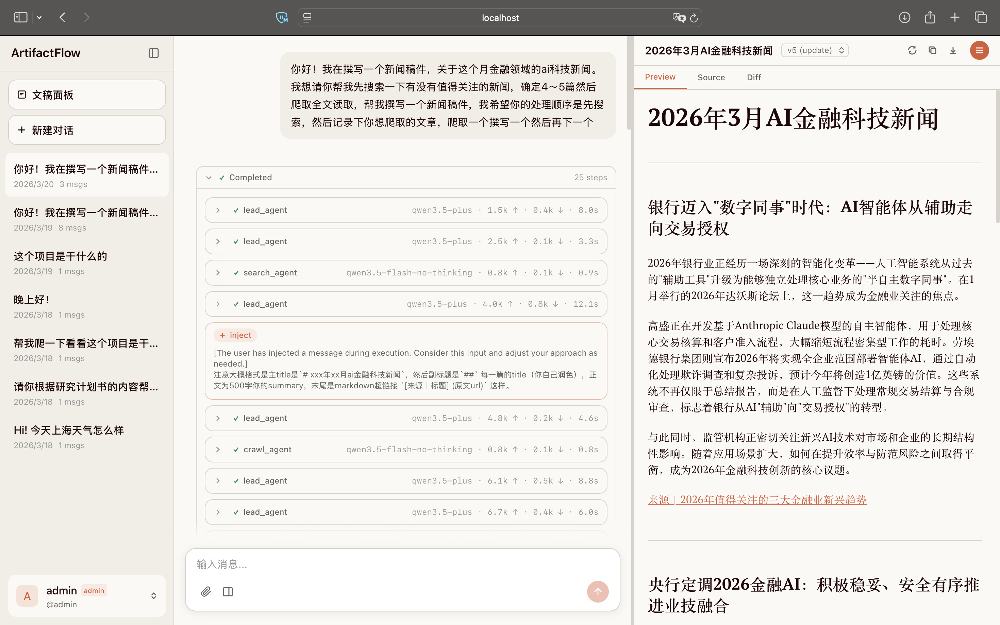
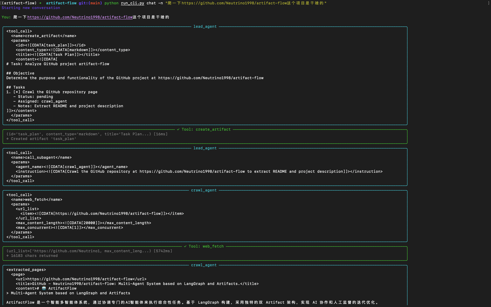

# ArtifactFlow

> Artifacts 架构的多智能体系统

[](https://www.python.org/downloads/)
[]()
[]()

ArtifactFlow 是一个智能多智能体系统，通过协调专门的AI智能体来执行综合性任务。基于 [Pi-style](https://github.com/badlogic/pi-mono) 执行引擎构建，采用独特的双 Artifact 架构，实现 AI 协作和人工监督的迭代优化。

## 预览

**Web UI** — 三栏布局：侧边栏对话列表、聊天面板（流式渲染 + 分支导航）、Artifact 面板（Markdown/Source/Diff）



**CLI** — 终端交互模式，实时展示 Agent 协作过程和工具调用



## 核心特性

### 执行引擎

- **Pi-style 扁平循环**: `while not completed` 单循环编排 Agent 调用、工具执行和路由，无框架依赖
- **多智能体协作**: Lead/Search/Crawl 专业分工，Lead 无工具调用 → 结束；Subagent 无工具调用 → 回传结果给 Lead
- **Agent 即配置**: Agent 定义为 MD 文件（YAML frontmatter + 角色提示词），无需写代码
- **单轮多工具串行执行**: Agent 单轮可调多个工具，串行执行，权限中断自然嵌入工具间

### 实时交互

- **SSE 流式推送**: 实时输出思考过程、工具调用和执行状态，`fetch` + `ReadableStream`（非 EventSource，支持自定义 Auth header）
- **执行中消息注入** (`/inject`): 用户在执行过程中追加指令，turn boundary 非阻塞 drain 到 LLM context
- **执行取消** (`/cancel`): 优雅取消正在运行的任务，mid-tool 检查点退出，pending interrupt 自动唤醒并拒绝
- **权限中断**: 工具分级权限（AUTO/CONFIRM），CONFIRM 工具触发 `asyncio.Event` 阻塞等待用户确认，超时和断连均视为拒绝

### 上下文管理

- **Context 预算分配**: `context_max_chars` 总预算在 system prompt / conversation history / tool interactions 之间动态分配
- **自动 Compaction**: 输入 token 超阈值时自动触发后台 LLM 摘要压缩，逐对处理带上下文传递，LLM 调用期间不持有 DB 资源
- **手动 Compaction** (`/compact`): API 手动触发，`wait_if_running` 确保下次执行使用最新摘要

### 数据与持久化

- **双 Artifact 架构**: Task Plan + Result Artifact 分离，支持版本追溯和乐观锁并发控制
- **事件溯源**: MessageEvent append-only 事件表，完整执行过程可回放（`/events` 端点查询），`llm_chunk` 仅 SSE 传输不持久化
- **分支对话**: 从任意历史节点创建新分支，active_branch 追踪当前路径
- **SQLite + WAL**: 持久化存储，服务重启数据不丢失

### 基础设施

- **并发保护**: 同一对话并发执行返回 409，`asyncio.Semaphore` 控制全局并发上限
- **执行指标**: 逐轮 token 用量聚合、agent/tool 级别耗时追踪，持久化到 message metadata
- **JWT 认证**: 多用户隔离，跨用户访问返回 404（非 403），管理员 CRUD
- **REST API**: FastAPI 接口，完整 OpenAPI schema，前端类型自动生成

## 系统架构

### 整体架构

```
┌─────────────────────────────────────────────────────────────┐
│                        API Layer                            │
│   (FastAPI, SSE Stream, Routers, StreamTransport)           │
└─────────────────────────────────────────────────────────────┘
                              │
                              ▼
┌─────────────────────────────────────────────────────────────┐
│                     Application Layer                       │
│           (ExecutionController, Agents, Tools)              │
└─────────────────────────────────────────────────────────────┘
                              │
                              ▼
┌─────────────────────────────────────────────────────────────┐
│                       Manager Layer                         │
│   ┌─────────────────────┐   ┌─────────────────────────┐     │
│   │ ConversationManager │   │    ArtifactManager      │     │
│   │  - In-memory cache  │   │  - In-memory cache      │     │
│   │  - Call Repository  │   │  - Call Repository      │     │
│   └─────────────────────┘   └─────────────────────────┘     │
└─────────────────────────────────────────────────────────────┘
                              │
                              ▼
┌─────────────────────────────────────────────────────────────┐
│                     Repository Layer                        │
│   ┌──────────────────────┐   ┌─────────────────────────┐    │
│   │ConversationRepository│   │   ArtifactRepository    │    │
│   │  - CRUD operations   │   │  - CRUD operations      │    │
│   │  - Tree queries      │   │  - Version & Opt. Lock  │    │
│   └──────────────────────┘   └─────────────────────────┘    │
└─────────────────────────────────────────────────────────────┘
                              │
                              ▼
┌─────────────────────────────────────────────────────────────┐
│                      Database Layer                         │
│              ┌────────────┴────────────┐                    │
│              ▼                         ▼                    │
│     App DB (SQLite)          MessageEvent 事件持久化         │
│     (conversations,          (append-only 事件流)            │
│      messages, artifacts)    (执行过程回放)                  │
└─────────────────────────────────────────────────────────────┘
```

### 并发模型

```
全局单例 (app lifespan)              请求级实例 (per HTTP request)
├─ DatabaseManager (连接池+WAL)      ├─ AsyncSession (独立会话)
├─ StreamTransport (事件缓冲队列)     ├─ ConversationManager/Repo
├─ ExecutionRunner (任务调度)         ├─ ArtifactManager/Repo
│   └─ RuntimeStore (运行时状态)      ├─ ExecutionController
├─ agents config (只读 Dict)         └─ Repositories (User, MessageEvent, ...)
└─ tools (只读 Dict)
```

**设计原则：**

- **全局单例只做协调**：`ExecutionRunner` 管理协程引用和并发上限（`asyncio.Semaphore`），其内部 `RuntimeStore` 管理运行时状态——conversation lease、engine interactive 标记（双状态生命周期）、interrupt（`asyncio.Event`）和消息注入；`StreamTransport`（当前实现为 `StreamManager`）管理事件缓冲队列（`asyncio.Lock` 保护字典操作）；`DatabaseManager` 管理连接池。它们不持有业务状态。`RuntimeStore` 和 `StreamTransport` 均为 Protocol，可替换为 Redis 实现。
- **请求级实例做业务**：每个 HTTP 请求通过 FastAPI `Depends()` 获得独立的 DB session 和 Manager 实例，请求间完全隔离。
- **背景任务独立 session**：`POST /chat` 启动的背景执行任务通过 `_create_controller()` 获取独立 DB session，生命周期不绑定 HTTP 请求。
- **agents / tools 是只读全局配置**：启动时加载，运行期间不可变，无需加锁。
- **Async-first**：全部使用 `asyncio` 原语（Lock / Semaphore / Event），无 threading 混用。

**SSE 管线生命周期：**

```
POST /chat → create_stream(TTL=30s) → submit background task → return stream_url
                                              │
GET /stream/{id} ← consume_events ← push_event ← execute_loop
                                              │
                              terminal event (complete/error) → close_stream → delayed cleanup (5s)
```

### Artifact 层

```
┌────────────────────────────────────────────────────────────┐
│                       ARTIFACT LAYER                       │
│                                                            │
│  ┌───────────────────────────────┐  ┌────────────────────┐ │
│  │       Task Plan Artifact      │  │    Result Artifact │ │
│  │  - Task breakdown & tracking  │  │  - Final outputs   │ │
│  │  - Shared context for agents  │  │  - User editable   │ │
│  └───────────────────────────────┘  └────────────────────┘ │
└────────────────────────────────────────────────────────────┘
           ↑                     ↑                    ↑
    Lead Agent              Subagents                User
  (Read/Write)             (Read Only)           (Read/Edit)
```

### 智能体角色

- **主控智能体 (Lead Agent)**: 任务协调、信息整合、用户交互
- **搜索智能体 (Search Agent)**: 信息检索和结构化搜索结果
- **网页抓取智能体 (Crawl Agent)**: 深度内容提取和分析（支持HTML和PDF）

## 快速开始

### 环境要求

- **Python 3.10+**
- API Keys（OpenAI、通义千问、DeepSeek、博查AI 等）
- 推荐系统内存 ≥ 2GB


### 方式一：Docker 部署（推荐）

最简单的部署方式，无需配置 Python 环境。

1. **克隆项目**
   ```bash
   git clone https://github.com/yourusername/artifact-flow.git
   cd artifact-flow
   ```

2. **配置环境变量**
   ```bash
   cp .env.example .env
   # 编辑 .env 文件，添加你的 API Keys
   # 设置 JWT 密钥（必须）
   echo "ARTIFACTFLOW_JWT_SECRET=$(python -c 'import secrets; print(secrets.token_urlsafe(32))')" >> .env
   ```

3. **启动服务**
   ```bash
   docker-compose up -d
   ```

4. **创建管理员账号**
   ```bash
   # "admin" 是用户名，--password 指定密码（不加则交互式提示输入）
   docker-compose exec backend python scripts/create_admin.py admin --password admin
   ```
   管理员登录后可在侧边栏底部的用户菜单中打开「管理用户」面板，创建和管理其他用户账号。

5. **查看日志**
   ```bash
   docker-compose logs -f
   ```

6. **访问服务**
   - 前端界面: http://localhost:3000
   - API 文档: http://localhost:8000/docs
   - ReDoc 文档: http://localhost:8000/redoc

**停止服务：**
```bash
docker-compose down
```

**重新构建（代码更新后）：**
```bash
docker-compose up -d --build
```

> **注意：** Docker 镜像 <1GB（约 430MB）。首次构建需要下载较多依赖。

### 方式二：本地安装

适合需要修改代码或进行开发的场景。

1. **克隆项目**
   ```bash
   git clone https://github.com/yourusername/artifact-flow.git
   cd artifact-flow
   ```

2. **创建虚拟环境**
   ```bash
   # 使用 conda（推荐）
   conda create -n artifact-flow python=3.10
   conda activate artifact-flow

   # 或使用 venv
   python3 -m venv artifact-flow
   # Windows: artifact-flow\Scripts\activate
   # macOS/Linux: source artifact-flow/bin/activate
   ```

3. **安装系统依赖**
   ```bash
   # macOS
   brew install pandoc

   # Ubuntu/Debian
   sudo apt-get install -y pandoc
   ```

4. **安装 Python 依赖**
   ```bash
   pip install -e .
   ```

5. **配置环境变量**
   ```bash
   cp .env.example .env
   # 编辑 .env 文件，添加你的 API Keys
   ```

6. **设置 JWT 密钥**（必须，否则服务无法启动）
   ```bash
   echo "ARTIFACTFLOW_JWT_SECRET=$(python -c 'import secrets; print(secrets.token_urlsafe(32))')" >> .env
   ```

7. **创建管理员账号**（首次使用前必须）
   ```bash
   # "admin" 是用户名，--password 指定密码（不加则交互式提示输入）
   python scripts/create_admin.py admin --password admin
   ```
   管理员登录后可在侧边栏底部的用户菜单中打开「管理用户」面板，创建和管理其他用户账号。

8. **启动服务**
   ```bash
   # 启动 API 服务器
   python run_server.py

   # 开发模式（自动重载）
   python run_server.py --reload

   # 服务启动后访问:
   # - API 文档: http://localhost:8000/docs
   # - ReDoc 文档: http://localhost:8000/redoc
   ```

9. **使用 CLI 交互**
   ```bash
   # 登录（首次使用需要）
   python run_cli.py login

   # 进入交互式聊天（需先启动服务器）
   python run_cli.py chat

   # 或直接发送消息
   python run_cli.py chat "研究一下 LangGraph 的最新特性"
   ```

## 配置指南

创建 `.env` 文件并配置以下 API Keys：

```env
# ========================================
# 认证配置（必须）
# ========================================
# 生成方式: python -c "import secrets; print(secrets.token_urlsafe(32))"
ARTIFACTFLOW_JWT_SECRET=your-secret-here

# ========================================
# 模型 API 配置
# ========================================

# ------ OpenAI (GPT系列) ------
# 获取地址: https://platform.openai.com/api-keys
OPENAI_API_KEY=sk-xxx

# ------ 通义千问 (Qwen) ------
# 获取地址: https://dashscope.console.aliyun.com/apiKey
DASHSCOPE_API_KEY=sk-xxx

# ------ DeepSeek ------
# 获取地址: https://platform.deepseek.com/api_keys
DEEPSEEK_API_KEY=sk-xxx

# ========================================
# 工具 API 配置
# ========================================

# ------ 博查AI (Web搜索) ------
# 获取地址: https://open.bochaai.com
BOCHA_API_KEY=sk-xxx

# ------ Jina Reader API (网页抓取) ------
# 获取地址: https://jina.ai/reader（免费 tier 可用，设置后提升限额）
# JINA_API_KEY=jina_xxx
```

## 自定义配置

所有运行时配置集中在 `config/` 目录，文件本身包含注释和示例：

| 配置 | 文件 | 说明 |
|------|------|------|
| **模型** | `config/models/models.yaml` | 基于 [LiteLLM](https://github.com/BerriAI/litellm) 支持 100+ 提供商，含 Ollama/vLLM 自部署示例 |
| **Agent** | `config/agents/*.md` | YAML frontmatter（模型、工具权限）+ 角色提示词 |
| **自定义工具** | `config/tools/*.md` | YAML frontmatter（HTTP 端点、参数）+ 使用说明，参考 `_example.md` |

## 数据持久化

ArtifactFlow 使用 SQLite 数据库进行数据持久化，采用双层存储架构：

### 存储位置

```
data/
└── artifactflow.db    # SQLite 数据库文件（自动创建）
```

### 数据库表结构

| 表名 | 说明 |
|------|------|
| `users` | 用户信息（用户名、密码哈希、角色） |
| `conversations` | 对话元信息（ID、标题、活跃分支、所属用户） |
| `messages` | 消息记录（树结构，支持分支对话） |
| `message_events` | 执行事件流（append-only，完整执行过程回放） |
| `artifact_sessions` | Artifact 会话（与对话 1:1 关联） |
| `artifacts` | Artifact 内容（含乐观锁版本控制） |
| `artifact_versions` | Artifact 历史版本（支持版本回溯） |

### 特性

- **WAL 模式**: 启用 Write-Ahead Logging，支持并发读写
- **乐观锁**: Artifact 更新使用乐观锁机制，防止并发冲突
- **热数据缓存**: Manager 层实现 LRU 缓存，减少数据库访问
- **PostgreSQL 兼容**: 使用 SQLAlchemy ORM，可平滑迁移到 PostgreSQL

### 初始化

数据库在首次运行时自动创建，无需手动初始化。如需重置数据库：

```bash
# 删除数据库文件（谨慎操作，将丢失所有数据）
rm data/artifactflow.db
```

## 项目结构

```
artifact-flow/
├── run_server.py       # API 服务器启动脚本
├── run_cli.py          # CLI 启动脚本
├── cli/                # CLI 命令行工具 (Typer + Rich)
│   ├── main.py                  # CLI 主入口和命令定义
│   ├── api_client.py            # API 客户端封装
│   ├── config.py                # CLI 配置和状态管理
│   └── ui.py                    # Rich 终端 UI 组件
├── src/
│   ├── config.py                 # 服务级配置（Settings，环境变量覆盖）
│   ├── core/        # 核心工作流和状态管理 (已完成)
│   │   ├── engine.py             # Pi-style 执行引擎（含状态创建和ExecutionMetrics）
│   │   ├── controller.py         # 执行控制器 (支持流式和批量模式)
│   │   ├── events.py             # 统一事件类型定义（StreamEventType + ExecutionEvent）
│   │   ├── compaction.py            # CompactionManager（跨轮对话摘要压缩）
│   │   ├── context_manager.py    # Context压缩和管理
│   │   └── conversation_manager.py  # 对话管理器（缓存+持久化）
│   ├── agents/      # 智能体系统 (已完成)
│   │   └── loader.py             # Agent 加载器（解析 YAML frontmatter + role prompt）
│   ├── tools/       # 工具系统和实现 (已完成)
│   │   ├── base.py               # 工具基类和权限定义
│   │   ├── xml_parser.py         # XML工具调用解析（CDATA格式）
│   │   ├── xml_formatter.py      # XML格式化（工具说明+结果序列化）
│   │   ├── builtin/              # 内置工具实现
│   │   │   ├── artifact_ops.py   # Artifact操作工具 (ArtifactManager)
│   │   │   ├── web_search.py     # 博查AI搜索
│   │   │   ├── web_fetch.py      # Jina Reader API网页抓取(支持PDF，DocConverter+pymupdf降级)
│   │   │   └── call_subagent.py  # Subagent调用工具
│   │   └── custom/               # 自定义工具系统
│   │       ├── loader.py         # MD文件加载器（YAML frontmatter → HttpTool）
│   │       ├── http_tool.py      # HTTP工具实现
│   │       └── secrets.py        # 环境变量模板解析
│   ├── db/          # 数据库层 (已完成)
│   │   ├── database.py           # DatabaseManager：连接池、WAL模式
│   │   ├── models.py             # SQLAlchemy ORM 模型定义
│   │   └── migrations/           # 数据库迁移脚本
│   │       └── versions/
│   │           └── 001_initial_schema.py
│   ├── repositories/ # 数据访问层 (已完成)
│   │   ├── base.py               # BaseRepository 抽象类
│   │   ├── conversation_repo.py  # ConversationRepository
│   │   ├── artifact_repo.py      # ArtifactRepository (含乐观锁)
│   │   ├── user_repo.py          # UserRepository
│   │   └── message_event_repo.py # MessageEventRepository (事件溯源)
│   ├── models/      # LLM 接口封装 (已完成)
│   │   └── llm.py                # 基于 LiteLLM 的统一接口，支持 100+ 提供商
│   ├── utils/       # 工具函数和帮助类 (已完成)
│   │   ├── logger.py             # 分级日志系统
│   │   ├── retry.py              # 指数退避重试
│   │   └── doc_converter.py      # 文档转换（pandoc/pymupdf，支持导入导出）
│   └── api/         # API 接口层 (已完成)
│       ├── main.py               # FastAPI 应用入口
│       ├── dependencies.py       # 依赖注入（Controller、Manager等）
│       ├── routers/              # 路由模块
│       │   ├── chat.py           # /api/v1/chat 对话接口
│       │   ├── artifacts.py      # /api/v1/artifacts Artifact接口
│       │   ├── stream.py         # /api/v1/stream SSE流式接口
│       │   └── auth.py           # /api/v1/auth 认证接口
│       ├── schemas/              # Pydantic 模型
│       │   ├── chat.py           # 对话相关 schema
│       │   ├── artifact.py       # Artifact 相关 schema
│       │   ├── events.py         # SSE 事件 schema
│       │   └── auth.py           # 认证相关 schema
│       ├── services/             # 服务层
│       │   ├── stream_manager.py    # 事件缓冲队列管理（StreamTransport 实现）
│       │   ├── stream_transport.py  # StreamTransport Protocol（可替换为 Redis Streams）
│       │   ├── execution_runner.py  # 后台任务调度（asyncio.Task + Semaphore）
│       │   ├── runtime_store.py     # RuntimeStore Protocol + InMemoryRuntimeStore（运行时状态）
│       │   └── auth.py              # JWT + 密码哈希服务
│       └── utils/
│           └── sse.py            # SSE 响应构建器
├── frontend/           # Next.js 前端（详见 frontend/README.md）
│   ├── Dockerfile               # 前端多阶段构建
│   ├── next.config.js           # Next.js 配置（standalone 输出）
│   └── src/                     # 前端源码
│       ├── app/                 # App Router 页面
│       ├── components/          # UI 组件
│       ├── stores/              # Zustand 状态管理
│       ├── hooks/               # 自定义 hooks
│       ├── lib/                 # 工具函数、API client
│       └── types/               # TypeScript 类型（含自动生成的 API 类型）
├── config/             # 配置文件（运行时只读）
│   ├── agents/                    # Agent 定义（MD: YAML frontmatter + role prompt）
│   │   ├── lead_agent.md          # 主控智能体（模型、工具权限、角色提示词）
│   │   ├── search_agent.md        # 搜索智能体
│   │   ├── crawl_agent.md         # 网页抓取智能体
│   │   └── compact_agent.md       # 压缩智能体（对话摘要生成）
│   ├── models/
│   │   └── models.yaml            # LLM 模型注册表
│   └── tools/                     # 自定义工具 MD 定义（可选，目录为空则无自定义工具）
├── scripts/            # 工具脚本
│   ├── export_openapi.py        # 导出 OpenAPI schema 供前端类型生成
│   └── create_admin.py          # 创建管理员账号
├── data/               # 数据目录 (SQLite数据库文件)
├── tests/              # 测试
│   ├── conftest.py                    # 全局 fixtures（db_manager, repos, test_user）
│   ├── repositories/                  # Repository 合约测试（pytest）
│   │   ├── test_user_repo.py          # 用户 CRUD / 分页 / 唯一约束
│   │   ├── test_conversation_repo.py  # 对话 CRUD / 消息树 / 分支路径
│   │   └── test_artifact_repo.py      # Artifact CRUD / 乐观锁 / 版本历史
│   ├── api/                           # API 集成测试（pytest）
│   │   ├── conftest.py                # httpx AsyncClient + 依赖覆盖
│   │   ├── test_auth.py               # 登录 / /me / 管理员 CRUD
│   │   ├── test_chat.py               # 会话列表 / 详情 / 删除 / 权限隔离
│   │   └── test_artifacts.py          # Artifact 列表 / 详情 / 版本 / 权限隔离
│   ├── test_concurrent.py             # 并发测试（file SQLite + Barrier + gather）
│   └── manual/                        # 手动 / 交互式测试（需要 LLM 后端）
│       ├── engine.py                  # 执行引擎测试（多轮对话、Artifact、权限、分支）
│       ├── api_smoke.py               # API 烟雾测试
│       └── litellm_providers.py       # LiteLLM 提供商兼容性测试
├── logs/               # 日志目录
└── docs/               # 文档
```

## 使用方式

### CLI 命令行工具

基于 Typer + Rich 的终端交互界面，需要先启动 API 服务器：

```bash
# 1. 启动 API 服务器
python run_server.py

# 2. 使用 CLI（另开终端）
python run_cli.py chat              # 进入交互式聊天
python run_cli.py chat "你好"       # 发送单条消息
python run_cli.py chat -n           # 开始新对话
```

#### CLI 完整命令

| 命令 | 说明 |
|------|------|
| `login` | 登录（首次使用前必须） |
| `logout` | 登出 |
| `chat [message]` | 发送消息，无参数时进入交互模式 |
| `chat -n/--new` | 开始新对话 |
| `list` | 列出最近对话 |
| `show <id>` | 查看对话详情 |
| `use <id>` | 切换到指定对话 |
| `artifacts [session_id]` | 列出 Artifacts |
| `artifact <id>` | 查看 Artifact 内容 |
| `status` | 显示当前 CLI 状态 |
| `clear` | 清除会话状态 |

交互模式内置命令：
- `/new` - 开始新对话
- `/status` - 查看当前状态
- `quit` / `exit` - 退出

### 自动化测试

项目使用 pytest，覆盖三层：

```bash
# 运行全部测试
pytest

# 按层运行
pytest tests/repositories/      # Repository 合约测试
pytest tests/api/               # API 集成测试
pytest tests/test_concurrent.py # 并发测试

# 常用选项
pytest -x                      # 遇到首个失败即停止
pytest -k "test_name"          # 按名称匹配运行
```

| 层 | 覆盖范围 |
|---|---------|
| **Repository** | CRUD / count+pagination / 唯一约束 / 消息树分支路径 / 乐观锁 VersionConflictError / 版本历史 |
| **API** | 登录（anon_client）/ JWT 鉴权 / 管理员 CRUD / 会话列表+详情+删除 / Artifact 版本 / 跨用户 404 隔离 |
| **并发** | file SQLite + WAL + asyncio.Barrier + gather：乐观锁冲突、并行写消息、重复创建、WAL 读隔离 |

### 手动 / 交互式测试

需要 LLM 后端运行：

```bash
# 执行引擎测试 - 多轮对话、Artifact、权限确认、分支对话
python -m tests.manual.engine

# LLM 提供商兼容性测试
python -m tests.manual.litellm_providers                    # 测试所有模型
python -m tests.manual.litellm_providers qwen3.5-plus       # 测试指定模型
```

测试脚本提供交互式菜单：
1. **基本问答** - 简单单轮对话
2. **多轮对话** - 演示多轮上下文保持
3. **Artifact 工具调用** - 演示 create_artifact 触发
4. **权限确认流** - 演示工具权限中断/恢复流程
5. **分支对话** - 演示从历史消息创建分支

## 文档

详细的架构设计和开发指南请参阅 **[Wiki 文档](https://neutrino1998.github.io/artifact-flow/)**：

- [Request Lifecycle](https://neutrino1998.github.io/artifact-flow/request-lifecycle/) - 请求完整生命周期
- [Architecture](https://neutrino1998.github.io/artifact-flow/architecture/core/) - 模块深度解析
- [Extension Guide](https://neutrino1998.github.io/artifact-flow/extension-guide/) - 如何扩展 Agent 和 Tool
- [API Reference](https://neutrino1998.github.io/artifact-flow/api/) - 前端集成接口文档
- [FAQ](https://neutrino1998.github.io/artifact-flow/faq/) - 常见问题与排查

## 支持与反馈

- [问题反馈](https://github.com/Neutrino1998/artifact-flow/issues)
- [讨论交流](https://github.com/Neutrino1998/artifact-flow/discussions)
- [联系作者](mailto:1998neutrino@gmail.com)
