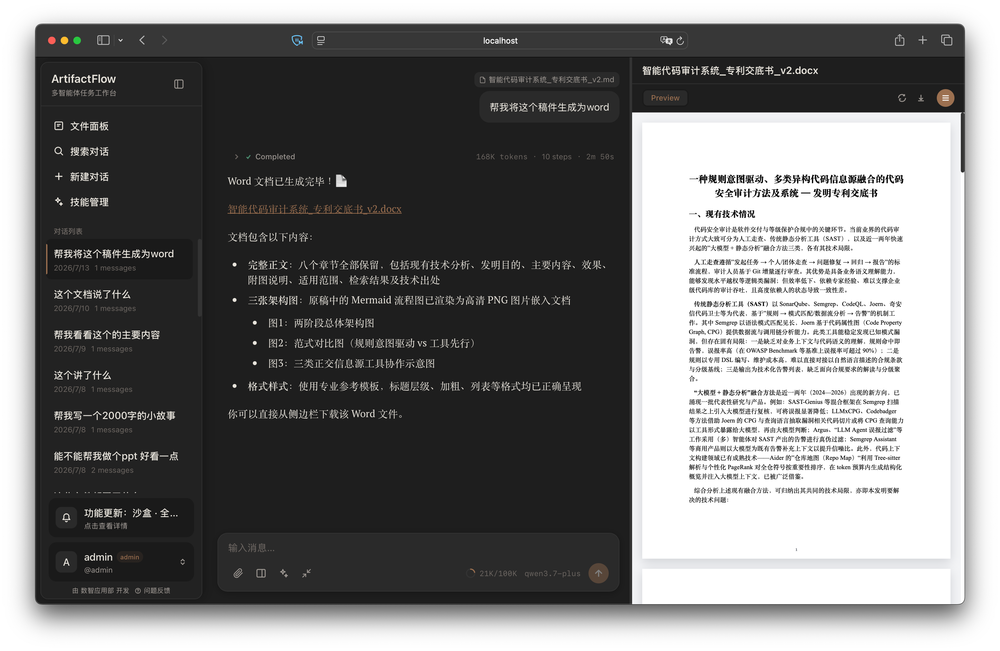

# ArtifactFlow

> 面向私有化部署的可配置多智能体服务

[](https://www.python.org/downloads/)
[](https://neutrino1998.github.io/artifact-flow/)
[]()

ArtifactFlow 使用 Pi-style 循环执行 Agent：Lead Agent 可以直接工作、调用 Tool，或把较大的子任务委派给隔离上下文中的 Subagent。Model、Agent、HTTP Tool、MCP 和 Skill 主要通过 Markdown/YAML 配置，生产环境通过不可变 Release 和 `afctl` 交付。

它位于本地个人 Agent 与全托管平台之间，目标是为一个组织快速搭建数据不出域、可以持续运维的 AI 服务，而不是公开多租户 SaaS 或本地长期开发工作区。



## 核心能力

- Pi-style per-agent loop 与原地串行 Subagent 委派
- Model / Agent / Tool / MCP / Skill 配置与数据库注册表
- Task Plan、Result 和上传文件统一为 Artifact
- 对话树、事件历史和上下文 Compaction
- SSE 实时输出、Permission Interrupt、Cancel 和 Timeout
- 按轮 Sandbox：显式 mount、执行和 persist
- SQLite/InMemory 本地试用；PostgreSQL/Redis 多副本生产运行
- 不可变 Release、`afctl` Apply/rollback/config hotfix

## 本地试用

需要 Docker、Docker Compose 和至少一个 LLM API Key。

```bash
git clone https://github.com/Neutrino1998/artifact-flow.git
cd artifact-flow
cp .env.example .env
```

编辑 `.env`，至少设置：

- `ARTIFACTFLOW_JWT_SECRET`
- `ARTIFACTFLOW_CREDENTIAL_KEY`
- `DASHSCOPE_API_KEY`、`OPENAI_API_KEY` 或其他已配置模型的凭证

启动：

```bash
docker compose up -d
docker compose exec backend python scripts/create_admin.py admin
```

访问 <http://localhost:3000>。设置 `ARTIFACTFLOW_DEBUG=true` 后，可在 <http://localhost:8000/docs> 查看 OpenAPI 文档。

本地 Compose 使用 SQLite 和进程内运行时，只适合试用与开发。生产部署从 Wiki 的[主机准备](https://neutrino1998.github.io/artifact-flow/operations/host-preparation/)开始。

## 配置入口

| 能力 | 作者配置 |
|---|---|
| Model | `config/models/models.yaml` |
| Agent | `config/agents/*.md` |
| HTTP Tool / Toolset | `config/tools/` |
| MCP Server | `config/mcp/*.md` |
| Skill | `config/skills/` |
| 现场配置 | 生产目标机的 `control/site.toml`、`control/.env`、`control/site/` |

修改 Agent、Tool、MCP 或 Skill 后，在 Quick Trial 容器中预检并重建 Backend 生效：

```bash
docker compose exec backend python scripts/reconcile_config.py --dry-run
docker compose up -d --force-recreate backend
```

完整字段与生效方式见 Wiki 的[配置总览](https://neutrino1998.github.io/artifact-flow/configuration/)。

## 生产发布

生产单机是当前正式支持路径。构建机生成 Release：

```bash
./scripts/release.sh 1.4.0 --with-infra --platform linux/amd64
```

目标机使用 bundle 自带的 `afctl` 执行 `site init → doctor → plan apply → apply`。公网和内网是同一部署栈的不同 TLS capability；实验性 Ansible 多机路径尚未完成物理验收。

详见：[首次部署](https://neutrino1998.github.io/artifact-flow/operations/first-deployment/) · [Release 与升级](https://neutrino1998.github.io/artifact-flow/operations/releases/) · [日常维护](https://neutrino1998.github.io/artifact-flow/operations/maintenance/)。

## 开发

Python 3.11+：

```bash
python -m venv .venv
source .venv/bin/activate
pip install -e .
cp .env.example .env
mkdir -p data
```

生成两个必填密钥：

```bash
python -c "import secrets; print(secrets.token_urlsafe(32))"
python -c "from cryptography.fernet import Fernet; print(Fernet.generate_key().decode())"
```

把输出分别填入 `.env` 的 `ARTIFACTFLOW_JWT_SECRET` 和 `ARTIFACTFLOW_CREDENTIAL_KEY`，并将至少一个模型供应商的占位凭证替换为真实值。然后初始化管理员并启动服务：

```bash
python scripts/create_admin.py admin
python run_server.py --reload
```

前端：

```bash
cd frontend
npm ci
npm run dev
```

API schema 变更后同步前端类型：

```bash
python scripts/export_openapi.py
cd frontend && npm run generate-types
```

测试：

```bash
# 完整串行回归（便于调试）
pytest

# 日常无外部依赖回归；普通测试默认必须支持 xdist 并行
pytest -n 4 -m "not external and not serial"

# 真实 Redis 集成回归
REDIS_URL=redis://localhost:6379 pytest -m external

cd frontend && npm run test:run
go test ./...
```

## 文档

完整 Wiki：<https://neutrino1998.github.io/artifact-flow/>

- [工作原理](https://neutrino1998.github.io/artifact-flow/how-it-works/)
- [配置](https://neutrino1998.github.io/artifact-flow/configuration/)
- [部署与运维](https://neutrino1998.github.io/artifact-flow/operations/host-preparation/)

Wiki 使用 MkDocs Material。推送 `main` 上的 `docs/**` 或 `mkdocs.yml` 变更后，GitHub Actions 会严格构建并发布到 `gh-pages`。
