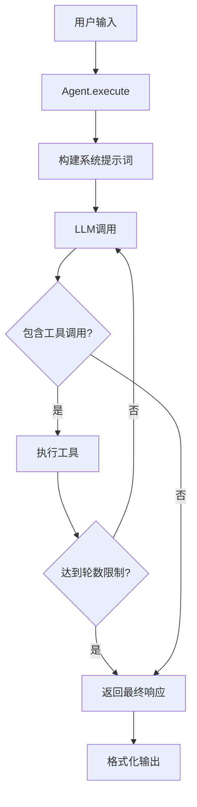

# Agents模块使用指南

## 概述

Agents模块实现了多智能体研究系统的核心Agent逻辑。每个Agent都有特定的职责和工具集，通过协作完成复杂的研究任务。

## 核心设计原则

1. **统一的执行模式**：所有Agent继承自`BaseAgent`，共享工具调用循环、流式输出等基础功能
2. **工具调用限制**：每个Agent最多进行3轮工具调用，防止无限循环
3. **完成判断统一**：当LLM响应中不包含工具调用时，即视为任务完成
4. **模型兼容性**：支持思考模型和非思考模型，核心逻辑基于`response.content`
5. **双执行模式**：提供`execute()`(传统)和`execute_stream()`(流式)两种执行方法

## Agent类型

### 1. Lead Agent

**职责**：任务协调、信息整合、用户交互

**工具集**：

- Artifact操作工具（create/update/rewrite/read）
- CallSubagentTool（路由到其他Agent）

**使用示例**：

```python
from agents import create_lead_agent
from tools.registry import create_agent_toolkit

# 创建工具包
toolkit = create_agent_toolkit("lead_agent", tool_names=[
    "create_artifact", "update_artifact", 
    "rewrite_artifact", "read_artifact", "call_subagent"
])

# 创建Lead Agent
agent = create_lead_agent(toolkit=toolkit)

# 执行任务
response = await agent.execute(
    "Create a research plan for AI safety",
    context={"task_complexity": "high"}
)

print(response.content)  # 最终响应
print(response.tool_calls)  # 工具调用历史
```

### 2. Search Agent

**职责**：信息检索、搜索优化

**工具集**：

- web_search（网页搜索）

**核心能力**：

- 自主优化搜索词
- 多轮迭代搜索
- XML格式结构化输出

**使用示例**：

```python
from agents import create_search_agent

# 创建Search Agent
agent = create_search_agent(toolkit=search_toolkit)

# 执行搜索
context = {
    "instruction": "Find recent AI breakthroughs",
    "requirements": ["Focus on 2024", "Include commercial applications"]
}

response = await agent.execute(
    "Search for AI breakthroughs",
    context=context
)

# 响应为XML格式
# <search_findings>
#   <summary>...</summary>
#   <search_results>...</search_results>
# </search_findings>
```

### 3. Crawl Agent

**职责**：内容抓取、信息提取

**工具集**：

- web_fetch（网页内容抓取）

**核心能力**：

- 深度内容提取
- 智能内容清洗
- 结构化信息组织

**使用示例**：

```python
from agents import create_crawl_agent

# 创建Crawl Agent
agent = create_crawl_agent(toolkit=crawl_toolkit)

# 执行抓取
context = {
    "urls": ["https://example.com/article"],
    "focus_areas": ["Key findings", "Data points"]
}

response = await agent.execute(
    "Extract content from URLs",
    context=context
)

# 响应为XML格式
# <extraction_results>
#   <summary>...</summary>
#   <pages>...</pages>
# </extraction_results>
```

## 工具集成

### 1. 设置工具注册表

```python
from tools.registry import get_registry
from tools.implementations import *

# 获取全局注册表
registry = get_registry()

# 注册工具到库
registry.register_tool_to_library(CreateArtifactTool())
registry.register_tool_to_library(WebSearchTool())
# ... 更多工具
```

### 2. 创建Agent工具包

```python
# 为特定Agent创建工具包
toolkit = registry.create_agent_toolkit(
    agent_name="lead_agent",
    tool_names=["create_artifact", "call_subagent"]
)
```

### 3. 权限控制（可选）

```python
from tools.permissions import PermissionManager, ToolPermission

# 设置Agent权限
manager = PermissionManager({
    "lead_agent": {ToolPermission.PUBLIC, ToolPermission.CONFIRM},
    "search_agent": {ToolPermission.PUBLIC}
})
```

## 执行流程



## AgentConfig配置

```python
from agents import AgentConfig

config = AgentConfig(
    name="custom_agent",
    description="Custom research agent",
    model="qwen-plus",  # 或其他模型
    temperature=0.7,
    max_tool_rounds=3,  # 最大工具调用轮数
    streaming=True,  # 流式输出
    debug=False  # 调试模式
)
```

## 最佳实践

### 1. 任务规划策略

- **简单问题**：直接回答，无需artifact
- **中等复杂**：可选创建task_plan
- **复杂研究**：必须创建task_plan进行系统化执行

### 2. Agent协作模式

```python
# Lead Agent协调示例
lead_response = await lead_agent.execute(
    "Research quantum computing applications"
)

# Lead自动调用sub agents
# 路由通过CallSubagentTool触发
if "call_subagent" in [c["tool"] for c in lead_response.tool_calls]:
    # Graph会自动路由到相应的sub agent
    pass
```

### 3. 错误处理

```python
try:
    response = await agent.execute(user_input)
except Exception as e:
    logger.error(f"Agent execution failed: {e}")
    # 降级处理或重试
```

### 4. 调试技巧

```python
# 开启调试模式
config = AgentConfig(debug=True)
agent = BaseAgent(config, toolkit)

# 查看工具调用详情
for call in response.tool_calls:
    print(f"Tool: {call['tool']}")
    print(f"Params: {call['params']}")
    print(f"Result: {call['result']}")
```

## 与LangGraph集成

Agents模块设计为与LangGraph无缝集成：

### 传统模式（使用execute）

```python
from langgraph.graph import StateGraph

# 定义工作流
workflow = StateGraph(AgentState)

# 添加节点
workflow.add_node("lead_agent", lead_agent_node)
workflow.add_node("search_agent", search_agent_node)

# 条件路由
def route_after_lead(state):
    # 检查是否需要路由到sub agent
    if state.get("route_to"):
        return state["route_to"]
    return END

workflow.add_conditional_edges(
    "lead_agent",
    route_after_lead,
    {"search_agent": "search_agent", END: END}
)
```

### 流式模式（使用execute_stream）

```python
from agents import StreamEvent, StreamEventType

async def lead_agent_node(state: AgentState):
    """使用execute_stream的节点实现"""
    agent = get_lead_agent()
    
    # 收集流式事件
    events = []
    final_response = None
    
    # 流式执行
    async for event in agent.execute_stream(state["input"]):
        events.append(event)
        
        # 实时处理不同类型的事件
        if event.type == StreamEventType.LLM_CHUNK:
            # 发送到WebSocket或其他流式通道
            await send_to_frontend(event.data["content"])
        
        elif event.type == StreamEventType.TOOL_START:
            # 显示工具调用状态
            await notify_tool_start(event.data["tool"])
        
        elif event.type == StreamEventType.COMPLETE:
            final_response = event.data["response"]
    
    return {
        "agent_response": final_response,
        "stream_events": events
    }
```

## 流式执行详解

### StreamEvent类型

```python
class StreamEventType(Enum):
    START = "start"              # 执行开始
    LLM_CHUNK = "llm_chunk"      # LLM输出片段
    LLM_COMPLETE = "llm_complete"# LLM输出完成
    TOOL_START = "tool_start"    # 工具调用开始
    TOOL_RESULT = "tool_result"  # 工具调用结果
    COMPLETE = "complete"        # 执行完成
    ERROR = "error"              # 错误
```

### 使用execute_stream

```python
# 创建Agent
agent = create_lead_agent(toolkit=toolkit)

# 流式执行
async for event in agent.execute_stream(user_input, context):
    # 处理不同类型的事件
    if event.type == StreamEventType.LLM_CHUNK:
        # 实时显示LLM输出
        print(event.data["content"], end="")
    
    elif event.type == StreamEventType.TOOL_START:
        print(f"\n🔧 Calling {event.data['tool']}...")
    
    elif event.type == StreamEventType.COMPLETE:
        response = event.data["response"]
        print(f"\n✅ Completed with {len(response.tool_calls)} tool calls")
```

### WebSocket集成示例

```python
# FastAPI WebSocket endpoint
@app.websocket("/ws/agent/{agent_id}")
async def agent_websocket(websocket: WebSocket, agent_id: str):
    await websocket.accept()
    
    # 获取Agent
    agent = get_agent(agent_id)
    
    # 接收用户输入
    user_input = await websocket.receive_text()
    
    # 流式执行并发送事件
    async for event in agent.execute_stream(user_input):
        # 转换为JSON并发送
        await websocket.send_json({
            "type": event.type.value,
            "agent": event.agent,
            "timestamp": event.timestamp.isoformat(),
            "data": event.data
        })
```

### 前端处理示例

```javascript
// 连接WebSocket
const ws = new WebSocket('ws://localhost:8000/ws/agent/lead_agent');

// 处理流式事件
ws.onmessage = (event) => {
    const data = JSON.parse(event.data);
    
    switch(data.type) {
        case 'llm_chunk':
            // 追加到聊天界面
            appendToChat(data.data.content);
            break;
            
        case 'tool_start':
            // 显示工具调用动画
            showToolLoading(data.data.tool);
            break;
            
        case 'tool_result':
            // 更新工具状态
            updateToolStatus(data.data.tool, data.data.success);
            break;
            
        case 'complete':
            // 显示最终结果
            displayFinalResponse(data.data.response);
            break;
    }
};
```

### execute vs execute_stream对比

| 特性      | execute()       | execute_stream()              |
| --------- | --------------- | ----------------------------- |
| 返回类型  | `AgentResponse` | `AsyncGenerator[StreamEvent]` |
| 使用场景  | 批量处理、测试  | 实时交互、LangGraph           |
| 输出时机  | 完成后一次性    | 实时流式                      |
| 事件粒度  | 无              | 细粒度事件                    |
| WebSocket | 需要轮询        | 原生支持                      |

## 🔧 工程实践要点

### 1. Agent工具循环控制机制

设置统一的工具调用次数限制（最大3轮），超过限制后在提示词中明确指示Agent："你已达到工具调用上限，请总结你的发现并返回最终结果给Lead Agent"，防止无限循环并确保任务收敛。

```python
# 在BaseAgent中已实现
if round_num == self.config.max_tool_rounds:
    messages.append({
        "role": "system",
        "content": "⚠️ You have reached the maximum tool call limit..."
    })
```

### 2. 任务完成状态判断统一原则

所有Agent（Lead/Sub）采用相同的完成信号：当LLM响应中不包含工具调用时，即视为任务完成。Sub Agent完成后自动返回Lead Agent，Lead Agent无工具调用时结束整个流程。

```python
# 统一的完成判断逻辑
tool_calls = parse_tool_calls(response_content)
if not tool_calls or round_num >= self.config.max_tool_rounds:
    final_content = response_content
    break  # 任务完成
```

### 3. 单线程顺序执行架构

不考虑Agent并发执行，采用简化设计：同一时间只有一个节点运行，Lead Agent和Sub Agent使用相同的执行策略和代码框架，降低系统复杂度，提高开发效率和调试友好性。

### 4. 统一流式输出体验

Lead Agent和Sub Agent采用相同的构造模式：

- LLM输出支持流式返回（用户实时看到思考过程）
- 工具执行为同步批量返回结果
- 使用`execute_stream()`提供统一的流式体验

### 5. 单一LangGraph架构设计

采用统一的LangGraph工作流，包含Lead Agent节点和多个Sub Agent节点，所有工具调用在节点内部循环执行而非独立节点。通过CallSubagentTool伪工具触发节点间路由。

```python
# CallSubagentTool返回路由指令而非执行结果
if data.get("_is_routing_instruction"):
    return data.get("_route_to")  # 触发LangGraph路由
```

### 6. 模块职责分工明确

- **agents/模块**：实现具体Agent的业务逻辑，包括提示词构建、工具调用循环、结果格式化等Agent内部行为
- **core/模块**：负责LangGraph工作流定义、节点路由逻辑、状态管理、执行控制等系统级调度
- **tools/模块**：提供工具实现和注册管理，不涉及Agent逻辑

### 7. 思考模型兼容性设计

Agent兼容思考模型和非思考模型，对于思考模型可以记录`additional_kwargs`中的`reasoning_content`用于调试，但核心逻辑始终基于`response.content`。

```python
# 记录思考过程但不依赖它
if 'reasoning_content' in chunk.additional_kwargs:
    reasoning_content = chunk.additional_kwargs['reasoning_content']
    # 仅用于调试，核心逻辑使用response.content
```

### 8. Lead Agent工具配置策略

Lead Agent只配置artifact操作工具和CallSubagentTool伪工具：

- Artifact工具：create/update/rewrite/read_artifact
- CallSubagentTool：触发路由到sub agents
- 无工具调用时表示直接回复用户，结束流程

### 9. Lead Agent任务规划逻辑

Lead Agent提示词明确task_plan管理策略：

- **简单问答**：直接回答，无需artifact
- **中等复杂**（1-2个搜索）：可选择创建task_plan
- **复杂研究**：必须先创建task_plan，然后逐步更新

### 10. Search Agent自主优化机制

Search Agent具备自主搜索能力：

- 根据结果质量自行refine搜索词
- 进行多轮搜索优化（最多3轮）
- 返回XML格式结构化结果
- 模仿搜索工具的标准输出格式

```xml
<search_findings>
  <summary>...</summary>
  <search_results>...</search_results>
  <search_strategy>...</search_strategy>
</search_findings>
```

### 11. Fetch Agent内容处理模式

Fetch Agent（Crawl Agent）职责相对简单：

- 接收URL列表
- 爬取内容后清洗提取
- 返回XML格式的有用信息
- 重点关注内容质量而非搜索策略

### 12. 动态Context注入机制

所有Agent的提示词构建都支持context参数传入，特别是将task_plan artifact内容作为任务上下文传递给sub agent。

```python
def build_system_prompt(self, context: Optional[Dict[str, Any]] = None):
    prompt = "基础提示词..."
    if context:
        if context.get("task_plan_content"):
            prompt += f"\n\n## Current Task Plan\n{context['task_plan_content']}"
    return prompt
```

## 其他注意事项

1. **API密钥配置**：确保在`.env`文件中配置了必要的API密钥
2. **工具可用性**：运行前确认所需工具已注册并分配给Agent
3. **内存管理**：注意工具调用历史会占用内存，长时间运行需要清理
4. **并发限制**：当前设计为单线程顺序执行，不支持Agent并发

## 下一步

完成agents模块后，下一步是实现`core/`模块：

- `graph.py` - LangGraph工作流定义
- `state.py` - 状态管理
- `controller.py` - 执行控制（pause/resume）

这些模块将把Agent组装成完整的多智能体系统。
