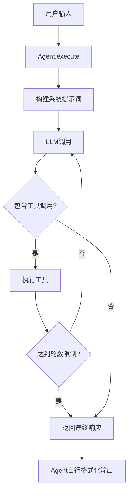

# Agents模块使用指南 (v2.0)

## 概述

Agents模块实现了多智能体系统的核心Agent逻辑。每个Agent都有特定的职责和工具集，通过协作完成复杂任务。

## 核心设计原则

1. **统一的执行模式**：所有Agent继承自`BaseAgent`，共享工具调用循环、流式输出等基础功能
2. **工具调用限制**：每个Agent最多进行3轮工具调用，防止无限循环
3. **完成判断统一**：当LLM响应中不包含工具调用时，即视为任务完成
4. **模型兼容性**：支持思考模型和非思考模型，核心逻辑基于`response.content`
5. **双执行模式**：提供`execute()`(批量)和`stream()`(流式)两种执行方法
6. **简单错误处理**：通过`success`字段标识执行状态，错误信息直接放在`content`中

## Agent类型

### 1. Lead Agent

**职责**：任务协调、信息整合、用户交互

**工具集**：

- Artifact操作工具（create/update/rewrite/read）
- CallSubagentTool（路由到其他Agent）

**特色功能**：

- **动态SubAgent注册**：可以灵活注册和管理子Agent
- **智能任务规划**：根据复杂度自动选择是否创建task_plan

**使用示例**：

```python
from agents.lead_agent import LeadAgent, SubAgent
from tools.registry import create_agent_toolkit
from agents.base import AgentConfig

# 配置Lead Agent
config = AgentConfig(
    name="lead_agent",
    description="Task coordinator and information integrator",
    model="qwen-plus",
    temperature=0.7,
    max_tool_rounds=5,  # Lead需要更多轮次
    streaming=True,
    llm_max_retries=3,  # 新增：LLM重试次数
    llm_retry_delay=1.0  # 新增：重试延迟
)

# 创建工具包
toolkit = create_agent_toolkit("lead_agent", tool_names=[
    "create_artifact", "update_artifact", 
    "rewrite_artifact", "read_artifact", "call_subagent"
])

# 创建Lead Agent
lead_agent = LeadAgent(config=config, toolkit=toolkit)

# 注册SubAgent
lead_agent.register_subagent(SubAgent(
    name="search_agent",
    description="Searches the web for information",
    capabilities=[
        "Web search with various filters",
        "Search refinement and optimization",
        "Information extraction from search results"
    ]
))

# 执行任务
response = await lead_agent.execute(
    "Create a task plan for analyzing market trends",
    context={"task_complexity": "high"}
)

# 检查执行状态（新增）
if response.success:
    print(response.content)  # 最终响应
    print(response.tool_calls)  # 工具调用历史
else:
    print(f"Execution failed: {response.content}")  # 错误信息
```

### 2. Search Agent

**职责**：信息检索、搜索优化

**工具集**：

- web_search（网页搜索）

**核心能力**：

- 自主优化搜索词
- 多轮迭代搜索
- 结构化XML输出

**使用示例**：

```python
from agents.search_agent import create_search_agent

# 创建Search Agent
agent = create_search_agent(toolkit=search_toolkit)

# 执行搜索
context = {
    "task_plan_content": "Research AI breakthroughs...",  # 新：自动注入的task_plan
    "task_plan_version": 1,
    "task_plan_updated": "2024-01-01T00:00:00"
}

response = await agent.execute(
    "Search for AI breakthroughs and summarize findings",
    context=context
)

if response.success:
    # 响应为XML格式
    print(response.content)
```

### 3. Crawl Agent

**职责**：内容抓取、信息提取

**工具集**：

- web_fetch（网页内容抓取）

**核心能力**：

- 深度内容提取
- 智能内容清洗
- 反爬检测和处理

## 执行流程



## AgentConfig配置（更新）

```python
from agents.base import AgentConfig

config = AgentConfig(
    name="custom_agent",
    description="Custom task agent",
    model="qwen-plus",
    temperature=0.7,
    max_tool_rounds=3,      # 最大工具调用轮数
    streaming=True,         # 流式输出
    debug=False,           # 调试模式
    # 新增配置项
    llm_max_retries=3,     # LLM调用最大重试次数
    llm_retry_delay=1.0    # 初始重试延迟（秒）
)
```

## AgentResponse结构（更新）

```python
@dataclass
class AgentResponse:
    success: bool = True           # 新增：执行是否成功
    content: str = ""              # 成功时为响应内容，失败时为错误信息
    tool_calls: List[Dict]         # 工具调用历史
    reasoning_content: Optional[str]  # 思考过程（思考模型）
    metadata: Dict                 # 元数据
    routing: Optional[Dict]        # 路由信息
    token_usage: Optional[Dict]    # Token使用统计
```

## 错误处理（新增）

### 三层错误处理机制

```python
# 1. 最外层：捕获未预期错误
try:
    response = await agent.execute(user_input)
    if not response.success:
        # Agent执行失败但返回了响应
        logger.error(f"Agent failed: {response.content}")
        # 可以根据agent类型决定是否致命
        if agent.config.name == "lead_agent":
            raise CriticalError("Lead agent failure")
        else:
            # Sub-agent失败，可以继续
            return handle_partial_result(response)
except Exception as e:
    # 完全失败
    logger.exception(f"Unexpected error: {e}")
    raise

# 2. LLM调用层：自动重试
# BaseAgent内置重试机制，根据错误类型：
# - Rate limit: 指数退避重试
# - Timeout: 快速重试
# - Auth error: 不重试，直接失败

# 3. 工具执行层：容错处理
# 工具失败不会终止执行，错误会记录在tool_calls中
```

### 错误类型识别

```python
# 通过response判断错误类型
response = await agent.execute(user_input)

if not response.success:
    error_msg = response.content.lower()
    
    if "llm call failed" in error_msg:
        # LLM调用失败（致命）
        handle_llm_failure()
    elif "tool execution error" in error_msg:
        # 工具执行失败（可恢复）
        handle_tool_failure()
    else:
        # 其他错误
        handle_general_error()
```

## 流式执行（更新）

### 使用stream()方法（原execute_stream）

```python
# 创建Agent
agent = create_lead_agent(toolkit=toolkit)

# 流式执行
async for event in agent.stream(user_input, context):
    # 处理不同类型的事件
    if event.type == StreamEventType.LLM_CHUNK:
        # 实时显示LLM输出
        print(event.data.content, end="")
    
    elif event.type == StreamEventType.TOOL_START:
        print(f"\n🔧 Calling {event.data.metadata['current_tool']}...")
    
    elif event.type == StreamEventType.ERROR:
        # 新增：处理错误事件
        print(f"\n❌ Error: {event.data.content}")
        if not event.data.success:
            # 决定是否继续
            break
    
    elif event.type == StreamEventType.COMPLETE:
        if event.data.success:
            print(f"\n✅ Completed successfully")
        else:
            print(f"\n⚠️ Completed with errors")
```

### StreamEvent类型（简化）

```python
class StreamEventType(Enum):
    START = "start"              # 执行开始
    LLM_CHUNK = "llm_chunk"      # LLM输出片段
    LLM_COMPLETE = "llm_complete"# LLM输出完成
    TOOL_START = "tool_start"    # 工具调用开始
    TOOL_RESULT = "tool_result"  # 工具调用结果
    COMPLETE = "complete"        # 执行完成
    ERROR = "error"              # 错误（新增活跃使用）

# StreamEvent.data始终是AgentResponse对象
# 通过response.success判断状态
```

### execute vs stream对比（更新）

| 特性       | execute()                 | stream()                      |
| ---------- | ------------------------- | ----------------------------- |
| 返回类型   | `AgentResponse`           | `AsyncGenerator[StreamEvent]` |
| 使用场景   | 批量处理、测试            | 实时交互、WebSocket           |
| 输出时机   | 完成后一次性              | 实时流式                      |
| 错误处理   | 返回带success=False的响应 | yield ERROR事件               |
| 方法名变化 | 保持不变                  | 原execute_stream改为stream    |

## 与LangGraph集成（更新）

### 批量模式节点

```python
async def agent_node(state: AgentState):
    """使用execute的节点实现"""
    agent = get_agent(state["agent_name"])
    
    # 执行agent
    response = await agent.execute(
        state["input"],
        context=state.get("context", {})
    )
    
    # 根据success字段处理
    if response.success:
        # 成功，更新状态
        return {
            "agent_response": response.content,
            "tool_calls": response.tool_calls,
            "status": "success"
        }
    else:
        # 失败，决定如何处理
        if state["agent_name"] == "lead_agent":
            # Lead失败是致命的
            raise GraphExecutionError(f"Lead failed: {response.content}")
        else:
            # Sub-agent失败，返回错误信息给Lead
            return {
                "agent_response": response.content,
                "status": "failed",
                "error": response.content
            }
```

### 流式模式节点

```python
async def streaming_agent_node(state: AgentState):
    """使用stream的节点实现"""
    agent = get_agent(state["agent_name"])
    
    final_response = None
    error_occurred = False
    
    # 流式执行
    async for event in agent.stream(state["input"], state.get("context")):
        # 实时处理事件
        if event.type == StreamEventType.LLM_CHUNK:
            await send_to_frontend({
                "type": "chunk",
                "content": event.data.content
            })
        
        elif event.type == StreamEventType.ERROR:
            error_occurred = True
            await send_to_frontend({
                "type": "error",
                "message": event.data.content
            })
        
        elif event.type == StreamEventType.COMPLETE:
            final_response = event.data
    
    # 返回最终状态
    if final_response and final_response.success:
        return {"status": "success", "response": final_response}
    else:
        return {"status": "failed", "error": final_response.content if final_response else "Unknown error"}
```

## Context自动注入机制（新增）

所有Agent在执行时会自动注入task_plan（如果存在）：

```python
# BaseAgent._prepare_context_with_task_plan 自动处理
# 1. 所有agent都会获得task_plan内容
context = {
    "task_plan_content": "...",      # task_plan的内容
    "task_plan_version": 1,           # 版本号
    "task_plan_updated": "2024-..."   # 更新时间
}

# 2. Lead Agent额外获得artifacts清单
if agent.config.name == "lead_agent":
    context["artifacts_inventory"] = [...]  # 所有artifacts列表
    context["artifacts_count"] = 3          # artifacts数量
```

## 最佳实践（更新）

### 1. 错误处理策略

```python
# 推荐的错误处理模式
async def safe_execute(agent, input_text, context=None):
    """安全执行Agent任务"""
    try:
        response = await agent.execute(input_text, context)
        
        if response.success:
            return response
        else:
            # 根据agent类型决定处理策略
            if isinstance(agent, LeadAgent):
                # Lead失败通常是致命的
                raise CriticalError(f"Lead agent failed: {response.content}")
            else:
                # Sub-agent失败可以恢复
                logger.warning(f"Sub-agent failed: {response.content}")
                return response  # 返回部分结果
                
    except Exception as e:
        logger.exception(f"Agent execution error: {e}")
        # 创建失败响应
        return AgentResponse(
            success=False,
            content=f"Execution error: {str(e)}"
        )
```

### 2. 流式交互最佳实践

```python
# WebSocket + 流式执行
async def handle_websocket(websocket, agent):
    user_input = await websocket.receive_text()
    
    async for event in agent.stream(user_input):
        # 简化的事件处理
        await websocket.send_json({
            "type": event.type.value,
            "success": event.data.success,
            "content": event.data.content,
            "timestamp": event.timestamp.isoformat()
        })
        
        # 错误时可选择终止
        if event.type == StreamEventType.ERROR and not event.data.success:
            if "llm call failed" in event.data.content.lower():
                break  # LLM失败，终止流
```

### 3. 调试技巧（增强）

```python
# 开启调试模式查看详细信息
config = AgentConfig(
    name="debug_agent",
    debug=True,  # 开启调试
    llm_max_retries=5,  # 增加重试次数便于调试
)

# 检查响应详情
if not response.success:
    print(f"Failed at: {response.metadata.get('failed_at')}")
    print(f"Error: {response.content}")
    print(f"Tool calls before failure: {response.tool_calls}")
```

## 重要变更说明

1. **方法重命名**：`execute_stream()` → `stream()` (更简洁)
2. **错误处理简化**：移除ErrorLevel，使用success字段
3. **自动重试**：LLM调用内置重试机制
4. **Context自动注入**：task_plan自动传递给所有Agent
5. **错误信息位置**：失败时错误信息直接放在content中

## 下一步

完成agents模块后，下一步是实现`core/`模块，利用Agent的success字段进行工作流控制和错误处理。
