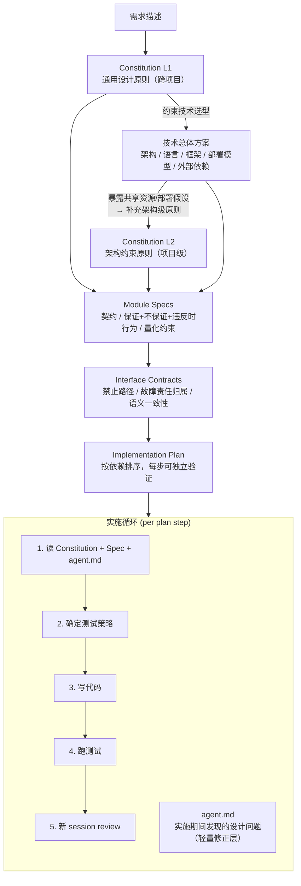

# 代码生成流程设计

> 这篇文档总结了一次 AI 辅助开发中遇到的问题，并提出了一套改进后的流程。
> 背景：我们用 AI 做了一次智能体框架的持久化改造，写了很详细的实现计划（persistence-refactor-plan.md），但 review 时发现了大量本应在设计阶段就避免的问题（ha-review-findings.md）。

---

## 问题回顾

这次的实际流程是：先写一份很详细的实现计划，然后照着计划写代码，最后 review 时发现一堆问题再补文档。

```
persistence-refactor-plan.md（很细，但全是 happy path）
    ↓
写代码（照着 plan 写，plan 没提的就随手放）
    ↓
review 发现（fencing 没做、职责错位、reconnect 矛盾……）
    ↓
补文档 ha-review-findings.md
```

Review 发现了几类问题，表面上各不相同，但深层原因是一样的——**设计阶段缺少高层原则的约束**。

比如，路由层（本应只做 HTTP 请求分发）承担了资源管理的职责，根本原因是没有明确定义"谁负责什么"的边界。再比如，分布式锁（lease）过期后系统继续执行写入操作，是因为计划只想了正常路径，没有要求"获取了资源就必须定义丢失时怎么办"。还有，断线自动拒绝（auto-deny）和断线重连（reconnect）两个功能自相矛盾——一个说"断了就当用户拒绝"，另一个说"断了可以重连继续"——因为它们是分别实现的，没有人检查同一个概念（断线）在系统里是否只有一种含义。

最有启发性的一个案例是：review 发现路由层绕过 manager 直接调用了 repository（数据层），于是我们在规则文件里补了一条"路由层不能直接调 repository"。但后来路由层又绕过 manager 直接调了另一个模块（RuntimeStore），因为规则里没提这个模块。**逐条补规则就像打地鼠——真正需要的是高层原则（"每个模块只能通过上一层的公开接口操作"），具体规则从原则推导出来。**

---

## 目标流程

改进后的流程不是一个自动化工具链，而是**人工走流程、在各阶段借助 AI 工具辅助**。这样做是为了能单独观察每个环节的效果，发现哪一步薄弱就优化哪一步。

这个流程乍看像瀑布式开发——先写原则，再写 spec，再写计划，最后才写代码。但传统瀑布的问题不是"先想清楚再动手"这个理念本身，而是前期设计的成本太高、迭代太慢，导致设计和实际脱节。AI 改变了这个成本结构：生成和迭代 spec/plan 的边际成本大幅下降，一个从 spec 到 implement 的完整循环可能只需要几个小时，所以"先想清楚再写"又变得划算了。同时，agent.md 机制让实施过程中的发现能持续反馈到设计层面（本质上是持续进行的 retrospective），小任务也可以跳步不走全套流程。所以更准确地说，这是**瀑布的阶段纪律 + 敏捷的迭代速度**——AI 消除了两者之间原本的矛盾。但也要注意不根据任务规模灵活调整的话，就会退化成真正的瀑布。

整体分为两大阶段：先通过一系列设计产物把约束层层细化，然后在实施阶段逐步执行。



下面逐个阶段说明。

---

## 设计阶段

### Constitution（设计原则）

Constitution 是一组高层设计原则，作用类似宪法——不直接告诉你怎么写代码，但约束所有下游设计决策的方向。它分两层：

**L1 通用设计原则**——跨项目复用，不依赖具体技术选型。应该很短（一页以内），写一次，偶尔修订。在技术方案之前写，因为原则会影响选型方向。示例：

- 每个模块只通过上一层的公开接口操作，不能穿透调用
- 获取的资源必须定义丢失时的行为
- 同一个概念在系统里只有一种语义
- 不能保证的事情不要假装做了
- spec 中的每条保证都必须有对应的测试
- 修改已有行为时，必须列出可能被削弱的已有保证，逐条确认不冲突
- 提案的机制必须在语言、框架和现有接口层面可落地——逻辑上说得通不等于能实现

**L2 架构约束原则**——依赖技术方案才能写出，项目级有效。技术方案确定了共享资源、部署模型、外部依赖之后，从中推导出的约束。示例：

- 共享外部资源必须声明 ownership 边界（如命名空间隔离）
- 对外部依赖的可用性假设必须显式声明（独占还是共享、故障恢复窗口多长）
- 不可假设运行环境是独占的（磁盘、端口、进程可能被其他服务使用）

Constitution 的原则本身是高层的，但在写 Module Spec 时必须逐条检查：这条原则在这个模块适用吗？如果适用，spec 里有没有对应的保证条目？这个展开步骤防止原则变成空话。

### 技术总体方案

技术总体方案是流程中**唯一需要外部确认的产物**——其他产物（constitution、spec、plan）都是团队内部执行用的，但技术方案涉及架构选型、资源共享、部署模型这些需要和其他团队或技术负责人对齐的决策。

内容包括：系统架构（分布式还是单体）、语言和框架选型、模块划分、资源共享方案、部署模型。

技术方案产出后有两个去向：对外的架构决策需要相关方确认；对内的共享资源和外部依赖清单会驱动 L2 原则和 Module Spec 的编写。技术方案做出的决策会被下游产物吸收（选型体现在 Spec 的实现约束里，共享资源催生 L2 原则，模块划分体现在 Interface Contract 的结构里），因此实施阶段不需要再反复参考技术方案。

### Module Specs（模块契约）

Module Spec 定义每个模块的接口、不变量和失败行为。和普通的 API 文档不同，它的关键在于**不仅写"保证什么"，还要写"不保证什么"和"违反时怎么办"**。

以下是一个简化的示例：

```
ExecutionRunner
  输入：conversation_id, message_id, coroutine

  保证：同一 conversation 同时只有一个执行
    违反时：后到的请求返回 409 Conflict

  保证：lease 丢失时执行被终止，后续处理不执行
    违反时：记录错误日志 + 终止进程（不尝试恢复）

  不保证：执行中的任务可以跨 Worker 迁移

  量化约束：
    - lease TTL = 90s，心跳间隔 = 30s
    - permission interrupt 超时 = 300s
```

几个要点：

**"违反时行为"不是要求为每种异常设计复杂的恢复方案。** 大部分情况下答案就是 fail，但"经过思考决定 fail"和"没想过这个问题碰巧 fail"是两件事。要求写"违反时行为"的目的是强制你想清楚降级链在哪里终止。

**量化约束不能省略。** 高可用类的问题往往不是"有没有做"的问题，而是"时间窗口够不够"的问题。TTL、心跳间隔、超时时间、故障恢复窗口都要写进 spec，否则"逻辑对但参数配错"的问题会漏过设计审查。

回顾这次的教训：persistence-refactor-plan.md 写了"怎么实现"，但没写每个模块的保证和不保证。如果当时写了"lease 丢失时执行被终止"，实现时就不会忘记做 fencing（即锁失效后阻止继续操作的保护机制）。

### Interface Contracts（接口契约）

对每对有交互的模块，显式声明跨边界的约束。只覆盖实际存在的调用关系，不做所有模块的全组合——数量和模块数是线性关系，不会爆炸。

主要声明两类内容：**禁止路径**（哪些模块间的直接调用不应存在）和**故障责任归属**（A 调 B 失败时，谁负责回滚、重试、报错）。示例：

```
Router → Manager
  禁止：Router 不直接调用 Repository 或 RuntimeStore
  故障责任：Manager 返回错误时，Router 只做 HTTP 状态码映射，不做重试或补偿

Manager → Repository
  语义一致性：Manager 和 Repository 对同一概念（如"执行中"）的判定逻辑必须一致
  故障责任：Repository 抛异常时，Manager 负责回滚同一用例中的其他副作用
```

### Implementation Plan（实施计划）

实施计划按模块依赖关系排序，每一步可以独立验证。重要的是每一步只包含一种性质的变更——配置修正、结构重构、语义变更不要混在同一步里，这样出问题时容易定位是哪一步引入的。

---

## 实施阶段

### 实施循环

设计产物就绪后，进入逐步实施。每个 plan step 的执行流程：

1. **读约束**：读 Constitution + 对应的 Module Spec + agent.md，明确本步需要满足的保证和边界
2. **确定测试策略**：根据这一步的变更性质决定需要写什么测试（见下文）
3. **写代码**
4. **跑测试**
5. **提案自检**：提交 review 前，对照检查清单验证（见下文）
6. **新 session review**：开一个新的 AI 对话来 review 这一步的产出（见下文）

#### 测试策略

不是每一步都需要同样的测试要求，根据变更性质区分：

**行为或契约变更**（比如新增 fencing 语义）——先写测试再写代码。测试直接从 spec 的保证条目推导，不需要看实现。这种测试就是 spec 的可执行版本，写测试的过程本身会强制你想清楚边界条件。例如：

```python
# 从 spec 推导：保证"同一 conversation 同时只有一个执行，违反时返回 conflict"
async def test_concurrent_execution_rejected():
    """同一 conversation 并发提交第二个执行，应返回 conflict"""
```

**模块边界变更**（比如把某个职责从路由层收敛到 manager 层）——在做这一步的同时写集成测试，只测涉及的模块之间的交互，不需要全链路。因为模块接缝处的问题单靠单元测试发现不了。例如：

```python
async def test_runner_submit_acquires_lease_and_creates_stream():
    """submit 内部完成 lease + stream 创建，router 不参与"""
```

**配置修正**——不需要写新测试，跑现有回归测试即可。

**纯重构**——不需要写新测试，但现有测试必须全部通过。行为不变是重构的前提。

#### 提案自检

写完代码、跑完测试之后，提交 review 之前，对照以下清单检查。这一步专门针对**修改已有系统**的场景——从零构建时风险主要在遗漏，修改时风险主要在破坏。

| 检查项 | 问自己 | 防护的失误类型 |
|--------|--------|---------------|
| 问题定义准确性 | 我描述的问题行为，和代码实际行为一致吗？ | 问题描述错误导致修复方向偏（如 F-18 孤儿 stream） |
| 机制可行性 | 提案的核心机制在语言/框架/现有接口层面能跑通吗？ | 逻辑对但落不了地（如 F-22 asynccontextmanager 不能 yield 两次，F-19 Protocol 参数不匹配） |
| 已有保证不退化 | 这个改动会削弱哪些已有的保证？逐条确认 | 修复一个问题的同时破坏另一个保证（如 F-21 重试方案重开 split-brain） |

前两项是事实核查（对着代码就能验证），第三项需要回查 Module Spec 的保证条目。如果没有 spec，至少回查 review findings 文档中标注为"已修复"的保证。

> **来源**：这三个检查项分别对应二轮 HA review 中被 reviewer 打回的三类问题。一轮 review 的问题主要是正向设计遗漏（没想到要做 fencing），二轮的问题主要是修复提案本身有缺陷。两类问题需要不同的防护手段。

#### 新 session review

每个 plan step 完成后，开一个新的 AI 会话来 review。新会话只给 constitution、spec、agent.md、这一步的 diff 和测试，**不给实现背景**。

这样做的价值在于 clean context——写代码的会话带着"我为什么这么做"的隐含假设，review 会话没有这些假设，反而能发现被默认合理的问题。这也解释了为什么之前外部 reviewer 能抓到那么多问题——他没有"跟着 plan 一步步写过来"的上下文包袱。

Review 不仅审代码，还要审测试策略：spec 的保证条目是否都有对应测试、测试是否真的能判定该保证被满足。如果发现设计层面的问题（spec 遗漏、原则缺失、保证项没有对应测试），记录到 agent.md。

#### agent.md（实施期间的轻量修正层）

编码和 review 过程中经常会发现设计层面的问题——spec 遗漏了某个边界条件、某条原则没覆盖到新场景、等等。这些发现不直接修改上游的 constitution 或 spec，而是追加记录到 agent.md。

每一步开始时都会读取 agent.md 作为补充约束，避免同一个坑踩两次。这样做的好处是上游产物保持稳定，不会因为改设计而引发连锁返工。如果发现影响后续步骤的重大问题，经人工确认后可以立即修订上游产物。

整轮实施结束后，统一回顾 agent.md，把仍然有效的发现合并回 Constitution 或 Spec，然后清空 agent.md。

---

## 行业参考

这个流程在业界已有名字：**Spec-Driven Development (SDD)**，2025 年下半年开始成熟。我们的流程和行业实践基本一致，但有几处刻意的差异。

### 关键参考

- **Constitutional SDD**（[arxiv 论文](https://arxiv.org/html/2602.02584)）— 提出将 constitution 作为不可违反的原则层，每条原则有 ID、约束文本、实现模式和 rationale。生成代码时只注入 3-5 条与当前任务相关的原则（而非全部），生成后对照原则校验
- **GitHub Spec Kit**（[GitHub](https://github.com/github/spec-kit)）— GitHub 官方开源的 SDD 工具链，提供 CLI 和 slash commands，支持 Claude Code、Copilot、Cursor 等 20+ AI 工具。流程：Constitution → Specify → Plan → Tasks → Implement
- **cc-sdd**（[GitHub](https://github.com/gotalab/cc-sdd)）— 社区 SDD 工具，Requirements → Design → Tasks，带校验命令检查设计是否满足需求、代码是否满足设计
- **Addy Osmani 的实操流程**（[博客](https://addyosmani.com/blog/ai-coding-workflow/)）— Google Chrome 团队工程师，核心实践是用 spec.md 描述需求 + 架构 + 测试策略，并**开第二个 AI session 来 review 第一个的输出**
- **Martin Fowler 团队的工具对比**（[文章](https://martinfowler.com/articles/exploring-gen-ai/sdd-3-tools.html)）— 对比 Kiro、Spec Kit、Tessl 三个工具，关键观察：现有工具的通病是**流程太死板，小任务也要走完整流程**

### 与本流程的差异

**Spec 内容更丰富**：行业实践中 spec 通常只写约束和理由，我们扩展为保证/不保证 + 量化约束 + 违反时行为，因为这次的教训表明只写"怎么实现"不够，还需要写"出问题时怎么办"。

**测试策略不一刀切**：多数工具要求所有步骤都先写 spec 级测试，我们按变更性质区分——纯重构和配置修正不需要新测试，避免写出"为了有测试而写的测试"。

**不采用端到端自动化**：Spec Kit 和 cc-sdd 都提供从设计到实现的自动化工具链，我们选择人工走流程、按需借助工具。原因有三：Martin Fowler 的观察表明工具流程太死板不适合所有任务规模；我们需要能单独观察每个环节的效果来发现薄弱点；我们可以按需引入某个工具的某个功能（比如用 Spec Kit 的校验命令），而不是被整个工具链绑定。

### 工具落地思路

预期的开发模式是使用 AI 编程工具（如 opencode、Claude Code）配合定制的 skill/slash command，每个 skill 对应流程中的一个阶段。不直接使用 Spec Kit 的 CLI 工具链，而是参考其 prompt 模板的设计思路，改写为自己的 skill。

**从 Spec Kit 值得借鉴的设计**：

- Constitution 模板的结构：命名原则 + 治理条款 + 语义化版本号，以及更新后自动扫描下游模板检查对齐的传播机制
- Spec 模板中的几个设计：用户故事按优先级分层（P1/P2/P3）、用 Given/When/Then 格式写验收场景、用 `[NEEDS CLARIFICATION]` 标记显式标注歧义而非忽略
- Analyze 步骤的思路：跨产物一致性检查（spec 和 plan 是否矛盾、constitution 是否被违反），这个作为独立的校验 skill 很有价值
- 任务分解的结构：按阶段组织（Setup → 基础设施 → 用户故事 → 收尾），标记可并行项和用户故事溯源

**不需要引入的部分**：

- CLI 脚手架和文件目录约定（`.specify/` 目录结构、自动编号、自动建分支）——skill 可以直接操作项目已有的结构
- 线性流程的强制——我们明确选择人工控制流程节奏，小任务可以跳步，大任务可以反复迭代某个阶段
- 模板的冗长度——Spec Kit 的单个模板可达 200 行指令，在 context window 中开销很大。改写为 skill 时应精简，只保留对 AI 行为有实际约束力的部分
