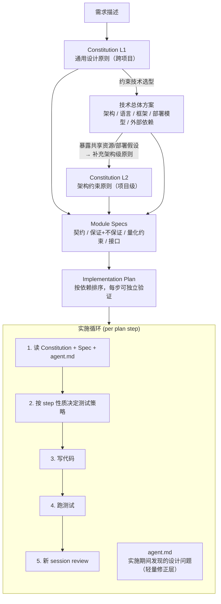

# 代码生成流程设计

> 基于持久化改造（persistence-refactor-plan.md → ha-review-findings.md）的复盘。
> 核心问题：plan 写得很细但全是 happy path，review 发现的问题本应在设计阶段避免。

---

## 问题回顾

这次的实际流程：

```
persistence-refactor-plan.md（很细，但全是 happy path）
    ↓
写代码（照着 plan 写，plan 没提的就随手放）
    ↓
review 发现（fencing 没做、职责错位、reconnect 矛盾……）
    ↓
补文档 ha-review-findings.md
```

Review 发现的问题分类：

| 问题 | 表面原因 | 深层原因 |
|------|---------|---------|
| 路由层做了 lease/stream 管理 | 没有"谁负责执行生命周期"的规定 | 没有定义模块的 ownership 边界 |
| lease 丢失后无 fencing | 只想了 happy path | 没有要求"获取资源 → 必须定义丢失时的行为" |
| auto-deny 和 reconnect 自相矛盾 | 分开做的，没对齐 | 没有要求同一概念的语义一致 |
| 本地文件假装 fallback | 看起来比"什么都不做"好 | 没有"不能保证就别假装"的原则 |
| 绕过 manager 直接调 repo | 能 work，更短 | 规则写了但太具体，新边界出现时防不住 |

关键发现：router 绕过 manager 直接调 repo 的问题被发现后，在 CLAUDE.md 里补了一条 "Routers must not bypass Manager to call Repo directly"。但这种事后补丁只防了一个具体边界——后来 router 直接调 RuntimeStore 的越界照样发生了，因为规则里没提 RuntimeStore。**逐条补规则是打地鼠，需要的是高层原则，具体规则从原则推导。**

---

## 目标流程

不采用端到端自动化流程，而是**人工走流程、借用工具辅助各阶段**。这样流程中哪个环节出问题可以单独发现和优化（类似消融实验）。



**Constitution 分两层**：

- **L1 通用设计原则**：跨项目复用，不依赖架构决策。如"同一概念只有一种语义"、"不能保证就别假装"。在技术方案之前写，约束选型方向。
- **L2 架构约束原则**：依赖技术方案才能写出，项目级有效。如"共享外部资源必须声明 ownership 边界"、"对外部依赖的可用性假设必须显式声明"。技术方案确定后产出。

**agent.md — 实施期间的轻量修正层**：编码和 review 过程中发现的设计层面问题（spec 遗漏、原则缺失、边界条件未覆盖）不直接修改上游产物，而是追加到 agent.md。实施循环中每步开始时读取 agent.md 作为补充约束（类似 LoRA：不改 base weights，叠加一层适配）。整轮实施结束后，统一回顾 agent.md，将仍然有效的发现合并回 Constitution / Spec。

---

## 各阶段说明

### Constitution L1（通用设计原则）

- 跨模块、跨项目复用的约束，不依赖具体架构决策
- 应该很短（一页以内），写一次，偶尔修订
- **在技术方案之前写**，因为原则会影响技术选型
- 示例方向（待细化）：
  - 每个模块只通过上一层的公开接口操作，不穿透
  - 获取的资源必须定义丢失时的行为
  - 同一个概念在系统里只有一种语义
  - 不能保证的事情不要假装做了

### 技术总体方案

- 系统架构（分布式/单体）、语言/框架选型、模块划分
- 这一步产出的是系统的大骨架，不涉及实现细节

### Constitution L2（架构约束原则）

- 依赖技术方案才能写出，项目级有效
- 技术方案确定共享资源、部署模型、外部依赖后，从中推导出的约束
- 示例方向（待细化）：
  - 共享外部资源必须声明 ownership 边界（命名空间隔离）
  - 对外部依赖的可用性假设必须显式声明（独占/共享、故障恢复窗口）
  - 不可假设运行环境独占（磁盘、端口、进程）

### Module Specs（模块契约）

- 每个模块的接口定义 + 不变量 + 失败行为
- 关键是**保证和不保证**都要写，保证需要区分条件和边界：
  ```
  ExecutionRunner
    输入：conversation_id, message_id, coroutine
    保证：同一 conversation 同时只有一个执行
    保证：进程存活时，执行结束后 lease 在 finally 中释放
    保证：进程 crash 时，lease 在 TTL（90s）内自动释放
    保证：lease 丢失时执行被终止，post-processing 不执行
    不保证：执行中任务跨 Worker 迁移
    量化约束：
      - lease TTL = 90s，心跳间隔 = TTL/3（30s）
      - lease 丢失检测延迟 ≤ 1 个心跳间隔（30s）
      - permission interrupt 超时 = 300s
  ```
- **量化约束**不可省略——HA 类问题往往不是二元的"有没有"，而是"时间窗口够不够"。TTL、grace period、retention、failover 恢复窗口都要写进 spec，否则"逻辑对但参数和时序不稳"的问题会漏过
- 这次缺的就是这个——persistence-refactor-plan.md 写了"怎么实现"，但没写每个模块的保证/不保证。如果当时写了"lease 丢失时执行被终止"，实现时就不会忘 fencing

### Implementation Plan

- 按模块依赖关系排序
- 每一步可独立验证
- 每一步的范围应区分性质：配置修正、结构重构、语义变更不混在同一步（方便 bisect）

### 实施循环

**测试策略按 step 性质区分**（不一刀切）：

| Step 性质 | 测试要求 | 理由 |
|-----------|---------|------|
| **行为/契约变更**（如 fencing 语义） | Spec 级测试先写，再写代码 | 测试就是 spec 的可执行版本，强制想清楚边界 |
| **模块边界变更**（如职责收敛） | 当步带窄集成测试 | 接缝问题只靠单元测试发现不了 |
| **配置修正** | 不需要新 spec 测试 | 回归覆盖即可 |
| **纯重构** | 不需要新 spec 测试，现有测试必须全过 | 行为不变是重构的前提 |

Spec 级测试示例：

```python
# 从 spec 推导，不需要看实现
async def test_lease_lost_stops_execution():
    """lease 过期后，执行应被终止，不应写 DB"""

async def test_concurrent_execution_rejected():
    """同一 conversation 并发提交第二个执行，应返回 conflict"""
```

窄集成测试示例（模块边界变更时当步就要写）：

```python
async def test_runner_submit_acquires_lease_and_creates_stream():
    """submit 内部完成 lease + stream 创建，router 不参与"""

async def test_runner_submit_rollback_on_stream_failure():
    """stream 创建失败时，lease 和 interactive 被回滚"""
```

**新 session review**：

- 每个 plan step 完成后，拉新 session review
- 新 session 只给 constitution + spec + diff，不给实现背景
- clean context 是 review 的价值所在——写代码的 session 带着"我为什么这么做"的隐含假设，review session 没有这些假设，反而能发现问题
- review 发现设计层面问题（spec 遗漏、原则缺失）→ 记录到 agent.md，不改上游产物

**agent.md（实施期间的轻量修正层）**：

- 实施循环中发现的设计问题、踩坑经验、上游产物的缺漏，追加记录到 agent.md
- 每步开始时读取，作为 Constitution + Spec 的补充约束（避免同一个坑踩两次）
- **实施期间不修改上游产物**——上游冻结保证实施基线稳定，避免改设计引发连锁返工
- 整轮实施结束后，统一回顾 agent.md，将仍然有效的发现合并回 Constitution / Spec，然后清空
- 这也解释了为什么外部 reviewer 能抓到那么多问题——他没有"跟着 plan 一步步写过来"的上下文包袱

---

## 行业参考

这个流程在业界已有名字：**Spec-Driven Development (SDD)**，2025 年下半年开始成熟。

### 关键参考

- **Constitutional SDD**（[arxiv 论文](https://arxiv.org/html/2602.02584)）— constitution 作为不可违反的原则层，每条原则有 ID + 约束 + 实现模式 + rationale。生成时注入 3-5 条相关原则作为 context，生成后对照原则校验
- **GitHub Spec Kit**（[GitHub](https://github.com/github/spec-kit)）— GitHub 官方开源的 SDD 工具链，提供 CLI + slash commands，支持 Claude Code / Copilot / Cursor 等 20+ agents。流程：Constitution → Specify → Plan → Tasks → Implement
- **cc-sdd**（[GitHub](https://github.com/gotalab/cc-sdd)）— 社区 SDD 工具，Requirements → Design → Tasks，带 `validate-design`（设计是否满足需求）和 `validate-gap`（代码是否满足需求）的校验命令
- **Addy Osmani 的实操流程**（[博客](https://addyosmani.com/blog/ai-coding-workflow/)）— Google Chrome 团队工程师。spec.md 包含需求 + 架构 + 数据模型 + 测试策略，"waterfall in 15 minutes"。关键实践：**开第二个 AI session 来 review 第一个的输出**
- **Martin Fowler 团队的工具对比**（[文章](https://martinfowler.com/articles/exploring-gen-ai/sdd-3-tools.html)）— 对比 Kiro / Spec Kit / Tessl 三个工具。关键观察：现有工具的通病是**流程太死板，小任务也要走完整流程**

### 与本流程的关系

| 维度 | 行业实践 | 本流程 |
|------|---------|-------|
| Constitution | 论文: "non-negotiable requirements with MUST/SHOULD/MAY" | 一致，待细化结构 |
| Spec 内容 | 论文: constraint + rationale | 扩展为保证/不保证 + 量化约束 |
| 新 session review | Osmani: "spawn second AI session to critique" | 一致 |
| 测试策略 | 多数工具一刀切要求 spec-first test | 按 step 性质区分，避免假测试 |
| 端到端自动化 | Spec Kit / cc-sdd 提供端到端工具链 | **不采用**端到端自动化，人工走流程 + 借用工具辅助 |

不采用端到端的原因：
1. Martin Fowler 的观察——工具流程太死板，不适合所有任务规模
2. 需要能单独观察每个环节的效果，发现和优化薄弱点（消融思路）
3. 可以按需引入工具（如 Spec Kit 的 `specify check` 做校验、constitution slash command 做原则生成），而不是被工具链绑定
