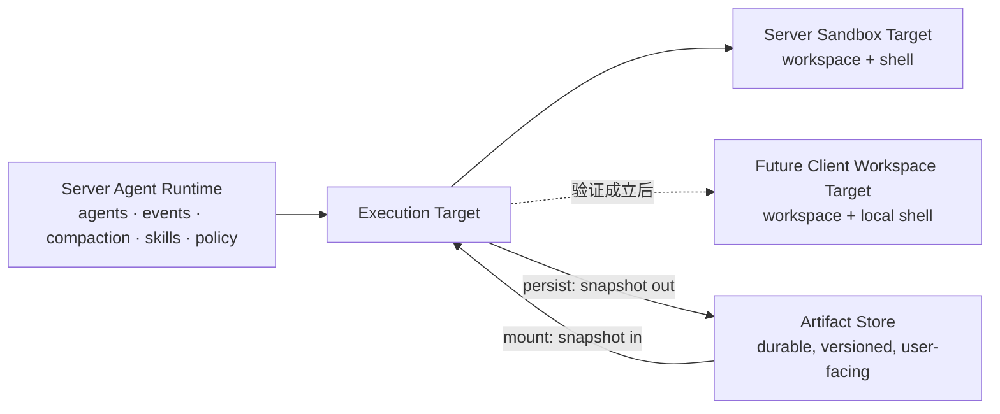

# Execution Target 与 Workspace 产品假设验证路线

> 状态：研究路线，尚未进入实施计划
>
> 性质：记录产品假设、技术边界、验证问题和可能的后置方向；不构成当前运行时契约、接口承诺或开发排期
>
> 更新日期：2026-08-14
>
> 结论维护：验证形成稳定结论后，应把仍然有效的约束同步到活动文档、`AGENTS.md` 或源码附近，不能让生产实现只依赖本文

## 1. 摘要

ArtifactFlow 当前是服务端 Agent runtime 加每轮临时沙盒的 Web 系统。面向 coding agent 场景，我们希望未来既能继续使用服务端安全沙盒，也保留连接用户电脑、远程开发机或企业 Runner 的可能性，同时避免维护两套 Agent runtime、会话历史、Skill、MCP 和工具配置。

本文记录的路线假设是：

> 让 Agent 面向一组稳定的 workspace 能力工作，而不直接依赖某一种沙盒实现；Agent/LLM runtime 仍可由服务端管理，具体执行位置则由 Execution Target 决定。

现在不急于实现 Client，也不先设计完整的远程协议。第一步是在现有 Server Sandbox 上形成最小的 Execution Target 边界，并提供结构化的 `read/edit/create/list/search` 文件能力，用真实任务同时验证：

- 这个技术边界是否自然，而不是只有转发作用的空抽象；
- 结构化文件工具是否比 Bash-only 更可靠、更容易展示和授权；
- Agent 能否在 Harness/Prompt 帮助下稳定理解 Workspace File 与 Artifact 的区别；
- `mount/persist` 作为显式边界是否足够清楚、可恢复，并能防止陈旧副本覆盖；
- 这些证据是否足以支持后续投入 Client Workspace Target。

只有这些问题得到正面证据后，才进入 Client 原型、断线恢复、本地权限与工作区模式等后置方向。

## 2. 背景：真正要决定的不是“要不要一个桌面端”

coding agent 需要读取和修改项目、执行 Shell、调用 Git/LSP，并可能使用用户本地的凭据和 stdio MCP。纯本地产品通常把 Agent runtime、文件系统、Shell、模型调用编排和 UI 都放在用户电脑上；这天然接近本地 workspace，但企业会面对配置、审计、权限、Skill/MCP 分发和多端访问分散的问题。

ArtifactFlow 的已有优势则集中在服务端：

- Agent、Skill、Tool 和模型通过配置集中管理；
- lead agent 与 context-isolated subagent 已有 nested-serial 执行语义和确定的事件顺序；
- MessageEvent、compaction、Artifact WorkingSet 和持久化链路已经是服务端会话的一部分；
- Tool permission、Human-in-the-loop（HITL）中断和审计可以形成统一策略；
- 服务端沙盒已有明确的隔离、资源限制和无网络边界。

因此当前更值得验证的产品形态不是立即复制一个全本地 Agent，而是：

```text
服务端：Agent runtime、会话、subagent、prompt/harness、artifact、memory、策略与审计

执行位置：
  - 当前：Server Sandbox
  - 未来候选：Client Workspace、远程容器、企业开发机或 Runner
```

完整 Agent runtime 放到 Client 仍然是一个可能分支，但应由“服务端不能看到代码”“必须离线运行”或类似产品要求驱动，而不是仅因为 Shell 位于本地就默认复制整套 runtime。

## 3. 工作定义

### 3.1 Execution Target

本文暂把 Execution Target 定义为：

> 一组共同访问同一个 workspace、共享同一权限边界和生命周期的执行能力。

一个 target 可以组合以下能力：

- Workspace filesystem；
- Shell 与进程；
- 可选的终端、Git、LSP；
- 可选的本地 stdio MCP 或设备相关工具。

这些能力必须观察同一份文件状态。例如 Shell 修改了文件，后续 `read_file` 必须看到修改；文件工具创建的文件也必须能被 Shell、测试和 LSP 立即看到。

Execution Target 不应成为包含所有功能的 God interface。更合适的概念关系是：

```text
ExecutionTarget
├── identity / lifecycle / security posture
├── filesystem: WorkspaceFileSystem
├── shell: ShellCapability
└── optional capabilities: terminal / git / lsp / local mcp
```

这些名称只是讨论用语，不是本文承诺的类名或公开接口。

### 3.2 目标架构假设



这里没有“服务端 workspace 与 Client workspace 双向同步”。对于 Client Target，Client workspace 是工作文件的唯一权威；Artifact Store 是 Artifact 的唯一权威，二者只通过 `mount/persist` 显式交换快照。

## 4. 外部系统给出的参考

### 4.1 DeepAgents：广泛的 Backend 抽象

DeepAgents 的 filesystem middleware 面向统一 Backend protocol，已有 State、Store、Filesystem、Sandbox 等实现；CompositeBackend 还可以按最长路径前缀把不同路径路由到不同 backend。这说明模型文件工具与存储/执行位置解耦是可行方向，也展示了远程、沙盒和持久存储可插拔时所需的统一语义。

值得参考：

- 模型工具依赖 backend contract，而不是具体本地文件 API；
- filesystem、Shell、context offload、memory、skills、subagents 可以作为 middleware/capability 组合；
- CompositeBackend 展示了多存储空间组合的一种办法。

不宜直接复制：ArtifactFlow 当前只有一个实际 workspace provider。现在先建立覆盖所有 Backend 能力的 Protocol、factory、registry 和 capability negotiation，容易得到一套由想象而不是两个真实实现塑造的抽象。DeepAgents 把 memory/offload 也映射为路径空间的做法同样不应让 Artifact 与 Workspace File 失去领域边界。

### 4.2 DeepSeek Harness：Provider、Tool 与 Policy 分层

DeepSeek Harness 把文件提供方、模型工具和 observation policy 分开。模型不需要提交版本号；policy 记录某个 actor 已观察到的文件版本，然后把写入转成 `createIfAbsent` 或 `replaceIfVersion`，把编辑前未读取、陈旧版本等情况变成可恢复错误。

值得参考：

- provider 拥有原子文件操作和 opaque version；
- tool 拥有模型 schema、读取窗口、结果呈现和输出上限；
- policy 拥有 read-before-edit 与 stale-write guard；
- 版本和 CAS 是运行时细节，不增加模型参数；
- 错误明确告诉模型重新读取再重试；
- 工具结果基于 provider 实际 before/after 生成 diff，而不是服务端根据输入猜测。

它的 session checkpoint policy 还说明了另一个独立问题：执行有副作用的工具前应先持久化调用意图。它不能提供通用 exactly-once，但能在恢复时区分尚未分派和结果未知，避免盲目重试。

DeepSeek Harness 的 Code Mode/PTC 则是更后层的优化：让模型通过 TypeScript/Python binding 编排多次工具调用，以减少模型 round trip 和上下文占用。它不替代稳定 workspace、文件语义、CAS 或执行 checkpoint，因此不是本路线的起点。

### 4.3 OpenCode：本地 Server 与多端 Client

OpenCode 的 TUI、Web/桌面交互可以连接 OpenCode server，`serve` 与 `attach` 使多端连接成为可能；但文件、Shell、MCP 和 Agent runtime 仍然运行在 OpenCode server 所在机器。它证明“界面与 runtime 分离”有价值，也适合在用户电脑上启动本地 server 后由多个界面连接。

对 ArtifactFlow 的启发是：

- UI 不必与执行进程同生命周期；
- 一个本地 runtime 可以服务多个本地或远程界面；
- 企业能力可以集中在配置、身份、模型网关和管理层。

差异在于 ArtifactFlow 已经有服务端会话、Artifact 和多 Agent runtime。如果只为了接用户本地 Shell 就把 runtime 整体移到 Client，会产生两个会话权威以及 Skill/MCP/策略的双份分发问题。因而“服务端 runtime + Client execution target”值得单独验证，而不是照搬 OpenCode 的进程布局。

### 4.4 pi：本地 runtime 的 RPC 外壳

pi 的 RPC mode 通过 stdin/stdout JSONL 把本地 coding agent 嵌入 IDE 或自定义 UI，请求有 correlation id，运行事件异步返回。这是清晰的本地 runtime 嵌入方式，但 RPC 对面仍是完整的本地 AgentSession，不只是远程文件和 Shell executor。

它适合作为“全 runtime 在 Client”分支的参考；不能直接回答 ArtifactFlow 如何让服务端 runtime 安全调用 Client workspace。

### 4.5 DeepAgents feature list 对本路线的含义

| Feature | ArtifactFlow 当前判断 | 与本路线的关系 |
|---|---|---|
| Sub-agents | 已有 context-isolated、nested-serial subagent 和确定事件顺序。通用 subagent 不需要强制结构化结果；只有下游机器流程确实要解析字段时才值得增加特定 schema | target 内 subagent 共享文件状态，但各自上下文和文件观察依据仍隔离 |
| Filesystem | 已有安全的沙盒文件访问和 `mount/persist`，缺少模型可见的结构化 workspace 文件语义和 provider seam | 第一阶段主验证对象 |
| Context management | MessageEvent、per-agent compaction、Artifact 和超大工具结果落盘已有较强基础 | Workspace 不能被当作另一种 memory/offload store；进行中 target 状态要进入 compaction 语义 |
| Shell access | 当前服务端沙盒的隔离与恢复语义明确 | Client 本地 Shell 的权限、断线和副作用风险尚未验证 |
| Persistent memory | 尚未形成正式能力，计划独立增加 | 与 Execution Target 正交，不应为了 filesystem 把 memory 伪装成 workspace 路径 |
| Human-in-the-loop | 已有 CONFIRM interrupt 基础 | Client 上要扩展为本地能力审批、命令/diff 展示和审计 |
| Skills | 已有服务端配置、按需加载与 sandbox mount | 原则上继续由服务端管理，必要内容显式下发到 target |
| Tools / MCP | Tool schema、permission 和执行事件已有统一契约；MCP 仍是未来 provider 路径 | 远程 MCP 可留服务端，本地 stdio MCP 是未来 Client 可选 capability |

这张表的判断是“哪些能力需要沿用、补齐或保持正交”，不是为了与 DeepAgents 做功能数量对齐。

## 5. 路线选择：先做纵向切片，不先做完整 Client 抽象

第一步在概念上确立 Execution Target，但在代码上只需要一个具体的 Server Sandbox Target，以及足以承载结构化文件工具的 WorkspaceFileSystem seam：

```text
ServerSandboxTarget
├── existing SandboxSession / Bash
├── WorkspaceFileSystem
├── mount / persist bridge
└── read / edit / create / list / search
```

现有 SandboxSession、容器生命周期和安全文件访问可以继续使用。重要的是新增文件工具和 `mount/persist` 最终都通过同一个 filesystem capability 观察同一个 workspace，而不是提前实现远程 transport、target registry 或一个覆盖未来所有能力的抽象层。

当第二个真实 provider——Client Workspace Target——开始出现时，再根据两边的实际差异提炼窄 Protocol。若第一阶段发现 concrete aggregate 已经足够，也不要求仅为“架构完整”增加 Python Protocol。

## 6. 双资源模型：Workspace File 不是 Artifact

这是结构化文件改造必须验证的核心产品语义。

| 维度 | Workspace File | Artifact |
|---|---|---|
| 标识 | target 内的 `path` | 会话内的 `artifact_id` |
| 权威位置 | Execution Target workspace | Artifact Store / WorkingSet |
| 生命周期 | 跟随 target；当前沙盒在 turn 结束时销毁 | 跨 turn 持久化、有版本和用户可见入口 |
| 外部修改 | 可能被 Shell、IDE、formatter、Git 或用户修改 | 通过 ArtifactFlow 的 Artifact 写入链路修改 |
| 主要用途 | 源码、项目文件、中间结果、构建产物 | 交付物、上传文件、长期结果、跨会话引用 |
| 修改语义 | 精确 edit、create、文件版本防护 | update/rewrite、Artifact version、WorkingSet |
| 进入另一领域 | `persist` 后成为 Artifact 快照 | `mount` 后成为 Workspace File 快照 |

必须坚持以下规则：

1. `read_file(path)` 只读当前 target 的文件；`read_artifact(id)` 只读 Artifact。任何工具都不根据字符串形状猜测另一个领域。
2. `mount` 和 `persist` 是复制快照，不建立隐式同步关系。
3. `edit_file` 不更新 Artifact；`update_artifact` 也不更新已经 mount 的文件。
4. Workspace 文件不能因为与某个 Artifact 同名，就自动获得 Artifact 身份。
5. 用户可长期访问的沙盒产物必须显式 persist；项目源码留在持久 Client workspace 时通常不应 persist 成 Artifact。

### 6.1 可达的陈旧覆盖风险

下面不是理论问题，而是当前 `mount` 刷新副本、`persist` 可覆盖指定 Artifact 时能够表达的顺序：

```text
mount artifact v3
→ workspace 得到 v3 副本
→ update_artifact 产生 v4
→ 修改 workspace 中的旧副本
→ persist 到原 artifact id
→ 旧副本覆盖 v4
```

目标语义应让这种无意覆盖不可直接发生：mount 时由 runtime 隐藏记录来源 Artifact version/hash；persist 回同一 Artifact 时，如果 Artifact 已变化则拒绝，并引导 Agent 重新读取、重新 mount 或选择新 Artifact。默认 persist 为新 Artifact 比默认覆盖更安全；覆盖已有 Artifact 必须有明确的来源版本或已观察版本。

同理，persist 捕获 Workspace File 时需要得到一个稳定字节快照：读取前后文件版本一致即可开始上传。稳定字节已经捕获后，文件随后继续变化不应让这一次 Artifact 快照失效。

## 7. 第一阶段候选能力及其边界

第一阶段建议让模型看到以下最小能力，最终名称可通过评估调整：

```text
read_file(path, offset?, limit?)
edit_file(path, exact replacements)
create_file(path, content)
list_files(path?)
search_files(query, path?)
```

候选语义如下；它们是要验证的设计假设，不是本文冻结的接口：

- `read_file`：文本读取，返回行号、总行数、截断状态、opaque version 和内容；读取窗口有明确上限。
- `edit_file`：采用精确且唯一的文本匹配；匹配失败或文件陈旧时要求重新读取；返回 provider 实际 before/after 生成的 unified diff。
- `create_file`：只允许 create-if-absent，避免把“创建”悄悄变成覆盖。
- `list_files`：有深度、数量和输出上限，返回是否截断。
- `search_files`：有扫描、匹配数和输出上限，返回位置、总数或截断事实；可优先使用现有 `rg` 能力实现，但模型看到稳定 schema。

模型不应传 `expected_version`。版本观察由 runtime/policy 按 actor 与 target 管理。subagent 共享同一个 target/workspace，但 context 隔离意味着每个 agent 在编辑前应读取自己要依赖的内容，不能因为另一个 agent 读过就自动获得编辑依据。

第一阶段暂不扩展：

- 覆盖已有文件的通用 `write_file`；
- delete、move、copy、watch；
- 完整文件同步；
- workspace checkpoint 或自动回滚；
- target registry、动态 capability negotiation；
- Client transport；
- PTC/Code Mode。

Bash 继续存在。结构化工具处理高频、范围明确、适合展示和细粒度授权的操作；Shell 处理构建、测试、Git 和开放式程序执行。目标不是用五个文件工具替代 Shell。

## 8. Harness/Prompt 是验证对象，不只是配套文案

第一阶段同时验证 Agent 是否能形成稳定的“双资源心智模型”。如果 Agent 持续混淆 File 与 Artifact，即使底层 Client 协议完整，产品也会表现为频繁误读、忘记 persist 或覆盖错误对象。

### 8.1 各层职责

| 层 | 应承担的职责 |
|---|---|
| Prompt | 用短规则解释 Workspace、Artifact、mount、persist 分别是什么以及何时使用 |
| Tool schema/description | 用 `path` 与 `artifact_id` 强化身份空间；描述本工具不能读取另一类资源 |
| Harness | 注入当前 target 的身份、生命周期和可用能力；提供 Artifact inventory；不把完整文件树塞进 prompt |
| Tool result | 明确返回 `resource_kind`、target/path 或 artifact_id/version、截断和 diff 等呈现数据 |
| Runtime/policy | 执行路径边界、read-before-edit、版本防护、target 绑定和 stale 拒绝 |
| Error recovery | 给出可执行的恢复提示，例如重新 read、先 mount、或 persist 后再引用 Artifact |
| Compaction/subagent | 保留进行中任务所依赖的 target、资源身份和未完成的交付动作，不把两个资源空间合并描述 |

工具命名可以先采用模型熟悉的 `read_file` / `read_artifact` 对称形式。如果评估显示模型仍因“上传文件也是 file”而频繁误选，再试验 `read_workspace_file` 等更强命名。名称不是唯一防线，错误率才是判断依据。

### 8.2 建议给 Agent 的最小交互规则

- 查看或修改项目源码、运行测试、处理构建文件：使用 Workspace File 与 Shell。
- 阅读或编辑侧边栏交付物、上传内容、长期结果：使用 Artifact 工具。
- 需要让本地程序处理 Artifact：先 mount，之后操作的是独立 Workspace 副本。
- 需要长期保存临时 workspace 产物：显式 persist。
- 不通过相同名称推断 File 与 Artifact 自动关联。

这些规则应尽量短；真正的安全约束由工具和 runtime 保证，不能依赖模型永远遵守说明。

## 9. 要验证什么

### 9.1 任务场景

| 场景 | 期望行为 | 主要观察点 |
|---|---|---|
| “查看并修改项目 README” | read/edit Workspace File，不创建 Artifact | 是否选对资源和工具 |
| “阅读侧边栏研究报告” | `read_artifact`，不把 ID 当路径 | Artifact 选择准确率 |
| “用 Python 处理上传的 PDF” | `mount → shell → persist` | 边界转换是否自然 |
| “修改代码并运行测试” | edit + Bash；源码不误 persist | Workspace 工作流完整性 |
| “生成供用户下载的报告” | workspace 中生成，再 persist | 是否识别交付物和生命周期 |
| Artifact mount 后又被更新 | persist 拒绝陈旧覆盖，Agent 能恢复 | provenance、CAS 与恢复提示 |
| subagent 接手代码调查 | 共享 target，但 subagent 自己读取依据 | context 隔离与共享 workspace |
| 长任务发生 compaction | 仍知道 target、相关路径/Artifact 和待 persist 产物 | Harness 状态连续性 |
| 当前临时 sandbox 即将结束 | 需要交付的结果已 persist | 是否理解 target 生命周期 |

### 9.2 比较和指标

使用一组相同 coding/file-processing 任务比较当前 Bash + mount/persist 基线与新增结构化文件工具，至少记录：

- 任务成功率和最终修改正确性；
- File/Artifact 工具选择错误次数；
- 多余或遗漏的 mount/persist；
- 精确 edit、stale、not-found、truncated 等错误后的自我恢复率；
- 误覆盖、误创建 Artifact、误把源码持久化为 Artifact 的次数；
- 模型 round、tool call、token 和耗时；
- 返回 diff 对用户审核和 UI 展示的价值；
- Bash 调用和 HITL 需求是否减少；
- 用户为纠正资源误解而追加说明的次数。

第一轮不预设缺少基线的百分比门槛。先建立可重复任务和可观察事件，再根据基线确定是否有产品价值，避免为证明预定路线挑选指标。

### 9.3 判断信号

支持继续进入 Client 原型的信号：

- Agent 在典型与模糊表达中都能稳定区分 File 与 Artifact；
- 结构化 edit/create 明显减少误修改，且错误能通过重新读取自我修复；
- 文件工具、Bash、mount/persist 确实共享同一 workspace，没有双状态同步；
- bounded read/search 和结构化 diff 对上下文、UI 或权限至少有一项可见收益；
- 上层 Agent/tool 不再需要知道 Docker host path 等沙盒细节；
- 新 seam 没有迫使当前实现引入大量只服务未来 Client 的状态。

需要调整而不是直接扩张的信号：

- 错误主要集中在工具名称和描述：先调整 Harness/Prompt/schema；
- 精确 edit 在真实代码中频繁失败：评估匹配语义，但不立即退回无防护整文件覆盖；
- list/search 没有优于 Bash：可以减少模型可见工具，保留内部 WorkspaceFS 能力；
- ExecutionTarget 只是把现有对象逐方法转发：继续使用 concrete target，延后通用 Protocol。

应暂停或重新定义路线的信号：

- 经过 schema、错误提示和 prompt 调整后，Agent 仍持续混淆 Workspace 与 Artifact；
- 结构化工具增加大量 round/token，却没有可靠性、权限或 UI 收益；
- 为适配唯一的 Server Sandbox 就需要实现远程状态机、同步或复杂 capability matrix；
- Client 的目标用户实际要求完全离线/代码不可离机，使“服务端 runtime + Client target”的前提不成立。

## 10. 第一阶段明确验证不了什么

Server Sandbox 纵向切片只能验证 workspace 语义、Agent 交互和本地 provider seam，不能证明以下问题已经解决：

- Client 断线、重连、休眠和版本升级；
- 网络 RTT 对高频文件调用的影响；
- Server 与 Client 之间的身份认证和设备绑定；
- IDE、用户、formatter 与 Agent 的真实跨进程并发；
- macOS、Linux、Windows/WSL 的路径、Shell 和权限差异；
- 本地 Shell 无沙盒时的安全边界和用户接受度；
- 企业是否愿意部署 Client、如何集中分发和吊销能力；
- Direct Workspace 与 Agent Worktree 哪种默认体验更合适；
- 远程调用产生副作用后的 exactly-once/unknown-outcome 处理。

因此第一阶段的成功只允许得出“值得构建 Client 原型”，不能直接得出“Client 架构已验证”或“可以生产部署”。

## 11. 验证成立后的后置方向

以下是后续决策方向，不是阶段排期。

### 11.1 根据两个 provider 提炼正式契约

当 Server Sandbox 与 Client Workspace 两个实现都出现后，再确认最窄的 filesystem、shell、lifecycle 与 security posture contract，明确哪些能力必选、哪些可选。避免把 LSP、Terminal、MCP、snapshot 等未来能力提前塞进统一接口。

### 11.2 Client Workspace Target 原型

优先验证“服务端 Agent runtime + Client execution target”：

- Client 主动建立出站连接，不要求企业网络向用户电脑开放入站端口；
- 服务端调度结构化文件和 Shell 调用；
- Client 只暴露用户明确选择的 workspace 与允许的能力；
- Shell、文件工具、LSP 和终端在同一 target 中观察相同文件状态；
- Artifact 继续由服务端管理，通过 mount/persist 传输明确文件快照；
- 一个运行中的任务绑定一个明确 target，不静默切换执行位置。

### 11.3 先解决执行 checkpoint，再谈生产 Client

远程副作用不能依赖普通网络重试。建议状态方向为：

```text
服务端持久化调用意图
→ dispatch(call_id)
→ Client 持久化 accepted
→ running
→ Client 保留 completed result
→ 服务端持久化结果
```

恢复时需要区分 `NOT_DISPATCHED`、已有结果和 `OUTCOME_UNKNOWN`。对未知结果的非幂等操作不自动重试；查询同一 `call_id`，无法确认时向用户暴露不确定性。这是 execution checkpoint，与 workspace 文件快照不是同一问题。

### 11.4 本地权限与 HITL

服务端沙盒里的 Bash 可以因强隔离而自动运行，用户电脑上的无沙盒 Shell 则不能把 `cwd` 当安全边界。Client 需要：

- 按 capability 和操作风险分类的策略；
- 只读、范围明确的 Workspace 工具可获得较低摩擦；
- Shell、覆盖、删除、外部网络和敏感路径进入确认或默认拒绝；
- 确认界面显示真实命令、target、cwd、文件 diff 和调用来源；
- 审批、编辑或拒绝后，服务端事件和审计记录保持一致。

结构化文件工具的一个明确产品价值，就是让“读一个文件、搜索代码”不必全部退化成高风险 Bash 审批。

### 11.5 Direct Workspace 与 Agent Worktree

Client coding 场景可能需要两种产品模式：

- Direct Workspace：直接修改用户当前 checkout；不承诺自动回滚，依赖 diff、版本防护、HITL 和用户自己的 Git。
- Agent Worktree：后台任务使用 agent-owned worktree/branch；用户当前 dirty/untracked 状态留在原 workspace，checkpoint 可在独占 worktree 中通过 commit/hidden ref 实现。

不建议一开始就在用户 dirty workspace 上建立复杂的双向同步和全量快照系统。只有真实恢复需求证明价值后，再为非 Git workspace 增加可选 snapshot capability。

### 11.6 本地能力扩展

在 Client target 稳定后，再按产品价值增加 Git 凭据、LSP、交互终端和本地 stdio MCP。Skill、远程 MCP、企业工具和策略仍可由服务端集中配置；只有必须接触本地环境的执行部分落到 Client。

### 11.7 Memory 与 PTC/Code Mode

Persistent memory 是 Agent runtime 的跨会话能力，与 workspace provider 可插拔相互正交，可在独立路线中加入。PTC/Code Mode 应在 native 文件/Shell 基线稳定后用同一任务集比较成功率、round、token、耗时和误修改率；否则只是更高效地编排尚未验证的工具语义。

## 12. 当前不做的架构承诺

本文不承诺：

- Client 一定成为产品默认形态；
- Agent runtime 永远只在服务端；
- `ExecutionTarget`、`WorkspaceFileSystem` 等讨论名称成为公开类型；
- Workspace 跨 turn 永久存在；
- Server 与 Client 双向同步整个项目；
- 所有文件操作都变成结构化工具；
- 所有 target 支持完全相同的 capability；
- 原生 Windows PowerShell 在 Client v1 与 macOS/Linux 同时支持；
- 自动 checkpoint、回滚、worktree 或 PTC 属于第一阶段。

路线的价值在于逐步减少关键不确定性，而不是提前把所有未来选择编码进当前实现。

## 13. 开放问题

- 企业真正需要集中管理哪些内容：Agent/Skill、MCP、模型网关、权限、审计、Client 版本，还是完整执行过程？
- Client workspace 的默认模式应是 Direct 还是 Agent Worktree？是否应由任务类型决定？
- 服务端是否允许看到源码片段和 tool result？如果不允许，是否意味着某些客户必须使用全本地 runtime？
- Artifact 覆盖应该默认禁止、要求来源版本，还是进入 HITL？
- 一个 target 应绑定 conversation、task、turn 还是独立 lease？当前临时沙盒与未来持久 Client 可能需要不同 lifecycle。
- subagent 是否全部共享 target，还是未来允许显式创建隔离 worktree target？
- Client v1 是 macOS/Linux/WSL，还是需要原生 Windows 文件与 Shell 语义？
- local MCP 的配置由服务端下发、Client 管理，还是由二者合并？凭据应始终留在哪一侧？
- 结构化 `list/search` 的实际收益来自模型可靠性、UI、权限还是跨 target 一致性？若没有收益，是否只保留内部 capability？

## 14. 参考快照

以下结论基于 2026-08-14 的本地 checkout；外部项目后续可能变化，因此链接固定到调研时 commit。

### DeepAgents

- 仓库快照：[`langchain-ai/deepagents@f4cc516`](https://github.com/langchain-ai/deepagents/tree/f4cc5160c75eb44e8ddee8b049048690ea0f8616)
- [`BackendProtocol`](https://github.com/langchain-ai/deepagents/blob/f4cc5160c75eb44e8ddee8b049048690ea0f8616/libs/deepagents/deepagents/backends/protocol.py)
- [`CompositeBackend`](https://github.com/langchain-ai/deepagents/blob/f4cc5160c75eb44e8ddee8b049048690ea0f8616/libs/deepagents/deepagents/backends/composite.py)
- [`FilesystemMiddleware`](https://github.com/langchain-ai/deepagents/blob/f4cc5160c75eb44e8ddee8b049048690ea0f8616/libs/deepagents/deepagents/middleware/filesystem.py)
- [`SubAgentMiddleware`](https://github.com/langchain-ai/deepagents/blob/f4cc5160c75eb44e8ddee8b049048690ea0f8616/libs/deepagents/deepagents/middleware/subagents.py)

### DeepSeek Harness

- 仓库快照：[`deepseek-ai/deepseek-harness@47f9438`](https://github.com/deepseek-ai/deepseek-harness/tree/47f943859bef60e4160492346772ded9b24f765a)
- [`fs-observation-policy`](https://github.com/deepseek-ai/deepseek-harness/blob/47f943859bef60e4160492346772ded9b24f765a/packages/fs/fs-observation-policy/README.zh.md)
- [`filesystem capability seam`](https://github.com/deepseek-ai/deepseek-harness/blob/47f943859bef60e4160492346772ded9b24f765a/.agents/notes/implemented/architecture/2026-06-17-filesystem-capability-seam.zh.md)
- [`session-checkpoint-policy`](https://github.com/deepseek-ai/deepseek-harness/blob/47f943859bef60e4160492346772ded9b24f765a/packages/session/session-checkpoint-policy/README.zh.md)
- [`Code Mode`](https://github.com/deepseek-ai/deepseek-harness/blob/47f943859bef60e4160492346772ded9b24f765a/.agents/notes/implemented/feature/2026-06-15-code-mode.zh.md)

### OpenCode

- 仓库快照：[`anomalyco/opencode@5dcf330`](https://github.com/anomalyco/opencode/tree/5dcf3301e099f5b86b796462f82627e41b4e0188)
- [`Server documentation`](https://github.com/anomalyco/opencode/blob/5dcf3301e099f5b86b796462f82627e41b4e0188/packages/web/src/content/docs/server.mdx)
- [`serve` command](https://github.com/anomalyco/opencode/blob/5dcf3301e099f5b86b796462f82627e41b4e0188/packages/opencode/src/cli/cmd/serve.ts)
- [`run --attach`](https://github.com/anomalyco/opencode/blob/5dcf3301e099f5b86b796462f82627e41b4e0188/packages/opencode/src/cli/cmd/run.ts)
- [`Enterprise documentation`](https://github.com/anomalyco/opencode/blob/5dcf3301e099f5b86b796462f82627e41b4e0188/packages/web/src/content/docs/enterprise.mdx)

### pi

- 仓库快照：[`earendil-works/pi@a96fb98`](https://github.com/earendil-works/pi/tree/a96fb984d8c8b065fc5d193309fc812a882adee0)
- [`RPC mode`](https://github.com/earendil-works/pi/blob/a96fb984d8c8b065fc5d193309fc812a882adee0/packages/coding-agent/docs/rpc.md)

### ArtifactFlow 当前实现

- [`SandboxSession`](../../../../src/tools/builtin/sandbox_session.py)
- [`bash / mount / persist`](../../../../src/tools/builtin/sandbox_ops.py)
- [`sandbox filesystem safety`](../../../../src/tools/builtin/sandbox_fs.py)
- [`Artifact tools`](../../../../src/tools/builtin/artifact_ops.py)
- [`execution engine`](../../../../src/core/execution/engine.py)
- [`turn finalization and event persistence`](../../../../src/api/services/conversation_turn_handler.py)
