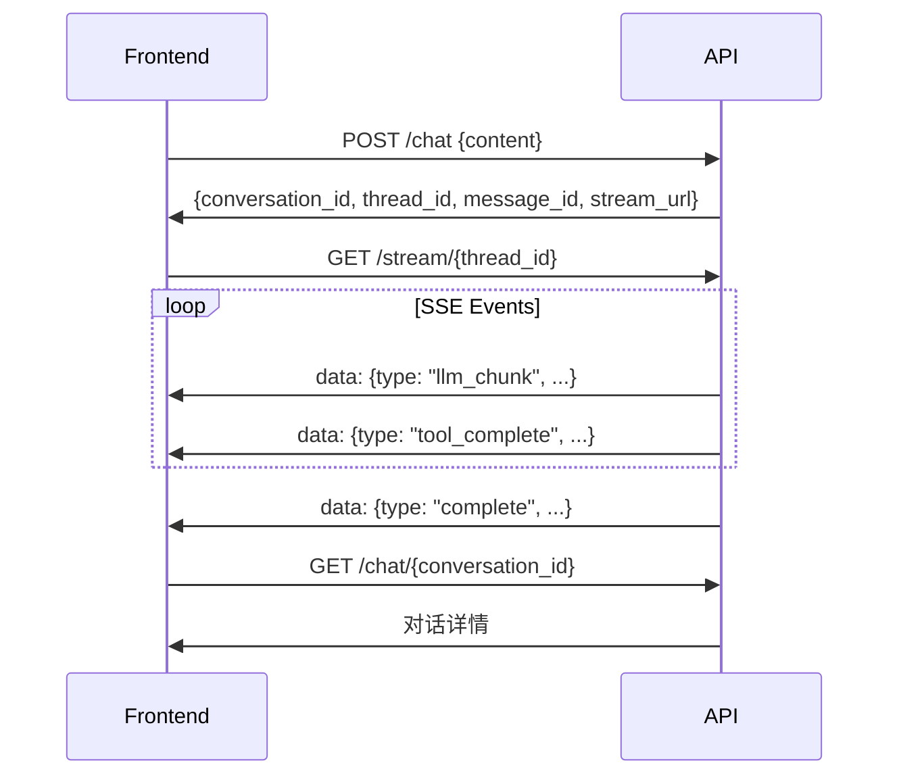

# API Reference

ArtifactFlow API 文档，供前端集成使用。

## 基础信息

| 项目 | 值 |
|------|-----|
| Base URL | `http://localhost:8000/api/v1` |
| 协议 | HTTP/HTTPS |
| 数据格式 | JSON |
| 流式推送 | Server-Sent Events (SSE) |

## 快速开始

### 典型调用流程



---

## Chat API

### 发送消息

```
POST /chat
```

**请求体：**

```json
{
  "content": "帮我分析一下 Python 异步编程",
  "conversation_id": null,
  "parent_message_id": null
}
```

| 字段 | 类型 | 必需 | 说明 |
|------|------|------|------|
| `content` | string | 是 | 用户消息内容 |
| `conversation_id` | string | 否 | 对话 ID，null 则创建新对话 |
| `parent_message_id` | string | 否 | 父消息 ID，用于分支对话 |

**响应：**

```json
{
  "conversation_id": "conv-550e8400e29b41d4a716446655440000",
  "message_id": "msg-770e8400e29b41d4a716446655440002",
  "thread_id": "thd-660e8400e29b41d4a716446655440001",
  "stream_url": "/api/v1/stream/thd-660e8400e29b41d4a716446655440001"
}
```

**说明：** 请求立即返回，实际执行在后台进行。使用 `stream_url` 连接 SSE 获取执行事件。

---

### 获取对话列表

```
GET /chat
```

**查询参数：**

| 参数 | 类型 | 默认值 | 说明 |
|------|------|--------|------|
| `limit` | int | 20 | 返回数量 |
| `offset` | int | 0 | 偏移量 |

**响应：**

```json
{
  "conversations": [
    {
      "id": "conv-550e8400e29b41d4a716446655440000",
      "title": "Python 异步编程分析",
      "message_count": 5,
      "created_at": "2024-01-15T10:30:00Z",
      "updated_at": "2024-01-15T11:00:00Z"
    }
  ],
  "total": 42,
  "has_more": true
}
```

---

### 获取对话详情

```
GET /chat/{conversation_id}
```

**响应：**

```json
{
  "id": "conv-550e8400e29b41d4a716446655440000",
  "title": "Python 异步编程分析",
  "active_branch": "msg-002",
  "messages": [
    {
      "id": "msg-001",
      "parent_id": null,
      "content": "帮我分析一下 Python 异步编程",
      "response": "好的，让我来分析...",
      "created_at": "2024-01-15T10:30:00Z",
      "children": ["msg-002"]
    },
    {
      "id": "msg-002",
      "parent_id": "msg-001",
      "content": "能详细说说 asyncio 吗？",
      "response": "asyncio 是...",
      "created_at": "2024-01-15T10:35:00Z",
      "children": []
    }
  ],
  "session_id": "conv-550e8400e29b41d4a716446655440000",
  "created_at": "2024-01-15T10:30:00Z",
  "updated_at": "2024-01-15T10:35:00Z"
}
```

**说明：** `messages` 是扁平数组，通过 `parent_id` 和 `children` 构建树状结构。`session_id` 与 `conversation_id` 相同。

---

### 删除对话

```
DELETE /chat/{conversation_id}
```

**响应：**

```json
{
  "success": true,
  "message": "Conversation 'conv-xxx' deleted"
}
```

---

### 恢复权限中断

当工具需要用户确认时使用：

```
POST /chat/{conversation_id}/resume
```

**请求体：**

```json
{
  "thread_id": "thd-660e8400e29b41d4a716446655440001",
  "message_id": "msg-770e8400e29b41d4a716446655440002",
  "approved": true
}
```

| 字段 | 类型 | 必需 | 说明 |
|------|------|------|------|
| `thread_id` | string | 是 | 中断时的 thread_id |
| `message_id` | string | 是 | 要更新的消息 ID |
| `approved` | boolean | 是 | 是否批准执行 |

**响应：**

```json
{
  "stream_url": "/api/v1/stream/thd-660e8400e29b41d4a716446655440001"
}
```

**说明：** 返回新的 SSE 端点 URL，前端需重新连接以接收后续事件。

---

## Stream API

### SSE 事件流

```
GET /stream/{thread_id}
```

**连接方式：**

```javascript
const eventSource = new EventSource('/api/v1/stream/{thread_id}');
```

**事件格式说明：**

所有事件以 SSE `data:` 形式发送，事件类型包含在 JSON 的 `type` 字段中：

```
data: {"type":"event_type","timestamp":"...","agent":"...","data":{...}}
```

前端使用 `onmessage` 处理并根据 `type` 分发。

**事件类型：**

#### metadata

执行开始，返回元数据。

```json
{
  "type": "metadata",
  "timestamp": "2024-01-15T10:30:00.000Z",
  "data": {
    "conversation_id": "conv-xxx",
    "thread_id": "thd-yyy",
    "message_id": "msg-zzz"
  }
}
```

#### agent_start

Agent 开始执行。

```json
{
  "type": "agent_start",
  "timestamp": "2024-01-15T10:30:00.000Z",
  "agent": "lead_agent"
}
```

#### llm_chunk

LLM 流式输出片段。

```json
{
  "type": "llm_chunk",
  "timestamp": "2024-01-15T10:30:00.000Z",
  "agent": "lead_agent",
  "data": {
    "content": "让我"
  }
}
```

#### llm_complete

LLM 输出完成。

```json
{
  "type": "llm_complete",
  "timestamp": "2024-01-15T10:30:00.000Z",
  "agent": "lead_agent",
  "data": {
    "content": "完整的输出内容...",
    "token_usage": {
      "input_tokens": 1000,
      "output_tokens": 500,
      "total_tokens": 1500
    }
  }
}
```

#### agent_complete

Agent 执行完成。

```json
{
  "type": "agent_complete",
  "timestamp": "2024-01-15T10:30:00.000Z",
  "agent": "lead_agent",
  "data": {
    "response": "Agent 的完整响应"
  }
}
```

#### tool_start

工具开始执行。

```json
{
  "type": "tool_start",
  "timestamp": "2024-01-15T10:30:00.000Z",
  "agent": "search_agent",
  "tool": "web_search",
  "data": {
    "params": {
      "query": "Python async programming"
    }
  }
}
```

#### tool_complete

工具执行完成。

```json
{
  "type": "tool_complete",
  "timestamp": "2024-01-15T10:30:00.000Z",
  "agent": "search_agent",
  "tool": "web_search",
  "data": {
    "success": true,
    "data": {
      "results": [...]
    }
  }
}
```

#### permission_request

请求用户确认权限。

```json
{
  "type": "permission_request",
  "timestamp": "2024-01-15T10:30:00.000Z",
  "agent": "crawl_agent",
  "tool": "read_file",
  "data": {
    "permission_level": "confirm",
    "params": {
      "path": "/etc/config"
    }
  }
}
```

**处理方式：** 显示确认对话框，用户确认后调用 `POST /chat/{id}/resume`。

#### permission_result

权限确认结果。

```json
{
  "type": "permission_result",
  "timestamp": "2024-01-15T10:30:00.000Z",
  "agent": "crawl_agent",
  "tool": "read_file",
  "data": {
    "approved": true
  }
}
```

#### complete

执行完成。

```json
{
  "type": "complete",
  "timestamp": "2024-01-15T10:30:00.000Z",
  "data": {
    "response": "最终响应内容",
    "metrics": {
      "started_at": "2024-01-15T10:30:00.000Z",
      "completed_at": "2024-01-15T10:30:05.000Z",
      "total_duration_ms": 5000,
      "agent_executions": [...],
      "tool_calls": [...]
    }
  }
}
```

#### error

执行错误。

```json
{
  "type": "error",
  "timestamp": "2024-01-15T10:30:00.000Z",
  "data": {
    "success": false,
    "error": "错误信息"
  }
}
```

---

## Artifact API

**说明：** Artifact 使用 `(session_id, artifact_id)` 复合键标识。`session_id` 与 `conversation_id` 相同。

### 获取 Artifact 列表

```
GET /artifacts/{session_id}
```

**路径参数：**

| 参数 | 类型 | 说明 |
|------|------|------|
| `session_id` | string | 会话 ID（与 conversation_id 相同） |

**响应：**

```json
{
  "session_id": "conv-550e8400e29b41d4a716446655440000",
  "artifacts": [
    {
      "id": "task_plan",
      "content_type": "markdown",
      "title": "任务计划",
      "current_version": 3,
      "created_at": "2024-01-15T10:30:00Z",
      "updated_at": "2024-01-15T11:00:00Z"
    }
  ]
}
```

---

### 获取 Artifact 详情

```
GET /artifacts/{session_id}/{artifact_id}
```

**响应：**

```json
{
  "id": "task_plan",
  "session_id": "conv-550e8400e29b41d4a716446655440000",
  "content_type": "markdown",
  "title": "任务计划",
  "content": "# 任务计划\n\n## 步骤 1\n...",
  "current_version": 3,
  "created_at": "2024-01-15T10:30:00Z",
  "updated_at": "2024-01-15T11:00:00Z"
}
```

---

### 获取版本历史

```
GET /artifacts/{session_id}/{artifact_id}/versions
```

**响应：**

```json
{
  "artifact_id": "task_plan",
  "session_id": "conv-550e8400e29b41d4a716446655440000",
  "versions": [
    {
      "version": 3,
      "update_type": "update",
      "created_at": "2024-01-15T11:00:00Z"
    },
    {
      "version": 2,
      "update_type": "update",
      "created_at": "2024-01-15T10:45:00Z"
    },
    {
      "version": 1,
      "update_type": "create",
      "created_at": "2024-01-15T10:30:00Z"
    }
  ]
}
```

---

### 获取特定版本

```
GET /artifacts/{session_id}/{artifact_id}/versions/{version}
```

**响应：**

```json
{
  "version": 2,
  "content": "第二版内容...",
  "update_type": "update",
  "changes": [["旧内容", "新内容"]],
  "created_at": "2024-01-15T10:45:00Z"
}
```

---

## 错误处理

### 错误响应格式

```json
{
  "error": {
    "code": "CONVERSATION_NOT_FOUND",
    "message": "对话不存在",
    "details": {
      "conversation_id": "xxx"
    }
  }
}
```

### 错误码

| 错误码 | HTTP 状态 | 说明 |
|--------|----------|------|
| `VALIDATION_ERROR` | 400 | 请求参数验证失败 |
| `CONVERSATION_NOT_FOUND` | 404 | 对话不存在 |
| `ARTIFACT_NOT_FOUND` | 404 | Artifact 不存在 |
| `THREAD_NOT_FOUND` | 404 | 线程不存在（SSE） |
| `VERSION_CONFLICT` | 409 | Artifact 版本冲突 |
| `INTERNAL_ERROR` | 500 | 服务器内部错误 |

---

## 前端集成示例

### 完整的聊天组件

```typescript
interface Message {
  id: string;
  role: 'user' | 'assistant';
  content: string;
  createdAt: Date;
}

interface ChatState {
  conversationId: string | null;
  messages: Message[];
  isStreaming: boolean;
  currentContent: string;
  pendingPermission: PermissionRequest | null;
  currentThreadId: string | null;
  currentMessageId: string | null;
}

async function sendMessage(
  state: ChatState,
  content: string
): Promise<void> {
  // 1. 发送消息
  const res = await fetch('/api/v1/chat', {
    method: 'POST',
    headers: { 'Content-Type': 'application/json' },
    body: JSON.stringify({
      content,
      conversation_id: state.conversationId
    })
  });

  const { conversation_id, thread_id, message_id, stream_url } = await res.json();
  state.conversationId = conversation_id;
  state.currentThreadId = thread_id;
  state.currentMessageId = message_id;
  state.isStreaming = true;
  state.currentContent = '';

  // 添加用户消息
  state.messages.push({
    id: message_id,
    role: 'user',
    content,
    createdAt: new Date()
  });

  // 2. 连接 SSE（使用返回的 stream_url）
  const eventSource = new EventSource(stream_url);

  // 3. 统一处理消息，根据 type 分发
  eventSource.onmessage = (e) => {
    const event = JSON.parse(e.data);
    const { type, data, agent, tool } = event;

    switch (type) {
      case 'llm_chunk':
        state.currentContent += data.content;
        break;

      case 'permission_request':
        state.pendingPermission = {
          threadId: thread_id,
          messageId: message_id,
          tool,
          params: data.params,
          permissionLevel: data.permission_level
        };
        break;

      case 'complete':
        state.messages.push({
          id: `${message_id}_response`,
          role: 'assistant',
          content: data.response,
          createdAt: new Date()
        });
        state.currentContent = '';
        state.isStreaming = false;
        eventSource.close();
        break;

      case 'error':
        console.error('Execution error:', data.error);
        state.isStreaming = false;
        eventSource.close();
        break;
    }
  };

  eventSource.onerror = () => {
    state.isStreaming = false;
    eventSource.close();
  };
}

async function handlePermission(
  state: ChatState,
  approved: boolean
): Promise<void> {
  if (!state.pendingPermission) return;

  const res = await fetch(`/api/v1/chat/${state.conversationId}/resume`, {
    method: 'POST',
    headers: { 'Content-Type': 'application/json' },
    body: JSON.stringify({
      thread_id: state.pendingPermission.threadId,
      message_id: state.pendingPermission.messageId,
      approved
    })
  });

  const { stream_url } = await res.json();
  state.pendingPermission = null;

  // 重新连接 SSE 获取后续事件
  const eventSource = new EventSource(stream_url);
  // ... 处理后续事件（同上）
}
```

### Artifact 查看组件

```typescript
async function loadArtifacts(sessionId: string): Promise<Artifact[]> {
  const res = await fetch(`/api/v1/artifacts/${sessionId}`);
  const { artifacts } = await res.json();
  return artifacts;
}

async function loadArtifactWithHistory(
  sessionId: string,
  artifactId: string
): Promise<{ artifact: Artifact; versions: Version[] }> {
  const [artifactRes, versionsRes] = await Promise.all([
    fetch(`/api/v1/artifacts/${sessionId}/${artifactId}`),
    fetch(`/api/v1/artifacts/${sessionId}/${artifactId}/versions`)
  ]);

  return {
    artifact: await artifactRes.json(),
    versions: (await versionsRes.json()).versions
  };
}

async function loadSpecificVersion(
  sessionId: string,
  artifactId: string,
  version: number
): Promise<VersionDetail> {
  const res = await fetch(`/api/v1/artifacts/${sessionId}/${artifactId}/versions/${version}`);
  return await res.json();
}
```
