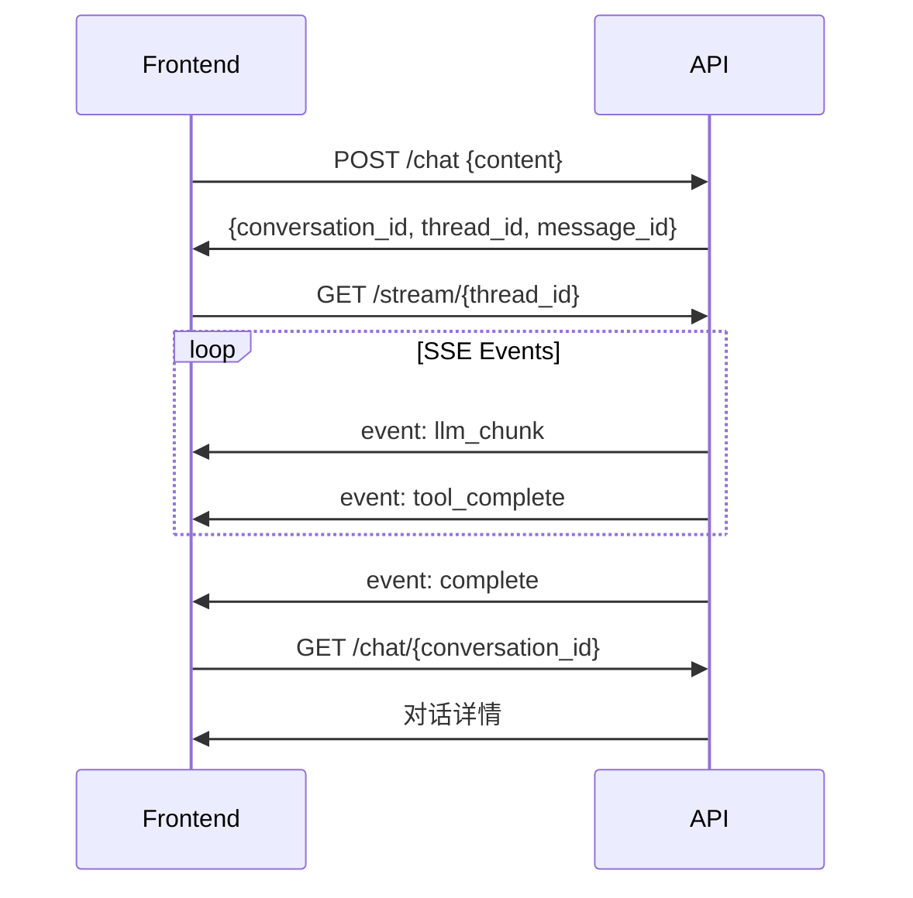

# API Reference

ArtifactFlow API 文档，供前端集成使用。

## 基础信息

| 项目 | 值 |
|------|-----|
| Base URL | `http://localhost:8000/api/v1` |
| 协议 | HTTP/HTTPS |
| 数据格式 | JSON |
| 流式推送 | Server-Sent Events (SSE) |

## 快速开始

### 典型调用流程



---

## Chat API

### 发送消息

```
POST /chat
```

**请求体：**

```json
{
  "content": "帮我分析一下 Python 异步编程",
  "conversation_id": null,
  "parent_message_id": null
}
```

| 字段 | 类型 | 必需 | 说明 |
|------|------|------|------|
| `content` | string | 是 | 用户消息内容 |
| `conversation_id` | string | 否 | 对话 ID，null 则创建新对话 |
| `parent_message_id` | string | 否 | 父消息 ID，用于分支对话 |

**响应：**

```json
{
  "conversation_id": "550e8400-e29b-41d4-a716-446655440000",
  "thread_id": "660e8400-e29b-41d4-a716-446655440001",
  "message_id": "770e8400-e29b-41d4-a716-446655440002"
}
```

**说明：** 请求立即返回，实际执行在后台进行。使用 `thread_id` 连接 SSE 获取执行事件。

---

### 获取对话列表

```
GET /chat
```

**查询参数：**

| 参数 | 类型 | 默认值 | 说明 |
|------|------|--------|------|
| `limit` | int | 20 | 返回数量 |
| `offset` | int | 0 | 偏移量 |

**响应：**

```json
{
  "conversations": [
    {
      "id": "550e8400-e29b-41d4-a716-446655440000",
      "title": "Python 异步编程分析",
      "created_at": "2024-01-15T10:30:00Z",
      "updated_at": "2024-01-15T11:00:00Z",
      "message_count": 5
    }
  ],
  "total": 42
}
```

---

### 获取对话详情

```
GET /chat/{conversation_id}
```

**响应：**

```json
{
  "id": "550e8400-e29b-41d4-a716-446655440000",
  "title": "Python 异步编程分析",
  "created_at": "2024-01-15T10:30:00Z",
  "messages": [
    {
      "id": "msg_001",
      "parent_id": null,
      "content": "帮我分析一下 Python 异步编程",
      "response": "好的，让我来分析...",
      "timestamp": "2024-01-15T10:30:00Z"
    },
    {
      "id": "msg_002",
      "parent_id": "msg_001",
      "content": "能详细说说 asyncio 吗？",
      "response": "asyncio 是...",
      "timestamp": "2024-01-15T10:35:00Z"
    }
  ]
}
```

---

### 删除对话

```
DELETE /chat/{conversation_id}
```

**响应：**

```json
{
  "success": true
}
```

---

### 恢复权限中断

当工具需要用户确认时使用：

```
POST /chat/{conversation_id}/resume
```

**请求体：**

```json
{
  "thread_id": "660e8400-e29b-41d4-a716-446655440001",
  "approved": true
}
```

| 字段 | 类型 | 必需 | 说明 |
|------|------|------|------|
| `thread_id` | string | 是 | 中断时的 thread_id |
| `approved` | boolean | 是 | 是否批准执行 |

**响应：**

```json
{
  "thread_id": "660e8400-e29b-41d4-a716-446655440001",
  "resumed": true
}
```

---

## Stream API

### SSE 事件流

```
GET /stream/{thread_id}
```

**连接方式：**

```javascript
const eventSource = new EventSource('/api/v1/stream/{thread_id}');
```

**事件类型：**

#### metadata

执行开始，返回元数据。

```json
{
  "conversation_id": "xxx",
  "thread_id": "yyy",
  "message_id": "zzz"
}
```

#### agent_start

Agent 开始执行。

```json
{
  "agent": "lead"
}
```

#### llm_chunk

LLM 流式输出片段。

```json
{
  "content": "让我",
  "agent": "lead"
}
```

#### llm_complete

LLM 输出完成。

```json
{
  "content": "完整的输出内容...",
  "agent": "lead",
  "token_usage": {
    "input_tokens": 1000,
    "output_tokens": 500
  }
}
```

#### agent_complete

Agent 执行完成。

```json
{
  "agent": "lead",
  "response": "Agent 的完整响应"
}
```

#### tool_start

工具开始执行。

```json
{
  "tool": "web_search",
  "params": {
    "query": "Python async programming"
  }
}
```

#### tool_complete

工具执行完成。

```json
{
  "tool": "web_search",
  "success": true,
  "data": {
    "results": [...]
  }
}
```

#### permission_request

请求用户确认权限。

```json
{
  "tool": "read_file",
  "params": {
    "path": "/etc/config"
  },
  "permission": "confirm",
  "message": "工具 read_file 需要您的确认才能执行"
}
```

**处理方式：** 显示确认对话框，用户确认后调用 `POST /chat/{id}/resume`。

#### permission_result

权限确认结果。

```json
{
  "tool": "read_file",
  "approved": true
}
```

#### complete

执行完成。

```json
{
  "response": "最终响应内容",
  "metrics": {
    "total_duration_ms": 5000,
    "agent_executions": [...],
    "tool_calls": [...]
  }
}
```

#### error

执行错误。

```json
{
  "error": "错误信息",
  "traceback": "..."
}
```

---

## Artifact API

### 获取 Artifact 列表

```
GET /artifacts
```

**查询参数：**

| 参数 | 类型 | 说明 |
|------|------|------|
| `session_id` | string | 按会话筛选 |
| `type` | string | 按类型筛选 |

**响应：**

```json
{
  "artifacts": [
    {
      "id": "artifact_001",
      "session_id": "session_001",
      "type": "task_plan",
      "title": "任务计划",
      "version": 3,
      "created_at": "2024-01-15T10:30:00Z",
      "updated_at": "2024-01-15T11:00:00Z"
    }
  ]
}
```

---

### 获取 Artifact 详情

```
GET /artifacts/{artifact_id}
```

**响应：**

```json
{
  "id": "artifact_001",
  "session_id": "session_001",
  "type": "task_plan",
  "title": "任务计划",
  "content": "# 任务计划\n\n## 步骤 1\n...",
  "version": 3,
  "created_at": "2024-01-15T10:30:00Z",
  "updated_at": "2024-01-15T11:00:00Z"
}
```

---

### 获取版本历史

```
GET /artifacts/{artifact_id}/versions
```

**响应：**

```json
{
  "versions": [
    {
      "version": 3,
      "content": "最新版本内容...",
      "created_at": "2024-01-15T11:00:00Z"
    },
    {
      "version": 2,
      "content": "第二版内容...",
      "created_at": "2024-01-15T10:45:00Z"
    },
    {
      "version": 1,
      "content": "初始版本...",
      "created_at": "2024-01-15T10:30:00Z"
    }
  ]
}
```

---

## 错误处理

### 错误响应格式

```json
{
  "error": {
    "code": "CONVERSATION_NOT_FOUND",
    "message": "对话不存在",
    "details": {
      "conversation_id": "xxx"
    }
  }
}
```

### 错误码

| 错误码 | HTTP 状态 | 说明 |
|--------|----------|------|
| `VALIDATION_ERROR` | 400 | 请求参数验证失败 |
| `CONVERSATION_NOT_FOUND` | 404 | 对话不存在 |
| `ARTIFACT_NOT_FOUND` | 404 | Artifact 不存在 |
| `THREAD_NOT_FOUND` | 404 | 线程不存在（SSE） |
| `VERSION_CONFLICT` | 409 | Artifact 版本冲突 |
| `INTERNAL_ERROR` | 500 | 服务器内部错误 |

---

## 前端集成示例

### 完整的聊天组件

```typescript
interface Message {
  id: string;
  role: 'user' | 'assistant';
  content: string;
  timestamp: Date;
}

interface ChatState {
  conversationId: string | null;
  messages: Message[];
  isStreaming: boolean;
  currentContent: string;
  pendingPermission: PermissionRequest | null;
}

async function sendMessage(
  state: ChatState,
  content: string
): Promise<void> {
  // 1. 发送消息
  const res = await fetch('/api/v1/chat', {
    method: 'POST',
    headers: { 'Content-Type': 'application/json' },
    body: JSON.stringify({
      content,
      conversation_id: state.conversationId
    })
  });

  const { conversation_id, thread_id, message_id } = await res.json();
  state.conversationId = conversation_id;
  state.isStreaming = true;
  state.currentContent = '';

  // 添加用户消息
  state.messages.push({
    id: message_id,
    role: 'user',
    content,
    timestamp: new Date()
  });

  // 2. 连接 SSE
  const eventSource = new EventSource(`/api/v1/stream/${thread_id}`);

  eventSource.addEventListener('llm_chunk', (e) => {
    const { content } = JSON.parse(e.data);
    state.currentContent += content;
  });

  eventSource.addEventListener('permission_request', (e) => {
    const data = JSON.parse(e.data);
    state.pendingPermission = {
      threadId: thread_id,
      ...data
    };
  });

  eventSource.addEventListener('complete', (e) => {
    const { response } = JSON.parse(e.data);
    state.messages.push({
      id: `${message_id}_response`,
      role: 'assistant',
      content: response,
      timestamp: new Date()
    });
    state.currentContent = '';
    state.isStreaming = false;
    eventSource.close();
  });

  eventSource.addEventListener('error', (e) => {
    console.error('SSE Error:', e);
    state.isStreaming = false;
    eventSource.close();
  });
}

async function handlePermission(
  state: ChatState,
  approved: boolean
): Promise<void> {
  if (!state.pendingPermission) return;

  await fetch(`/api/v1/chat/${state.conversationId}/resume`, {
    method: 'POST',
    headers: { 'Content-Type': 'application/json' },
    body: JSON.stringify({
      thread_id: state.pendingPermission.threadId,
      approved
    })
  });

  state.pendingPermission = null;
}
```

### Artifact 查看组件

```typescript
async function loadArtifacts(sessionId: string): Promise<Artifact[]> {
  const res = await fetch(`/api/v1/artifacts?session_id=${sessionId}`);
  const { artifacts } = await res.json();
  return artifacts;
}

async function loadArtifactWithHistory(
  artifactId: string
): Promise<{ artifact: Artifact; versions: Version[] }> {
  const [artifactRes, versionsRes] = await Promise.all([
    fetch(`/api/v1/artifacts/${artifactId}`),
    fetch(`/api/v1/artifacts/${artifactId}/versions`)
  ]);

  return {
    artifact: await artifactRes.json(),
    versions: (await versionsRes.json()).versions
  };
}
```
