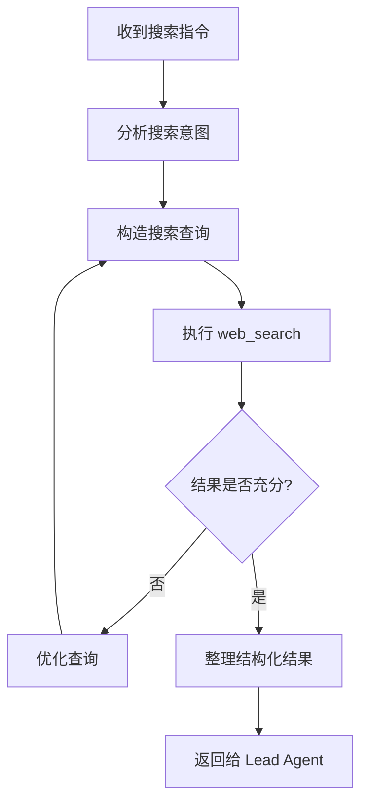
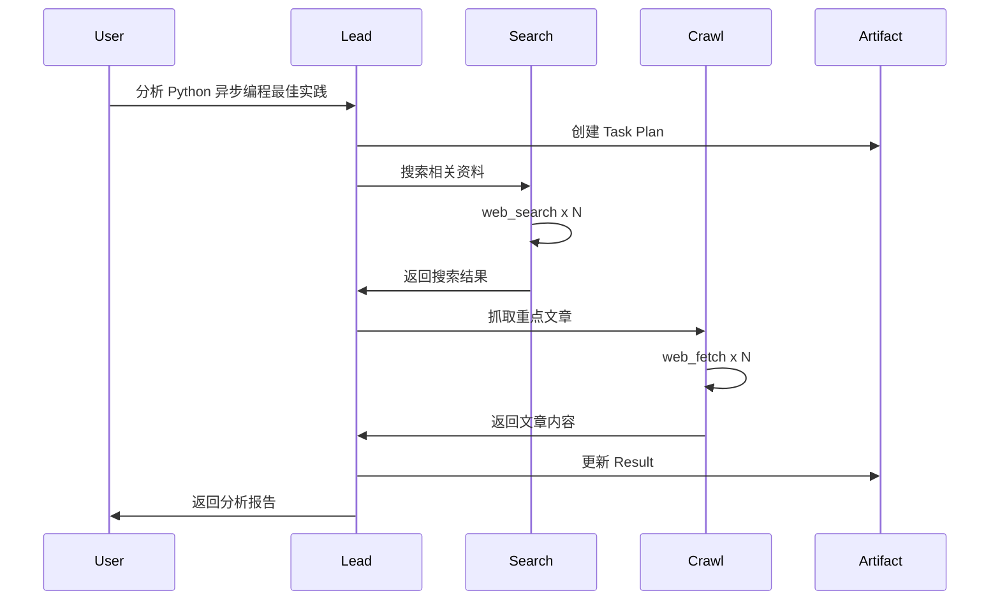

# Agent 系统

Agent 是 ArtifactFlow 中的智能执行单元，每个 Agent 专注于特定类型的任务。

## 模块结构

```
src/agents/
├── base.py          # Agent 基类和核心数据结构
├── lead_agent.py    # Lead Agent（任务协调）
├── search_agent.py  # Search Agent（信息检索）
└── crawl_agent.py   # Crawl Agent（内容采集）
```

## 核心数据结构 (base.py)

### AgentConfig

Agent 配置：

```python
@dataclass
class AgentConfig:
    name: str                    # Agent 名称（唯一标识）
    description: str             # Agent 描述
    capabilities: list[str]      # 能力列表
    required_tools: list[str]    # 所需工具名称列表
    model: str                   # LLM 模型
    temperature: float = 0.7     # 生成温度
    max_tool_rounds: int = 3     # 单次执行最大工具调用轮数
    llm_max_retries: int = 3     # LLM 调用重试次数
```

### AgentResponse

Agent 单轮执行的响应：

```python
@dataclass
class AgentResponse:
    success: bool                    # 执行是否成功
    content: str                     # 回复内容
    tool_calls: list[dict]           # 本轮工具调用记录
    tool_interactions: list[dict]    # assistant-tool 交互历史
    reasoning_content: str | None    # 思考过程（支持 reasoning model）
    routing: dict | None             # 路由信息
    token_usage: dict | None         # Token 统计
```

**routing 字段结构**：

```python
# 工具调用
routing = {
    "type": "tool",
    "tool_name": "web_search",
    "params": {"query": "..."}
}

# 调用 SubAgent
routing = {
    "type": "subagent",
    "target": "search",
    "instruction": "搜索相关信息..."
}

# 任务完成
routing = {
    "type": "complete",
    "response": "最终回复内容"
}

# 继续执行（处理工具结果后继续）
routing = {
    "type": "continue"
}
```

## BaseAgent 基类

### 核心职责

1. **单轮 LLM 调用**：每次执行只调用一次 LLM
2. **响应解析**：解析 XML 格式的工具调用
3. **流式输出**：支持 LLM token 级别的流式
4. **错误重试**：LLM 调用失败自动重试

### 抽象方法

子类必须实现：

```python
class BaseAgent(ABC):
    @abstractmethod
    def build_system_prompt(self, toolkit: AgentToolkit) -> str:
        """构建系统提示词"""
        pass

    @abstractmethod
    def format_final_response(self, content: str, state: AgentState) -> str:
        """格式化最终响应"""
        pass
```

### 执行流程

```python
async def stream(self, context: AgentContext) -> AsyncGenerator[StreamEvent, None]:
    """流式执行 Agent"""

    # 1. 发送 Agent 开始事件
    yield StreamEvent(type=AGENT_START, data={"agent": self.name})

    # 2. 构建 messages
    messages = self._build_messages(context)

    # 3. 流式调用 LLM
    full_content = ""
    async for chunk in self._call_llm_with_retry(messages):
        full_content += chunk.content
        yield StreamEvent(type=LLM_CHUNK, data={"content": chunk.content})

    yield StreamEvent(type=LLM_COMPLETE, data={"content": full_content})

    # 4. 解析响应
    response = self._parse_response(full_content, context)

    # 5. 发送 Agent 完成事件
    yield StreamEvent(type=AGENT_COMPLETE, data={"response": response})

    return response
```

### 响应解析

```python
def _parse_response(self, content: str, context: AgentContext) -> AgentResponse:
    # 尝试解析工具调用
    tool_calls = XMLToolCallParser.parse(content)

    if tool_calls:
        tool_call = tool_calls[0]  # 每轮只处理一个工具调用

        # 判断是 subagent 调用还是普通工具
        if tool_call["name"] == "call_subagent":
            return AgentResponse(
                success=True,
                content=content,
                routing={
                    "type": "subagent",
                    "target": tool_call["params"]["target"],
                    "instruction": tool_call["params"]["instruction"]
                }
            )
        else:
            return AgentResponse(
                success=True,
                content=content,
                routing={
                    "type": "tool",
                    "tool_name": tool_call["name"],
                    "params": tool_call["params"]
                }
            )

    # 检查是否达到最大工具轮数
    if context.tool_round_count >= self.config.max_tool_rounds:
        return AgentResponse(
            success=True,
            content=content,
            routing={"type": "complete", "response": content}
        )

    # 无工具调用，任务完成
    return AgentResponse(
        success=True,
        content=content,
        routing={"type": "complete", "response": self.format_final_response(content)}
    )
```

## Lead Agent

### 角色定位

Lead Agent 是任务的**总协调者**：

- 理解用户意图，制定任务计划
- 管理 Task Plan Artifact
- 调度 SubAgent 执行具体任务
- 整合结果到 Result Artifact
- 与用户交互，响应反馈

### 配置

```python
class LeadAgent(BaseAgent):
    def __init__(self):
        super().__init__(AgentConfig(
            name="lead",
            description="任务规划与协调",
            capabilities=[
                "任务分解与规划",
                "SubAgent 调度",
                "结果整合",
                "用户交互"
            ],
            required_tools=[
                "create_artifact",
                "update_artifact",
                "rewrite_artifact",
                "read_artifact",
                "call_subagent"
            ],
            model="qwen3-next-80b-thinking",  # 使用思考模型
            temperature=0.7,
            max_tool_rounds=5  # 需要更多轮次协调
        ))
```

### 系统提示词结构

```python
def build_system_prompt(self, toolkit: AgentToolkit) -> str:
    return f"""
# 角色
你是 ArtifactFlow 的 Lead Agent，负责理解用户需求、规划任务、协调执行。

# 核心职责
1. **任务规划**：将复杂任务分解为可执行步骤，记录到 Task Plan Artifact
2. **进度管理**：跟踪任务进度，更新计划状态
3. **Agent 调度**：根据任务类型调用合适的 SubAgent
4. **结果整合**：将 SubAgent 结果整合到 Result Artifact
5. **用户交互**：响应用户反馈，调整执行方向

# 可用工具
{toolkit.generate_tool_docs()}

# 工作流程
1. 收到新任务 → 创建 Task Plan Artifact
2. 分析任务 → 确定需要哪些 SubAgent
3. 逐步执行 → 调用 SubAgent，收集结果
4. 整合结果 → 更新 Result Artifact
5. 完成/继续 → 根据进度决定下一步

# 输出格式
- 思考过程用自然语言描述
- 工具调用使用 XML 格式
- 最终回复简洁明了
"""
```

## Search Agent

### 角色定位

专注于**信息检索**：

- 优化搜索查询
- 多轮迭代搜索
- 结果筛选与结构化

### 配置

```python
class SearchAgent(BaseAgent):
    def __init__(self):
        super().__init__(AgentConfig(
            name="search",
            description="信息检索与搜索",
            capabilities=[
                "搜索查询优化",
                "多轮迭代搜索",
                "结果筛选"
            ],
            required_tools=["web_search"],
            model="qwen3-next-80b-instruct",
            temperature=0.5,  # 精确搜索
            max_tool_rounds=3
        ))
```

### 工作模式



## Crawl Agent

### 角色定位

专注于**内容采集**：

- 网页内容抓取
- 内容解析与提取
- 处理异常情况

### 配置

```python
class CrawlAgent(BaseAgent):
    def __init__(self):
        super().__init__(AgentConfig(
            name="crawl",
            description="内容采集与解析",
            capabilities=[
                "网页内容抓取",
                "内容提取",
                "格式转换"
            ],
            required_tools=["web_fetch"],
            model="qwen3-next-80b-instruct",
            temperature=0.3,  # 精确提取
            max_tool_rounds=3
        ))
```

## Agent 协作模式



## Agent 记忆系统

每个 Agent 维护独立的记忆，用于跨轮次保持上下文：

```python
# state["agent_memories"] 结构
{
    "lead": "已完成搜索阶段，收集到 5 篇相关文章...",
    "search": "上次搜索关键词：Python async, asyncio tutorial...",
    "crawl": "已抓取 3 个 URL：..."
}
```

记忆在 `merge_agent_response_to_state()` 中自动更新：

```python
# Agent 可以在响应中包含记忆更新
if response.memory_update:
    state["agent_memories"][agent_name] = response.memory_update
```

## 添加新 Agent

参见 [Extension Guide](../extension-guide.md#添加新-agent)。
