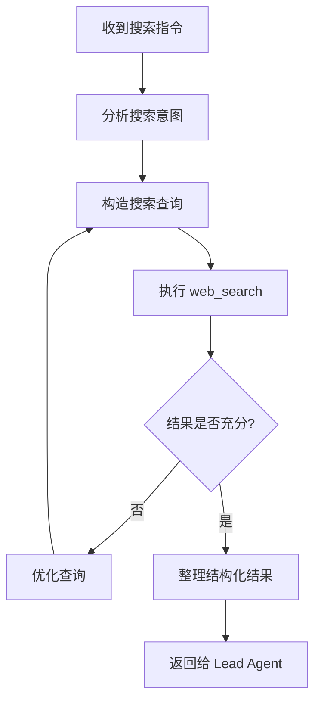
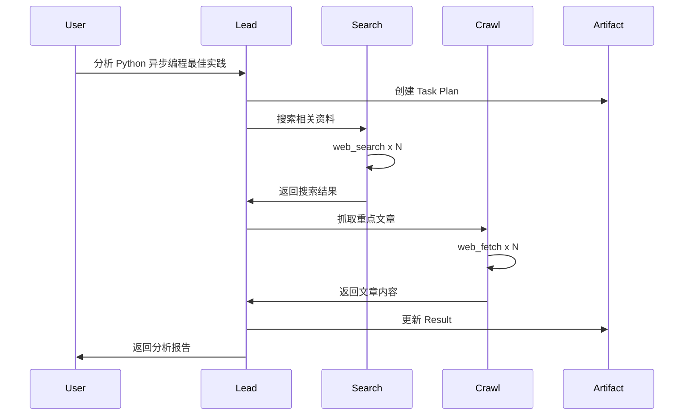

# Agent 系统

Agent 是 ArtifactFlow 中的智能执行单元，每个 Agent 专注于特定类型的任务。

## 模块结构

```
src/agents/
├── base.py          # Agent 基类和核心数据结构
├── lead_agent.py    # Lead Agent（任务协调）
├── search_agent.py  # Search Agent（信息检索）
└── crawl_agent.py   # Crawl Agent（内容采集）
```

## 核心数据结构 (base.py)

### AgentConfig

Agent 配置：

```python
@dataclass
class AgentConfig:
    name: str                        # Agent 名称（唯一标识）
    description: str                 # Agent 描述

    # 元信息（用于注册到 Lead、创建 toolkit）
    capabilities: List[str] = []     # 能力列表
    required_tools: List[str] = []   # 所需工具名称列表

    # LLM 配置
    model: str = "qwen-plus"         # LLM 模型
    temperature: float = 0.7         # 生成温度
    max_tool_rounds: int = 3         # 单次执行最大工具调用轮数
    streaming: bool = False          # 是否默认流式输出

    llm_max_retries: int = 3         # LLM 调用最大重试次数
    llm_retry_delay: float = 1.0     # 初始重试延迟（秒）
```

### AgentResponse

Agent 单轮执行的响应：

```python
@dataclass
class AgentResponse:
    success: bool = True                     # 执行是否成功
    content: str = ""                        # 回复内容或错误信息
    tool_calls: List[Dict[str, Any]] = []    # 本轮工具调用记录
    tool_interactions: List[Dict] = []       # assistant-tool 交互历史（用于恢复）
    reasoning_content: Optional[str] = None  # 思考过程（支持 reasoning model）
    metadata: Dict[str, Any] = {}            # 元数据
    routing: Optional[Dict[str, Any]] = None # 路由信息
    token_usage: Optional[Dict[str, Any]] = None  # Token 统计
```

**routing 字段结构**：

```python
# 工具调用
routing = {
    "type": "tool_call",
    "tool_name": "web_search",
    "params": {"query": "..."}
}

# 调用 SubAgent
routing = {
    "type": "subagent",
    "target": "search_agent",
    "instruction": "搜索相关信息..."
}

# 任务完成（无 routing 字段）
# 当 routing 为 None 时表示 Agent 完成执行
```

## BaseAgent 基类

### 核心职责

1. **单轮 LLM 调用**：每次执行只调用一次 LLM
2. **响应解析**：解析 XML 格式的工具调用
3. **流式输出**：支持 LLM token 级别的流式
4. **错误重试**：LLM 调用失败自动重试

### 抽象方法

子类必须实现：

```python
class BaseAgent(ABC):
    @abstractmethod
    def build_system_prompt(self, context: Optional[Dict[str, Any]] = None) -> str:
        """
        构建系统提示词（不含工具说明）

        Args:
            context: 动态上下文（如 artifacts_inventory）

        Returns:
            系统提示词
        """
        pass

    @abstractmethod
    def format_final_response(self, content: str, tool_history: List[Dict]) -> str:
        """
        格式化最终响应

        Args:
            content: LLM 的最终回复
            tool_history: 工具调用历史

        Returns:
            格式化后的响应
        """
        pass
```

工具说明由 `build_complete_system_prompt()` 自动追加到 `build_system_prompt()` 结果后面。

### 执行流程

```python
async def stream(
    self,
    messages: List[Dict],
    is_resuming: bool = False
) -> AsyncGenerator[StreamEvent, None]:
    """
    流式执行 Agent（单轮 LLM 调用）

    Args:
        messages: 完整的消息列表（由 ContextManager 构建）
        is_resuming: 是否从工具执行恢复
    """

    # 1. 发送 Agent 开始事件
    yield StreamEvent(type=AGENT_START, agent=self.config.name, data=current_response)

    # 2. 流式调用 LLM（带重试）
    stream = await self._call_llm_with_retry(messages, streaming=True)
    async for chunk in stream:
        if chunk["type"] == "content":
            response_content += chunk["content"]
            yield StreamEvent(type=LLM_CHUNK, agent=self.config.name, data=current_response)
        elif chunk["type"] == "reasoning":
            reasoning_content += chunk["content"]
            yield StreamEvent(type=LLM_CHUNK, agent=self.config.name, data=current_response)

    yield StreamEvent(type=LLM_COMPLETE, agent=self.config.name, data=current_response)

    # 3. 解析响应（内联处理）
    tool_calls = parse_tool_calls(response_content)
    if tool_calls:
        tool_call = tool_calls[0]  # 每轮只处理一个
        if tool_call.name == "call_subagent":
            current_response.routing = {"type": "subagent", ...}
        else:
            current_response.routing = {"type": "tool_call", ...}

    # 4. 发送 Agent 完成事件
    yield StreamEvent(type=AGENT_COMPLETE, agent=self.config.name, data=current_response)
```

### 响应解析

响应解析在 `_execute_generator()` 中内联处理：

```python
# 在 _execute_generator 中
tool_calls = parse_tool_calls(response_content)

if tool_calls:
    tool_call = tool_calls[0]  # 每轮只处理一个工具调用

    # 判断是 subagent 调用还是普通工具
    if tool_call.name == "call_subagent":
        current_response.routing = {
            "type": "subagent",
            "target": tool_call.params.get("agent_name"),
            "instruction": tool_call.params.get("instruction")
        }
    else:
        current_response.routing = {
            "type": "tool_call",
            "tool_name": tool_call.name,
            "params": tool_call.params
        }

    yield StreamEvent(type=AGENT_COMPLETE, ...)
    return

# 无工具调用 → Agent 完成
# routing 为 None，由 Graph 层决定是 COMPLETED 还是返回 Lead
final_response = self.format_final_response(content, tool_calls)
current_response.content = final_response

yield StreamEvent(type=AGENT_COMPLETE, ...)
```

**注意**：工具轮数限制由 Graph 层控制（读取 `agent.config.max_tool_rounds`），不在 Agent 内部判断。

## Lead Agent

### 角色定位

Lead Agent 是任务的**总协调者**：

- 理解用户意图，制定任务计划
- 管理 Task Plan Artifact
- 调度 SubAgent 执行具体任务
- 整合结果到 Result Artifact
- 与用户交互，响应反馈

### 配置

```python
class LeadAgent(BaseAgent):
    def __init__(self, config: Optional[AgentConfig] = None, toolkit=None):
        if not config:
            config = AgentConfig(
                name="lead_agent",
                description="Task coordinator and information integrator",
                required_tools=[
                    "create_artifact",
                    "update_artifact",
                    "rewrite_artifact",
                    "read_artifact",
                    "call_subagent"
                ],
                model="qwen3-next-80b-thinking",  # 使用思考模型
                temperature=0.7,
                max_tool_rounds=5,    # 需要更多轮次协调
                streaming=True
            )
        super().__init__(config, toolkit)

        # 注册的子 Agent 配置（用于生成 system prompt）
        self.sub_agents: Dict[str, AgentConfig] = {}

    def register_subagent(self, config: AgentConfig):
        """注册子 Agent，使其出现在 system prompt 中"""
        self.sub_agents[config.name] = config
```

### 系统提示词结构

```python
def build_system_prompt(self, context: Optional[Dict[str, Any]] = None) -> str:
    """
    构建 Lead Agent 系统提示词

    Args:
        context: 包含 artifacts_inventory、user_feedback 等上下文

    提示词结构（使用 XML 标签组织）：
    - <system_time>: 当前时间
    - <agent_role>: 角色定义和核心职责
    - <execution_flow>: 执行流程和指导原则
    - <task_planning_strategy>: 任务规划策略
    - <artifact_management>: Artifact 管理规范
    - <available_subagents>: 可用的子 Agent 列表（动态生成）
    - <current_context>: 当前上下文（artifacts_inventory、user_feedback）
    """
```

提示词核心结构：

```
<agent_role>
You are lead_agent, the Lead Agent coordinating a multi-agent system.

## Your Role and Responsibilities
1. Task Planning: Analyze user requests and create structured task plans
2. Coordination: Delegate specific tasks to specialized sub-agents
3. Integration: Synthesize information from various sources
4. Quality Control: Ensure quality and completeness
</agent_role>

<artifact_management>
## Artifact Management

### Task Plan Artifact (ID: "task_plan")
- 固定 ID，用于任务跟踪

### Result Artifacts (Flexible IDs)
- 根据用户需求创建，如 "research_report"、"main.py" 等
</artifact_management>

<available_subagents>
## Available Sub-Agents
（动态生成已注册的子 Agent 列表）
</available_subagents>
```

## Search Agent

### 角色定位

专注于**信息检索**：

- 优化搜索查询
- 多轮迭代搜索
- 结果筛选与结构化

### 配置

```python
class SearchAgent(BaseAgent):
    def __init__(self, config: Optional[AgentConfig] = None, toolkit=None):
        if not config:
            config = AgentConfig(
                name="search_agent",
                description="Web search and information retrieval specialist",
                capabilities=["Web search", "Information retrieval"],
                required_tools=["web_search"],
                model="qwen3-next-80b-instruct",
                temperature=0.5,      # 较低温度 for 精确搜索
                max_tool_rounds=3,    # 最多 3 轮搜索优化
                streaming=True
            )
        super().__init__(config, toolkit)
```

### 工作模式



## Crawl Agent

### 角色定位

专注于**内容采集**：

- 网页内容抓取
- 内容解析与提取
- 处理异常情况

### 配置

```python
class CrawlAgent(BaseAgent):
    def __init__(self, config: Optional[AgentConfig] = None, toolkit=None):
        if not config:
            config = AgentConfig(
                name="crawl_agent",
                description="Web content extraction and cleaning specialist",
                capabilities=[
                    "Deep content extraction",
                    "Web scraping",
                    "IMPORTANT: Instructions must include a specific URL to crawl"
                ],
                required_tools=["web_fetch"],
                model="qwen3-next-80b-instruct",
                temperature=0.3,      # 更低温度 for 精确提取
                max_tool_rounds=2,    # 通常 1-2 轮即可
                streaming=True
            )
        super().__init__(config, toolkit)
```

## Agent 协作模式



## Agent 记忆系统

每个 Agent 维护独立的记忆（`NodeMemory`），用于跨轮次保持上下文：

```python
# state["agent_memories"] 结构
{
    "lead_agent": {
        "tool_interactions": [...],    # assistant-tool 交互历史
        "last_response": {...},        # 最后的 AgentResponse
        "tool_round_count": 2          # 当前工具调用轮数
    },
    "search_agent": {...},
    "crawl_agent": {...}
}
```

记忆在 `merge_agent_response_to_state()` 中自动更新：

```python
# 自动合并 tool_interactions
if response.tool_interactions:
    memory["tool_interactions"].extend(response.tool_interactions)

# 自动更新 last_response
memory["last_response"] = {
    "success": response.success,
    "content": response.content,
    "tool_calls": response.tool_calls,
    "metadata": response.metadata,
    "reasoning": response.reasoning_content
}
```

**注意**：可观测性指标（执行时间、token 统计等）已移至 `ExecutionMetrics`，由 Graph 层记录。

## 添加新 Agent

参见 [Extension Guide](../extension-guide.md#添加新-agent)。
