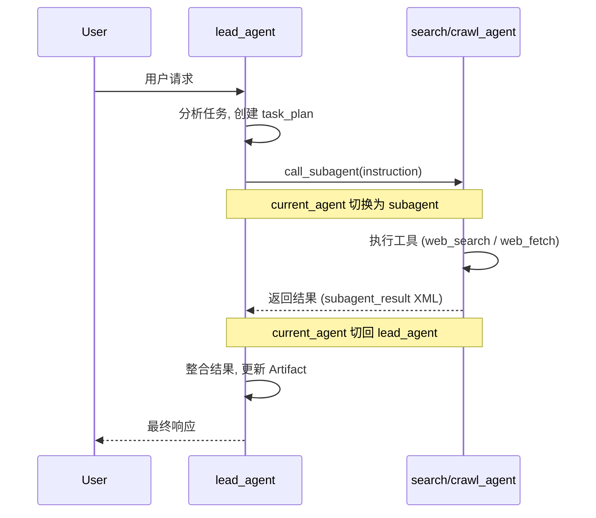

# Agent 配置化系统

> Agent 是数据，不是类 — 一个 Markdown 文件就是一个 Agent。

## Agent-as-Config 理念

ArtifactFlow 的 Agent 完全由配置驱动：每个 Agent 是 `config/agents/` 下的一个 `.md` 文件，包含 YAML frontmatter（元数据）和 Markdown body（角色提示词）。不需要编写任何 Python 代码。

```
config/agents/
├── lead_agent.md       # 协调者
├── search_agent.md     # Web 搜索专家
├── crawl_agent.md      # 网页内容提取
└── compact_agent.md    # 对话摘要（内部）
```

## AgentConfig 数据结构

`src/agents/loader.py` 定义了 `AgentConfig` dataclass：

```python
@dataclass
class AgentConfig:
    name: str                                        # Agent 唯一标识
    description: str                                 # Agent 描述（用于 call_subagent 候选列表）
    tools: dict[str, str] = field(default_factory=dict)  # {tool_name: permission_level}
    model: str = "qwen3.6-plus-no-thinking"          # LLM 模型别名
    max_tool_rounds: int = 3                         # 最大工具调用轮数
    internal: bool = False                           # 内部 Agent（不出现在候选列表）
    role_prompt: str = ""                            # MD body（角色提示词）
```

## YAML Frontmatter Schema

每个 Agent 的 `.md` 文件以 YAML frontmatter 开头：

```yaml
---
name: search_agent
description: |
  Web search and information retrieval specialist
  - Web search
  - Information retrieval
tools:
  web_search: auto
model: qwen3.6-plus-no-thinking
max_tool_rounds: 3
---
```

### 字段参考

| 字段 | 类型 | 必填 | 默认值 | 说明 |
|------|------|------|--------|------|
| `name` | string | 是 | — | Agent 唯一标识（与文件名无关，以此字段为准） |
| `description` | string | 否 | `""` | Agent 描述，注入到 `<available_subagents>` 列表中 |
| `tools` | dict | 否 | `{}` | 工具白名单 + 权限覆盖，格式 `{tool_name: auto\|confirm}` |
| `model` | string | 否 | `"qwen3.6-plus-no-thinking"` | 引用 `config/models/models.yaml` 中的模型别名 |
| `max_tool_rounds` | int | 否 | `3` | 最大工具调用轮数，超过后注入系统提示要求总结 |
| `internal` | bool | 否 | `false` | 内部 Agent，不出现在 `call_subagent` 的可用候选列表中 |

### 工具权限覆盖

`tools` 字段不仅是工具白名单，也是 per-agent 的权限覆盖：

```yaml
tools:
  web_search: auto       # 该 agent 自动执行 web_search
  web_fetch: confirm     # 该 agent 执行 web_fetch 前需用户确认
```

引擎执行工具时的权限决策逻辑：

1. 检查 agent 配置中该工具的权限值（`agents[agent_name].tools[tool_name]`）
2. 如未配置，回退到工具自身的默认权限（`tool.permission`）
3. 如果最终权限为 `CONFIRM` 且工具不在 `always_allowed_tools` 中 → 触发权限中断

## Role Prompt 设计

YAML frontmatter 之后的 Markdown body 是 Agent 的角色提示词，会作为 system prompt 的第一层注入到每次 LLM 调用中。

以 `lead_agent.md` 为例：

```markdown
---
name: lead_agent
...
---

<role>
You are lead_agent, the Lead Agent coordinating a multi-agent system.

**Execution Flow:**
1. **Analyze Request** — Determine complexity
2. **Plan Tasks** — Create task_plan if needed
3. **Execute** — Call sub-agents or work directly
4. **Integrate** — Update result artifact with findings
5. **Iterate** — Refine based on progress and feedback
</role>

<task_plan>
For tasks requiring multiple steps or sub-agent calls, create a task_plan artifact...
</task_plan>

<artifacts>
You can create MULTIPLE result artifacts...
</artifacts>
```

**编写建议：**

- 用 XML 标签分隔不同关注点（`<role>`, `<task_plan>`, `<output_format>` 等）
- 明确职责边界（"你是什么"、"你不做什么"）
- 定义输出格式（减少 LLM 输出的不确定性）
- 设置停止条件（如 search_agent 的 "Maximum 3 search iterations"）

## 现有 Agent 概览

| Agent | 职责 | 工具 | 模型 | 最大轮数 | 内部 |
|-------|------|------|------|---------|------|
| `lead_agent` | 任务协调、规划、Artifact 管理、subagent 路由 | create/update/rewrite/read_artifact (auto), call_subagent (auto) | qwen3.6-plus | 100 | 否 |
| `search_agent` | Web 搜索，信息检索 | web_search (auto) | qwen3.6-plus-no-thinking | 3 | 否 |
| `crawl_agent` | 网页内容提取与清洗 | web_fetch (confirm) | qwen3.6-plus-no-thinking | 3 | 否 |
| `compact_agent` | 对话摘要生成（Compaction） | 无 | qwen3.6-plus-no-thinking | 0 | 是 |

### 角色分工

- **lead_agent** 是唯一与用户直接交互的 Agent，也是唯一能创建/修改 Artifact 的 Agent
- **search_agent** 和 **crawl_agent** 是执行型 subagent，由 lead_agent 通过 `call_subagent` 分发任务
- **compact_agent** 是内部 Agent，由 `CompactionManager` 直接调用，不参与正常的引擎循环

## Agent 协作模型


```mermaid
sequenceDiagram
    participant User
    participant Lead as lead_agent
    participant Sub as search/crawl_agent

    User->>Lead: 用户请求
    Lead->>Lead: 分析任务, 创建 task_plan

    Lead->>Sub: call_subagent(instruction)
    Note over Lead,Sub: current_agent 切换为 subagent

    Sub->>Sub: 执行工具 (web_search / web_fetch)
    Sub-->>Lead: 返回结果 (subagent_result XML)
    Note over Lead,Sub: current_agent 切回 lead_agent

    Lead->>Lead: 整合结果, 更新 Artifact
    Lead-->>User: 最终响应
```

**协作流程：**

1. **Lead 分发**：Lead 调用 `call_subagent` 工具，提供 `agent_name` 和 `instruction`
2. **Agent 切换**：引擎将 `state["current_agent"]` 设为目标 subagent，instruction 作为 `SUBAGENT_INSTRUCTION` 事件注入
3. **Sub 执行**：Subagent 不看对话历史，只看当前请求中按 `agent_name` 过滤的所有事件（instruction、LLM 响应、tool results）。如果同一请求内 Lead 两次调用同一个 subagent，第二次调用会看到第一次的完整事件上下文
4. **结果回传**：Subagent 无工具调用时，响应打包为 `<subagent_result>` XML，作为 `call_subagent` 的 tool_result 返回给 Lead
5. **Lead 继续**：Lead 看到 tool_result 后决定下一步（继续分发、整合结果、或完成）

## Agent 注册与加载

### 加载机制

`load_all_agents()`（`src/agents/loader.py`）在服务启动时扫描 `config/agents/` 目录：

```python
def load_all_agents(agents_dir=None) -> dict[str, AgentConfig]:
    # 默认从 {project_root}/config/agents/ 加载
    # 遍历所有 .md 文件，按 sorted() 顺序
    # 解析 YAML frontmatter + MD body
    # 返回 {agent_name: AgentConfig} 字典
```

- 文件名不重要，以 frontmatter 中的 `name` 字段为准
- 单个文件解析失败不影响其他 agent 的加载（错误会 log）
- 加载结果传递给 `execute_loop()` 的 `agents` 参数

### 单文件解析

`load_agent(md_path)` 的解析逻辑：

1. 检查文件以 `---` 开头
2. 找到第二个 `---`，之间的内容用 `yaml.safe_load` 解析为 frontmatter
3. 第二个 `---` 之后的内容作为 `role_prompt`（strip 后赋值）

## Design Decisions

### 为什么 Agent 是数据不是类

- **降低扩展门槛**：添加新 Agent 只需创建一个 `.md` 文件，不需要理解 Python 代码结构
- **热加载潜力**：配置文件的修改不需要改动代码，未来可以实现运行时重载
- **关注点分离**：Agent 的行为完全由提示词决定，执行逻辑统一在引擎中处理
- **可审查性**：所有 Agent 的配置集中在 `config/agents/`，一目了然

### 完成路由不对称性的意图

- **Lead 是唯一出口**：只有 Lead Agent 的无工具调用才会终止执行循环
- **Subagent 必须回传**：Subagent 完成后其响应作为工具结果返回给 Lead，由 Lead 决定下一步
- **统一控制流**：所有的任务调度、结果整合、最终响应都经过 Lead，避免 subagent 直接对用户输出
- 这个设计使得 Lead 拥有全局视角，可以在多个 subagent 结果之间做出取舍和整合
