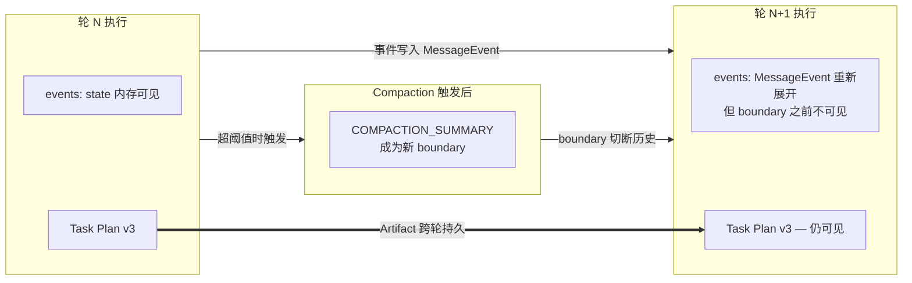
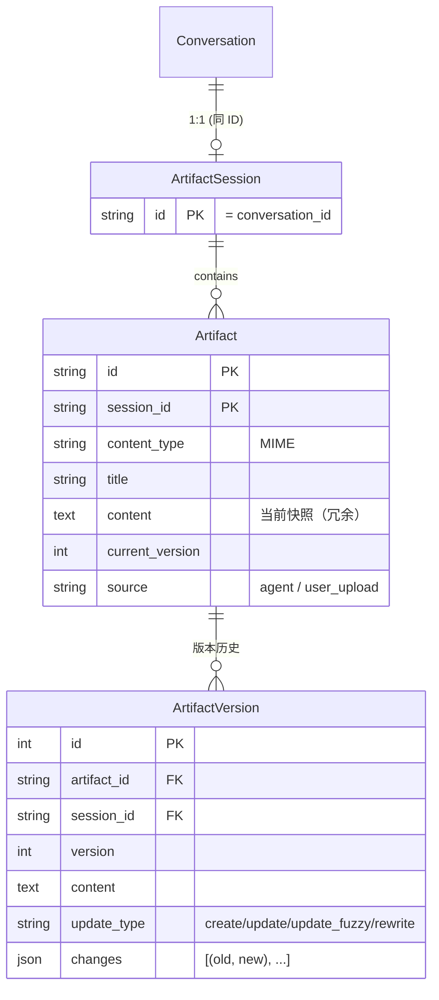
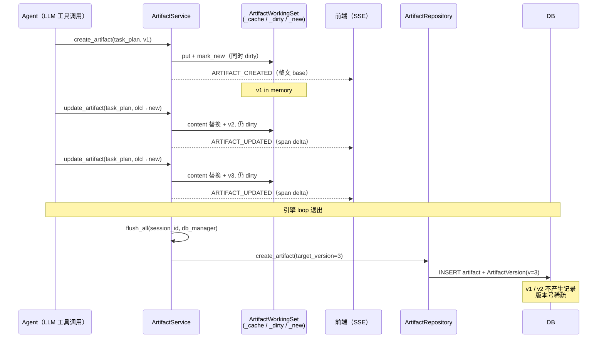
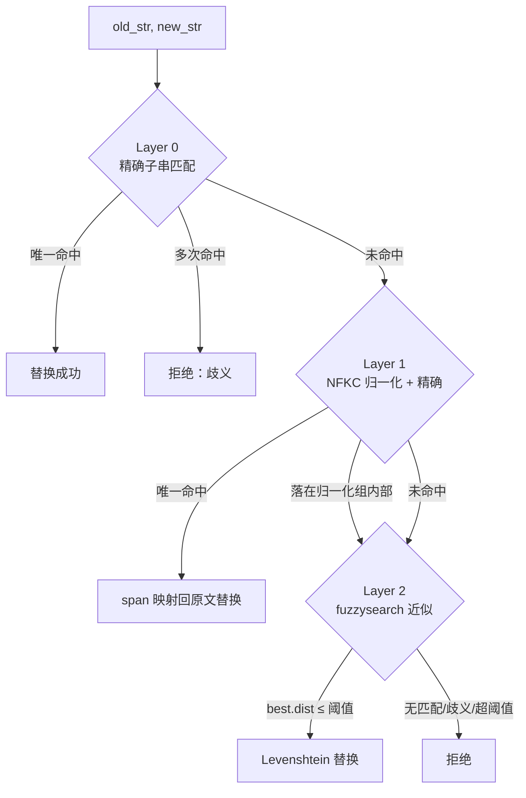

# Artifact 系统

> 双 Artifact 架构 + Write-Back Cache — Artifact 既是产物，也是模型跨轮次、跨 compaction 维持任务状态的"工作记忆"。

## 双 Artifact 架构

ArtifactFlow 采用**双 Artifact 约定**作为 lead_agent 工作流的核心协议：

| Artifact | ID 约定 | 角色 |
|---------|---------|------|
| Task Plan | `task_plan` | 任务分解、状态追踪、进度勾选 — 模型的 todo list |
| Result | 任意（如 `research_report`、`analysis.py`） | 最终产出 — 用户可见的交付物 |

"双"不是数据库上的强约束，而是 prompt 层的约定。系统通过两个机制将 `task_plan` 提升为一等公民：

1. **System Prompt 层注入**：`ContextManager` 发现 `id="task_plan"` 的 artifact 时，将其全文注入 system prompt（见 [engine.md → System Prompt 组装](engine.md#system-prompt-组装)），使模型在每次 LLM 调用时都看到最新的任务状态
2. **Role Prompt 引导**：`lead_agent.md` 的 role prompt 明确要求"先写/更新 Task Plan 再执行"

Result Artifact 则通过 Artifact Inventory 层以预览形式暴露（`INVENTORY_PREVIEW_LENGTH=200` 字符），需完整内容时由模型显式调用 `read_artifact`。

## Artifact 作为任务追踪 Checkpoint

这是 ArtifactFlow 架构中最容易被忽略但最关键的语义。

**背景：** 引擎每轮 `ContextManager.build()` 重新生成上下文。历史由 conversation path 上的 `MessageEvent` 展开、按 agent 过滤、再从右向左扫描到最近的 `COMPACTION_SUMMARY` 边界（见 [engine.md → 消息构建](engine.md#消息构建)）。这意味着：

- 当前轮的工具调用、subagent 交互在 `state["events"]` 内存中可见
- 一旦发生 compaction（超阈值触发），摘要之前的全部 `LLM_COMPLETE` / `TOOL_COMPLETE` 原文对该 agent 不可见 — 摘要本身成为"agent 对过去的全部记忆"
- Compaction 的 7-section 摘要会尽量保留 tool interactions / current work / next step，但细节保真度无可避免地下降

**后果：** 模型在长任务中缺乏"持久工作记忆"。若 Task 5 步骤中前 3 步通过 subagent 完成，一旦 compaction 触发，lead agent 在后续轮次只能读到摘要，无法精确知道"哪些已做、哪些没做、中间发现了什么"。

**Artifact 填补这个空洞：**

- Task Plan Artifact：承载"任务分解 + 进度状态"，每轮模型通过 `update_artifact` 勾选完成项（`[✗] → [✓]`），下一轮读到的 system prompt 天然携带最新状态
- Result Artifact：累积产出（研究报告、代码文件），避免重复劳动，也让模型在后续轮次可直接 `read_artifact` 回顾

**设计含义：** Artifact 不是"展示用"的副产品，而是模型自己的状态机。lead_agent 的 role prompt 强制"先写 Task Plan"就是为了创建这个 checkpoint；对于 ArtifactFlow 的长任务能力，这是架构上的 load-bearing 设计，不可省略。

## 数据模型

- **ArtifactSession** 与 Conversation 1:1 绑定（`session_id == conversation_id`），`cascade="all, delete-orphan"`：删除对话同时清理所有 artifacts
- **Artifact** 使用复合主键 `(id, session_id)`，同一 ID 可在不同 session 独立存在
- **Artifact.content** 冗余存当前快照（避免每次查版本表），`current_version` 是最新版本号
- **ArtifactVersion.version** 在同一 Artifact 内唯一，但**可以稀疏**（见下文 write-back 语义）

## Write-Back Cache 机制

这是 Artifact 系统最核心的运行时设计。

### 语义

引擎执行期间，`create_artifact` / `update_artifact` / `rewrite_artifact` **只改内存工作集（`ArtifactWorkingSet`）+ 标记 dirty**，不写数据库；同时由 `ArtifactService` 发一条 SSE-only 的 `ARTIFACT_CREATED` / `ARTIFACT_UPDATED` 事件给前端做 live 渲染（见下文 [SSE 实时推送](#sse-实时推送)）。`ArtifactService.flush_all()` 在 Controller 后处理阶段（引擎 loop 退出后、终端 SSE 事件推送前）统一持久化。

> **四层职责**（重构后，已删除 `ArtifactManager` god-object）：`ArtifactWorkingSet`（纯状态：缓存 + dirty/new，无 IO）+ `ArtifactService`（用例编排 + 发事件，**各自独占**一个 WorkingSet）+ `ArtifactRepository`（数据访问）+ 纯算法模块（`compute_update` 模糊匹配 / grep 扫描，Service 只调用）。

### 关键字段

`ArtifactWorkingSet`（每个 `ArtifactService` 独占一个）持有三个进程内数据结构：

| 字段 | 类型 | 作用 |
|------|------|------|
| `_cache` | `{session_id: {artifact_id: ArtifactMemory}}` | 内存快照，含 content/version/metadata |
| `_dirty` | `{(session_id, artifact_id): None}`（保序） | 需要 flush 的条目 |
| `_new` | `{(session_id, artifact_id): None}`（保序） | 执行期间新建（未入 DB） |

`mark_new()` 同时置 `_dirty` 与 `_new`；`mark_dirty()` 只置 `_dirty`。`flush_all` 遍历 `dirty_keys`，`_flush_one` 用 `is_new()` 决定 flush 路径：`_new` → `repo.create_artifact`，否则 → `repo.upsert_artifact_content`（均传 `target_version=memory.current_version`）。`clear_one()` 在 flush 成功后清除 dirty/new 标记但**保留缓存**，供同轮后续读取。

### Flush 弹性

`_flush_one()` 在 `db_manager` 可用时走 `with_retry()`：每次 attempt 创建独立 session，捕获 `DuplicateError / IntegrityError` 视为"前次 attempt 已提交"视作成功。这保证了终端事件之前 artifact 一定落盘，即使遇到 DB 瞬断也能恢复。`flush_all` 逐条 flush，成功即 `clear_one`；任一失败收集到 `failed` 后整体 `raise`，由后处理的 `decide_terminal` 转成 `ERROR` 终态（`flush_error` 优先级最高，见 [execution-lifecycle.md](execution-lifecycle.md)）。

### 版本号稀疏的后果

执行期间模型可能对同一 artifact 连续 update 三次（v1 → v2 → v3 in memory），flush 时 DB 只产生一条 `ArtifactVersion(version=3)` 记录。用户视角：

- `list_versions()` 返回的版本号列表可能是 `[1, 3, 7, 8]` — 中间版本是不可恢复的
- 对比历史只能在**轮次边界**之间做，同一轮内的中间态不保留
- 这是预期行为 — 同一轮的中间编辑通常是模型自我修正，无保留价值

## 执行期间的 REST API 读取

旧设计有一个进程级 `ArtifactManager._active_managers` 注册表 + `get_active()` overlay，让 REST 在执行中读到未 flush 的内存态。**该机制已删除**——它在多 worker 下静默失效：REST 请求可能打到非执行 worker，进程级注册表读不到执行 worker 的内存，overlay 形同虚设却让人以为有一致性保证。

现在 **REST artifact 读取一律是纯 DB 读**（`get_artifact_service` 每请求新建一个 `ArtifactService`，自带空 WorkingSet、无 emit）：

- turn **执行中**，REST 返回上一次 `flush_all` 的快照，**落后于 live**；turn 内的实时内容由 SSE 的 `ARTIFACT_*` 事件推给前端 reduce（见下文），不经 REST
- turn 结束（`flush_all` 落库）后，REST 即拿到权威最新态

这是有意的权衡（plan 决策 6）：读类操作绕过只会让调用者自己看到稍旧的内容，伤不到别人 → 用前端 UX 锁（流式中隐藏版本选择器 / 导出）兜，后端保持纯 DB、宽松、多 worker 安全。对比写 / 执行类（发消息 / cancel / 开分支 / delete）绕过会冲突 → 必须后端 lease（409）/ ownership（404）强制。

## Operations 语义

### create_artifact

- 幂等检查：同时查 WorkingSet 缓存和 DB，任一存在即拒绝
- 成功后 memory 入 WorkingSet（`put` + `mark_new` → 同时 dirty/new），并发 `ARTIFACT_CREATED`（整文 base）
- 返回 XML：`<artifact version="1"><id>task_plan</id> Created...</artifact>`
- 模型自建（`source="agent"`）与用户上传（`source="user_upload"`）共用此路径（`_register_new`），统一生命周期

### update_artifact（分层模糊匹配）

`ArtifactMemory.compute_update()` 采用 3 层匹配策略，依次尝试：

**Layer 1 的归一化转换链**（`_normalize_for_match()`）：

1. **1-to-1 字符翻译**：智能引号（`""` → `"`）、Unicode 破折号（`—` → `-`）、特殊空格（nbsp、ideographic space → ` `）
2. **NFKC 归一化**：全字符串，可能扩展（`Ⅳ` → `IV`）或收缩（预组合韩文 → 分解 + 重组）
3. **行尾空白剥离**：每行 rstrip
4. **CJK-Latin 边界空格折叠**：`中文 word` → `中文word`

关键难点：每个归一化后字符维护 `span_map[i] = (start, end)` 映射回**原始文本**的位置，替换时用原始位置切片，确保替换结果与原文字符完全一致。匹配起止落在"归一化组"（多字符折叠成一个）内部时拒绝，避免破坏原文。

**Layer 2 阈值**：`max_l_dist = max(5, int(len(old_str) * 0.3))`，相似度 `< 70%` 拒绝；存在多个等距最佳匹配时拒绝。

### rewrite_artifact

完全替换 content，`current_version += 1`，不做任何匹配。用于大幅改动（diff 多到 update_artifact 不划算）。

### read_artifact

- 无 version 参数 → 读当前 memory（执行轮内的 Service 持有 live WorkingSet，故含未 flush 修改；REST 路径的 Service 自带空 WS → 落到纯 DB）
- 指定 version → 走 `repo.get_version_content()` 查历史表
- 行级分页：`offset`（1-indexed，默认 1）+ 可选 `limit`，再受隐藏字符上限 `READ_ARTIFACT_MAX_CHARS`（默认 50000）兜底
- 返回 `<artifact_slice>` 包含 `shown_lines / total_lines / shown_chars / total_chars / truncated_by`；未读完时 `has_more=true` 并附续读 `hint`（透传调用者原始的 `limit` / `version`，避免续读悄悄换页大小或跳到 latest 版本）

## SSE 实时推送

turn 内 artifact 的实时内容**不走 REST，也不走 `tool_complete`**（旧的 `build_snapshot()` → `tool_complete.metadata["artifact_snapshot"]` 机制已删除）。`ArtifactService` 在 create/update/rewrite 成功后直接发一条 **SSE-only** 的 artifact 事件，前端 reduce 进 `artifactStore.liveContent`：

| 事件 | 载荷 |
|------|------|
| `ARTIFACT_CREATED` | `id`, `title`, `content_type`, `source`, `current_version` + 整文 `content`（或 `content_omitted=true`，正文超 `ARTIFACT_LIVE_CONTENT_MAX_CHARS` 时） |
| `ARTIFACT_UPDATED` | `id`, `current_version` + 二选一：整文（rewrite / 本轮首次触碰）**或** `delta={offset, deleted_len, inserted_text}`（已发过 base 后的 `update_artifact` 模糊命中 span） |

**为什么 SSE-only 不持久化**：artifact 有专属持久家（artifact 表 + 版本表），`MessageEvent` 里再存一份正文无任何读者；冷启动 / 断线重连靠 `flush_all` 后的 DB 权威态重建。

**同步 base 由后端负责**（关键不变量）：`delta` 的 offset 是相对"本轮前几次编辑之后"的内容，DB 只能当第一条 delta 的 base。Service 用 `_emitted_base` 集合跟踪"前端是否已拿到该 artifact 的整文 base"——任一 artifact 本轮的**首个** live 事件强制发整文（create / rewrite / 首次 update 皆整文），其后才发 delta。于是前端是个**纯同步 reducer**（先有 base 再 apply delta），无需在 live 路径上查 DB 取 base，事件流自包含（断线重连重放即可重建）。正文超上限省略时退化为发信号、靠 `COMPLETE` 后 DB 对齐。

REST 一致性见上文 [执行期间的 REST API 读取](#执行期间的-rest-api-读取)：所有 GET 纯 DB，turn 中落后于 live；`versions[]` / `export` 同样 DB-only，未 flush 的中间版本返回 404。前端在流式执行期间隐藏版本选择器和 export 入口规避滞后。

## Upload 并入统一生命周期

> 旧设计有一个独立的 `POST /artifacts/upload` 端点，`create_from_upload()` **绕过 write-back** 直接 commit。该端点已删除，上传并入消息提交的统一生命周期。

用户上传随 `POST /chat`（multipart `files`）一起提交：chat 路由只做 size-check + 转换（`convert_uploaded_file`，**不写库**），转换后的内容 closure-carry 进引擎。`execute_loop` 在 turn 起点经 `ArtifactService.create_from_upload()` 把每个文件 **stage 进 WorkingSet**（走 `_register_new` → 发 `ARTIFACT_CREATED`、随 turn 末 `flush_all` 落库），与 agent 自建 artifact **完全同路径**。

- 文件名中特殊字符经 `_normalize_filename_to_id()`（`re.sub(r'[^\w\-.]', '_', ...)` + 长度截断）清洗成 artifact_id base；与 WorkingSet + DB 现有 id 冲突时追加 `_N` 后缀自动去重
- 上传 artifact 的 `source="user_upload"`，在 Artifact Inventory 中与 agent 创建的条目区分展示
- staging 失败（gatekeeper 拒绝 / 异常）→ 引擎回滚已 stage 的上传（`discard_staged`）并 loud-abort 本轮（记 `error_detail`，由 `decide_terminal` 统一发 ERROR 终态）

> **历史包袱已消除**：旧的"先即时 commit 再在 submit 时重复 staging"会产生 `_N` 副本 bug——把提交退到 submit 之后、并入引擎生命周期后该 bug 自然消失。

## Design Decisions

### 为什么 Write-Back 而非即时写入

- **减少 DB 写入**：长任务中 Task Plan 可能被更新 10+ 次，直写会放大写压力
- **简化 version 语义**：稀疏版本号自然对应"轮次边界的快照"，版本回溯的粒度与用户感知一致
- **单 artifact 原子性**：每个 dirty artifact 用独立事务 + `with_retry()` 落盘，瞬断仅影响该条，不会把成功的条目也回滚
- **代价**：引擎崩溃 → 内存修改丢失（但这一轮的 user 消息也未写入 response，整体一致）

注意：write-back 的原子性**仅在单 artifact 粒度成立**。`flush_all()` 逐个 flush，先成功的条目已 commit 落盘；`failed` 列表非空时 Controller 会推 `error` 终态事件，但**不会回滚**先前成功写入的 artifact。也就是说可能出现"3 个 dirty artifact，2 个成功、1 个失败"的部分成功状态。这个设计优先 retry 粒度（避免整批因单条失败重试）而非"一整轮的 all-or-nothing"。

### 为什么版本号稀疏可接受

- 中间态通常是模型自我修正（写错 → 改对），保留无价值
- 若需严格版本历史，可改为每次 operation 直写 version 表，但 write-back 语义会被破坏
- 稀疏版本号也暗示"一轮一个 snapshot"的心智模型，对用户更直观

### 为什么 Task Plan 走 System Prompt 而非 Inventory

- Inventory 只给预览（200 字符），Task Plan 通常包含完整步骤列表，截断会丢失关键状态
- System Prompt 保证每次 LLM 调用都能看到完整 Task Plan，无需模型记忆或 `read_artifact` 重读
- 这是用"配置化双 Artifact 约定"换取"模型任务追踪能力"的核心交易点

### 为什么 Upload 并入 Write-Back（而非旁路即时 commit）

旧设计让 upload 旁路 write-back 即时 commit，理由是"上传成功就该立刻可见"。重构后反过来并入统一生命周期，因为：

- **消除 `_N` 副本 bug**：旧路径"上传时即时 commit + submit 时又 staging"会造成同一文件两份（`name` + `name_1`）。并入引擎、提交点退到 submit 之后，bug 自然消失
- **单一持久化路径**：上传与 agent 自建走同一条 `_register_new` → 发 `ARTIFACT_CREATED` → `flush_all`，无需为上传另造 commit 路径，也让"冷启动靠 DB+事件流重建"对上传同样成立（即时 commit 而不发事件会让上传在重建时隐形）
- **即时可见性由 SSE 补足**：staging 时立刻发 `ARTIFACT_CREATED`，前端 live 渲染——不靠即时 commit 也没有"上传成功但列表无此项"的时间窗
- `source="user_upload"` 仍清晰区分来源，不依赖"走不同路径"
