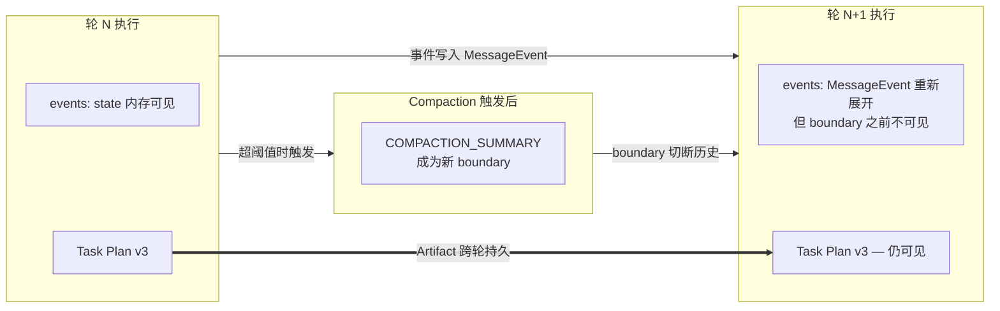
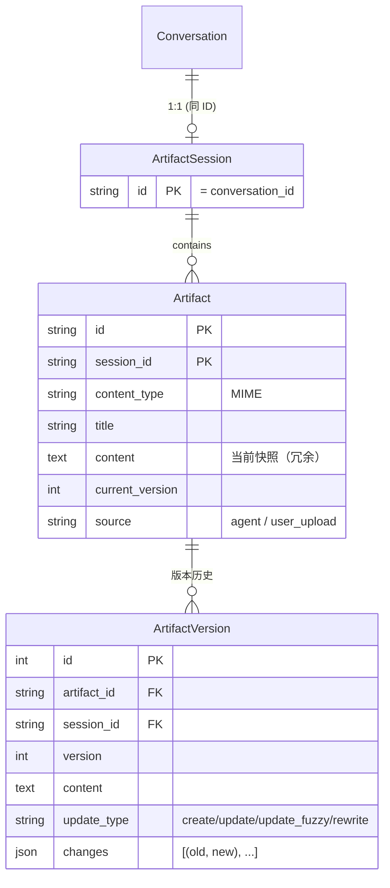
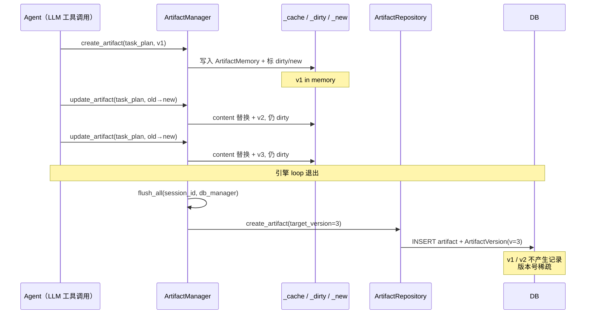
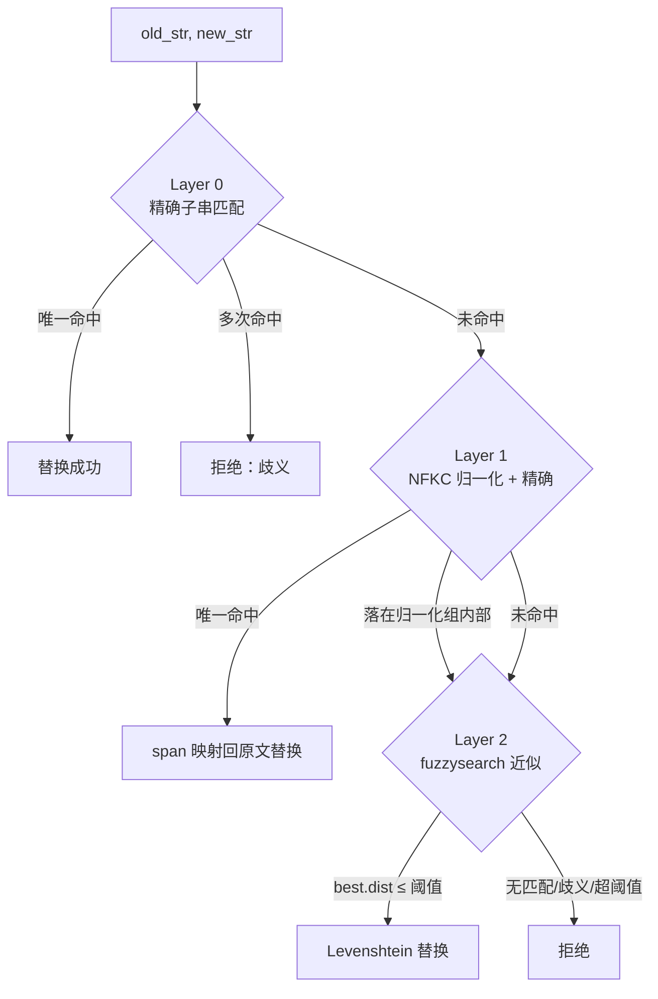

# Artifact 系统

> 双 Artifact 架构 + Write-Back Cache — Artifact 既是产物，也是模型跨轮次、跨 compaction 维持任务状态的"工作记忆"。

## 双 Artifact 架构

ArtifactFlow 采用**双 Artifact 约定**作为 lead_agent 工作流的核心协议：

| Artifact | ID 约定 | 角色 |
|---------|---------|------|
| Task Plan | `task_plan` | 任务分解、状态追踪、进度勾选 — 模型的 todo list |
| Result | 任意（如 `research_report`、`analysis.py`） | 最终产出 — 用户可见的交付物 |

"双"不是数据库上的强约束，而是 prompt 层的约定。系统通过两个机制将 `task_plan` 提升为一等公民：

1. **System Prompt 层注入**：`ContextManager` 发现 `id="task_plan"` 的 artifact 时，将其全文注入 system prompt（见 [engine.md → System Prompt 组装](engine.md#system-prompt-组装)），使模型在每次 LLM 调用时都看到最新的任务状态
2. **Role Prompt 引导**：`lead_agent.md` 的 role prompt 明确要求"先写/更新 Task Plan 再执行"

Result Artifact 则通过 Artifact Inventory 层以预览形式暴露（`INVENTORY_PREVIEW_LENGTH=200` 字符），需完整内容时由模型显式调用 `read_artifact`。

## Artifact 作为任务追踪 Checkpoint

这是 ArtifactFlow 架构中最容易被忽略但最关键的语义。

**背景：** 引擎每轮 `ContextManager.build()` 重新生成上下文。历史由 conversation path 上的 `MessageEvent` 展开、按 agent 过滤、再从右向左扫描到最近的 `COMPACTION_SUMMARY` 边界（见 [engine.md → 消息构建](engine.md#消息构建)）。这意味着：

- 当前轮的工具调用、subagent 交互在 `state["events"]` 内存中可见
- 一旦发生 compaction（超阈值触发），摘要之前的全部 `LLM_COMPLETE` / `TOOL_COMPLETE` 原文对该 agent 不可见 — 摘要本身成为"agent 对过去的全部记忆"
- Compaction 的 7-section 摘要会尽量保留 tool interactions / current work / next step，但细节保真度无可避免地下降

**后果：** 模型在长任务中缺乏"持久工作记忆"。若 Task 5 步骤中前 3 步通过 subagent 完成，一旦 compaction 触发，lead agent 在后续轮次只能读到摘要，无法精确知道"哪些已做、哪些没做、中间发现了什么"。

**Artifact 填补这个空洞：**

- Task Plan Artifact：承载"任务分解 + 进度状态"，每轮模型通过 `update_artifact` 勾选完成项（`[✗] → [✓]`），下一轮读到的 system prompt 天然携带最新状态
- Result Artifact：累积产出（研究报告、代码文件），避免重复劳动，也让模型在后续轮次可直接 `read_artifact` 回顾

**设计含义：** Artifact 不是"展示用"的副产品，而是模型自己的状态机。lead_agent 的 role prompt 强制"先写 Task Plan"就是为了创建这个 checkpoint；对于 ArtifactFlow 的长任务能力，这是架构上的 load-bearing 设计，不可省略。

## 数据模型

- **ArtifactSession** 与 Conversation 1:1 绑定（`session_id == conversation_id`），`cascade="all, delete-orphan"`：删除对话同时清理所有 artifacts
- **Artifact** 使用复合主键 `(id, session_id)`，同一 ID 可在不同 session 独立存在
- **Artifact.content** 冗余存当前快照（避免每次查版本表），`current_version` 是最新版本号
- **ArtifactVersion.version** 在同一 Artifact 内唯一，但**可以稀疏**（见下文 write-back 语义）

## Write-Back Cache 机制

这是 Artifact 系统最核心的运行时设计。

### 语义

引擎执行期间，`create_artifact` / `update_artifact` / `rewrite_artifact` **只改内存缓存 + 标记 dirty**，不写数据库。`ArtifactManager.flush_all()` 在 Controller 后处理阶段（引擎 loop 退出后、终端 SSE 事件推送前）统一持久化。

### 关键字段

`ArtifactManager` 持有三个进程内数据结构：

| 字段 | 类型 | 作用 |
|------|------|------|
| `_cache` | `{session_id: {artifact_id: ArtifactMemory}}` | 内存快照，含 content/version/metadata |
| `_dirty` | `set[(session_id, artifact_id)]` | 需要 flush 的条目 |
| `_new` | `set[(session_id, artifact_id)]` | 执行期间新建（未入 DB） |

`_new` 与 `_dirty` 的区别决定 flush 路径：`_new` → `repo.create_artifact`，否则 → `repo.upsert_artifact_content`（传 `target_version=memory.current_version`）。

### Flush 弹性

`flush_one()` 在 `db_manager` 可用时走 `with_retry()`：每次 attempt 创建独立 session，捕获 `DuplicateError / IntegrityError` 视为"前次 attempt 已提交"视作成功。这保证了终端事件之前 artifact 一定落盘，即使遇到 DB 瞬断也能恢复。

### 版本号稀疏的后果

执行期间模型可能对同一 artifact 连续 update 三次（v1 → v2 → v3 in memory），flush 时 DB 只产生一条 `ArtifactVersion(version=3)` 记录。用户视角：

- `list_versions()` 返回的版本号列表可能是 `[1, 3, 7, 8]` — 中间版本是不可恢复的
- 对比历史只能在**轮次边界**之间做，同一轮内的中间态不保留
- 这是预期行为 — 同一轮的中间编辑通常是模型自我修正，无保留价值

## 执行期间的 REST API 读取

`ArtifactManager._active_managers` 是**类级别注册表**（`Dict[session_id, ArtifactManager]`）：

- 引擎执行开始时 `manager.set_session(session_id)` → `register()`
- `flush_all()` 结束时 `unregister()`

作用：REST API（`GET /artifacts`）在引擎执行中被调用时，可通过 `ArtifactManager.get_active(session_id)` 拿到正在执行的 manager，调用 `get_cached_artifacts()` 读取未 flush 的内存内容，避免用户看到"陈旧"的 DB 状态。

## Operations 语义

### create_artifact

- 幂等检查：同时查缓存和 DB，任一存在即拒绝
- 成功后 memory 入 `_cache`，`_dirty` 和 `_new` 均置位
- 返回 XML：`<artifact version="1"><id>task_plan</id> Created...</artifact>`

### update_artifact（分层模糊匹配）

`ArtifactMemory.compute_update()` 采用 3 层匹配策略，依次尝试：

**Layer 1 的归一化转换链**（`_normalize_for_match()`）：

1. **1-to-1 字符翻译**：智能引号（`""` → `"`）、Unicode 破折号（`—` → `-`）、特殊空格（nbsp、ideographic space → ` `）
2. **NFKC 归一化**：全字符串，可能扩展（`Ⅳ` → `IV`）或收缩（预组合韩文 → 分解 + 重组）
3. **行尾空白剥离**：每行 rstrip
4. **CJK-Latin 边界空格折叠**：`中文 word` → `中文word`

关键难点：每个归一化后字符维护 `span_map[i] = (start, end)` 映射回**原始文本**的位置，替换时用原始位置切片，确保替换结果与原文字符完全一致。匹配起止落在"归一化组"（多字符折叠成一个）内部时拒绝，避免破坏原文。

**Layer 2 阈值**：`max_l_dist = max(5, int(len(old_str) * 0.3))`，相似度 `< 70%` 拒绝；存在多个等距最佳匹配时拒绝。

### rewrite_artifact

完全替换 content，`current_version += 1`，不做任何匹配。用于大幅改动（diff 多到 update_artifact 不划算）。

### read_artifact

- 无 version 参数 → 读当前 memory（可能含未 flush 修改）
- 指定 version → 走 `repo.get_version_content()` 查历史表

## SSE 实时推送

每次 artifact 操作成功后，`ArtifactManager.build_snapshot()` 构建完整快照（含 content），通过 `ToolResult.metadata["artifact_snapshot"]` 随 `tool_complete` 事件推送到前端。前端由此在执行期间实时看到 artifact 变化，无需等待执行结束后再 REST 拉取。

REST API 在执行期间的一致性**按接口分**：

| REST 接口 | 执行中行为 |
|----------|----------|
| `GET /artifacts` (列表) | ✅ `list_artifacts()` 合并 DB 和内存 dirty/new 条目 |
| `GET /artifacts/{id}` 的当前内容 | ✅ `ArtifactManager.get_active()` overlay 内存态 |
| `GET /artifacts/{id}` 返回的 `versions[]` | ❌ DB-only — 未 flush 的中间版本不可见 |
| `GET /versions/{version}` | ❌ DB-only — 未 flush 的版本返回 404 |
| `GET /export` (docx) | ❌ DB-only — 导出最后一次已 flush 的快照 |

前端通过"流式执行期间隐藏版本选择器和 export 入口"规避 DB-only 接口的滞后问题；列表和当前内容通道在执行期间与 SSE 保持一致。

## Upload 旁路

用户上传文件（`POST /artifacts/upload`）走 `create_from_upload()`，**绕过 write-back**，直接调用 `repo.create_artifact()` 立即 commit。原因：

- 上传不在 engine loop 内，没有"折叠多次编辑"的需求
- 上传用户期望是同步操作（文件传完就该可用），write-back 语义不符合
- 文件名中特殊字符经 `re.sub(r'[^\w\-.]', '_', filename)` 清洗后作为 artifact_id，冲突时追加 `_1` / `_2` 后缀自动去重

上传 artifact 的 `source="user_upload"`，在 Artifact Inventory 中与 agent 创建的条目区分展示。

## Design Decisions

### 为什么 Write-Back 而非即时写入

- **减少 DB 写入**：长任务中 Task Plan 可能被更新 10+ 次，直写会放大写压力
- **简化 version 语义**：稀疏版本号自然对应"轮次边界的快照"，版本回溯的粒度与用户感知一致
- **单 artifact 原子性**：每个 dirty artifact 用独立事务 + `with_retry()` 落盘，瞬断仅影响该条，不会把成功的条目也回滚
- **代价**：引擎崩溃 → 内存修改丢失（但这一轮的 user 消息也未写入 response，整体一致）

注意：write-back 的原子性**仅在单 artifact 粒度成立**。`flush_all()` 逐个 flush，先成功的条目已 commit 落盘；`failed` 列表非空时 Controller 会推 `error` 终态事件，但**不会回滚**先前成功写入的 artifact。也就是说可能出现"3 个 dirty artifact，2 个成功、1 个失败"的部分成功状态。这个设计优先 retry 粒度（避免整批因单条失败重试）而非"一整轮的 all-or-nothing"。

### 为什么版本号稀疏可接受

- 中间态通常是模型自我修正（写错 → 改对），保留无价值
- 若需严格版本历史，可改为每次 operation 直写 version 表，但 write-back 语义会被破坏
- 稀疏版本号也暗示"一轮一个 snapshot"的心智模型，对用户更直观

### 为什么 Task Plan 走 System Prompt 而非 Inventory

- Inventory 只给预览（200 字符），Task Plan 通常包含完整步骤列表，截断会丢失关键状态
- System Prompt 保证每次 LLM 调用都能看到完整 Task Plan，无需模型记忆或 `read_artifact` 重读
- 这是用"配置化双 Artifact 约定"换取"模型任务追踪能力"的核心交易点

### 为什么 Upload 要旁路 Write-Back

- Upload 不在 engine 事务边界内，若延迟 flush 则用户看到"上传成功但列表无此项"的时间窗
- Upload 是幂等的用户操作，即时 commit 更符合心智模型
- 与 agent 创建的 artifact 走不同路径也让 `source` 字段语义清晰
