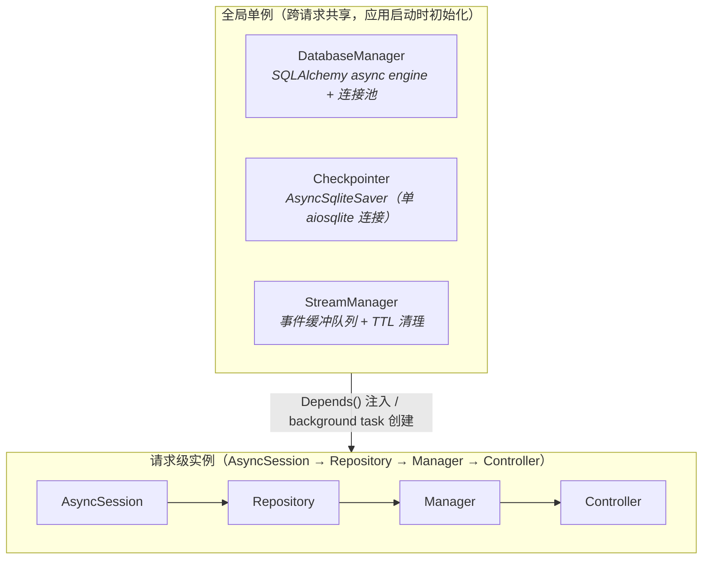
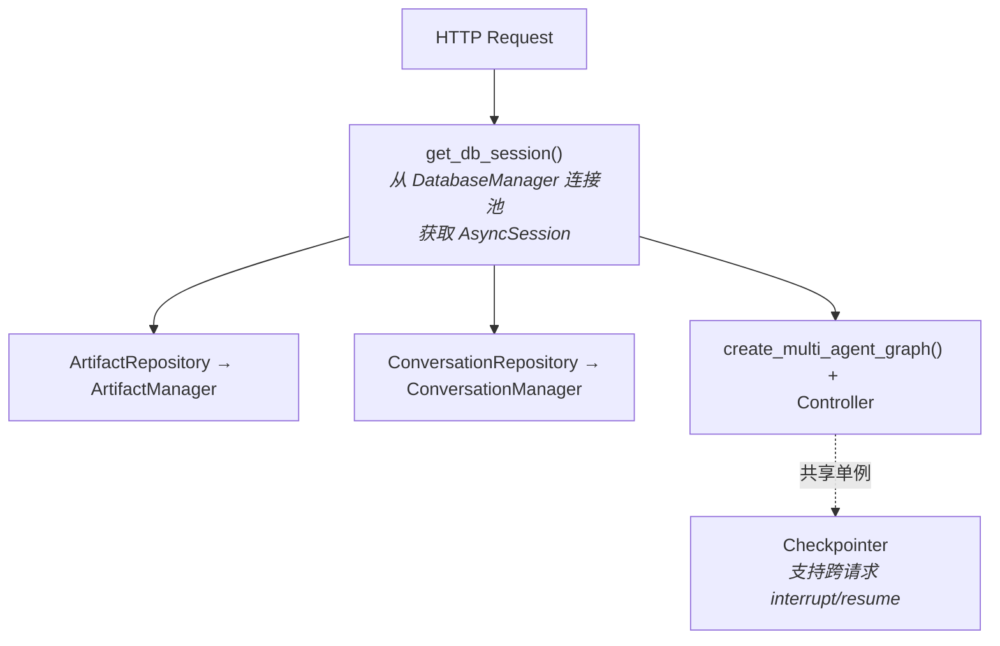
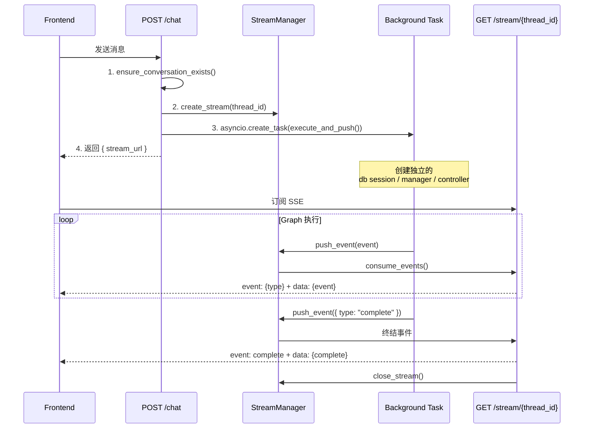
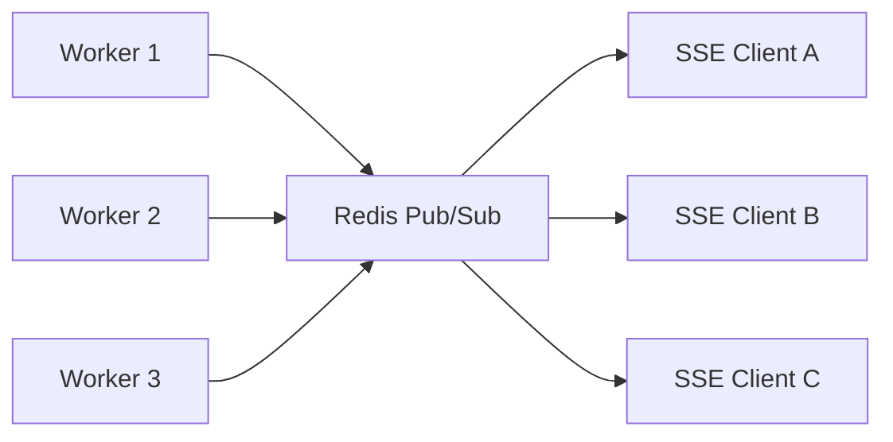

# Concurrency Architecture

本文档描述 ArtifactFlow 的并发模型：当前设计、已知局限、以及面向生产环境的演进路线。

## 当前设计

### 资源分层模型



> **Note**: HTTP 请求（POST /chat）只做轻量同步操作（`ensure_conversation` + `create_stream`），然后立即返回。Graph 执行由 background task（`asyncio.create_task`）独立管理，task 内部创建自己的 session / manager / controller 实例（因为 HTTP 请求的依赖在返回后即释放）。

### 依赖注入链路



并发安全保证：
- **DatabaseManager**: 全局单例，内部维护 SQLAlchemy 连接池，天然支持并发
- **Checkpointer**: 全局单例，所有 graph 执行共享同一个 checkpoint 存储
- **StreamManager**: 全局单例，使用 `asyncio.Lock` 保护 stream 创建/关闭操作
- **AsyncSession**: 请求独立，每个请求（或 background task）创建新的数据库会话

### POST /chat 执行流程

> 此图侧重并发与生命周期视角，完整的端到端流程见 [Request Lifecycle — 整体流程](../request-lifecycle.md#整体流程)。



关键设计决策：
- Background task 创建**独立的**依赖实例，不复用 HTTP 请求的 session（避免请求结束后 session 失效）
- StreamManager 作为中间缓冲层，解耦 POST（生产事件）和 GET（消费事件）的时序
- TTL 机制防止前端不连接时队列无限增长
- **Graph 执行独立于 SSE 连接**：前端断开 SSE 后，graph 仍继续运行到完成，结果持久化到数据库，用户刷新页面后可查看

### 数据库并发配置

当前使用 SQLite + WAL 模式：

```python
PRAGMA journal_mode=WAL       # 读写可并发
PRAGMA synchronous=NORMAL     # 平衡性能和安全
PRAGMA busy_timeout=15000     # 写锁等待 15 秒
PRAGMA foreign_keys=ON
PRAGMA cache_size=-64000      # 64MB 缓存
```

WAL 模式允许多个读操作并发执行，但**写操作仍然是串行的**（单写者模型）。

---

## 运行边界与已知局限

### Checkpointer 单连接瓶颈

`AsyncSqliteSaver` 使用单个 `aiosqlite.connect()` 连接，作为全局单例被所有并发请求共享。`aiosqlite` 内部只有一个后台线程 + 队列，所有操作串行执行。LangGraph 每个 node 执行完都要写 checkpoint，N 个并发用户 = 所有 checkpoint 读写排队，高并发时成为全局延迟瓶颈。

**缓解**: 演进路线 Phase 2 迁移到 `langgraph-checkpoint-redis`。

### Graph 重复编译

每个请求都会执行：创建 3 个 Agent → 创建所有 Tool → 注册到 Registry → 编译 StateGraph。Graph 结构本身是无状态的（状态存在 checkpointer 里），理论上可编译一次后复用。当前设计是因为 `artifact_manager` 通过闭包绑定到 graph 节点中，导致 graph 与请求级实例耦合。

**缓解**: 演进路线 Phase 3 — 通过 state 传递 `artifact_manager` 而非闭包捕获，实现 graph 编译缓存。

### 错误信息泄露（已部分缓解）

`_sanitize_error_event()`（`api/routers/chat.py`）在非 DEBUG 模式下将 error 事件的详情替换为 `"Internal server error"`，开发模式保留原始 `str(e)` 便于调试。当前脱敏仅覆盖 SSE error 事件，HTTP 异常（如 500）的响应体尚未统一处理。

### 已解决的问题

以下问题已在历次迭代中修复，详细修复记录见 [optimization-plan.md](../_archive/optimization-plan.md)：

- **Background Task 生命周期管理** — `TaskManager` 持有任务引用防 GC、Semaphore 限制并发数、graceful shutdown
- **SQLite 写并发** — 短事务模式，Repository 层立即 `flush() + commit()`
- **请求级日志上下文** — `contextvars` + `RequestContextFilter` 实现 `[conv_id|thread_id]` 日志追踪
- **StreamManager 内存泄漏** — 延迟清理任务，关闭后 5 秒自动移除
- **请求级超时** — `asyncio.timeout(config.STREAM_TIMEOUT)`
- **SSE Heartbeat** — `SSE_PING_INTERVAL` 秒发送 `: ping` 注释
- **认证鉴权** — JWT 认证框架 + 数据隔离

---

## 演进方向

### Phase 1: Redis 引入 — 支持多 Worker 部署

**目标**: 将进程内状态迁移到 Redis，支持多 worker 实例。

| 组件 | 当前 | 迁移到 |
|------|------|--------|
| ConversationManager._cache | Python dict | Redis Hash |
| StreamManager 事件队列 | asyncio.Queue | Redis Pub/Sub (或 Redis Streams) |

迁移后的架构：



注意事项：
- Redis Pub/Sub 是"发后即忘"的，如果消费者不在线则消息丢失。如果需要可靠投递，考虑 Redis Streams（支持消费者组 + ACK）
- ConversationManager cache 迁移后，需要处理 cache invalidation 策略

### Phase 2: Checkpointer 迁移 + TTL 管理

**目标**: 解决 checkpoint 单连接瓶颈。

| 组件 | 当前 | 迁移到 |
|------|------|--------|
| LangGraph Checkpointer | AsyncSqliteSaver（单 aiosqlite 连接） | langgraph-checkpoint-redis |

Redis 作为 checkpointer 的优势：
- 天然支持并发读写（无写锁竞争）
- 内置 TTL，checkpoint 数据自动过期清理
- 读写延迟远低于 SQLite

```python
# 迁移示例
from langgraph.checkpoint.redis.aio import AsyncRedisSaver

async def create_redis_checkpointer(redis_url: str):
    checkpointer = AsyncRedisSaver.from_conn_string(redis_url)
    await checkpointer.setup()
    return checkpointer
```

### Phase 2.5: 主数据库迁移（按需）

**触发条件**: 当短事务模式仍无法满足并发需求时（例如极高写入频率）。当前 SQLite + 短事务模式可满足中等并发场景。

**方案** — 迁移到 PostgreSQL：
- 彻底解决写并发问题（MVCC 支持真正的多写者）
- SQLAlchemy 切换只需改 `DATABASE_URL` 和 driver

### Phase 3: 生产化完善

- API Rate Limiting（per-user 限流）
- 分布式锁（防止同一 conversation 的并发写入冲突）
- 错误信息脱敏补全（SSE 已脱敏，HTTP 500 响应体待统一）
- Metrics 采集（Prometheus / OpenTelemetry，基于已有的 `contextvars` 请求上下文扩展 trace/span）
- Graph 编译缓存（编译一次，通过 state 传递 `artifact_manager` 而非闭包捕获）

---

## 参考

- [Python asyncio.create_task — 关于任务引用的警告](https://docs.python.org/3/library/asyncio-task.html#creating-tasks)
- [langgraph-checkpoint-redis](https://langchain-ai.github.io/langgraph/reference/checkpoints/#langgraph.checkpoint.redis)
- [SQLite WAL Mode](https://www.sqlite.org/wal.html)
- [FastAPI Lifespan Events](https://fastapi.tiangolo.com/advanced/events/)
