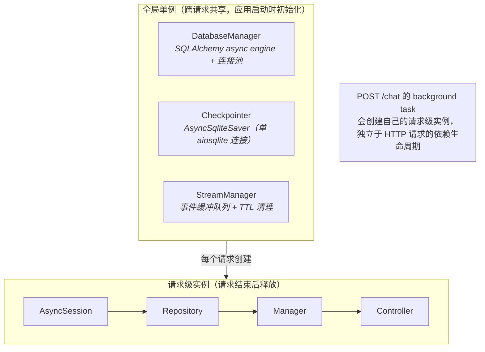
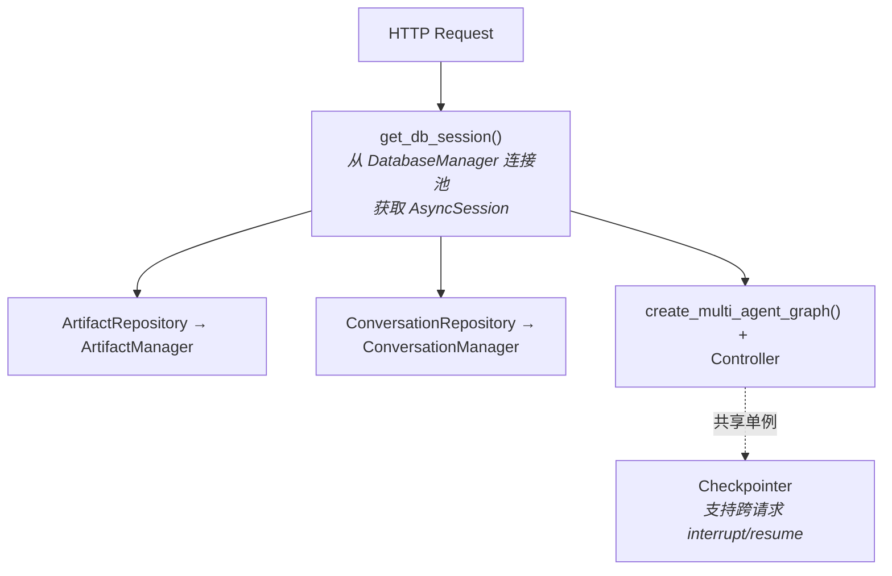
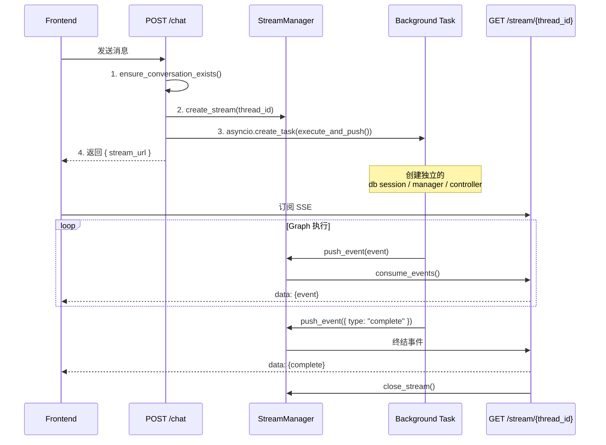
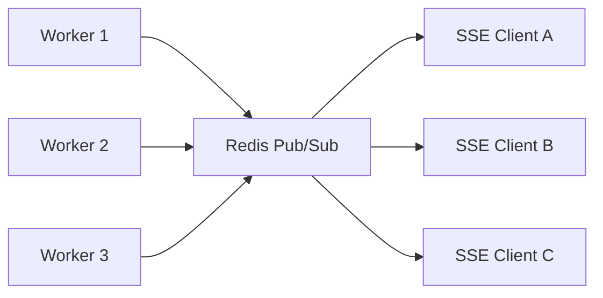

# Concurrency Architecture

本文档描述 ArtifactFlow 的并发模型：当前设计、已知局限、以及面向生产环境的演进路线。

## 当前设计

### 资源分层模型



### 依赖注入链路



并发安全保证：
- **DatabaseManager**: 全局单例，内部维护 SQLAlchemy 连接池，天然支持并发
- **Checkpointer**: 全局单例，所有 graph 执行共享同一个 checkpoint 存储
- **StreamManager**: 全局单例，使用 `asyncio.Lock` 保护 stream 创建/关闭操作
- **AsyncSession**: 请求独立，每个请求（或 background task）创建新的数据库会话

### POST /chat 执行流程

> 此图侧重并发与生命周期视角，完整的端到端流程见 [Request Lifecycle — 整体流程](../request-lifecycle.md#整体流程)。



关键设计决策：
- Background task 创建**独立的**依赖实例，不复用 HTTP 请求的 session（避免请求结束后 session 失效）
- StreamManager 作为中间缓冲层，解耦 POST（生产事件）和 GET（消费事件）的时序
- TTL 机制防止前端不连接时队列无限增长

### 数据库并发配置

当前使用 SQLite + WAL 模式：

```python
PRAGMA journal_mode=WAL       # 读写可并发
PRAGMA synchronous=NORMAL     # 平衡性能和安全
PRAGMA busy_timeout=5000      # 写锁等待 5 秒
PRAGMA foreign_keys=ON
PRAGMA cache_size=-64000      # 64MB 缓存
```

WAL 模式允许多个读操作并发执行，但**写操作仍然是串行的**（单写者模型）。

---

## 已知局限

### P0: 严重 — 多用户并发时会出问题

#### 1. Checkpointer 单连接瓶颈

`AsyncSqliteSaver` 使用单个 `aiosqlite.connect()` 连接，作为全局单例被所有并发请求共享：

> `core/graph.py:701` — 单连接创建
> ```python
> conn = await aiosqlite.connect(db_path)
> ```
>
> `api/dependencies.py:74` — 作为全局单例初始化
> ```python
> _checkpointer = await create_async_sqlite_checkpointer(config.LANGGRAPH_DB_PATH)
> ```

- `aiosqlite` 内部只有一个后台线程 + 队列，所有操作串行执行
- LangGraph 每个 node 执行完都要写 checkpoint
- N 个并发用户 = N 个 graph 同时跑 = 所有 checkpoint 读写排队
- 并发量上去后会成为全局延迟瓶颈

#### 2. Background Task 无生命周期管理

> `api/routers/chat.py:193` — send_message 中 fire-and-forget
> ```python
> asyncio.create_task(execute_and_push())
> ```
>
> `api/routers/chat.py:401` — resume_execution 中同样的问题
> ```python
> asyncio.create_task(execute_resume())
> ```

- 任务没有被持有引用，可能被 GC 回收（[Python 文档明确警告](https://docs.python.org/3/library/asyncio-task.html#creating-tasks)）
- 没有并发数量限制 — N 个用户同时发消息 = N 个并发 LLM 调用
- 服务器 shutdown 时运行中任务被直接 cancel，数据库可能处于不一致状态

#### 3. SQLite 主数据库写并发限制

Background task 中的 session 生命周期覆盖整个 graph 执行期间（可能持续数分钟），期间的写操作会触发 SQLite 写锁竞争：

> `api/routers/chat.py:152` — session 从 graph 开始持有到结束
> ```python
> async with db_manager.session() as session:
>     # ... 创建 controller，执行整个 graph（可能几分钟）...
> ```
>
> `db/database.py:155` — busy_timeout 只能缓解，不能根治
> ```python
> await conn.execute(text("PRAGMA busy_timeout=5000"))
> ```

即使配了 `busy_timeout=5000`：
- 多个并发写操作排队等锁，最多等 5 秒
- 超过 5 秒抛出 `database is locked` 错误
- 长事务加剧锁持有时间

### P1: 重要 — 会导致资源泄漏

#### 4. StreamManager 内存泄漏

关闭的 stream 不会从 `streams` 字典中移除，`_closed_streams` set 也只增不减：

> `api/services/stream_manager.py:110` — streams dict 只增不减
> ```python
> self.streams: Dict[str, StreamContext] = {}
> ```
>
> `api/services/stream_manager.py:114` — closed 记录集合只增不减
> ```python
> self._closed_streams: set = set()
> ```
>
> `api/services/stream_manager.py:265` — 注释说"延迟清理"但没有实际清理逻辑
> ```python
> # 注意：不立即从字典中移除，保留引用以便 push_event 能检测到 closed 状态
> # 延迟清理会在下一次 create_stream 或 TTL 时处理
> ```

长时间运行后内存会持续增长。

#### 5. Graph 重复编译

每个请求都会执行：创建 3 个 Agent → 创建所有 Tool → 注册到 Registry → 编译 StateGraph：

> `api/dependencies.py:212` — 每个请求都重新创建 graph
> ```python
> compiled_graph = await create_multi_agent_graph(
>     artifact_manager=artifact_manager,
>     checkpointer=get_checkpointer()
> )
> ```

Graph 结构本身是无状态的（状态存在 checkpointer 里），理论上可以编译一次后复用。当前设计是因为 `artifact_manager` 通过闭包绑定到 graph 节点中，导致 graph 与请求级实例耦合。

### P2: 可接受 — 生产环境应解决

#### 6. 没有请求级超时

> `api/config.py:31` — 定义了但未使用
> ```python
> STREAM_TIMEOUT: int = 300    # 秒，最大执行时间
> ```

Graph 执行可能因 LLM 调用卡住而永远不返回。`chat.py` 中的 `execute_and_push()` 和 `execute_resume()` 均没有 timeout 保护。

#### 7. 错误信息泄露

Background task 的异常直接通过 `str(e)` 推送给前端，可能包含内部文件路径、数据库信息等：

> `api/routers/chat.py:189`
> ```python
> "data": {"success": False, "error": str(e)}
> ```
>
> `api/routers/chat.py:398` — resume 路径同样的问题
> ```python
> "data": {"success": False, "error": str(e)}
> ```

#### 8. SSE 无 Heartbeat

> `api/routers/stream.py:93-101` — 没有 heartbeat 机制
> ```python
> return StreamingResponse(
>     event_generator(),
>     media_type="text/event-stream",
>     ...
> )
> ```

LLM 调用可能耗时 30 秒以上，期间 SSE 连接无数据传输，可能被中间的 proxy/load balancer 超时断开。需要定期发送 `:ping\n\n` 注释保持连接。

#### 9. 无认证鉴权

> `api/dependencies.py:227` — 预留了但未实现
> ```python
> async def get_current_user() -> Optional[str]:
>     return None
> ```

任何人可以读写任何 conversation。

---

## 演进路线

### Phase 0: 应用层加固（当前单进程部署即可受益）

**目标**: 不引入新依赖，修复当前架构中最危险的问题。

#### Task Manager — 管理 background task 生命周期

```python
class TaskManager:
    """
    管理 graph 执行的后台任务

    职责：
    - 持有任务引用，防止 GC
    - Semaphore 限制并发数
    - Graceful shutdown 支持
    """

    def __init__(self, max_concurrent: int = 10):
        self._tasks: dict[str, asyncio.Task] = {}
        self._semaphore = asyncio.Semaphore(max_concurrent)

    async def submit(self, task_id: str, coro) -> asyncio.Task:
        async def _wrapped():
            async with self._semaphore:
                try:
                    await coro
                finally:
                    self._tasks.pop(task_id, None)
        task = asyncio.create_task(_wrapped())
        self._tasks[task_id] = task
        return task

    async def shutdown(self, timeout: float = 30):
        """等待所有运行中任务完成或超时后 cancel"""
        if self._tasks:
            _, pending = await asyncio.wait(
                self._tasks.values(), timeout=timeout
            )
            for task in pending:
                task.cancel()
```

集成方式：
- 作为全局单例在 `init_globals()` 中初始化
- `chat.py` 中 `asyncio.create_task()` 改为 `task_manager.submit(thread_id, ...)`
- `close_globals()` 中调用 `task_manager.shutdown()`

#### 其他加固项

- 给 graph 执行加 `asyncio.timeout(config.STREAM_TIMEOUT)` 保护
- StreamManager 关闭 stream 时从字典中移除（延迟几秒后清理）
- SSE 加 heartbeat（每 15 秒发送 `:ping\n\n`）

### Phase 1: Redis 引入 — 支持多 Worker 部署

**目标**: 将进程内状态迁移到 Redis，支持多 worker 实例。

| 组件 | 当前 | 迁移到 |
|------|------|--------|
| ConversationManager._cache | Python dict | Redis Hash |
| StreamManager 事件队列 | asyncio.Queue | Redis Pub/Sub (或 Redis Streams) |

迁移后的架构：



注意事项：
- Redis Pub/Sub 是"发后即忘"的，如果消费者不在线则消息丢失。如果需要可靠投递，考虑 Redis Streams（支持消费者组 + ACK）
- ConversationManager cache 迁移后，需要处理 cache invalidation 策略

### Phase 2: Checkpointer 迁移 + TTL 管理

**目标**: 解决 checkpoint 单连接瓶颈。

| 组件 | 当前 | 迁移到 |
|------|------|--------|
| LangGraph Checkpointer | AsyncSqliteSaver（单 aiosqlite 连接） | langgraph-checkpoint-redis |

Redis 作为 checkpointer 的优势：
- 天然支持并发读写（无写锁竞争）
- 内置 TTL，checkpoint 数据自动过期清理
- 读写延迟远低于 SQLite

```python
# 迁移示例
from langgraph.checkpoint.redis.aio import AsyncRedisSaver

async def create_redis_checkpointer(redis_url: str):
    checkpointer = AsyncRedisSaver.from_conn_string(redis_url)
    await checkpointer.setup()
    return checkpointer
```

### Phase 2.5: 主数据库迁移（按需）

**触发条件**: 当并发写入导致 `database is locked` 错误频繁出现时。

**方案 A** — 迁移到 PostgreSQL：
- 彻底解决写并发问题
- SQLAlchemy 切换只需改 `DATABASE_URL` 和 driver

**方案 B** — 短事务重构（继续使用 SQLite）：
- 将 background task 中的长事务拆分为多个短事务
- 每次数据库写操作单独开 session，而不是一个 session 贯穿整个 graph 执行
- 适合用户量不大但需要改善稳定性的场景

### Phase 3: 生产化完善

- API Rate Limiting（per-user 限流）
- 认证鉴权（JWT / OAuth）
- 分布式锁（防止同一 conversation 的并发写入冲突）
- 错误信息脱敏（生产环境不暴露内部异常）
- Structured Logging + Metrics（可观测性）
- Graph 编译缓存（编译一次，通过 state 传递 `artifact_manager` 而非闭包捕获）

---

## 参考

- [Python asyncio.create_task — 关于任务引用的警告](https://docs.python.org/3/library/asyncio-task.html#creating-tasks)
- [langgraph-checkpoint-redis](https://langchain-ai.github.io/langgraph/reference/checkpoints/#langgraph.checkpoint.redis)
- [SQLite WAL Mode](https://www.sqlite.org/wal.html)
- [FastAPI Lifespan Events](https://fastapi.tiangolo.com/advanced/events/)
