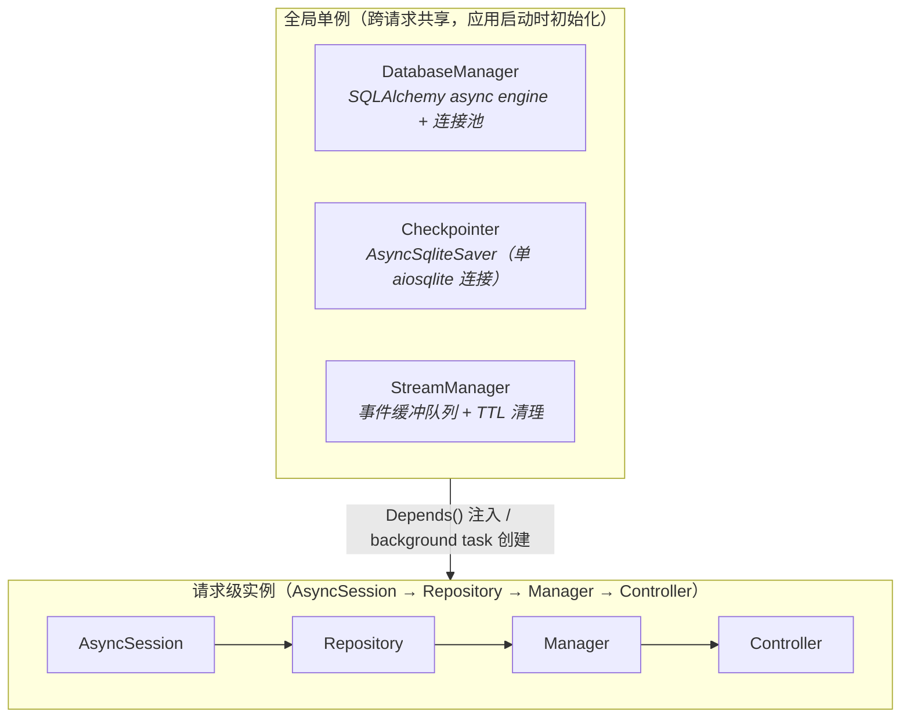
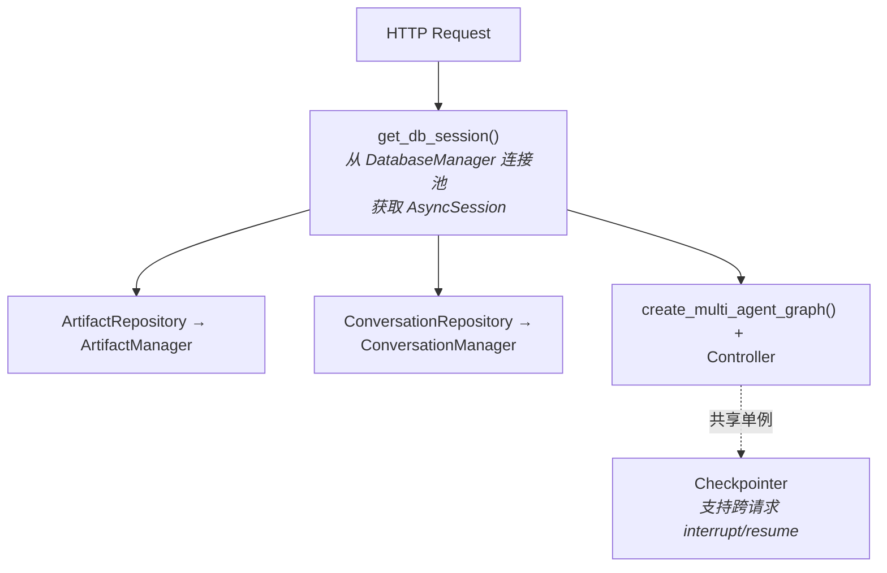
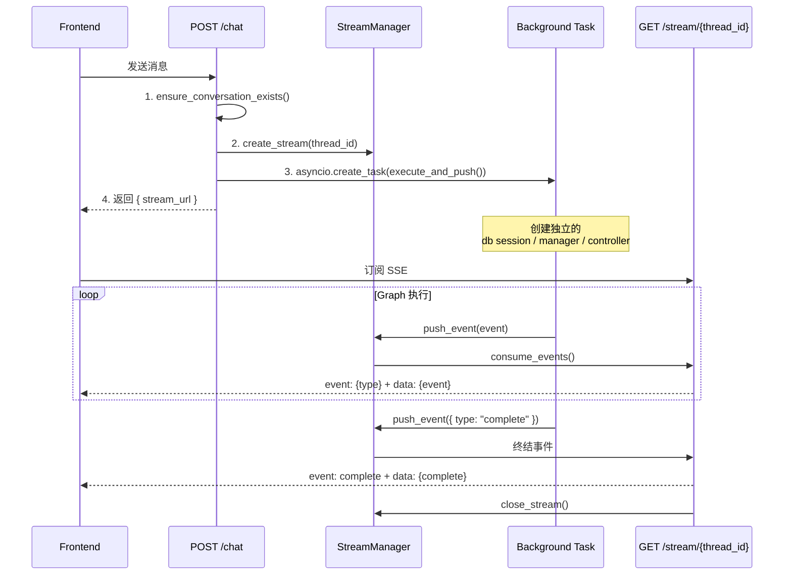
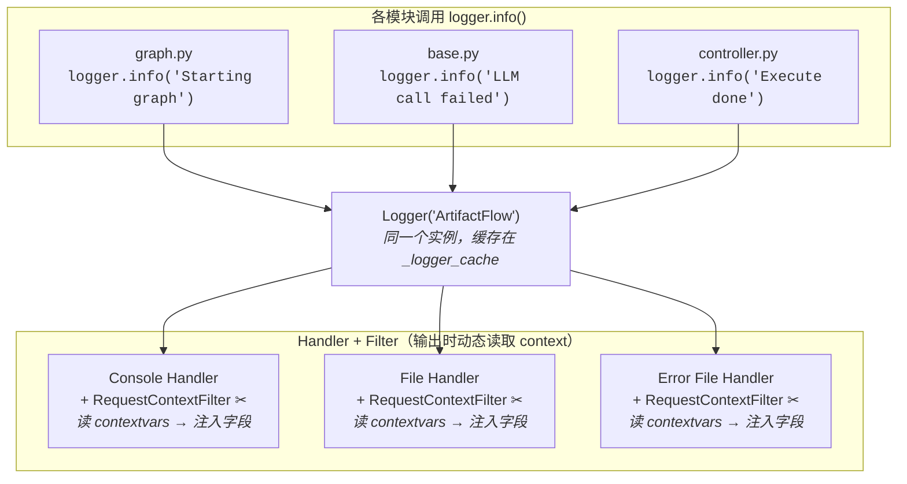
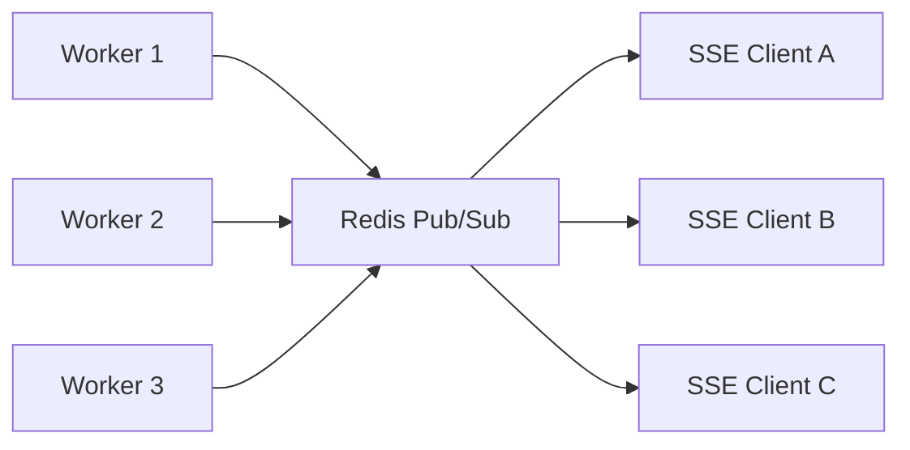

# Concurrency Architecture

本文档描述 ArtifactFlow 的并发模型：当前设计、已知局限、以及面向生产环境的演进路线。

## 当前设计

### 资源分层模型



> **Note**: HTTP 请求（POST /chat）只做轻量同步操作（`ensure_conversation` + `create_stream`），然后立即返回。Graph 执行由 background task（`asyncio.create_task`）独立管理，task 内部创建自己的 session / manager / controller 实例（因为 HTTP 请求的依赖在返回后即释放）。

### 依赖注入链路



并发安全保证：
- **DatabaseManager**: 全局单例，内部维护 SQLAlchemy 连接池，天然支持并发
- **Checkpointer**: 全局单例，所有 graph 执行共享同一个 checkpoint 存储
- **StreamManager**: 全局单例，使用 `asyncio.Lock` 保护 stream 创建/关闭操作
- **AsyncSession**: 请求独立，每个请求（或 background task）创建新的数据库会话

### POST /chat 执行流程

> 此图侧重并发与生命周期视角，完整的端到端流程见 [Request Lifecycle — 整体流程](../request-lifecycle.md#整体流程)。



关键设计决策：
- Background task 创建**独立的**依赖实例，不复用 HTTP 请求的 session（避免请求结束后 session 失效）
- StreamManager 作为中间缓冲层，解耦 POST（生产事件）和 GET（消费事件）的时序
- TTL 机制防止前端不连接时队列无限增长
- **Graph 执行独立于 SSE 连接**：前端断开 SSE 后，graph 仍继续运行到完成，结果持久化到数据库，用户刷新页面后可查看

### 数据库并发配置

当前使用 SQLite + WAL 模式：

```python
PRAGMA journal_mode=WAL       # 读写可并发
PRAGMA synchronous=NORMAL     # 平衡性能和安全
PRAGMA busy_timeout=15000     # 写锁等待 15 秒
PRAGMA foreign_keys=ON
PRAGMA cache_size=-64000      # 64MB 缓存
```

WAL 模式允许多个读操作并发执行，但**写操作仍然是串行的**（单写者模型）。

---

## 已知局限

### P0: 严重 — 多用户并发时会出问题

#### 1. Checkpointer 单连接瓶颈

`AsyncSqliteSaver` 使用单个 `aiosqlite.connect()` 连接，作为全局单例被所有并发请求共享：

> `core/graph.py:701` — 单连接创建
> ```python
> conn = await aiosqlite.connect(db_path)
> ```
>
> `api/dependencies.py:74` — 作为全局单例初始化
> ```python
> _checkpointer = await create_async_sqlite_checkpointer(config.LANGGRAPH_DB_PATH)
> ```

- `aiosqlite` 内部只有一个后台线程 + 队列，所有操作串行执行
- LangGraph 每个 node 执行完都要写 checkpoint
- N 个并发用户 = N 个 graph 同时跑 = 所有 checkpoint 读写排队
- 并发量上去后会成为全局延迟瓶颈

#### 2. ~~Background Task 无生命周期管理~~ ✅ 已修复

> **修复方案**: `TaskManager`（`api/services/task_manager.py`）— 持有任务引用防 GC、Semaphore 限制并发数（`MAX_CONCURRENT_TASKS`）、graceful shutdown 支持。`chat.py` 中 `asyncio.create_task()` 已替换为 `task_manager.submit()`。

#### 3. ~~SQLite 主数据库写并发限制~~ ✅ 已修复

> **修复方案**: 短事务模式 — 每次数据库写操作在 Repository 层立即 `flush() + commit()`，将写锁持有时间从"整个 graph 执行期间（数分钟）"缩短到"单次写操作（微秒级）"。`DatabaseManager.session()` 简化为纯生命周期管理（只负责 create + close），不再自动 commit/rollback，事务控制权完全交给 Repository 层。配合 `busy_timeout=15000` 和 `expire_on_commit=False`（允许中间 commit 后对象仍可用），并发写入不再触发 `database is locked` 错误。

### P1: 重要 — 影响并发调试和运行可靠性

#### 4. ~~日志无请求上下文（可观测性缺失）~~ ✅ 已修复

> **修复方案**: 使用 `contextvars` 实现请求级日志上下文。`utils/logger.py` 新增 `RequestContextFilter`，从 `ContextVar` 读取 `thread_id` / `conv_id` 自动注入到每条日志。请求入口（`chat.py` 的 `send_message` / `resume_execution`）调用 `set_request_context()` 设置上下文，background task 通过 `asyncio.create_task` 自动继承。日志格式更新为 `[conv_id|thread_id]`，无上下文时显示 `[no-ctx|no-ctx]`。详见 [Phase 0.5](#phase-05-可观测性基础--多用户日志追踪-✅-已完成)。

### P2: 可接受 — 资源泄漏风险

#### 6. ~~StreamManager 内存泄漏~~ ✅ 已修复

> **修复方案**: `_close_stream_internal()` 关闭后启动延迟清理任务（5 秒后从 `streams` 字典和 `_closed_streams` 中移除）。`push_event` 在关闭后短时间内仍能检测到 closed 状态，但不会无限积累。

#### 7. Graph 重复编译

每个请求都会执行：创建 3 个 Agent → 创建所有 Tool → 注册到 Registry → 编译 StateGraph：

> `api/dependencies.py:212` — 每个请求都重新创建 graph
> ```python
> compiled_graph = await create_multi_agent_graph(
>     artifact_manager=artifact_manager,
>     checkpointer=get_checkpointer()
> )
> ```

Graph 结构本身是无状态的（状态存在 checkpointer 里），理论上可以编译一次后复用。当前设计是因为 `artifact_manager` 通过闭包绑定到 graph 节点中，导致 graph 与请求级实例耦合。

### P3: 可接受 — 生产环境应解决

#### 8. ~~没有请求级超时~~ ✅ 已修复

> **修复方案**: `chat.py` 中 `execute_and_push()` 和 `execute_resume()` 的 `async for` 循环外层包裹 `async with asyncio.timeout(config.STREAM_TIMEOUT)`，超时后推送 error 事件到 stream。

#### 9. 错误信息泄露

Background task 的异常直接通过 `str(e)` 推送给前端，可能包含内部文件路径、数据库信息等：

> `api/routers/chat.py:189`
> ```python
> "data": {"success": False, "error": str(e)}
> ```
>
> `api/routers/chat.py:398` — resume 路径同样的问题
> ```python
> "data": {"success": False, "error": str(e)}
> ```

#### 10. ~~SSE 无 Heartbeat~~ ✅ 已修复

> **修复方案**: `StreamManager.consume_events()` 新增 `heartbeat_interval` 参数，使用 `asyncio.wait_for` 包装 `queue.get()`，超时时 yield `{"type": "__ping__"}` 哨兵事件。`stream.py` 检测到 `__ping__` 时输出 `: ping\n\n` SSE 注释。间隔由 `config.SSE_PING_INTERVAL`（默认 15 秒）控制。

#### 11. 无认证鉴权

> `api/dependencies.py:227` — 预留了但未实现
> ```python
> async def get_current_user() -> Optional[str]:
>     return None
> ```

任何人可以读写任何 conversation。

---

## 演进路线

### Phase 0: 应用层加固 ✅ 已完成

**目标**: 不引入新依赖，修复当前架构中最危险的问题。

已实现：
- **TaskManager**（`api/services/task_manager.py`）：持有任务引用防 GC、Semaphore 限制并发数、graceful shutdown
- **执行超时**：`asyncio.timeout(config.STREAM_TIMEOUT)` 保护 graph 执行
- **StreamManager 延迟清理**：关闭后 5 秒自动从字典移除，防止内存泄漏
- **StreamManager cleanup_task 引用**：`_delayed_cleanup` 的 `asyncio.create_task` 引用保存到 `StreamContext.cleanup_task`，防止 GC 回收
- **SSE Heartbeat**：每 `SSE_PING_INTERVAL` 秒发送 `: ping\n\n` 注释保持连接

### Phase 0.5: 可观测性基础 — 多用户日志追踪 ✅ 已完成

**目标**: 让并发请求的日志可追踪、可区分，为后续所有并发改进提供调试基础。

**核心方案**: 使用 `contextvars` 实现请求级日志上下文。`contextvars` 天然支持 asyncio —— 每个 `asyncio.Task` 自动继承创建时的 context 副本，background task 中的日志会自动携带创建时设置的 `thread_id` / `conv_id`。

已实现：

- **`RequestContextFilter`**（`utils/logger.py`）：从 `ContextVar` 读取 `thread_id` / `conv_id`，自动注入到每条日志记录
- **`set_request_context()`**（`utils/logger.py`）：在请求入口设置上下文的辅助函数
- **请求入口集成**（`api/routers/chat.py`）：`send_message()` 和 `resume_execution()` 在启动 background task 前调用 `set_request_context()`
- **日志格式**：控制台和文件格式均更新为 `[conv_id|thread_id]`，无上下文时显示 `[no-ctx|no-ctx]`

```python
# utils/logger.py — 核心实现
_request_ctx: contextvars.ContextVar[dict] = contextvars.ContextVar('request_ctx', default={})

def set_request_context(*, thread_id: str = "", conv_id: str = "") -> None:
    _request_ctx.set({"thread_id": thread_id, "conv_id": conv_id})

class RequestContextFilter(logging.Filter):
    def filter(self, record):
        ctx = _request_ctx.get({})
        record.thread_id = ctx.get("thread_id", "no-ctx")
        record.conv_id = ctx.get("conv_id", "no-ctx")
        return True

# 日志格式（控制台）
'%(asctime)s [%(levelname)s] [%(conv_id)s|%(thread_id)s] %(filename)s:%(funcName)s:%(lineno)d - %(message)s'
```

改造后的日志效果：

```
14:23:05 [INFO] [no-ctx|no-ctx] main.py:startup:10 - Server starting               # 非请求上下文
14:23:05 [INFO] [conv-abc|thd-abc123] graph.py:execute:142 - Starting graph execution  # 用户 A
14:23:05 [INFO] [conv-abc|thd-def456] graph.py:execute:142 - Starting graph execution  # 用户 A 的第二次消息
14:23:05 [INFO] [conv-xyz|thd-ghi789] graph.py:execute:142 - Starting graph execution  # 用户 B
14:23:06 [ERROR] [conv-abc|thd-abc123] base.py:call_llm:89 - LLM call failed           # 立即可定位
```

原理：为什么 `set_request_context` 只需在入口设置一次，所有层级的日志都能自动携带上下文？

**1) Filter 挂在 Handler 上，所有 `logger.info()` 调用共享同一条输出路径：**



不管哪个文件调用 `logger.info()`，日志都会经过 Filter —— Filter 在**输出时**动态读取当前 context。

**2) `contextvars` 跟着执行流走，`create_task` 自动继承：**

```
send_message()                              ← HTTP 请求协程
  │
  ├─ set_request_context(thd=A, conv=X)     ← 设置一次
  │
  └─ task_manager.submit()
       └─ asyncio.create_task()             ← ★ 自动拷贝父协程的 context 快照
            │
            └─ execute_and_push()
                 └─ ctrl.stream_execute()
                      └─ graph.execute()
                           └─ lead_agent.run()
                                └─ logger.info("...")
                                     │
                                     ▼
                                   Filter 读 _request_ctx
                                     → 拿到 thd=A, conv=X ✅
```

`asyncio.create_task()` 创建新 task 时，自动复制当前协程的 context 副本。因此从 `execute_and_push` 到最深层的 agent/tool 代码，都能读到同一份上下文，**不需要层层传参**。

设计要点：
- 改动集中在 `utils/logger.py` 和 `api/routers/chat.py`，不需要修改任何 agent / tool / manager 代码中的 `logger.xxx()` 调用
- `TaskManager.submit()` 内部直接调用 `asyncio.create_task()`，context 从调用方继承，链路完整
- 后续 Phase 3 可升级为 JSON 结构化日志格式，便于对接 OpenTelemetry trace/span

### Phase 1: Redis 引入 — 支持多 Worker 部署

**目标**: 将进程内状态迁移到 Redis，支持多 worker 实例。

| 组件 | 当前 | 迁移到 |
|------|------|--------|
| ConversationManager._cache | Python dict | Redis Hash |
| StreamManager 事件队列 | asyncio.Queue | Redis Pub/Sub (或 Redis Streams) |

迁移后的架构：



注意事项：
- Redis Pub/Sub 是"发后即忘"的，如果消费者不在线则消息丢失。如果需要可靠投递，考虑 Redis Streams（支持消费者组 + ACK）
- ConversationManager cache 迁移后，需要处理 cache invalidation 策略

### Phase 2: Checkpointer 迁移 + TTL 管理

**目标**: 解决 checkpoint 单连接瓶颈。

| 组件 | 当前 | 迁移到 |
|------|------|--------|
| LangGraph Checkpointer | AsyncSqliteSaver（单 aiosqlite 连接） | langgraph-checkpoint-redis |

Redis 作为 checkpointer 的优势：
- 天然支持并发读写（无写锁竞争）
- 内置 TTL，checkpoint 数据自动过期清理
- 读写延迟远低于 SQLite

```python
# 迁移示例
from langgraph.checkpoint.redis.aio import AsyncRedisSaver

async def create_redis_checkpointer(redis_url: str):
    checkpointer = AsyncRedisSaver.from_conn_string(redis_url)
    await checkpointer.setup()
    return checkpointer
```

### Phase 2.5: 主数据库迁移（按需）

**触发条件**: 当短事务模式仍无法满足并发需求时（例如极高写入频率）。

> **注意**: 短事务重构（方案 B）已在 Phase 0 中实现，见 [已知局限 #3](#3-sqlite-主数据库写并发限制--已修复)。当前 SQLite + 短事务模式可满足中等并发场景。

**方案 A** — 迁移到 PostgreSQL：
- 彻底解决写并发问题（MVCC 支持真正的多写者）
- SQLAlchemy 切换只需改 `DATABASE_URL` 和 driver

### Phase 3: 生产化完善

- API Rate Limiting（per-user 限流）
- 认证鉴权（JWT / OAuth）
- 分布式锁（防止同一 conversation 的并发写入冲突）
- 错误信息脱敏（生产环境不暴露内部异常）
- Metrics 采集（Prometheus / OpenTelemetry，基于 Phase 0.5 已实现的 `contextvars` 请求上下文扩展 trace/span，升级为 JSON 结构化日志）
- Graph 编译缓存（编译一次，通过 state 传递 `artifact_manager` 而非闭包捕获）

---

## 参考

- [Python asyncio.create_task — 关于任务引用的警告](https://docs.python.org/3/library/asyncio-task.html#creating-tasks)
- [langgraph-checkpoint-redis](https://langchain-ai.github.io/langgraph/reference/checkpoints/#langgraph.checkpoint.redis)
- [SQLite WAL Mode](https://www.sqlite.org/wal.html)
- [FastAPI Lifespan Events](https://fastapi.tiangolo.com/advanced/events/)
