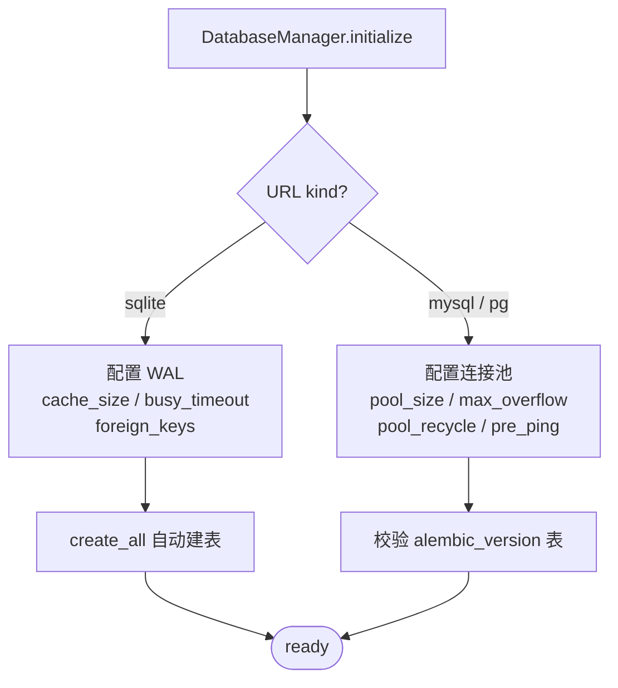
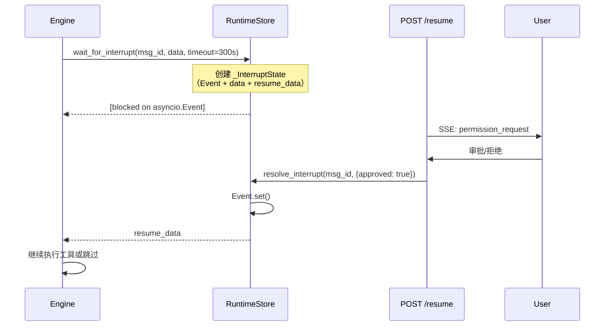

# 并发与运行时

> DatabaseManager 的连接池与重试 + RuntimeStore 的租约/中断/取消/消息队列 — 中小规模 SaaS 的高可用底座。

## 两层并发关注点

ArtifactFlow 的并发分为两个正交维度：

| 维度 | 模块 | 关注 |
|------|------|------|
| **数据层并发** | `DatabaseManager` | 连接池、SQLite WAL、多 PX failover、瞬断重试 |
| **执行层并发** | `RuntimeStore` | 单对话互斥（lease）、中断等待、取消信号、消息队列 |

两者由 Controller 层组合使用，但互不感知 — DB 的连接问题不污染执行状态，反之亦然。

## DatabaseManager

`src/db/database.py` 封装 SQLAlchemy AsyncEngine，统一 SQLite / MySQL / PostgreSQL 的初始化与会话管理。

### 初始化分支


```mermaid
flowchart TD
    INIT[DatabaseManager.initialize] --> KIND{URL kind?}
    KIND -->|sqlite| SQLITE[配置 WAL<br/>cache_size / busy_timeout<br/>foreign_keys]
    KIND -->|mysql / pg| POOL[配置连接池<br/>pool_size / max_overflow<br/>pool_recycle / pre_ping]
    SQLITE --> CREATE[create_all 自动建表]
    POOL --> CHECK[校验 alembic_version 表]
    CREATE --> DONE
    CHECK --> DONE([ready])
```

### SQLite 配置

开发/测试默认使用 SQLite + WAL：

| PRAGMA | 值 | 作用 |
|--------|----|----|
| `journal_mode` | `WAL` | 读写并发、更好的崩溃恢复 |
| `synchronous` | `NORMAL` | 平衡性能与持久性 |
| `cache_size` | `-64000` | 64MB 页缓存 |
| `foreign_keys` | `ON` | 强制外键约束 |
| `busy_timeout` | `5000` | 写锁冲突时等 5 秒 |

内存库（`:memory:`）使用 `StaticPool` 单连接，因为跨连接不可见表。

### MySQL / PostgreSQL 连接池

| 参数 | 默认 | 说明 |
|------|------|------|
| `pool_size` | 5 | 保持空闲连接数 |
| `max_overflow` | 10 | 高峰期可溢出数 |
| `pool_timeout` | 30s | 获取连接超时 |
| `pool_recycle` | 300s | 连接最大寿命，防中间件断连 |
| `pool_pre_ping` | True | 每次拿连接先 ping，踢掉死连接 |

### 多地址 Failover

`database_urls=[...]` 传入多个地址时启用 primary-first failover：

```python
# _parse_db_url 按后端类型返回 ("mysql"/"postgres", kwargs)
# _failover_creator 根据 driver 分发到 aiomysql 或 asyncpg
async def _failover_creator():
    connect_fn, timeout_kw = (
        (asyncpg.connect, "timeout") if driver == "postgres"
        else (aiomysql.connect, "connect_timeout")
    )
    for _, kwargs in parsed_urls:   # 固定顺序，不轮转
        try:
            return await connect_fn(**kwargs, **{timeout_kw: 5})
        except Exception as e:
            errors.append(...)
    raise ConnectionError(...)
```

- **Primary-first**：按配置顺序尝试，首个成功即返回 — 不做负载均衡
- **支持 MySQL 和 PostgreSQL**：按 URL 后端自动选择 `aiomysql` / `asyncpg` 驱动；所有地址必须同一种 driver（启动时校验）
- 通过 SQLAlchemy 的 `async_creator` hook 注入
- 仅用于建立新连接；已建立的连接断开由 `pool_pre_ping` + 应用层 `with_retry()` 处理

**DSN query 参数白名单**（不在列表内的 key 在 init 时 fail fast，避免 failover 路径静默丢配置）：

| 参数 | 适用 | 映射 | 类型处理 |
|------|------|------|---------|
| `ssl_ca` / `ssl_cert` / `ssl_key` | 两者 | 文件路径 → `ssl.SSLContext` → `ssl=` kwarg | — |
| `sslmode` | PG | → asyncpg `ssl=` 字符串（`require` / `prefer` / `disable` 等） | — |
| `command_timeout` | PG | asyncpg 直接 kwarg | 强制转 `float` |
| `application_name` | PG | asyncpg `server_settings={...}` 字典（**不是**直接 kwarg） | — |
| `charset` / `unix_socket` / `init_command` / `program_name` | MySQL | aiomysql 直接 kwarg | `str` |
| `autocommit` | MySQL | aiomysql 直接 kwarg | 强制转 `bool`（接受 `true`/`false`/`1`/`0`/`yes`/`no`/`on`/`off`） |

**关键点：**

- `application_name` 不是 `asyncpg.connect()` 的直接 kwarg，必须走 `server_settings` 字典 — 直接当 kwarg 传会 `TypeError`
- `connect_timeout` 故意**不在**白名单中：failover 路径硬编码 5s probe timeout（架构决策），DSN 覆盖会导致 Python 层 kwarg 重复报错
- `read_timeout` / `write_timeout` 不在白名单：虽然 PyMySQL 支持，但 **aiomysql 不支持这两个参数**，传过去会 `TypeError`
- URL query 值永远是 `str`，数值/布尔类参数必须在解析时显式转换，否则 driver 内部使用时（如 `asyncio.wait_for(timeout=...)`、`if autocommit:`）会出错
- **PG 的 `sslmode` 与 `ssl_ca`/`ssl_cert`/`ssl_key` 不可混用**：两者表达 TLS 意图的方式不同，混用有语义歧义（`sslmode=disable + ssl_ca=...` 会反转用户禁用 TLS 的意图）。即使是看似相容的组合（如 `sslmode=prefer + ssl_ca=...`），本项目在 `ssl_*` 路径下也不会复刻 asyncpg 自身的 `prefer` / `allow` 降级语义 — 构造 `SSLContext` 后交给 asyncpg 就意味着"确定 TLS"，没有 mode 字符串承载降级意图。因此混用时 init 直接 fail。用户须二选一：要么只用 `sslmode=`（由 asyncpg 处理语义 — 注意 `require` 不做证书校验，`verify-ca`/`verify-full` 需要额外 root cert），要么只给 CA/cert 文件路径（构造 `SSLContext`，由 Python `ssl` 模块做校验）

之所以要白名单 + fail-fast：failover 路径绕过了 SQLAlchemy dialect 的 URL 翻译（直接调 driver 的 `connect()`），而 `asyncpg.connect` 和 `aiomysql.connect` 签名都是固定的、不吃任意 `**kwargs`。白名单保证迁移 `DATABASE_URL → DATABASE_URLS` 不会出现连接行为静默变化，也不会在真正连接时才炸。

### 瞬断重试

`db_manager.with_retry(fn)` 在 `OperationalError / DisconnectionError` 时重试（最多 3 次，指数退避 1s → 2s → 4s）。每次 attempt 创建**独立 session**，所以只适合：

- 幂等写操作（如 `flush_one` 的 artifact 写入 — Duplicate 视为成功）
- 只读查询

不适合需要事务串联多步的写入 — 中间失败会破坏一致性。

### Session 生命周期

```python
@asynccontextmanager
async def session(self):
    session = self._session_factory()
    try:
        yield session
    finally:
        await session.close()
```

**只管创建和关闭**，不做 `begin/commit/rollback`。事务控制在 Repository 方法内，见 [data-layer.md → 事务所有权](data-layer.md#事务所有权)。

## RuntimeStore

执行层的共享状态都放在 `RuntimeStore` 后面，通过 Protocol 接口隔离实现：

```python
@runtime_checkable
class RuntimeStore(Protocol):
    # Conversation lease — 阻止同一对话并发 POST /chat
    async def try_acquire_lease(self, conv_id, msg_id) -> Optional[str]: ...
    async def release_lease(self, conv_id, msg_id) -> None: ...

    # Engine interactive — inject / cancel 的有效窗口
    async def mark_engine_interactive(self, conv_id, msg_id) -> None: ...
    async def clear_engine_interactive(self, conv_id, msg_id) -> None: ...

    # Interrupts — permission 确认等待
    async def wait_for_interrupt(self, msg_id, data, timeout) -> Optional[Dict]: ...
    async def resolve_interrupt(self, msg_id, resume_data) -> Literal[...]: ...

    # Cancellation
    async def request_cancel(self, msg_id) -> None: ...
    async def is_cancelled(self, msg_id) -> bool: ...

    # Message queue — 执行中用户注入
    async def inject_message(self, msg_id, content) -> None: ...
    async def drain_messages(self, msg_id) -> List[str]: ...

    # Owner-key primitives — 通用分布式锁（compaction 等用）
    async def acquire(self, key, ttl, *, owner=None) -> Tuple[bool, str]: ...
    async def renew(self, key, owner, ttl) -> bool: ...
    async def release(self, key, owner) -> None: ...

    # Lease lifecycle
    async def renew_lease(self, conv_id, msg_id, ttl) -> bool: ...
    async def cleanup_execution(self, conv_id, msg_id) -> None: ...
    async def shutdown_cleanup(self) -> None: ...
```

### 双状态生命周期

lease 和 interactive 是**两个独立状态**，生命周期不同：


```mermaid
gantt
    title 执行请求的双状态时间线
    dateFormat  X
    axisFormat %s

    section Lease
    acquire_lease      :a1, 0, 30
    post_processing    :a2, 25, 30

    section Interactive
    mark_interactive   :b1, 2, 23
    engine_loop        :b2, 2, 23

    section Execution
    receive_request    :milestone, 0, 0
    release_lease      :milestone, 30, 0
```

- **Lease** 覆盖**整个请求生命周期**（含 post-processing、flush、终端事件推送）
- **Interactive** 仅覆盖**引擎 loop 期间**（退出后 inject/cancel 返回 409）

这个分离允许 post-processing 阶段拒绝新的 inject/cancel（此时引擎已退出无法响应），但仍阻止并发 POST /chat（lease 未释放）。

### Interrupt 机制

Permission CONFIRM 工具执行前，工具处理器调用 `wait_for_interrupt()` 挂起引擎，等待用户从前端 `POST /chat/{id}/resume` 响应：


```mermaid
sequenceDiagram
    participant Engine
    participant Store as RuntimeStore
    participant API as POST /resume
    participant User

    Engine->>Store: wait_for_interrupt(msg_id, data, timeout=300s)
    Note over Store: 创建 _InterruptState<br/>（Event + data + resume_data）
    Store-->>Engine: [blocked on asyncio.Event]

    API->>User: SSE: permission_request
    User->>API: 审批/拒绝
    API->>Store: resolve_interrupt(msg_id, {approved: true})
    Store->>Store: Event.set()
    Store-->>Engine: resume_data
    Engine->>Engine: 继续执行工具或跳过
```

**超时或 shutdown：**

- `asyncio.wait_for()` 超时 → 返回 `None` → 工具处理器视为 deny
- `request_cancel()` 同时唤醒 pending interrupt：设 `resume_data = {"approved": False, "reason": "cancelled"}` → Event.set()
- `shutdown_cleanup()` 唤醒所有 pending interrupt：`{"approved": False, "reason": "shutdown"}`

这保证引擎永远不会"死在 interrupt 上"。

### Cancellation

- `request_cancel(msg_id)` 设置 Event 标志
- 引擎在每次循环顶部和工具执行前调用 `check_cancelled` hook 检查
- 取消时引擎 emit `cancelled` 终端事件，释放资源，lease 随后在 finally 块释放

### 消息注入

`POST /chat/{id}/inject` 在执行中追加用户消息：

- 条件：对话处于 `interactive` 状态
- `inject_message(msg_id, content)` 入队
- Lead agent 在每次迭代顶部 `drain_messages(msg_id)` 取出所有待处理消息，包装为 `QUEUED_MESSAGE` 事件注入上下文
- 非 lead agent 不检查队列 — 注入消息只影响 lead agent 的决策回路

### Owner-Key 通用原语

`acquire / renew / release / get_owner` 是建立在 lease 之上的通用分布式锁，主要用户是 Compaction：

- Compaction 在多实例部署时需要互斥，避免同一对话被多实例同时压缩
- 使用 `acquire("compact:{conv_id}", ttl=60, owner=uuid)`
- 启动后台续期任务，每 20s 调 `renew()`
- 任务结束或崩溃后 TTL 到期自动释放

## 两种 RuntimeStore 实现

### InMemoryRuntimeStore（单进程）

`src/api/services/runtime_store.py` — 开发、单实例部署使用：

| 状态维度 | 存储 |
|---------|------|
| Conversation lease | `dict[conv_id → msg_id]` |
| Engine interactive | `dict[conv_id → msg_id]` |
| Interrupts | `dict[msg_id → _InterruptState]`（Event + data + resume_data） |
| Cancellations | `dict[msg_id → asyncio.Event]` |
| Message queues | `dict[msg_id → asyncio.Queue]` |
| Owner keys | `dict[key → (owner, expires_at)]`（内存 TTL） |

**特点：**

- 无 TTL 必要 — `cleanup_execution()` 或 `shutdown_cleanup()` 显式清理
- `renew_lease()` 永远 True — 单进程无失效风险
- `get_lease_key()` 返回空字符串 — 无跨实例查询需求

### RedisRuntimeStore（分布式）

`src/api/services/redis_runtime_store.py` — 生产多 Worker / 多 Pod 部署：

**Key 设计**（使用 `{prefix:id}` 的 hash tag 保证同 entity 同 slot，兼容 Redis Cluster）：

| Key | 类型 | TTL | 用途 |
|-----|------|-----|------|
| `{af:conv_id}:lease` | STRING (msg_id) | `LEASE_TTL` = 90s | Conversation 持有 |
| `{af:conv_id}:interactive` | STRING (msg_id) | `LEASE_TTL` | Engine interactive |
| `{af:msg_id}:interrupt` | HASH | `PERM_TIMEOUT + 60` | Interrupt 状态 |
| `{af:msg_id}:cancel` | STRING "1" | `EXECUTION_TIMEOUT` | 取消标记 |
| `{af:msg_id}:queue` | LIST | `EXECUTION_TIMEOUT` | 消息队列 |
| `{af:msg_id}:interrupt_ch` | Pub/Sub channel | — | Interrupt 唤醒通知 |

**原子性 — Lua 脚本：**

| 脚本 | 用途 |
|------|------|
| `acquire-lease` | `SET NX EX` 原子获取或返回现有持有者（避免 SET NX + GET 竞态） |
| `compare-and-del` | 仅当 owner 匹配时 DEL（防止误释放他人持有的 lease） |
| `compare-and-expire` | 仅当 owner 匹配时续期 |
| `drain-all` | `LRANGE + DEL` 原子取出队列 |
| `resolve-interrupt` | HSET status + PUBLISH 的原子组合 |

**Interrupt 的 Pub/Sub 四步模式：**

```
1. HSET 创建 interrupt（status=pending）
2. SUBSCRIBE channel
3. 再次 HGET 检查 status（防止步骤 1-2 之间被 resolve）
4. 等待 PUBLISH 通知或超时
```

步骤 3 是关键 — 没有它则 1-2 之间的 resolve 会丢失通知，导致永久阻塞到超时。

### 心跳续租

Controller 启动后台任务每 `LEASE_TTL / 3 = 30s` 调用 `renew_lease()`：

- InMemory 永远成功
- Redis 通过 `compare-and-expire` 脚本：owner 不匹配返回 0 → 续租失败 → Controller 感知到"lease 被抢" → 主动终止执行

这允许在 Pod 崩溃时（心跳停止）90s 内 lease 自动释放，其他实例可接管该对话的新请求。

## 超时参数总览

| 参数 | 默认 | 作用 |
|------|------|------|
| `EXECUTION_TIMEOUT` | 1800s (30min) | 总执行上限，同时作为 stream lifetime 上限 |
| `PERMISSION_TIMEOUT` | 300s (5min) | 单次 permission 等待上限 |
| `LEASE_TTL` | 90s | Lease 存活时长（心跳每 30s 续） |
| `COMPACTION_TIMEOUT` | 600s (10min) | Compaction 后台任务上限 |
| `SSE_PING_INTERVAL` | 15s | SSE 心跳间隔 |

选择原则：`PERMISSION_TIMEOUT < EXECUTION_TIMEOUT`，给模型在用户审批后仍有足够时间完成任务。

## Design Decisions

### 为什么 Permission Interrupt 用 asyncio.Event 阻塞

- 实现简单，依赖标准库 — InMemory 版本无外部依赖
- 阻塞语义天然与"工具串行执行"契合，interrupt 自然插入在工具之间
- 超时由 `asyncio.wait_for` 统一处理，无需额外 watchdog
- 取消和 shutdown 都能通过 Event.set() + resume_data 唤醒，无死锁风险

对比轮询方案：轮询需要精心选择间隔（响应延迟 vs CPU 消耗），Event 通知零延迟。

### 为什么用 Lease 而非 Lock

- Lock 是"谁持有谁释放" — 持有者崩溃则永久占用
- Lease 带 TTL + 心跳续期 — 崩溃时 TTL 自动过期，其他实例可接管
- SaaS 场景下 Pod 重启、网络抖动、OOM Kill 都是常态，Lease 更稳健
- 代价：实例需感知 "lease 被抢" 并主动退出，Controller 层实现这一逻辑

### 为什么 InMemory 和 Redis 共用 Protocol

- 本地开发、单元测试、Docker Compose 单实例都不需要 Redis，InMemory 足够
- 生产多实例必须 Redis — 同 Protocol 允许配置驱动切换（`REDIS_URL` 环境变量）
- Protocol 方法全部 async 是为 Redis 实现留出空间，InMemory 的"伪 async"是小代价

### 为什么 Redis Key 用 hash tag `{prefix:id}`

- Redis Cluster 按 CRC16 分片；同一对话的 lease / interactive 等 key 必须在同一 slot 才能跨 key 原子操作
- hash tag `{...}` 内的内容决定分片位置，将 `conv_id` 或 `msg_id` 放入 tag 即可确保同 entity 聚合到同 slot
- 不用 hash tag 则 Cluster 模式下 Lua 脚本的 `KEYS[]` 跨 slot 会报错

### 为什么事务控制在 Repository 而非 Session Context Manager

见 [data-layer.md → 事务所有权](data-layer.md#事务所有权)。核心：缩短 SQLite 写锁持有时间，将每个 Repo 方法视为独立微事务。
