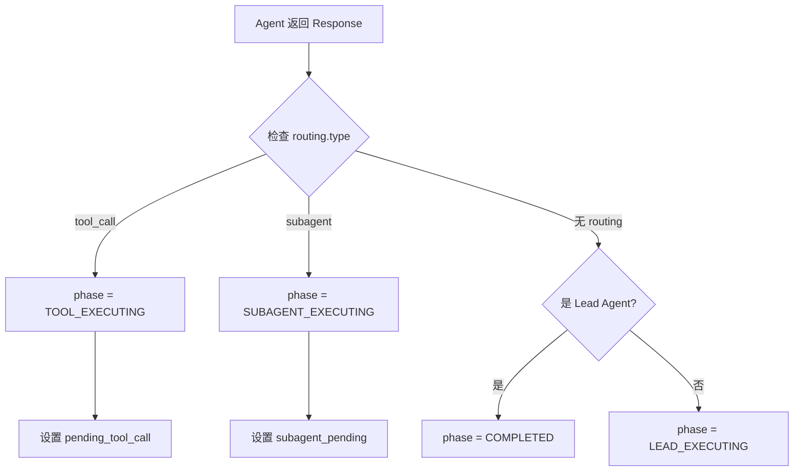
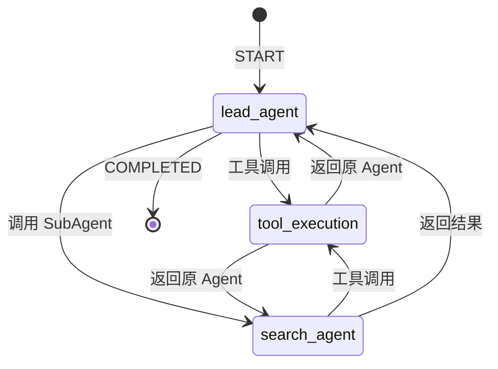

# Core 模块

Core 模块是 ArtifactFlow 的核心引擎，负责状态管理、工作流编排和执行控制。

## 模块结构

```
src/core/
├── state.py              # 状态定义与转换
├── events.py             # 事件类型与指标
├── graph.py              # LangGraph 工作流
├── controller.py         # 执行控制器
├── context_manager.py    # 上下文管理
└── conversation_manager.py # 对话管理
```

## 状态系统 (state.py)

### ExecutionPhase

执行阶段枚举，控制工作流路由：

```python
class ExecutionPhase(Enum):
    LEAD_EXECUTING = "lead_executing"          # Lead Agent 执行中
    SUBAGENT_EXECUTING = "subagent_executing"  # SubAgent 执行中
    TOOL_EXECUTING = "tool_executing"          # 工具执行中
    WAITING_PERMISSION = "waiting_permission"  # 等待权限确认
    COMPLETED = "completed"                    # 任务完成
```

### AgentState

LangGraph 全局状态，贯穿整个执行流程：

```python
class AgentState(TypedDict):
    # 基础信息
    current_task: str                           # 当前任务描述
    session_id: str                             # Artifact 会话 ID
    thread_id: str                              # LangGraph 线程 ID

    # 对话上下文
    conversation_history: Optional[List[Dict]]  # 格式化的对话历史

    # 执行控制
    phase: ExecutionPhase                       # 当前执行阶段
    current_agent: str                          # 当前 Agent 名称

    # 路由信息
    subagent_pending: Optional[Dict]            # {"target", "instruction", "subagent_result"}
    pending_tool_call: Optional[Dict]           # {"tool_name", "params", "from_agent", "tool_result"}

    # 记忆系统
    agent_memories: Dict[str, NodeMemory]       # 各 Agent 的记忆（含 tool_round_count）

    # Context 管理
    compression_level: str                      # 压缩级别

    # 用户交互层
    user_message_id: str                        # 当前用户消息 ID
    graph_response: Optional[str]               # Graph 最终响应

    # 可观测性
    execution_metrics: ExecutionMetrics         # 执行指标
```

其中 `NodeMemory` 结构：

```python
class NodeMemory(TypedDict):
    tool_interactions: List[Dict]      # assistant-tool 交互历史
    last_response: Optional[Dict]      # 最后的 AgentResponse
    tool_round_count: int              # 当前节点工具调用计数
```

### 状态转换函数

`merge_agent_response_to_state()` 是状态更新的统一入口（原地修改 state）：

```python
def merge_agent_response_to_state(
    state: AgentState,
    agent_name: str,
    response: AgentResponse,
    is_resuming: bool = False
) -> None:
    """
    处理 Agent 响应，更新状态（原地修改）
    - 更新 current_agent
    - 清理恢复状态（如果 is_resuming）
    - 更新 agent_memories（tool_interactions, last_response, tool_round_count）
    - 解析 routing 信息，设置 phase 和路由数据
    """
```

路由逻辑：



## 事件系统 (events.py)

### StreamEventType

统一的事件类型定义，贯穿 Agent、Graph、Controller 三层：

```python
class StreamEventType(Enum):
    # Controller 层事件
    METADATA = "metadata"          # 初始元数据
    COMPLETE = "complete"          # 执行完成
    ERROR = "error"                # 执行错误

    # Agent 层事件
    AGENT_START = "agent_start"    # Agent 开始执行
    LLM_CHUNK = "llm_chunk"        # LLM 流式输出片段
    LLM_COMPLETE = "llm_complete"  # LLM 输出完成
    AGENT_COMPLETE = "agent_complete"  # Agent 执行完成

    # Graph 层事件
    TOOL_START = "tool_start"        # 工具开始执行
    TOOL_COMPLETE = "tool_complete"  # 工具执行完成
    PERMISSION_REQUEST = "permission_request"  # 请求权限确认
    PERMISSION_RESULT = "permission_result"    # 权限确认结果
```

### ExecutionMetrics

可观测性指标，记录执行过程（使用 TypedDict）：

```python
class ExecutionMetrics(TypedDict):
    started_at: str                               # ISO timestamp
    completed_at: Optional[str]                   # ISO timestamp
    total_duration_ms: Optional[int]
    agent_executions: List[AgentExecutionRecord]  # append-only
    tool_calls: List[ToolCallRecord]              # append-only

class AgentExecutionRecord(TypedDict):
    agent_name: str
    model: str
    token_usage: TokenUsage
    llm_duration_ms: int
    started_at: str
    completed_at: str

class ToolCallRecord(TypedDict):
    tool_name: str
    success: bool
    duration_ms: int
    called_at: str
    completed_at: str
    agent: str  # 调用方 agent
```

使用示例：

```python
# 记录 Agent 执行
append_agent_execution(
    metrics=state["execution_metrics"],
    agent_name="lead_agent",
    model="qwen-plus",
    token_usage={"input_tokens": 1000, "output_tokens": 500, "total_tokens": 1500},
    started_at=start_time.isoformat(),
    completed_at=end_time.isoformat(),
    llm_duration_ms=1200
)

# 记录工具调用
append_tool_call(
    metrics=state["execution_metrics"],
    tool_name="web_search",
    success=True,
    duration_ms=1500,
    called_at=start_time.isoformat(),
    completed_at=end_time.isoformat(),
    agent="search_agent"
)
```

## 工作流引擎 (graph.py)

### ExtendableGraph

基于 LangGraph 的可扩展工作流：

```python
class ExtendableGraph:
    def __init__(self):
        self.workflow = StateGraph(AgentState)
        self.agents: Dict[str, BaseAgent] = {}

    def register_agent(self, agent: BaseAgent):
        """注册 Agent 并创建对应节点"""

    async def compile(
        self,
        checkpointer: Optional[Any] = None,
        interrupt_before: Optional[list] = None,
        db_path: str = "data/langgraph.db"
    ) -> CompiledGraph:
        """编译 Graph，注入 Checkpointer"""
```

### 节点类型

**Agent 节点**：执行单轮 LLM 调用

```python
def _create_agent_node(self, agent_name: str) -> Callable:
    async def agent_node(state: AgentState, writer: StreamWriter) -> AgentState:
        agent = self.agents[agent_name]

        # 构建 messages
        messages = ContextManager.build_agent_messages(
            agent=agent,
            state=state,
            instruction=instruction,
            tool_interactions=tool_interactions,
            pending_tool_result=pending_tool_result
        )

        # 流式执行 Agent
        async for event in agent.stream(messages, is_resuming):
            writer({
                "type": event.type.value,
                "agent": event.agent,
                "timestamp": event.timestamp.isoformat(),
                "data": self._serialize_event_data(event.data)
            })

        # 更新状态（原地修改）
        merge_agent_response_to_state(state, agent_name, final_response, is_resuming)
        return state

    return agent_node
```

**工具执行节点**：统一处理工具调用

```python
async def tool_execution_node(state: AgentState, writer: StreamWriter) -> AgentState:
    pending = state.get("pending_tool_call")
    from_agent = pending["from_agent"]
    tool_name = pending["tool_name"]
    params = pending["params"]

    # 获取工具（通过 agent 的 toolkit）
    agent = self.agents.get(from_agent)
    tool = agent.toolkit.get_tool(tool_name)

    # 权限检查
    if tool.permission == ToolPermission.CONFIRM:
        writer({...})  # PERMISSION_REQUEST
        is_approved = interrupt({...})
        if not is_approved:
            pending["tool_result"] = ToolResult(success=False, error="Permission denied")
            state["phase"] = self._get_return_phase(from_agent)
            return state

    # 执行工具
    writer({...})  # TOOL_START
    tool_result = await agent.toolkit.execute_tool(tool_name, params)
    writer({...})  # TOOL_COMPLETE

    # 保存结果并返回原 Agent
    pending["tool_result"] = tool_result
    state["phase"] = self._get_return_phase(from_agent)
    return state
```

### 路由规则

```python
def _add_routing_rules(self, agent_name: str):
    def route_func(state: AgentState) -> str:
        phase = state["phase"]
        if phase == ExecutionPhase.TOOL_EXECUTING:
            return "tool_execution"
        elif phase == ExecutionPhase.SUBAGENT_EXECUTING:
            return state["subagent_pending"]["target"]
        elif phase == ExecutionPhase.LEAD_EXECUTING:
            return "lead_agent"
        elif phase == ExecutionPhase.COMPLETED:
            return END
        return END

    # Agent 节点后的路由
    self.workflow.add_conditional_edges(
        agent_name,
        route_func,
        {
            "tool_execution": "tool_execution",
            "lead_agent": "lead_agent",
            "search_agent": "search_agent",
            "crawl_agent": "crawl_agent",
            END: END
        }
    )
```

### 状态机图示

以 Lead → Search 调用为例：



> 其他 SubAgent（如 crawl_agent）的流程与 search_agent 相同。

## 执行控制器 (controller.py)

### ExecutionController

协调整个执行流程的入口：

```python
class ExecutionController:
    def __init__(
        self,
        compiled_graph,
        artifact_manager: Optional[ArtifactManager] = None,
        conversation_manager: Optional[ConversationManager] = None
    ):
        self.graph = compiled_graph
        self.conversation_manager = conversation_manager or ConversationManager()
        self.artifact_manager = artifact_manager or ArtifactManager()

    async def stream_execute(
        self,
        content: Optional[str] = None,
        thread_id: Optional[str] = None,
        conversation_id: Optional[str] = None,
        parent_message_id: Optional[str] = None,
        message_id: Optional[str] = None,
        resume_data: Optional[Dict] = None
    ) -> AsyncGenerator[Dict[str, Any], None]:
        """流式执行，yield 事件字典"""

    async def execute(self, ...) -> Dict[str, Any]:
        """批量执行，等待完成"""
```

### 执行流程

```python
async def _stream_new_message(self, content, conversation_id, parent_message_id):
    # 1. 确保 conversation 存在
    if not conversation_id:
        conversation_id = await self.conversation_manager.start_conversation_async()
    else:
        await self.conversation_manager.ensure_conversation_exists(conversation_id)

    # 2. 自动设置 parent_message_id（如果未指定）
    if not parent_message_id:
        parent_message_id = await self.conversation_manager.get_active_branch(conversation_id)

    # 3. 格式化对话历史
    conversation_history = await self.conversation_manager.format_conversation_history_async(
        conv_id=conversation_id,
        to_message_id=parent_message_id
    )

    # 4. 生成 ID
    message_id = f"msg-{uuid4().hex}"
    thread_id = f"thd-{uuid4().hex}"
    session_id = self._get_or_create_session(conversation_id)

    # 5. 创建初始状态
    initial_state = create_initial_state(
        task=content,
        session_id=session_id,
        thread_id=thread_id,
        message_id=message_id,
        conversation_history=conversation_history
    )

    # 6. 添加消息到 conversation
    await self.conversation_manager.add_message_async(
        conv_id=conversation_id,
        message_id=message_id,
        content=content,
        thread_id=thread_id,
        parent_id=parent_message_id
    )

    # 7. 发送元数据事件
    yield {
        "type": StreamEventType.METADATA.value,
        "timestamp": datetime.now().isoformat(),
        "data": {"conversation_id": conversation_id, "message_id": message_id, "thread_id": thread_id}
    }

    # 8. 执行 Graph
    async for chunk in self.graph.astream(initial_state, config, stream_mode="custom"):
        yield chunk

    # 9. 保存响应
    await self.conversation_manager.update_response_async(
        conv_id=conversation_id,
        message_id=message_id,
        response=response
    )

    # 10. 发送完成事件
    yield {"type": StreamEventType.COMPLETE.value, "data": {...}}
```

## 上下文管理 (context_manager.py)

### ContextManager

为 Agent 准备执行上下文：

```python
class ContextManager:
    @classmethod
    def prepare_agent_context(cls, state: Dict[str, Any]) -> Dict[str, Any]:
        """
        构建路由上下文（用于系统提示注入）：
        - session_id, thread_id, user_message_id
        - artifacts_inventory（Artifact 列表）
        """

    @classmethod
    def build_agent_messages(
        cls,
        agent: Any,  # BaseAgent 实例
        state: Dict[str, Any],
        instruction: str,
        tool_interactions: Optional[List[Dict]] = None,
        pending_tool_result: Optional[Tuple[str, Any]] = None
    ) -> List[Dict]:
        """
        统一构建 Agent messages，拼接顺序：
        system → conversation_history → instruction → tool_interactions → tool_result
        """
```

### 消息压缩

基于字符数限制的消息压缩：

```python
COMPRESSION_LEVELS = {
    'full': 160000,
    'normal': 80000,
    'compact': 40000,
    'minimal': 20000
}

@classmethod
def should_compress(cls, messages: List[Dict], level: str = "normal") -> bool:
    """判断是否需要压缩"""

@classmethod
def compress_messages(
    cls,
    messages: List[Dict],
    level: str = "normal",
    preserve_recent: int = 5
) -> List[Dict]:
    """
    压缩消息历史（同步方法，基于字符数截断）
    - 保留最近 N 条完整消息
    - 超出部分添加截断标记
    """
```

## 对话管理 (conversation_manager.py)

### ConversationManager

管理对话树结构：

```python
class ConversationManager:
    def __init__(self, repository: Optional[ConversationRepository] = None):
        self.repository = repository
        self._cache: Dict[str, ConversationCache] = {}

    async def start_conversation_async(
        self,
        conversation_id: Optional[str] = None
    ) -> str:
        """创建新对话，返回对话 ID"""

    async def add_message_async(
        self,
        conv_id: str,
        message_id: str,
        content: str,
        thread_id: str,
        parent_id: Optional[str] = None
    ) -> Dict:
        """添加消息到对话树"""

    async def format_conversation_history_async(
        self,
        conv_id: str,
        to_message_id: Optional[str] = None
    ) -> List[Dict]:
        """
        格式化从 root 到指定消息的对话历史
        返回: [{"role": "user", "content": ...}, {"role": "assistant", ...}, ...]
        """

    async def get_active_branch(self, conv_id: str) -> Optional[str]:
        """获取对话的活跃分支（当前最新消息 ID）"""

    async def list_conversations_async(
        self,
        limit: int = 50,
        offset: int = 0
    ) -> List[Dict]:
        """列出所有对话"""
```

### 树状消息结构

```
Conversation
    │
    └── Message (root, parent_id=None)
            │
            ├── Message (branch 1)
            │       │
            │       └── Message (leaf)
            │
            └── Message (branch 2)
                    │
                    └── Message (leaf)
```

支持从任意消息节点创建分支，实现对话版本控制。
