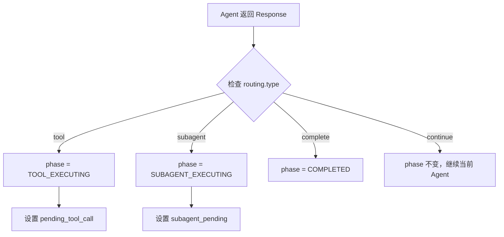
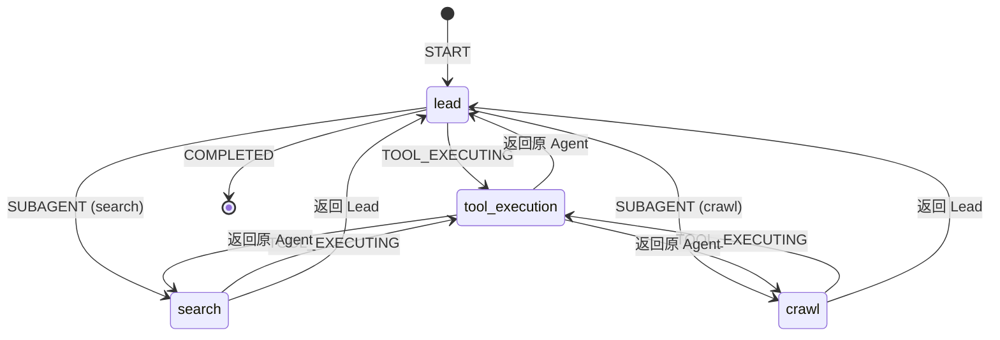

# Core 模块

Core 模块是 ArtifactFlow 的核心引擎，负责状态管理、工作流编排和执行控制。

## 模块结构

```
src/core/
├── state.py              # 状态定义与转换
├── events.py             # 事件类型与指标
├── graph.py              # LangGraph 工作流
├── controller.py         # 执行控制器
├── context_manager.py    # 上下文管理
└── conversation_manager.py # 对话管理
```

## 状态系统 (state.py)

### ExecutionPhase

执行阶段枚举，控制工作流路由：

```python
class ExecutionPhase(Enum):
    LEAD_EXECUTING = "lead_executing"       # Lead Agent 执行中
    SUBAGENT_EXECUTING = "subagent_executing"  # SubAgent 执行中
    TOOL_EXECUTING = "tool_executing"       # 工具执行中
    WAITING_PERMISSION = "waiting_permission"  # 等待权限确认
    COMPLETED = "completed"                 # 任务完成
```

### AgentState

LangGraph 全局状态，贯穿整个执行流程：

```python
class AgentState(TypedDict):
    # 任务相关
    current_task: str              # 当前任务描述
    session_id: str                # Artifact 会话 ID
    thread_id: str                 # LangGraph 线程 ID
    conversation_history: str      # 格式化的对话历史

    # 执行控制
    phase: ExecutionPhase          # 当前执行阶段
    current_agent: str             # 当前 Agent 名称
    tool_round_count: int          # 工具调用轮数计数

    # 路由信息
    subagent_pending: dict | None  # 待执行的 subagent 信息
    pending_tool_call: dict | None # 待执行的工具调用

    # 记忆系统
    agent_memories: dict[str, str] # 各 Agent 的记忆

    # 可观测性
    execution_metrics: ExecutionMetrics
```

### 状态转换函数

`merge_agent_response_to_state()` 是状态更新的统一入口：

```python
def merge_agent_response_to_state(
    state: AgentState,
    response: AgentResponse,
    agent_name: str
) -> AgentState:
    """
    处理 Agent 响应，更新状态
    - 解析 routing 信息
    - 更新执行阶段
    - 保存 Agent 记忆
    - 记录执行指标
    """
```

路由逻辑：



## 事件系统 (events.py)

### StreamEventType

统一的事件类型定义，贯穿 Agent、Graph、Controller 三层：

```python
class StreamEventType(Enum):
    # Controller 层事件
    METADATA = "metadata"          # 初始元数据
    COMPLETE = "complete"          # 执行完成
    ERROR = "error"                # 执行错误

    # Agent 层事件
    AGENT_START = "agent_start"    # Agent 开始执行
    LLM_CHUNK = "llm_chunk"        # LLM 流式输出片段
    LLM_COMPLETE = "llm_complete"  # LLM 输出完成
    AGENT_COMPLETE = "agent_complete"  # Agent 执行完成

    # Graph 层事件
    TOOL_START = "tool_start"      # 工具开始执行
    TOOL_COMPLETE = "tool_complete"  # 工具执行完成
    PERMISSION_REQUEST = "permission_request"  # 请求权限确认
    PERMISSION_RESULT = "permission_result"    # 权限确认结果
```

### ExecutionMetrics

可观测性指标，记录执行过程：

```python
@dataclass
class ExecutionMetrics:
    agent_executions: list[AgentExecutionRecord]  # Agent 执行记录
    tool_calls: list[ToolCallRecord]              # 工具调用记录
    started_at: datetime | None
    completed_at: datetime | None
    total_duration_ms: int | None
```

使用示例：

```python
# 记录 Agent 执行
append_agent_execution(state, AgentExecutionRecord(
    agent="lead",
    started_at=start_time,
    completed_at=end_time,
    token_usage={"input": 1000, "output": 500}
))

# 记录工具调用
append_tool_call(state, ToolCallRecord(
    tool="web_search",
    params={"query": "..."},
    success=True,
    duration_ms=1500
))
```

## 工作流引擎 (graph.py)

### ExtendableGraph

基于 LangGraph 的可扩展工作流：

```python
class ExtendableGraph:
    def __init__(self):
        self.builder = StateGraph(AgentState)
        self.agents: dict[str, BaseAgent] = {}
        self.tool_registry: ToolRegistry = None

    def register_agent(self, agent: BaseAgent):
        """注册 Agent 并创建对应节点"""

    def compile(self, checkpointer) -> CompiledGraph:
        """编译 Graph，注入 Checkpointer"""
```

### 节点类型

**Agent 节点**：执行单轮 LLM 调用

```python
async def _create_agent_node(self, agent: BaseAgent):
    async def node(state: AgentState, writer: StreamWriter):
        # 准备上下文
        context = ContextManager.prepare_agent_context(state, agent.name)

        # 流式执行 Agent
        async for event in agent.stream(context):
            writer(event)

        # 更新状态
        return merge_agent_response_to_state(state, response, agent.name)

    return node
```

**工具执行节点**：统一处理工具调用

```python
async def tool_execution_node(state: AgentState, writer: StreamWriter):
    tool_call = state["pending_tool_call"]
    tool = self.tool_registry.get_tool(tool_call["name"])

    # 权限检查
    if tool.permission in [ToolPermission.CONFIRM, ToolPermission.RESTRICTED]:
        writer(StreamEvent(type=PERMISSION_REQUEST, ...))
        result = interrupt({"tool": tool_call["name"], ...})
        if not result:
            return state  # 用户拒绝

    # 执行工具
    writer(StreamEvent(type=TOOL_START, ...))
    result = await tool.execute(**tool_call["params"])
    writer(StreamEvent(type=TOOL_COMPLETE, ...))

    # 返回原 Agent
    return {**state, "pending_tool_result": result, "phase": ..., "pending_tool_call": None}
```

### 路由规则

```python
def _add_routing_rules(self):
    # Agent 节点后的路由
    self.builder.add_conditional_edges(
        "lead",
        self._route_after_agent,
        {
            "tool_execution": "tool_execution",
            "search": "search",
            "crawl": "crawl",
            END: END
        }
    )

    # 工具执行后返回原 Agent
    self.builder.add_conditional_edges(
        "tool_execution",
        lambda s: s["current_agent"],
        {"lead": "lead", "search": "search", "crawl": "crawl"}
    )
```

### 状态机图示



## 执行控制器 (controller.py)

### ExecutionController

协调整个执行流程的入口：

```python
class ExecutionController:
    def __init__(
        self,
        graph: CompiledGraph,
        conversation_manager: ConversationManager,
        artifact_manager: ArtifactManager,
        stream_manager: StreamManager
    ):
        ...

    async def stream_execute(
        self,
        content: str,
        conversation_id: str | None,
        parent_message_id: str | None
    ) -> AsyncGenerator[StreamEvent, None]:
        """流式执行，yield 事件"""

    async def execute(self, ...) -> ExecutionResult:
        """批量执行，等待完成"""
```

### 执行流程

```python
async def stream_execute(self, content, conversation_id, parent_message_id):
    # 1. 确保 conversation 存在
    conversation_id = await self._ensure_conversation(conversation_id)

    # 2. 自动设置 parent_message_id（如果未指定）
    if not parent_message_id:
        parent_message_id = await self._get_latest_message_id(conversation_id)

    # 3. 格式化对话历史
    history = await self.conversation_manager.format_conversation_history_async(
        conversation_id, parent_message_id
    )

    # 4. 生成 ID
    message_id = str(uuid.uuid4())
    thread_id = str(uuid.uuid4())
    session_id = conversation_id  # Artifact session 与 conversation 对应

    # 5. 创建初始状态
    initial_state = create_initial_state(
        current_task=content,
        session_id=session_id,
        thread_id=thread_id,
        conversation_history=history
    )

    # 6. 添加消息到 conversation
    await self.conversation_manager.add_message_async(
        conversation_id, message_id, content, parent_message_id, thread_id
    )

    # 7. 发送元数据事件
    yield StreamEvent(type=METADATA, data={
        "conversation_id": conversation_id,
        "thread_id": thread_id,
        "message_id": message_id
    })

    # 8. 执行 Graph
    async for event in self.graph.astream(
        initial_state,
        config={"configurable": {"thread_id": thread_id}},
        stream_mode="custom"
    ):
        yield event

    # 9. 保存响应
    await self.conversation_manager.update_response_async(
        conversation_id, message_id, final_response
    )

    # 10. 发送完成事件
    yield StreamEvent(type=COMPLETE, data={...})
```

## 上下文管理 (context_manager.py)

### ContextManager

为 Agent 准备执行上下文：

```python
class ContextManager:
    @staticmethod
    def prepare_agent_context(state: AgentState, agent_name: str) -> AgentContext:
        """
        构建 Agent 执行所需的上下文：
        - 对话历史
        - 当前任务
        - Agent 记忆
        - 工具交互历史
        - 待处理的工具结果
        """

    @staticmethod
    def build_agent_messages(context: AgentContext) -> list[dict]:
        """
        构建 LLM 调用的 messages 列表：
        - system: Agent 系统提示
        - user: 对话历史 + 任务 + 记忆
        - assistant/tool: 工具交互历史（如果有）
        """
```

### 消息压缩

当消息历史过长时自动压缩：

```python
@staticmethod
def should_compress(messages: list, threshold: int = 50000) -> bool:
    """判断是否需要压缩"""

@staticmethod
async def compress_messages(messages: list, llm) -> list:
    """使用 LLM 压缩消息历史"""
```

## 对话管理 (conversation_manager.py)

### ConversationManager

管理对话树结构：

```python
class ConversationManager:
    def __init__(self, repo: ConversationRepository):
        self._cache: dict[str, ConversationCache] = {}

    async def start_conversation_async(self, conversation_id: str):
        """创建新对话"""

    async def add_message_async(
        self,
        conversation_id: str,
        message_id: str,
        content: str,
        parent_id: str | None,
        thread_id: str
    ):
        """添加消息到对话树"""

    async def format_conversation_history_async(
        self,
        conversation_id: str,
        leaf_message_id: str
    ) -> str:
        """格式化从 root 到指定消息的对话历史"""
```

### 树状消息结构

```
Conversation
    │
    └── Message (root, parent_id=None)
            │
            ├── Message (branch 1)
            │       │
            │       └── Message (leaf)
            │
            └── Message (branch 2)
                    │
                    └── Message (leaf)
```

支持从任意消息节点创建分支，实现对话版本控制。
