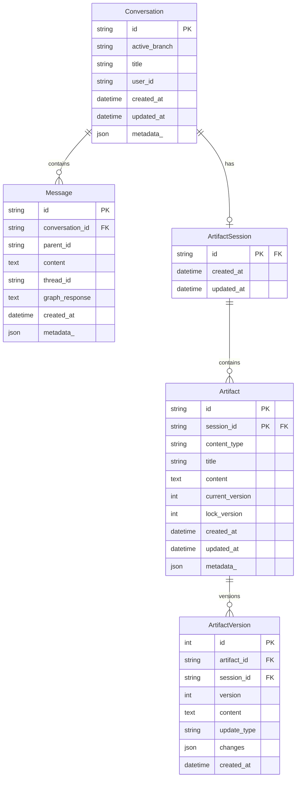
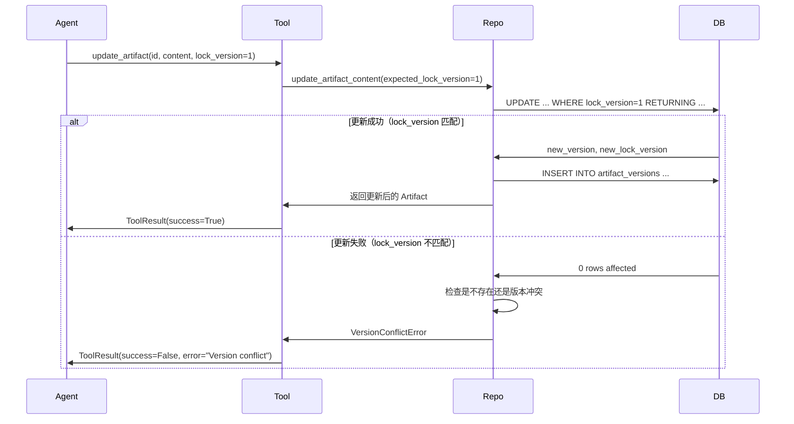

# 数据层

数据层负责持久化存储，包括对话历史、消息、Artifact 等。

## 模块结构

```
src/
├── db/
│   ├── models.py      # SQLAlchemy ORM 模型
│   └── database.py    # 数据库管理器
└── repositories/
    ├── base.py        # Repository 基类
    ├── conversation_repo.py
    └── artifact_repo.py
```

## 数据模型 (models.py)

### ER 图



### Conversation

对话实体：

```python
class Conversation(Base):
    __tablename__ = "conversations"

    id: Mapped[str] = mapped_column(String(64), primary_key=True)
    active_branch: Mapped[Optional[str]] = mapped_column(String(64), nullable=True)
    title: Mapped[Optional[str]] = mapped_column(String(256), nullable=True)
    user_id: Mapped[Optional[str]] = mapped_column(String(64), nullable=True, index=True)
    created_at: Mapped[datetime] = mapped_column(DateTime, default=datetime.now)
    updated_at: Mapped[datetime] = mapped_column(DateTime, default=datetime.now, onupdate=datetime.now)
    metadata_: Mapped[Optional[Dict[str, Any]]] = mapped_column("metadata", JSON, nullable=True)

    # 关系
    messages: Mapped[List["Message"]] = relationship(
        "Message", back_populates="conversation", cascade="all, delete-orphan", lazy="selectin"
    )
    artifact_session: Mapped[Optional["ArtifactSession"]] = relationship(
        "ArtifactSession", back_populates="conversation", uselist=False, cascade="all, delete-orphan"
    )
```

### Message

消息实体（树状结构）：

```python
class Message(Base):
    __tablename__ = "messages"

    id: Mapped[str] = mapped_column(String(64), primary_key=True)
    conversation_id: Mapped[str] = mapped_column(
        String(64), ForeignKey("conversations.id", ondelete="CASCADE")
    )
    parent_id: Mapped[Optional[str]] = mapped_column(String(64), nullable=True)  # None = 根消息
    content: Mapped[str] = mapped_column(Text)                      # 用户消息
    thread_id: Mapped[str] = mapped_column(String(64))              # LangGraph 线程 ID
    created_at: Mapped[datetime] = mapped_column(DateTime, default=datetime.now)
    graph_response: Mapped[Optional[str]] = mapped_column(Text)     # Agent 回复
    metadata_: Mapped[Optional[Dict]] = mapped_column("metadata", JSON)  # 扩展元数据

    conversation: Mapped["Conversation"] = relationship("Conversation", back_populates="messages")
```

**树状结构说明**：

```
parent_id 实现消息树：

msg_1 (parent_id=None)     ← 根消息
  ├── msg_2 (parent_id=msg_1)
  │     └── msg_4 (parent_id=msg_2)
  └── msg_3 (parent_id=msg_1)    ← 分支
        └── msg_5 (parent_id=msg_3)
```

### Artifact

工件实体（复合主键 + 乐观锁）：

```python
class Artifact(Base):
    __tablename__ = "artifacts"

    # 复合主键
    id: Mapped[str] = mapped_column(String(64), primary_key=True)
    session_id: Mapped[str] = mapped_column(
        String(64), ForeignKey("artifact_sessions.id", ondelete="CASCADE"), primary_key=True
    )

    content_type: Mapped[str] = mapped_column(String(32))  # markdown/python/etc
    title: Mapped[str] = mapped_column(String(256))
    content: Mapped[str] = mapped_column(Text, default="")

    # 版本控制
    current_version: Mapped[int] = mapped_column(Integer, default=1)
    lock_version: Mapped[int] = mapped_column(Integer, default=1)  # 乐观锁

    created_at: Mapped[datetime] = mapped_column(DateTime, default=datetime.now)
    updated_at: Mapped[datetime] = mapped_column(DateTime, onupdate=datetime.now)
    metadata_: Mapped[Optional[Dict]] = mapped_column("metadata", JSON)

    versions: Mapped[List["ArtifactVersion"]] = relationship(
        "ArtifactVersion", back_populates="artifact", cascade="all, delete-orphan"
    )
```

### ArtifactVersion

版本历史：

```python
class ArtifactVersion(Base):
    __tablename__ = "artifact_versions"

    id: Mapped[int] = mapped_column(Integer, primary_key=True, autoincrement=True)

    # 复合外键
    artifact_id: Mapped[str] = mapped_column(String(64))
    session_id: Mapped[str] = mapped_column(String(64))

    version: Mapped[int] = mapped_column(Integer)
    content: Mapped[str] = mapped_column(Text)
    update_type: Mapped[str] = mapped_column(String(32))  # create/update/update_fuzzy/rewrite
    changes: Mapped[Optional[List]] = mapped_column(JSON)  # [(old, new), ...]
    created_at: Mapped[datetime] = mapped_column(DateTime, default=datetime.now)

    artifact: Mapped["Artifact"] = relationship("Artifact", back_populates="versions")

    __table_args__ = (
        UniqueConstraint("artifact_id", "session_id", "version"),
        ForeignKeyConstraint(
            ["artifact_id", "session_id"],
            ["artifacts.id", "artifacts.session_id"],
            ondelete="CASCADE"
        ),
    )
```

## 数据库管理 (database.py)

### DatabaseManager

```python
class DatabaseManager:
    def __init__(
        self,
        database_url: Optional[str] = None,
        echo: bool = False,
    ):
        """
        Args:
            database_url: 数据库连接 URL，默认为 SQLite
            echo: 是否打印 SQL 语句（调试用）
        """
        if database_url is None:
            database_url = "sqlite+aiosqlite:///data/artifactflow.db"
        self.database_url = database_url
        self.echo = echo
        self._engine: Optional[AsyncEngine] = None
        self._session_factory: Optional[async_sessionmaker] = None
        self._initialized = False

    async def initialize(self):
        """初始化数据库（创建引擎、配置 WAL、创建表）"""
        self._engine = create_async_engine(self.database_url, echo=self.echo)

        # SQLite WAL 模式配置（提高并发性能）
        if "sqlite" in self.database_url:
            async with self._engine.begin() as conn:
                await conn.execute(text("PRAGMA journal_mode=WAL"))
                await conn.execute(text("PRAGMA foreign_keys=ON"))

        self._session_factory = async_sessionmaker(
            bind=self._engine,
            class_=AsyncSession,
            expire_on_commit=False,
            autoflush=False,
        )

        # 创建所有表
        async with self._engine.begin() as conn:
            await conn.run_sync(Base.metadata.create_all)

        self._initialized = True

    @asynccontextmanager
    async def session(self) -> AsyncGenerator[AsyncSession, None]:
        """获取数据库会话"""
        if not self._initialized:
            await self.initialize()

        session = self._session_factory()
        try:
            yield session
            await session.commit()
        except Exception:
            await session.rollback()
            raise
        finally:
            await session.close()

    async def close(self):
        """关闭数据库连接"""
        if self._engine:
            await self._engine.dispose()
            self._initialized = False
```

**使用示例**：

```python
db_manager = DatabaseManager("sqlite+aiosqlite:///data/app.db")
await db_manager.initialize()

async with db_manager.session() as session:
    repo = ConversationRepository(session)
    conversation = await repo.get_by_id("xxx")
```

## Repository 模式

### BaseRepository

通用 CRUD 操作：

```python
class BaseRepository(ABC, Generic[T]):
    def __init__(self, session: AsyncSession, model_class: Type[T]):
        self._session = session
        self._model_class = model_class

    async def get_by_id(self, id: Any) -> Optional[T]:
        return await self._session.get(self._model_class, id)

    async def get_all(self, *, limit: Optional[int] = None, offset: Optional[int] = None) -> List[T]:
        query = select(self._model_class)
        if offset: query = query.offset(offset)
        if limit: query = query.limit(limit)
        result = await self._session.execute(query)
        return list(result.scalars().all())

    async def count(self) -> int:
        """获取实体总数"""

    async def exists(self, id: Any) -> bool:
        """检查实体是否存在"""

    async def add(self, entity: T) -> T:
        """添加新实体"""
        self._session.add(entity)
        await self._session.flush()
        await self._session.refresh(entity)
        return entity

    async def add_all(self, entities: List[T]) -> List[T]:
        """批量添加实体"""
        self._session.add_all(entities)
        await self._session.flush()
        for entity in entities:
            await self._session.refresh(entity)
        return entities

    async def update(self, entity: T) -> T:
        """更新实体（需已在 Session 中）"""
        await self._session.flush()
        await self._session.refresh(entity)
        return entity

    async def delete(self, entity: T) -> None:
        """删除实体"""
        await self._session.delete(entity)
        await self._session.flush()

    async def delete_by_id(self, id: Any) -> bool:
        """根据主键删除"""
```

### ConversationRepository

对话相关操作：

```python
class ConversationRepository(BaseRepository[Conversation]):
    def __init__(self, session: AsyncSession):
        super().__init__(session, Conversation)

    async def create_conversation(
        self, conversation_id: str, title: Optional[str] = None, ...
    ) -> Conversation:
        """创建新对话（同时创建关联的 ArtifactSession）"""

    async def get_conversation(
        self, conversation_id: str, *, load_messages: bool = False, load_artifacts: bool = False
    ) -> Optional[Conversation]:
        """获取对话（可选预加载消息和 Artifacts）"""

    async def add_message(
        self, conversation_id: str, message_id: str, content: str, thread_id: str, ...
    ) -> Message:
        """添加消息到对话（自动更新 active_branch）"""

    async def update_graph_response(self, message_id: str, response: str) -> Message:
        """更新消息的 Graph 响应"""

    async def get_conversation_path(
        self, conversation_id: str, to_message_id: Optional[str] = None
    ) -> List[Message]:
        """获取从根到指定消息的路径（向上追溯）"""

    async def format_conversation_history(
        self, conversation_id: str, to_message_id: Optional[str] = None
    ) -> List[Dict[str, str]]:
        """格式化对话历史为 [{"role": "user", ...}, {"role": "assistant", ...}, ...]"""
```

### ArtifactRepository

Artifact 操作（含乐观锁）：

```python
class ArtifactRepository(BaseRepository[Artifact]):
    def __init__(self, session: AsyncSession):
        super().__init__(session, Artifact)

    async def create_artifact(
        self, session_id: str, artifact_id: str, content_type: str, title: str, content: str, ...
    ) -> Artifact:
        """创建 Artifact（同时创建初始版本）"""

    async def get_artifact(
        self, session_id: str, artifact_id: str, *, load_versions: bool = False
    ) -> Optional[Artifact]:
        """获取 Artifact（复合主键查询）"""

    async def update_artifact_content(
        self,
        session_id: str,
        artifact_id: str,
        new_content: str,
        update_type: str,
        expected_lock_version: int,
        changes: Optional[List[Tuple[str, str]]] = None
    ) -> Artifact:
        """
        乐观锁更新（原子操作）

        使用 UPDATE ... WHERE lock_version = ? 实现乐观锁。
        如果 lock_version 不匹配，抛出 VersionConflictError。
        """
        result = await self._session.execute(
            update(Artifact)
            .where(and_(
                Artifact.id == artifact_id,
                Artifact.session_id == session_id,
                Artifact.lock_version == expected_lock_version  # 乐观锁检查
            ))
            .values(content=new_content, current_version=..., lock_version=...)
            .returning(...)
        )
        # 如果更新失败，检查是不存在还是版本冲突
        ...

    async def list_versions(self, session_id: str, artifact_id: str) -> List[Dict[str, Any]]:
        """列出版本历史（不含完整内容）"""
```

## 乐观锁机制

### 为什么需要乐观锁？

多 Agent 并发场景下，可能同时更新同一个 Artifact：

```
Agent A: 读取 Artifact (version=1)
Agent B: 读取 Artifact (version=1)
Agent A: 更新 Artifact → version=2
Agent B: 更新 Artifact → 冲突！
```

### 处理流程



### Agent 处理冲突

当收到版本冲突错误时，Agent 应该：

1. 重新读取最新版本
2. 合并变更
3. 重试更新

## LangGraph Checkpointer

除了业务数据，LangGraph 状态也需要持久化：

```python
# src/core/graph.py
async def create_async_sqlite_checkpointer(db_path: str):
    """创建 LangGraph 状态检查点"""
    from langgraph.checkpoint.sqlite.aio import AsyncSqliteSaver

    checkpointer = AsyncSqliteSaver.from_conn_string(db_path)
    await checkpointer.setup()
    return checkpointer
```

Checkpointer 存储：

- 每个 `thread_id` 的完整状态历史
- 支持 `interrupt()` 后恢复执行
- 存储在独立的 SQLite 文件（`data/langgraph.db`）
