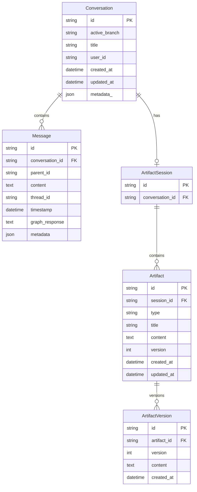
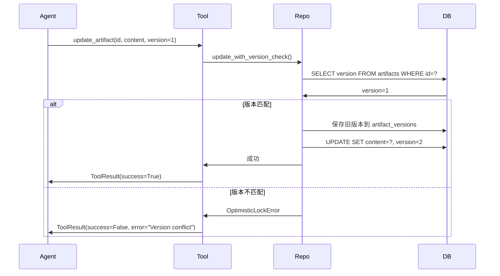

# 数据层

数据层负责持久化存储，包括对话历史、消息、Artifact 等。

## 模块结构

```
src/
├── db/
│   ├── models.py      # SQLAlchemy ORM 模型
│   └── database.py    # 数据库管理器
└── repositories/
    ├── base.py        # Repository 基类
    ├── conversation_repo.py
    └── artifact_repo.py
```

## 数据模型 (models.py)

### ER 图



### Conversation

对话实体：

```python
class Conversation(Base):
    __tablename__ = "conversations"

    id = Column(String(64), primary_key=True)
    active_branch = Column(String(64))  # 当前活跃分支的叶子 message_id
    title = Column(String(256))
    user_id = Column(String(64))        # 预留字段
    created_at = Column(DateTime, default=datetime.utcnow)
    updated_at = Column(DateTime, onupdate=datetime.utcnow)
    metadata_ = Column(JSON)

    # 关系
    messages = relationship("Message", back_populates="conversation")
    artifact_session = relationship("ArtifactSession", uselist=False)
```

### Message

消息实体（树状结构）：

```python
class Message(Base):
    __tablename__ = "messages"

    id = Column(String(64), primary_key=True)
    conversation_id = Column(String(64), ForeignKey("conversations.id"))
    parent_id = Column(String(64), nullable=True)  # None = 根消息
    content = Column(Text)                          # 用户消息
    thread_id = Column(String(64))                  # LangGraph 线程 ID
    timestamp = Column(DateTime, default=datetime.utcnow)
    graph_response = Column(Text)                   # Agent 回复
    metadata = Column(JSON)

    conversation = relationship("Conversation", back_populates="messages")
```

**树状结构说明**：

```
parent_id 实现消息树：

msg_1 (parent_id=None)     ← 根消息
  ├── msg_2 (parent_id=msg_1)
  │     └── msg_4 (parent_id=msg_2)
  └── msg_3 (parent_id=msg_1)    ← 分支
        └── msg_5 (parent_id=msg_3)
```

### Artifact

工件实体（带乐观锁）：

```python
class Artifact(Base):
    __tablename__ = "artifacts"

    id = Column(String(128), primary_key=True)
    session_id = Column(String(64), ForeignKey("artifact_sessions.id"))
    type = Column(String(32))       # task_plan, result, etc.
    title = Column(String(256))
    content = Column(Text)
    version = Column(Integer, default=1)  # 乐观锁版本号
    created_at = Column(DateTime, default=datetime.utcnow)
    updated_at = Column(DateTime, onupdate=datetime.utcnow)

    versions = relationship("ArtifactVersion", back_populates="artifact")
```

### ArtifactVersion

版本历史：

```python
class ArtifactVersion(Base):
    __tablename__ = "artifact_versions"

    id = Column(String(128), primary_key=True)
    artifact_id = Column(String(128), ForeignKey("artifacts.id"))
    version = Column(Integer)
    content = Column(Text)
    created_at = Column(DateTime, default=datetime.utcnow)

    artifact = relationship("Artifact", back_populates="versions")
```

## 数据库管理 (database.py)

### DatabaseManager

```python
class DatabaseManager:
    def __init__(self, database_url: str):
        self._engine = create_async_engine(database_url)
        self._session_factory = async_sessionmaker(self._engine)

    async def initialize(self):
        """初始化数据库（创建表）"""
        async with self._engine.begin() as conn:
            await conn.run_sync(Base.metadata.create_all)

    @asynccontextmanager
    async def session(self) -> AsyncGenerator[AsyncSession, None]:
        """获取数据库会话"""
        async with self._session_factory() as session:
            try:
                yield session
                await session.commit()
            except Exception:
                await session.rollback()
                raise

    async def close(self):
        """关闭数据库连接"""
        await self._engine.dispose()
```

**使用示例**：

```python
db_manager = DatabaseManager("sqlite+aiosqlite:///data/app.db")
await db_manager.initialize()

async with db_manager.session() as session:
    repo = ConversationRepository(session)
    conversation = await repo.get_by_id("xxx")
```

## Repository 模式

### BaseRepository

通用 CRUD 操作：

```python
class BaseRepository(Generic[T]):
    def __init__(self, session: AsyncSession, model_class: Type[T]):
        self.session = session
        self.model_class = model_class

    async def get_by_id(self, id: str) -> T | None:
        return await self.session.get(self.model_class, id)

    async def get_all(self, limit: int = 100, offset: int = 0) -> list[T]:
        stmt = select(self.model_class).limit(limit).offset(offset)
        result = await self.session.execute(stmt)
        return list(result.scalars().all())

    async def create(self, obj: T) -> T:
        self.session.add(obj)
        await self.session.flush()
        return obj

    async def update(self, obj: T) -> T:
        await self.session.flush()
        return obj

    async def delete(self, id: str) -> bool:
        obj = await self.get_by_id(id)
        if obj:
            await self.session.delete(obj)
            return True
        return False
```

### ConversationRepository

对话相关操作：

```python
class ConversationRepository(BaseRepository[Conversation]):
    def __init__(self, session: AsyncSession):
        super().__init__(session, Conversation)

    async def get_with_messages(self, id: str) -> Conversation | None:
        """获取对话及其所有消息"""
        stmt = (
            select(Conversation)
            .options(selectinload(Conversation.messages))
            .where(Conversation.id == id)
        )
        result = await self.session.execute(stmt)
        return result.scalar_one_or_none()

    async def add_message(self, conversation_id: str, message: Message) -> Message:
        """添加消息到对话"""
        message.conversation_id = conversation_id
        self.session.add(message)
        await self.session.flush()
        return message

    async def get_message_path(
        self,
        conversation_id: str,
        leaf_message_id: str
    ) -> list[Message]:
        """获取从根到指定消息的路径"""
        # 递归查询实现
        ...
```

### ArtifactRepository

Artifact 操作（含乐观锁）：

```python
class ArtifactRepository(BaseRepository[Artifact]):
    def __init__(self, session: AsyncSession):
        super().__init__(session, Artifact)

    async def update_with_version_check(
        self,
        artifact_id: str,
        new_content: str,
        expected_version: int
    ) -> Artifact:
        """
        乐观锁更新

        如果 expected_version 与数据库中的 version 不匹配，
        抛出 OptimisticLockError
        """
        artifact = await self.get_by_id(artifact_id)

        if artifact.version != expected_version:
            raise OptimisticLockError(
                f"Version mismatch: expected {expected_version}, "
                f"got {artifact.version}"
            )

        # 保存旧版本
        version_record = ArtifactVersion(
            id=f"{artifact_id}_v{artifact.version}",
            artifact_id=artifact_id,
            version=artifact.version,
            content=artifact.content
        )
        self.session.add(version_record)

        # 更新 artifact
        artifact.content = new_content
        artifact.version += 1

        await self.session.flush()
        return artifact

    async def get_versions(self, artifact_id: str) -> list[ArtifactVersion]:
        """获取版本历史"""
        stmt = (
            select(ArtifactVersion)
            .where(ArtifactVersion.artifact_id == artifact_id)
            .order_by(ArtifactVersion.version.desc())
        )
        result = await self.session.execute(stmt)
        return list(result.scalars().all())
```

## 乐观锁机制

### 为什么需要乐观锁？

多 Agent 并发场景下，可能同时更新同一个 Artifact：

```
Agent A: 读取 Artifact (version=1)
Agent B: 读取 Artifact (version=1)
Agent A: 更新 Artifact → version=2
Agent B: 更新 Artifact → 冲突！
```

### 处理流程



### Agent 处理冲突

当收到版本冲突错误时，Agent 应该：

1. 重新读取最新版本
2. 合并变更
3. 重试更新

## LangGraph Checkpointer

除了业务数据，LangGraph 状态也需要持久化：

```python
# src/core/graph.py
async def create_async_sqlite_checkpointer(db_path: str):
    """创建 LangGraph 状态检查点"""
    from langgraph.checkpoint.sqlite.aio import AsyncSqliteSaver

    checkpointer = AsyncSqliteSaver.from_conn_string(db_path)
    await checkpointer.setup()
    return checkpointer
```

Checkpointer 存储：

- 每个 `thread_id` 的完整状态历史
- 支持 `interrupt()` 后恢复执行
- 存储在独立的 SQLite 文件（`data/langgraph.db`）
