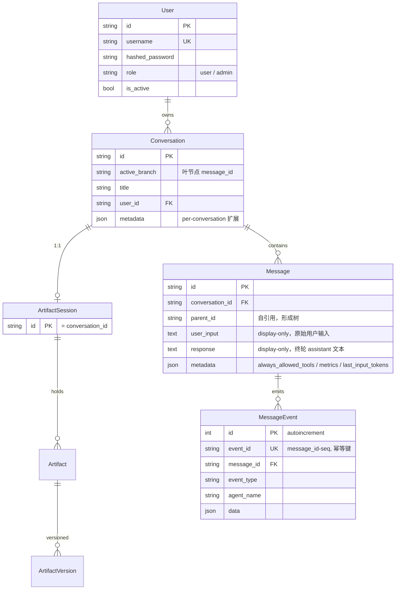
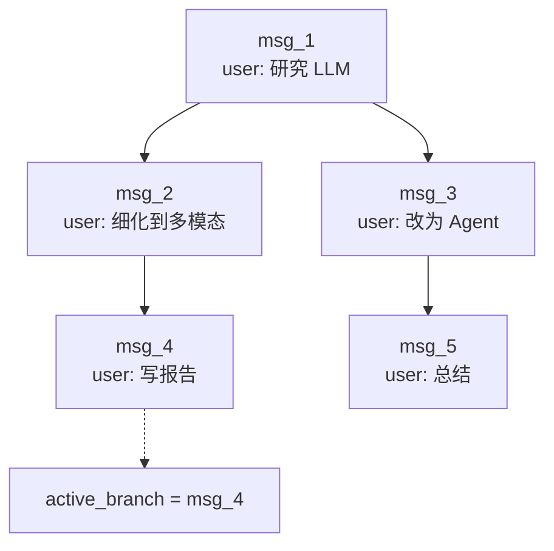

# 数据层

> SQLAlchemy async ORM + Repository 模式 — 三层责任模型的"数据访问层"。

## ORM 模型总览

所有模型定义在 `src/db/models.py`，继承自 `Base = DeclarativeBase()`：


```mermaid
erDiagram
    User ||--o{ Conversation : owns
    Conversation ||--o{ Message : contains
    Conversation ||--o| ArtifactSession : "1:1"
    ArtifactSession ||--o{ Artifact : holds
    Artifact ||--o{ ArtifactVersion : versioned
    Message ||--o{ MessageEvent : emits

    User {
        string id PK
        string username UK
        string hashed_password
        string role "user / admin"
        bool is_active
    }
    Conversation {
        string id PK
        string active_branch "叶节点 message_id"
        string title
        string user_id FK
        json metadata "per-conversation 扩展"
    }
    Message {
        string id PK
        string conversation_id FK
        string parent_id "自引用，形成树"
        text user_input "display-only，原始用户输入"
        text response "display-only，终轮 assistant 文本"
        json metadata "always_allowed_tools / metrics / last_input_tokens"
    }
    ArtifactSession {
        string id PK "= conversation_id"
    }
    MessageEvent {
        int id PK "autoincrement"
        string event_id UK "message_id-seq, 幂等键"
        string message_id FK
        string event_type
        string agent_name
        json data
    }
```

### 表级职责划分

| 表 | 角色 | 生命周期 |
|----|------|---------|
| `users` | 认证主体 | 用户创建即存在 |
| `conversations` | 对话容器，含 `active_branch` 指向当前叶 | 级联删除 messages + artifact_session |
| `messages` | 用户输入 + 助手响应，树结构 | 级联由 conversation 触发 |
| `message_events` | Append-only 执行事件流 | FK 跟随 message |
| `artifact_sessions` | Artifact 容器，与 conversation 1:1 | 级联由 conversation 触发 |
| `artifacts` | Artifact 当前快照（复合 PK） | 级联由 session 触发 |
| `artifact_versions` | 版本历史，版本号**可稀疏** | 复合 FK 级联删除 |

## 对话树结构

Message 通过 `parent_id` 自引用形成树，`Conversation.active_branch` 指向当前活跃叶节点。


```mermaid
flowchart TD
    M1["msg_1<br/>user: 研究 LLM"] --> M2["msg_2<br/>user: 细化到多模态"]
    M1 --> M3["msg_3<br/>user: 改为 Agent"]
    M2 --> M4["msg_4<br/>user: 写报告"]
    M3 --> M5["msg_5<br/>user: 总结"]
    note1["active_branch = msg_4"]
    M4 -.-> note1
```

- 用户可从任意历史消息创建分支（前端 UI 支持）→ 新消息的 `parent_id` 指向被选消息
- `ConversationRepository.get_conversation_path(to_msg_id)` 从目标节点向上回溯 `parent_id` 得到线性路径，供引擎构建对话历史
- `add_message()` 自动更新 `active_branch = new_msg_id`

### Compaction 在树上的语义

Compaction 不再修改 `Message` 行 — 它只往 `MessageEvent` 追加一条 `COMPACTION_SUMMARY` 事件（绑定到触发它的 agent 名），**从不触碰 `parent_id`**。因此：

- 分支结构跨 compaction 完全保留（`Message` 表只负责树形与显示字段）
- 引擎上下文加载时按 path 展开所有 `MessageEvent`，`EventHistory` 从右向左找 `COMPACTION_SUMMARY` 作为 boundary → 摘要之前的事件对后续 LLM 调用不可见（详见 [engine.md → Compaction 机制](engine.md#compaction-机制)）
- 切换到旧分支后沿新 path 展开，已存在分支的 compaction_summary 事件自然继承，互不干扰

> **废弃字段：** `Message.user_input_summary` / `response_summary` 已从 ORM 中移除。对话历史由 `MessageEvent` 唯一承载，`Message.user_input` / `response` 仅作显示用。

## Event Sourcing 层

`MessageEvent` 是执行过程的完整事件链，append-only：

### 关键字段

| 字段 | 用途 |
|------|------|
| `id` | 自增主键，天然时序 |
| `event_id` | 业务去重键（`{message_id}-{seq}`），幂等批量写入时识别重复 |
| `event_type` | `StreamEventType.value` 字符串（`agent_start`/`llm_complete`/`tool_complete` 等） |
| `agent_name` | 产生事件的 agent（`lead_agent` / `search_agent` / ...） |
| `data` | JSON 完整载荷，按 `event_type` 有不同 schema |

### 持久化边界

- `llm_chunk` 标记 `sse_only=True`，**仅 SSE 传输，不入表** — 高频低价值，`llm_complete` 已含完整内容
- 其余事件累积在 `state["events"]`，引擎退出后由 Controller 层调用 `MessageEventRepository.batch_create()` 一次性写入
- 批写遇 `IntegrityError` 时判断是否全部 `event_id` 已存在：是则视为前次重试已成功，静默跳过；否则重抛

### 查询接口

| 方法 | 用途 |
|------|------|
| `get_by_message(message_id)` | 单条消息的完整事件链（Admin Observability UI 用） |
| `get_by_conversation(conv_id)` | 跨 message join，用于对话级分析 |
| `get_by_type(message_id, type)` | 按类型过滤，常用于取 `tool_complete` 列表 |

事件数据的详细 schema 和 Admin 消费路径见 [observability.md](observability.md)。

## Repository 模式

### 泛型基类

`BaseRepository[T]`（`src/repositories/base.py`）封装通用 CRUD：

```python
class BaseRepository(Generic[T]):
    def __init__(self, session: AsyncSession, model_class: Type[T]): ...

    async def get_by_id(self, id) -> Optional[T]
    async def add(self, entity: T) -> T              # flush + commit + refresh
    async def update(self, entity: T) -> T           # flush + commit + refresh
    async def delete(self, entity: T) -> None
    async def flush(self) -> None                    # 立即释放 SQLite write lock
```

异常类型：

- `NotFoundError(entity_type, entity_id)` — 实体不存在
- `DuplicateError(entity_type, entity_id)` — 主键/唯一约束冲突

### 具体 Repository

| Repository | 职责 |
|-----------|------|
| `UserRepository` | 认证相关查询（按 username 取、角色过滤） |
| `ConversationRepository` | 对话/消息树 CRUD、`get_conversation_path()`、标题搜索分页 |
| `ArtifactRepository` | Artifact + Version + ArtifactSession CRUD |
| `MessageEventRepository` | `batch_create` / 按多维度查询（不继承 BaseRepository，因业务模型特殊） |

### Repo 边界规则

严格遵循[三层责任模型](overview.md#三层责任模型)：

- **Repo 只返回 ORM 对象**，不做序列化、不做 ownership check、不做业务逻辑
- ORM 对象**不得逃逸**创建它的 session（Manager 层必须在 session 关闭前转为 dict，或让请求级 session 覆盖 router 的响应构建）
- **Router 层不直接实例化 Repository** — 所有 DB 访问通过 Manager 方法
  - `chat.py` 的事件查询、`admin.py` 的 admin 列表/详情都通过 `ConversationManager.get_message_events()` / `list_admin_conversations()` / `get_admin_conversation_events()` 间接访问 `MessageEventRepository`
  - 唯一例外是 Controller/后台任务层（如 `controller.py`、`controller_factory.py`），它们不是 router，自管 session 生命周期和重试逻辑，可直接创建 Repository

## 事务所有权

**原则：** `DatabaseManager.session()` 只管生命周期（创建 + 关闭），**不做事务控制**。`flush()` + `commit()` 由 Repository 方法内部决定。

### 为什么

SQLite 的写锁是整库级别的。如果用 `async with db.session() as s:` 包裹整个 controller 逻辑并在结束时统一 commit：

- 写锁持续到 controller 结束（可能几十秒，含 LLM 调用）
- 其他请求全部阻塞在 `PRAGMA busy_timeout` 内

Repository 内部 `flush + commit` 的好处：

- 写操作完成立即释放锁
- 每个 Repo 方法是独立的"微事务"边界
- 跨表原子操作（如创建 conversation 同时建 artifact_session）仍在同一方法内完成

### 典型模式

```python
# ConversationRepository.add_message()
async def add_message(self, ...):
    conversation = await self.get_conversation_or_raise(conversation_id)
    existing_msg = await self.get_message(message_id)
    if existing_msg:
        raise DuplicateError(...)

    message = Message(...)
    self._session.add(message)
    conversation.active_branch = message_id   # ORM 属性变动，onupdate 自动刷 updated_at

    await self._session.flush()
    await self._session.commit()              # 写锁在此释放
    await self._session.refresh(message)
    return message
```

### 批量 UPDATE 模式

某些场景下 ORM 实例无其他属性变动但需要刷新 DB-side 计算值（如 `updated_at`），此时用 bulk UPDATE：

```python
# update_response：message.response 变动，但 conversation 本身无变动
await self._session.execute(
    update(Conversation)
    .where(Conversation.id == message.conversation_id)
    .values(updated_at=func.now()),
)
```

注意：bulk UPDATE 之后，同 session 中已持有的 `Conversation` 实例会被 expire，不要再访问其属性（会触发隐式 IO，async 下即 `MissingGreenlet`）。

## ORM 使用规范

这些规则在仓库根 `CLAUDE.md` 的 "Code Conventions" 已列出，这里展开 why。

### 时间戳

```python
created_at: Mapped[datetime] = mapped_column(
    DateTime, server_default=func.now(), nullable=False
)
updated_at: Mapped[datetime] = mapped_column(
    DateTime, server_default=func.now(), onupdate=func.now(), nullable=False
)
```

- **`server_default=func.now()`** 在 INSERT 时由 DB 填值 — 跨时区一致、与客户端时钟无关
- **`onupdate=func.now()`** 在 UPDATE 时由 ORM 自动生成 SQL `SET updated_at = CURRENT_TIMESTAMP` — 但**仅当** ORM 检测到该行有属性变动
- Repo 代码**绝不**写 `entity.created_at = datetime.now()` — 引入客户端时钟依赖

### 优先 ORM 属性变动

当一行已 dirty（有其他字段变动），改用 ORM 属性赋值让 `onupdate` 自动处理时间戳：

```python
conversation.active_branch = message_id   # ✅
# 而不是：
await session.execute(update(...).values(active_branch=..., updated_at=func.now()))
```

### Bulk UPDATE 仅用于 DB-side 计算

如前述 `update_response` 模式。唯一合法理由：**行本身无其他字段变动，但需要 DB-side 函数写入（如 `func.now()`）**。

### 绝不把 SQL 表达式赋给 ORM 属性

```python
entity.updated_at = func.now()   # ❌ SQLAlchemy 不会翻译这个，会当 Python 对象塞进 DateTime 列
```

### 实例过期后不可访问属性

commit 后 session 内持有的 ORM 实例会被 expire。async 下访问过期实例的属性会触发隐式 IO，抛 `MissingGreenlet`。应对：

- 用 `session.refresh(entity)` 显式重新加载
- 或直接发起一个新查询获取当前状态

Repository 方法的 `refresh(entity)` 调用就是为了让返回值对调用方安全。

## Alembic 迁移

- **SQLite 开发模式**：`DatabaseManager._create_tables()` 调用 `Base.metadata.create_all` 自动建表
- **MySQL / PostgreSQL**：依赖 `alembic upgrade head` 建表，启动时 `_check_alembic_version()` 校验 `alembic_version` 表存在且非空，缺失则 fail fast
- Revision 与 head 一致性由 CI/CD 通过 `alembic current --check-heads` 验证，DB 管理器本身不做此校验

## Design Decisions

### 为什么 404 not 403

跨用户访问他人资源时，路由层统一返回 **404 Not Found** 而非 403 Forbidden。

- 403 会泄露资源存在性（"这个 ID 确实存在，只是你没权限"）
- 404 等同于"这个 ID 对你不存在"，攻击者无法枚举
- 代价：合法用户遇到权限问题时排障略难，但 SaaS 场景下可接受
- 这一策略在 API 层实现，Core/Engine/Tools 不感知 `user_id` 以外的鉴权逻辑

### 为什么 Repository 内部控制事务

见上文"事务所有权"。核心是缩短 SQLite 写锁持有时间，同时保持跨表原子操作能力。

### 为什么 MessageEventRepository 不继承 BaseRepository

- MessageEvent 没有"用户级 CRUD"语义 — 只有 append 和只读查询
- `batch_create` 的幂等处理（`IntegrityError` → 验 `event_id` 存在性）与泛型基类的简单 `add` 语义冲突
- 按业务建模时不强行套用泛型更清晰

### 为什么 Message.metadata_ 用 JSON 而非规范化列

- `metadata` 承载异质字段：`always_allowed_tools` / `execution_metrics` 汇总 / `last_input_tokens`
- 这些字段增减频繁且只有 Manager 层读写，规范化成列需频繁迁移
- JSON 列牺牲了 SQL 级查询能力，但换取 schema 稳定性 — 符合中小 SaaS 的迭代节奏
