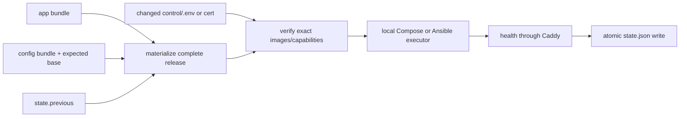

# Deployment Architecture v2

状态：Accepted

## 背景

旧部署层把 CLI、topology parser、SSH/SCP、single/multi-host 顺序、bundle identity、config hotfix、env、maintenance、sandbox preparation、state 和 rollback 都放进约 1,900 行 Shell。连续 reviewer round 暴露的不是孤立 bug，而是同一形状：不同分支重复解析参数或重新推导 active/base 状态，导致 dry-run、lock 和 apply 对同一命令得出不同结论。

release 的不可变 app/config/deploy 契约是正确方向；问题是 executor 边界。v2 保留契约，删除多套状态与多条 mutation path。

## 决策

### 一个控制器、一个状态、一个 apply

`afctl` 是小型静态 Go binary。Go 提供严格 JSON/TOML、显式类型、可单测错误处理、跨平台构建和 kernel advisory lock；目标机不需要 Python runtime 来运行单机控制器。

`.artifactflow/state.json` 是唯一 active/previous authority。删除运行时 `.fleet-state` + `current` symlink 双权威；v1 迁移不尝试保持两者同步。

所有 release 变更先物化为完整 effective release，再进入同一个 apply；target-local env/cert 不伪装成 release，修改后用 `apply current` 进入同一 verify/reconcile：

config-only 不是下游 executor 分支。它先在 lock 内校验 expected base，继承 base app/deploy/sandbox，解开新 config，形成完整 snapshot。rollback 只解析 previous，然后调用相同 executor。

### plan 与 apply 是不同命令

`plan apply`/`plan rollback` 永远只读，不创建 lock 或 release。`apply`/`rollback` 永远拿 lock。不存在通过扫描任意 argv 中 `--dry-run` 来判断是否加锁的逻辑，未知/多余参数直接拒绝。

### 公网/内网是 capability，不是 stack

严格 `control/site.toml` 声明：

| Capability | 值 |
|---|---|
| executor | `local` / `ansible`（实验性） |
| tls | `static` / `acme` |
| infra | `bundled` / `external` |
| sandbox_runtime | `runsc` / `runc` |

Compose substrate 只有 base + capability overlays。生产没有 `build:` 和 `:latest`。target-local secret/cert/site content/inventory/maintenance 和派生 upstream 留在 `control/`，shipped deploy/config 在 immutable release 内且从不作为可写挂载。

### Sandbox 始终存在

移除 `AF_ENABLE_SANDBOX`。`compose.sandbox.yml` 总被包含；runsc 是生产支持 runtime，runc 只能显式选择为 reduced-isolation trusted/dev mode。缺少 runsc 不会降级。

runsc 注册和 scratch filesystem 是稳定 host capability，由主机镜像、配置管理或明确的 commissioning SOP 预置。`afctl` 只检查，不安装 runtime、不格式化磁盘、不修改 `/etc/fstab`。content-addressed sandbox image 是 release artifact，由 apply 加载。Docker socket mount 是所有生产部署接受的显式 host-root-equivalent exposure，不因配置开关隐藏。

### 单机与实验性多机 executor 分工

单机直接调用 Compose，是当前 production-supported executor。实验性多机路径通过 digest 固定的 Ansible Execution Environment，只使用 `ansible.builtin`；playbook 调 Compose CLI，`serial: 1` 滚 app host。`afctl` 保留 release/state/lock/plan 语义，Ansible 只负责远端传输和顺序，不建立第二套 release contract。

控制面 Ansible dependency 被封进 EE。当前实验路径只接受 external PostgreSQL/Redis，不实现跨主机 bundled infra；基于 host-local 文件的通知编辑也不属于多机支持范围，后续应迁移到共享数据库而不是增加文件同步。目标 baseline 是 SSH、POSIX shell、Python 3.9+；app host 还必须预置 runsc/runc 与 scratch mount，不满足时 loud-fail。每个物理机在 inventory 只能用一个 hostname，靠加入多个 group 表达多角色。多控制机协调不在支持范围，一个 site 指定一台控制机。

## 不变量

- unknown CLI flag、TOML/JSON field、manifest role 失败。
- release id 与内容 identity 一一对应；同 id 不同 archive SHA 失败。
- caddy/postgres/redis 以本地 image ID 派生 content tag；不同 release 不共享可覆盖 tag。
- app identity 包含 app/config/deploy/sandbox archive；config identity 包含 expected base。
- tar extraction 拒绝绝对路径、`..`、symlink 和 device entry。
- apply 全窗口持有 kernel lock；进程退出自动释放，没有 stale lock directory。
- health 成功前不写 state；state 用 fsync + rename 原子替换；多机各节点的维护/autoheal 互斥旗标也只在 state 写入后清除。
- 管理员可写 site config 和拓扑派生 upstream 只存在于 `control/`，正常 API/Ansible 不改写 release。
- 没有 Compose v1、runc、self-signed TLS、old release root、missing image 或 manifest guessing fallback。
- 单机 apply 总开 maintenance；失败恢复失败时 maintenance 保留。

## 命令与生命周期

- `site init/migrate-v1/validate`：建立或校验 target-local control plane。
- `doctor`：只读检查 Docker/Compose、runtime、mount、TLS、env 和 EE。
- `plan`：解析同一 contract，但零写入。
- `apply`：唯一 reconcile mutation。
- `status/maintenance`：正常运维。
- `config checkout/apply`：生成基线绑定 bundle，然后复用 apply。

构建脚本只 build/package/finalize manifest。gVisor host package、Ansible EE 和 analyst tooling 都是独立运维物料，不扩大应用 release 脚本职责。应用 apply 也不安装或回滚 `afctl` 自身；控制器升级是显式 operator 动作。

## Failure contract

单机 apply 在 Compose 或 health 失败后 best-effort reconcile 上一个成功 release。无法保证数据库 migration 的分布式回滚；强事务语义与当前私有部署价值不匹配。若恢复失败，命令非零退出并保留维护页，operator 用 logs/status 处理。

实验性多机路径同样是 best-effort rolling，不声称 distributed atomicity。首套真实多机环境在完成 SSH、LB routing、firewall、partial failure 与 rollback 物理验收前，不属于 production-supported contract。

## Removed surface

- public `docker-compose.prod.yml` 与 source checkout deploy
- Shell topology/SSH executor
- config-only `release.sh`
- `AF_ENABLE_SANDBOX`
- `deploy/.env`、`.fleet-state`、`current` symlink authority
- pause/resume deploy choreography、generated SOP、release 内 gVisor/analyst tooling
- controller 内的宿主机 provisioning 与 apply 自升级

`fleet.sh` 只作短期兼容桥，禁止增加功能。
