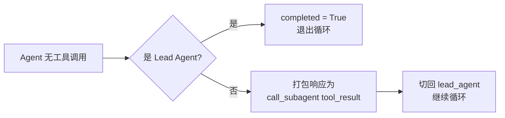
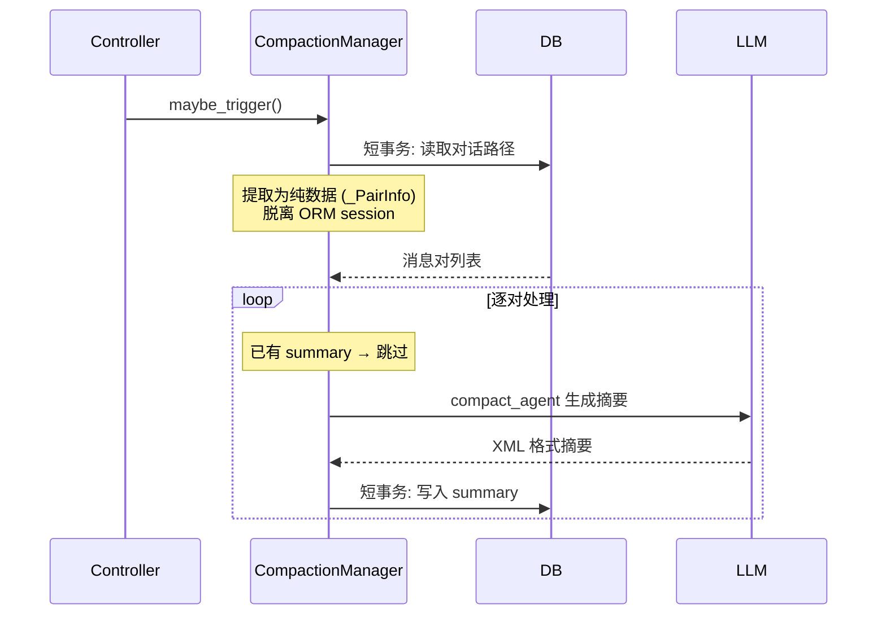

# 执行引擎

> Pi-style 扁平 while loop — 无框架、无中间件、无 DAG，一个循环解决所有问题。

## 核心设计

引擎的核心是 `execute_loop()`（`src/core/engine.py`），一个 async 函数内的 `while not completed` 循环。每次迭代执行完整的 **构建上下文 → 调用 LLM → 解析工具 → 串行执行 → 路由** 流程，不持有跨迭代状态。

### 执行状态

引擎通过一个普通 `dict` 维护状态，`create_initial_state()` 创建初始值：

| 字段 | 类型 | 说明 |
|------|------|------|
| `current_agent` | `str` | 当前执行的 agent（初始 `"lead_agent"`） |
| `completed` | `bool` | 是否完成（退出循环条件） |
| `error` | `bool` | 是否出错 |
| `events` | `List[ExecutionEvent]` | 内存事件列表（最终 batch write） |
| `execution_metrics` | `ExecutionMetrics` | 请求级可观测性指标 |
| `session_id` | `str` | Artifact Session ID |
| `message_id` | `str` | 当前消息 ID（用于租约/中断/取消） |
| `conversation_history` | `List[Dict]` | DB 层对话历史（含 compaction summaries） |
| `always_allowed_tools` | `List[str]` | 用户已永久授权的工具列表 |
| `response` | `str` | 最终响应文本 |

## 主循环流程


### 每轮迭代详解

**1. 构建上下文**（`_build_context`）

- 为 lead_agent 排空消息队列（`hooks.drain_messages`），将注入消息包装为 `QUEUED_MESSAGE` 事件
- 加载 Artifact 清单（通过 `ArtifactManager.list_artifacts`）
- 调用 `ContextManager.build()` 组装完整 messages 列表
- 若当前 agent 已达 `max_tool_rounds`，注入 system 消息提醒总结

**2. 流式调用 LLM**（`_call_llm`）

- 通过 `astream_with_retry()` 流式调用，处理四种 chunk 类型：

| chunk 类型 | 处理方式 |
|-----------|---------|
| `content` | 累加到 `response_content`，推送 `llm_chunk` 事件（SSE-only，不持久化） |
| `reasoning` | 累加到 `reasoning_content`，推送 `llm_chunk` 事件 |
| `usage` | 记录 token 使用量 |
| `final` | 兜底填充（某些 provider 不流式返回内容） |

- LLM 调用完成后推送 `llm_complete` 事件（持久化，含完整内容 + token 统计 + 模型信息 + 耗时）
- 累加 token 到 `execution_metrics.total_token_usage`

**3. 解析工具调用**

- `parse_tool_calls()` 从 LLM 响应中提取 XML 格式的工具调用
- 解析失败返回带 `error` 字段的 `ToolCall`，engine 将错误反馈给 agent（而非静默忽略）

**4. 串行执行工具**（`_execute_tools`）

- 工具排序：`call_subagent` 延后到最后执行，确保同一轮的常规工具不会被 break 跳过
- 每个工具执行前检查取消状态
- 执行流水线详见[工具系统 → 工具执行流水线](tools.md#工具执行流水线)

**5. Agent 完成路由**（`_complete_agent`）

见下节。

## Agent 完成路由

这是引擎最核心的不对称设计：



**Lead Agent 无工具调用：**

- 先检查是否有待处理消息（`drain_messages`）
- 有 → 注入为 `QUEUED_MESSAGE` 事件，`continue` 回到循环顶部
- 无 → `state["completed"] = True`，退出循环

**Subagent 无工具调用：**

- 将 subagent 的响应打包为 XML：`<subagent_result agent="search_agent">...</subagent_result>`
- 作为 `TOOL_COMPLETE` 事件（tool=`call_subagent`）追加到 lead_agent 的事件流
- 切换 `current_agent` 回 `"lead_agent"`
- 下次循环时 lead_agent 的 `_build_context` 会看到这个 tool_result

**设计意图：** Lead Agent 是唯一出口。Subagent 完成后必须经过 Lead 决定是否继续。

## 上下文加载策略

`ContextManager.build()`（`src/core/context_manager.py`）是一个纯静态类方法，为每次 LLM 调用构建完整的 messages 列表。

### System Prompt 组装

System prompt 由六层拼接而成，每层按条件注入：

```
┌─────────────────────────────────────────┐
│ 1. Role Prompt (AgentConfig.role_prompt) │  ← 始终注入
├─────────────────────────────────────────┤
│ 2. System Time                           │  ← 始终注入
├─────────────────────────────────────────┤
│ 3. Task Plan (artifact id="task_plan")   │  ← 有 task_plan artifact 时
├─────────────────────────────────────────┤
│ 4. Artifacts Inventory                   │  ← 有 artifact 工具的 agent
├─────────────────────────────────────────┤
│ 5. Available Subagents                   │  ← 有 call_subagent 的 agent
├─────────────────────────────────────────┤
│ 6. Tool Instructions                     │  ← 有工具的 agent
└─────────────────────────────────────────┘
```

- **Task Plan**：从 artifacts 清单中查找 `id="task_plan"` 的 artifact，注入全文（版本号、内容类型、来源、更新时间）
- **Artifacts Inventory**：每个 artifact 的内容截断到 `INVENTORY_PREVIEW_LENGTH`（预览），超长内容用 `<content_preview>` 标签
- **Available Subagents**：排除当前 agent 和 `internal=true` 的 agent

### 消息构建

两种 agent 类型的消息构建方式不同：

| | Lead Agent | Subagent |
|---|-----------|----------|
| 对话历史 | DB Message 层（含 compaction summaries） | 无 |
| 当前轮事件 | 按 agent_name 过滤 | 按 agent_name 过滤 |

当前轮事件通过 `_build_tool_interactions()` 从内存事件流构建：

| 事件类型 | 映射为 |
|---------|--------|
| `USER_INPUT` | user 消息（用户原始输入） |
| `SUBAGENT_INSTRUCTION` | user 消息（subagent 收到的指令） |
| `QUEUED_MESSAGE` | user 消息（执行中注入） |
| `LLM_COMPLETE` | assistant 消息（附 `_meta` token 信息） |
| `TOOL_COMPLETE` | user 消息（XML 格式化的工具结果） |

### Token-Based 预算截断

当上下文超过 `CONTEXT_MAX_TOKENS` 时触发截断：

1. 从最后一条 assistant 消息的 `_meta.input_tokens`（LLM 报告的累积输入 token 数）估算总量
2. 从左到右扫描 assistant 消息边界，找到第一个使 `total - savings <= budget` 的切点
3. 保留尾部至少 `TRUNCATION_PRESERVE_AI_MSGS` 条 assistant 消息
4. 切点前插入 `"[N earlier messages truncated]"` 占位符
5. 发给 LLM 前剥离所有 `_meta` 字段

## Compaction 机制

Compaction（`src/core/compaction.py`）是异步后台执行的对话摘要压缩，用于在长对话中控制上下文窗口大小。

### 触发条件

`CompactionManager.maybe_trigger()` 在每次请求后调用：

- 条件：`last_input_tokens >= COMPACTION_TOKEN_THRESHOLD`（默认 60,000）
- 已有 compaction 运行中 → 跳过
- 满足条件 → `asyncio.create_task()` 启动后台任务

### 处理流程



**关键设计：**

- **保留策略**：最近 `COMPACTION_PRESERVE_PAIRS`（默认 2）对消息不压缩
- **树结构保持**：compaction 不改变 `parent_id`，保留对话分支结构
- **短事务模式**：读消息 → 关 session → 调 LLM → 开 session → 写 summary，LLM 调用期间不持有 DB 连接
- **上下文传递**：每对的 summary 作为后续对的 context，保持语义连贯
- **分布式锁**：当有 `RuntimeStore` 时使用 owner-key 原语实现跨实例互斥（`compact:{conv_id}`），TTL 60s，每 20s 续期

### 等待 Compaction

`wait_if_running()` 由 `ExecutionController.stream_execute()` 在加载对话历史之前调用（而非在引擎内部），确保读取到 compaction 写入的最新 summary。引擎本身不感知 compaction 状态。

- 本地 compaction → 等待 `asyncio.Event`
- 跨实例 → 轮询分布式锁状态（每 2s 检查一次）

## EngineHooks

Engine 通过 `EngineHooks` 回调接口与外部交互，避免 core → api/services 的层级倒置：

```python
@dataclass
class EngineHooks:
    check_cancelled: Callable[[str], Awaitable[bool]]
    wait_for_interrupt: Callable[[str, Dict[str, Any], float], Awaitable[Optional[Dict[str, Any]]]]
    drain_messages: Callable[[str], Awaitable[List[str]]]
```

| Hook | 参数 | 说明 |
|------|------|------|
| `check_cancelled` | `message_id` | 检查是否被用户取消 |
| `wait_for_interrupt` | `message_id`, `interrupt_data`, `timeout` | 阻塞等待权限确认，超时/断开 → 返回 `None`（deny） |
| `drain_messages` | `message_id` | 排空执行中注入的消息队列 |

这三个 hook 由 Controller 层注入，实际实现委托给 `RuntimeStore`（InMemory 或 Redis）。

## 可观测性

### ExecutionMetrics

每次请求的指标通过 `ExecutionMetrics` 跟踪：

| 字段 | 说明 |
|------|------|
| `started_at` / `completed_at` | 执行起止时间 |
| `total_duration_ms` | 总耗时 |
| `first_input_tokens` | 首次 LLM 调用的 input token 数 |
| `last_input_tokens` | 最后一次 LLM 调用的 input token 数（compaction 触发依据） |
| `last_output_tokens` | 最后一次 LLM 调用的 output token 数 |
| `total_token_usage` | 累计 token（input + output + total） |

注意：`first_input_tokens` 和 `last_input_tokens` 仅对 lead_agent 追踪（用于 compaction 阈值判断和上下文预算评估）。

### 事件收集

所有执行事件在引擎运行期间累积到 `state["events"]` 列表中：

- `llm_chunk` 标记为 `sse_only=True`，仅推 SSE 不入事件列表
- 其余事件（`agent_start`, `llm_complete`, `tool_start`, `tool_complete` 等）全部入列
- 引擎完成后由 Controller 层 batch write 到 `MessageEvent` 表

事件类型完整列表见 `StreamEventType`（`src/core/events.py`）。

## Design Decisions

### 为什么 flat loop 而非 graph/DAG

Pi-style 的设计哲学：用最简单的控制流（while loop）实现全部功能。

- **可调试性**：单一循环，断点打在任意位置都能看到完整状态
- **透明性**：没有隐式中间件链、没有事件总线、没有框架魔法
- **灵活性**：新功能（如消息注入、取消、compaction 等待）只需在循环中加 if 判断
- 对比 LangGraph/middleware 方案：后者引入大量抽象但在实际调试中难以追踪

### 为什么上下文只加载 Conversation 不加载 Events

- Events 是可观测性数据（面向运维），不是 LLM 上下文
- Events 数量远大于 Message（每条 Message 可能产生 10+ Events），全量加载会膨胀上下文窗口
- 当前轮的 tool 交互通过内存 `state["events"]` 构建，不需要从 DB 读取

### 为什么 Compaction 保留树结构

- Compaction 只修改 Message 的 `user_input_summary` / `response_summary` 字段
- `parent_id` 不变 → 对话分支结构完整保留
- 用户可以回溯到任意分支点创建新分支，compaction 不影响这一能力
