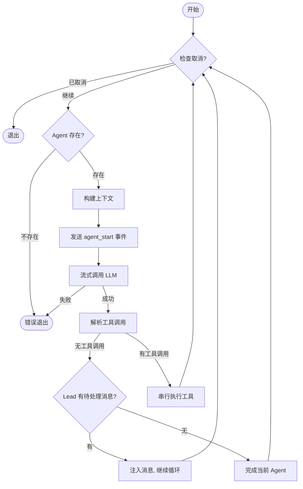
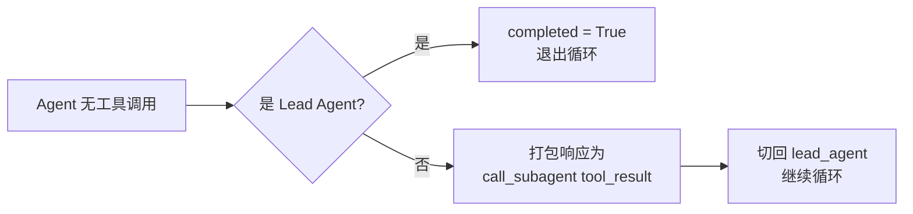
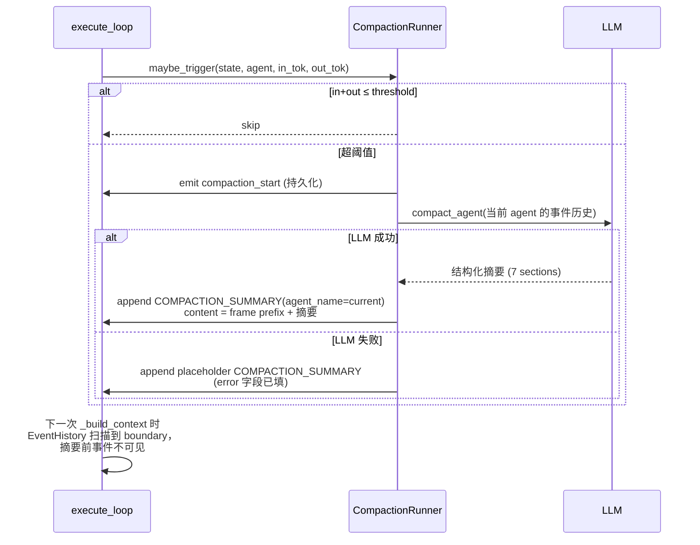

# 执行引擎

> Pi-style 扁平 while loop — 无框架、无中间件、无 DAG，一个循环解决所有问题。

## 核心设计

引擎的核心是 `execute_loop()`（`src/core/engine.py`），一个 async 函数内的 `while not completed` 循环。每次迭代执行完整的 **构建上下文 → 调用 LLM → 解析工具 → 串行执行 → 路由** 流程，不持有跨迭代状态。

### 执行状态

引擎通过一个普通 `dict` 维护状态，`create_initial_state()` 创建初始值：

| 字段 | 类型 | 说明 |
|------|------|------|
| `current_agent` | `str` | 当前执行的 agent（初始 `"lead_agent"`） |
| `completed` | `bool` | 是否完成（退出循环条件） |
| `error` | `bool` | 是否出错 |
| `events` | `List[ExecutionEvent]` | 事件流（路径历史事件 `is_historical=True` + 本轮新追加事件 `is_historical=False`；新事件在引擎退出后 batch write） |
| `execution_metrics` | `ExecutionMetrics` | 请求级可观测性指标 |
| `session_id` | `str` | Artifact Session ID |
| `message_id` | `str` | 当前消息 ID（用于租约/中断/取消） |
| `current_task` | `str` | 本轮用户原始输入（引擎入口会追加为首个 `USER_INPUT` 事件） |
| `always_allowed_tools` | `List[str]` | 用户已永久授权的工具列表 |
| `response` | `str` | 最终响应文本 |

轮起始时，Controller 从 `MessageEvent` 表按 conversation path 加载全部历史事件（`is_historical=True`）填入 `state["events"]`；引擎循环中新增事件 `is_historical=False`。**没有单独的 `conversation_history` 字段** — 历史和当前轮事件统一来自 `state["events"]`，由 `EventHistory` 在 build 时做 boundary 扫描 + agent 过滤（详见下文"消息构建"）。

## 主循环流程



### 每轮迭代详解

**1. 构建上下文**（`_build_context`）

- 为 lead_agent 排空消息队列（`hooks.drain_messages`），将注入消息包装为 `QUEUED_MESSAGE` 事件
- 加载 Artifact 清单（通过 `ArtifactManager.list_artifacts`）
- 调用 `ContextManager.build()` 组装完整 messages 列表
- 若当前 agent 已达 `max_tool_rounds`，注入 system 消息提醒总结

**2. 流式调用 LLM**（`_call_llm`）

- 通过 `astream_with_retry()` 流式调用，处理四种 chunk 类型：

| chunk 类型 | 处理方式 |
|-----------|---------|
| `content` | 累加到 `response_content`，推送 `llm_chunk` 事件（SSE-only，不持久化） |
| `reasoning` | 累加到 `reasoning_content`，推送 `llm_chunk` 事件 |
| `usage` | 记录 token 使用量 |
| `final` | 兜底填充（某些 provider 不流式返回内容） |

- LLM 调用完成后推送 `llm_complete` 事件（持久化，含完整内容 + token 统计 + 模型信息 + 耗时）
- 累加 token 到 `execution_metrics.total_token_usage`

**3. 解析工具调用**

- `parse_tool_calls()` 从 LLM 响应中提取 XML 格式的工具调用
- 解析失败返回带 `error` 字段的 `ToolCall`，engine 将错误反馈给 agent（而非静默忽略）

**4. 串行执行工具**（`_execute_tools`）

- 工具排序：`call_subagent` 延后到最后执行，确保同一轮的常规工具不会被 break 跳过
- 每个工具执行前检查取消状态
- 执行流水线详见[工具系统 → 工具执行流水线](tools.md#工具执行流水线)

**5. Agent 完成路由**（`_complete_agent`）

见下节。

## Agent 完成路由

这是引擎最核心的不对称设计：



**Lead Agent 无工具调用：**

- 先检查是否有待处理消息（`drain_messages`）
- 有 → 注入为 `QUEUED_MESSAGE` 事件，`continue` 回到循环顶部
- 无 → `state["completed"] = True`，退出循环

**Subagent 无工具调用：**

- 将 subagent 的响应打包为 XML：`<subagent_result agent="search_agent">...</subagent_result>`
- 作为 `TOOL_COMPLETE` 事件（tool=`call_subagent`）追加到 lead_agent 的事件流
- 切换 `current_agent` 回 `"lead_agent"`
- 下次循环时 lead_agent 的 `_build_context` 会看到这个 tool_result

**设计意图：** Lead Agent 是唯一出口。Subagent 完成后必须经过 Lead 决定是否继续。

## 上下文加载策略

`ContextManager.build()`（`src/core/context_manager.py`）是一个纯静态类方法，为每次 LLM 调用构建完整的 messages 列表。

### System Prompt 组装

System prompt 由六层拼接而成，每层按条件注入：

```
┌─────────────────────────────────────────┐
│ 1. Role Prompt (AgentConfig.role_prompt) │  ← 始终注入
├─────────────────────────────────────────┤
│ 2. System Time                           │  ← 始终注入
├─────────────────────────────────────────┤
│ 3. Task Plan (artifact id="task_plan")   │  ← 有 task_plan artifact 时
├─────────────────────────────────────────┤
│ 4. Artifacts Inventory                   │  ← 有 artifact 工具的 agent
├─────────────────────────────────────────┤
│ 5. Available Subagents                   │  ← 有 call_subagent 的 agent
├─────────────────────────────────────────┤
│ 6. Tool Instructions                     │  ← 有工具的 agent
└─────────────────────────────────────────┘
```

- **Task Plan**：从 artifacts 清单中查找 `id="task_plan"` 的 artifact，注入全文（版本号、内容类型、来源、更新时间）
- **Artifacts Inventory**：每个 artifact 的内容截断到 `INVENTORY_PREVIEW_LENGTH`（预览），超长内容用 `<content_preview>` 标签
- **Available Subagents**：排除当前 agent 和 `internal=true` 的 agent

### 消息构建

历史与当前轮事件**统一来源**：都从 `state["events"]` 读出，`EventHistory.build_event_history(events, agent_name)`（`src/core/event_history.py`）负责 boundary 扫描 + agent 过滤，返回 LLM-ready 的 messages 列表。

流程：

1. **按 `agent_name` 过滤**事件（lead 只看 lead 的事件；subagent 只看自己的）
2. **从右向左扫描最近的 boundary**：
   - `COMPACTION_SUMMARY`（tagged 为当前 agent）— 始终作为 boundary
   - `SUBAGENT_INSTRUCTION` 且 `data.fresh_start=True` — subagent 额外 boundary（按会话隔离）
3. 输出 `[boundary_content, ...boundary 之后的所有事件]`，按下表映射为 LLM 消息

| 事件类型 | 映射为 |
|---------|--------|
| `COMPACTION_SUMMARY` | user 消息（带有 *"Prior conversation has been compacted..."* 前缀，作为 agent 对历史的全部记忆） |
| `USER_INPUT` | user 消息（用户原始输入） |
| `SUBAGENT_INSTRUCTION` | user 消息（subagent 收到的指令） |
| `QUEUED_MESSAGE` | user 消息（执行中注入） |
| `LLM_COMPLETE` | assistant 消息（附 `_meta` token 信息） |
| `TOOL_COMPLETE` | user 消息（XML 格式化的工具结果） |

两种 agent 类型的差异：

| | Lead Agent | Subagent |
|---|-----------|----------|
| boundary | `COMPACTION_SUMMARY` | `COMPACTION_SUMMARY` **或** `SUBAGENT_INSTRUCTION.fresh_start=True` |
| 历史可见性 | 最近 compaction_summary 之后的全部 lead 事件（跨多轮消息） | 仅当前 subagent 会话（上一次 fresh_start 之后） |

> 注：引擎不做任何"token 预算截断"。上下文增长到超过阈值时由下节的 **Compaction** 处理；compaction 失败时写入 placeholder summary，语义等同硬截断。

## Compaction 机制

`CompactionRunner`（`src/core/compaction_runner.py`）运行在引擎循环内部，**同步**为当前 agent 产出一个结构化摘要并 append 到 `state["events"]` 尾部，`EventHistory` 的右到左扫描会在此 boundary 处停下 → 摘要之前的事件对后续 LLM 调用不可见。

### 触发条件

每次 `_call_llm` 返回后，`compaction_runner.maybe_trigger(state, agent_name, input_tokens, output_tokens)` 被立即调用：

- 条件：`input_tokens + output_tokens > COMPACTION_TOKEN_THRESHOLD`（默认 60,000，本次 LLM 调用的 I/O 合计）
- 满足条件 → 立即（blocking）执行 `compact_agent`，append `COMPACTION_SUMMARY` 到 tail

### 处理流程



**关键设计：**

- **Summary 即 agent 的唯一记忆** — compaction 之前的 `LLM_COMPLETE` / `TOOL_COMPLETE` 原文对该 agent 不再可见。`compact_agent` prompt 的 *Current Work* / *Next Step* 两节必须承载 in-flight 状态（例如"刚调用了工具 X，结果尚未返回"），以便 compaction 之后 append 的 tool_result 仍可解读。
- **不兜底工具结果溢出**：compaction 只在 LLM 调用后触发；若 compaction 之后同轮某工具返回超大 blob，下一次 LLM 调用仍可能超模型上限。工具作者自行处理 `max_length` / 分页 / 结构化截断（附 `(truncated at N)` 标记）。真超了 → LLM 调用 loudly 报错（ERROR 给用户），不静默丢数据。
- **Per-agent 隔离**：`COMPACTION_SUMMARY` 携带 `agent_name`，`EventHistory` 先按 agent 过滤再扫 boundary → lead 与 subagent 的 compaction 完全独立。subagent 的 `SUBAGENT_INSTRUCTION.fresh_start=True` 额外做会话级隔离。
- **失败回退 = placeholder summary**：LLM 调用失败时 append 一条带 `error` 字段的占位摘要到同一 tail 位置，boundary 语义完全一致 → 等价于硬截断。无独立的截断代码路径。
- **`compaction_start` 事件持久化**：在开始调用 LLM 前先 append 一条 `COMPACTION_START` 事件（含 triggering inputs），用于 replay / audit。
- **树结构保持**：compaction 只往 `MessageEvent` append 新事件，完全不触碰 `Message.parent_id` / 分支结构。

### 无等待、无分布式锁

旧设计（异步后台 task + `compact:{conv_id}` 分布式锁 + `wait_if_running()`）已全部移除：

- Compaction 同步内嵌在引擎循环中，不存在"compaction 在跑、历史未写"的窗口
- 无跨实例互斥问题 — 每个 `execute_loop` 拥有自己的 `state["events"]`
- 无 `/chat/{id}/compact` 端点、无手动触发 API

## EngineHooks

Engine 通过 `EngineHooks` 回调接口与外部交互，避免 core → api/services 的层级倒置：

```python
@dataclass
class EngineHooks:
    check_cancelled: Callable[[str], Awaitable[bool]]
    wait_for_interrupt: Callable[[str, Dict[str, Any], float], Awaitable[Optional[Dict[str, Any]]]]
    drain_messages: Callable[[str], Awaitable[List[str]]]
```

| Hook | 参数 | 说明 |
|------|------|------|
| `check_cancelled` | `message_id` | 检查是否被用户取消 |
| `wait_for_interrupt` | `message_id`, `interrupt_data`, `timeout` | 阻塞等待权限确认，超时/断开 → 返回 `None`（deny） |
| `drain_messages` | `message_id` | 排空执行中注入的消息队列 |

这三个 hook 由 Controller 层注入，实际实现委托给 `RuntimeStore`（InMemory 或 Redis）。

## 可观测性

### ExecutionMetrics

每次请求的指标通过 `ExecutionMetrics` 跟踪：

| 字段 | 说明 |
|------|------|
| `started_at` / `completed_at` | 执行起止时间 |
| `total_duration_ms` | 总耗时 |
| `first_input_tokens` | 首次 LLM 调用的 input token 数 |
| `last_input_tokens` | 最后一次 LLM 调用的 input token 数 |
| `last_output_tokens` | 最后一次 LLM 调用的 output token 数 |
| `total_token_usage` | 累计 token（input + output + total） |

注意：`first_input_tokens` 和 `last_input_tokens` 仅对 lead_agent 追踪，作为上下文预算评估的观测指标。**Compaction 触发依据不是这些 metric** — `CompactionRunner` 在每次 LLM 调用后直接拿该次调用的 `input_tokens + output_tokens` 比对阈值，不读 metrics。

### 事件收集

所有执行事件在引擎运行期间累积到 `state["events"]` 列表中：

- `llm_chunk` 标记为 `sse_only=True`，仅推 SSE 不入事件列表
- 其余事件（`agent_start`, `llm_complete`, `tool_start`, `tool_complete` 等）全部入列
- 引擎完成后由 Controller 层 batch write 到 `MessageEvent` 表

事件类型完整列表见 `StreamEventType`（`src/core/events.py`）。

## Design Decisions

### 为什么 flat loop 而非 graph/DAG

Pi-style 的设计哲学：用最简单的控制流（while loop）实现全部功能。

- **可调试性**：单一循环，断点打在任意位置都能看到完整状态
- **透明性**：没有隐式中间件链、没有事件总线、没有框架魔法
- **灵活性**：新功能（如消息注入、取消、compaction 等待）只需在循环中加 if 判断
- 对比 LangGraph/middleware 方案：后者引入大量抽象但在实际调试中难以追踪

### 为什么历史改用 MessageEvent 而不是 Message 字段

- 旧设计中 `Message.user_input_summary` / `response_summary` 承载了对话历史的"摘要版本"，但这意味着 compaction 产出与 Message 行被耦合 — 必须修改已存在的行，且分支切换后不同分支可能看到不一致的摘要
- 现在历史 = "按 conversation path 展开的 `MessageEvent` 列表"，compaction 只往末尾 append `COMPACTION_SUMMARY`，`Message` 表回归纯粹的树结构 + display 字段
- 对话 replay / audit 也统一走 `MessageEvent`，不需要再区分"显示字段 vs 摘要字段"

### 为什么 Compaction 保留树结构

- Compaction 只 append `COMPACTION_SUMMARY` 事件，绝不改任何 `Message.parent_id`
- 分支切换后新分支从父节点的 path 继承历史事件（含已存在的 compaction_summary），互不干扰
- 用户可以回溯到任意分支点创建新分支，compaction 不影响这一能力
