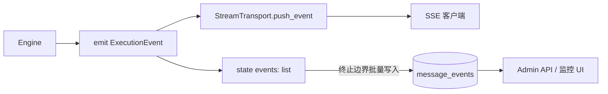

# 可观测性与监控

> Event Sourcing 做回看 + Admin API 做审计 + 健康检查做探活 — 让运行时是"透明盒子"而非"黑盒子"。

## 总体设计

ArtifactFlow 的可观测性建立在 **Event Sourcing** 上：引擎执行过程中产生的每一个 `ExecutionEvent`，除了实时通过 SSE 推给前端（见 [streaming.md](streaming.md)），还会在执行边界批量落库到 `MessageEvent` 表。之后任何时刻都能按 `message_id` 完整重放一次执行，无需保留额外日志。



两个关键设计：

- **双路投递**：SSE 实时性优先（包括 `llm_chunk`），DB 则只在终止边界（`complete` / `cancelled` / `error`）一次性批量写入 — 高频事件不拖慢事务。
- **`llm_chunk` SSE-only**：见 [streaming.md → Design Decisions](streaming.md#为什么-llm_chunk-不持久化)。

## MessageEvent 表

`src/db/models.py`：

| 字段 | 类型 | 说明 |
|------|------|------|
| `id` | `int` 自增 | 主键，天然有序 |
| `event_id` | `str(96)` unique, nullable | 业务去重键 `{message_id}-{seq}`，支持批量写入重试幂等 |
| `message_id` | FK → `messages.id` ON DELETE CASCADE | 所属 message |
| `event_type` | `str(32)` | `StreamEventType.value` |
| `agent_name` | `str(64)` nullable | 产生事件的 agent，Controller 层事件为 null |
| `data` | `JSON` nullable | 完整事件 payload，不截断 |
| `created_at` | `DateTime` server_default=`func.now()` | 写入时间 |

**索引**：`ix_message_events_message` on `message_id` — 查询模式永远是"按 message 拉时间线"。

**表特性：append-only**。不做 UPDATE、不做 DELETE（除消息级 CASCADE）。这让表的写锁持有极短，适配 SQLite 单写锁。

## 持久化边界

`src/core/controller.py` 的 `_persist_events()`：

```python
# 伪代码
async def _persist_events(state):
    events = state["events"]
    db_events = [
        MessageEvent(
            event_id=f"{message_id}-{seq}",
            message_id=message_id,
            event_type=e.event_type,
            agent_name=e.agent_name,
            data=e.data,
        )
        for seq, e in enumerate(events)
    ]
    await event_repo.batch_create(db_events)
```

**触发点**：引擎 loop 退出后进入 post-processing，`_persist_events()` 一次性批量写入 `state["events"]` 累积的全部事件。`complete` / `cancelled` 两条路径走的是"先写 DB、后 emit 终端事件到 SSE"：Controller 在 post-processing 内把终端事件 append 到 events 列表、调用 `_persist_events()`、再 yield 给 SSE — 前端收到 `complete` / `cancelled` 时 DB 已就绪。

**`error` 路径不保证可持久化**：

- 引擎内部抛异常时，Controller 捕获后立即把 `error` 事件推进事件队列（yield 给 SSE 客户端），之后才在 post-processing 里调用 `_persist_events()`。此时 SSE 与 DB 之间存在竞争窗口，窗口大小取决于 post-processing 其余步骤（flush artifacts、DB retry backoff 指数为 1s/2s/4s）
- 更严重：post-processing 自身出错时（`controller.py` 的 except 分支），Controller 直接 yield 一条 SSE `error`，这条事件**既不会追加到 `state["events"]`，也不会触发 `_persist_events()`** — 永远不会进 `MessageEvent` 表

结论：**不要假设 SSE 收到 `error` 后 `GET /messages/{id}/events` 能查到该错误**。监控回看以 DB 为准时，必须把 SSE `error` 视为"可能只出现在实时流里"的事件；需要强一致审计的场景应在外层（Controller 之外）补一份日志。Admin 监控 UI 因为是人工粒度，不会感知。

批量写入本身的收益：

- 一次 INSERT，比逐事件事务快一个数量级
- `event_id` 的 unique 约束保证崩溃重启后重试幂等

**排除规则**：引擎 emit `llm_chunk` 时显式传 `sse_only=True`，Controller 只推 SSE 不加入 `state["events"]` — DB 天然没有这一类。

## 事件目录

每种事件 `data` 字段的契约（所有事件都含 `type`, `timestamp`, `agent`, `data` 四层外壳，下列仅展开 `data`）：

### Controller 层

| 事件 | `data` 字段 |
|------|------------|
| `METADATA` | `conversation_id`, `message_id` |
| `COMPLETE` | `success=true`, `conversation_id`, `message_id`, `response`, `execution_metrics` |
| `CANCELLED` | `success=false`, `cancelled=true`, `conversation_id`, `message_id`, `response`, `execution_metrics` |
| `ERROR` | `success=false`, `conversation_id`, `message_id`, `error`, `execution_metrics` |

`execution_metrics` 汇总整次执行指标（总耗时、总 token、每 agent 轮数等），是监控面板的核心字段。

### Agent 层

| 事件 | `data` 字段 |
|------|------------|
| `AGENT_START` | `agent`, `system_prompt`（可能 None） |
| `LLM_CHUNK` | `content` 或 `reasoning_content`（增量，SSE-only） |
| `LLM_COMPLETE` | `content`, `reasoning_content?`, `token_usage={input,output,total}`, `model`, `duration_ms` |
| `AGENT_COMPLETE` | `agent`, `content` |

`LLM_COMPLETE` 是"每次 LLM 调用"的边界，包含本次调用的 model、耗时、token 明细 — 成本分析和性能归因都从这里来。

### 工具 / 权限层

| 事件 | `data` 字段 |
|------|------------|
| `TOOL_START` | `tool`, `params` |
| `TOOL_COMPLETE` | `tool`, `success`, `result_data?`, `error?`, `duration_ms`, `params`, `metadata?` |
| `PERMISSION_REQUEST` | `permission_level`, `tool`, `params` |
| `PERMISSION_RESULT` | `approved`, `tool`, `reason?` |

`tool_complete.metadata` 里携带 `artifact_snapshot` 时，前端据此实时刷新 Artifact 面板（不等 DB flush），见 [artifacts.md → Write-Back](artifacts.md#write-back-cache-机制).

Permission 事件的阻塞语义属于 RuntimeStore，见 [concurrency.md → Interrupt 机制](concurrency.md#interrupt-机制).

### Compaction 层

| 事件 | `data` 字段 |
|------|------------|
| `COMPACTION_START` | `last_input_tokens`, `last_output_tokens`（触发时本次 LLM 调用的 token 数） |
| `COMPACTION_SUMMARY` | `content`（带 frame prefix 的结构化摘要）, `token_usage={input,output,total}`, `duration_ms`, `model`, `error?`（LLM 失败时为占位符内容 + 非空 error） |

两条事件都带 `agent_name`（触发 compaction 的 agent），都持久化。`EventHistory` 在构建历史时以 `COMPACTION_SUMMARY` 作为 boundary（见 [engine.md → Compaction 机制](engine.md#compaction-机制)），`COMPACTION_START` 对历史构建无影响 — 仅用于前端实时指示和 replay 重放。

### 输入层

| 事件 | `data` 字段 |
|------|------------|
| `USER_INPUT` | `content`（用户首条输入） |
| `QUEUED_MESSAGE` | `content`（执行中注入的消息） |
| `SUBAGENT_INSTRUCTION` | `instruction`（lead → sub 的指令） |

`QUEUED_MESSAGE` 通过 `/chat/{id}/inject` 触发，包装后进入 lead 的上下文（见 [concurrency.md → 消息注入](concurrency.md#消息注入)），但只会作为事件持久化，不会创建独立的 `Message` 行。

## Admin API

`src/api/routers/admin.py`，所有端点 `Depends(require_admin)`：

### GET `/api/v1/admin/conversations`

**Query：**

| 参数 | 类型 | 默认 | 约束 |
|------|------|------|------|
| `limit` | int | 20 | 1..100 |
| `offset` | int | 0 | ≥0 |
| `q` | str? | — | 按 title 搜索，max_length=200 |
| `user_id` | str? | — | 按 owner 过滤，max_length=64 |

**响应**：`AdminConversationListResponse`

```json
{
  "conversations": [
    {
      "id": "...", "title": "...", "user_id": "...", "user_display_name": "...",
      "message_count": 42, "is_active": true,
      "created_at": "...", "updated_at": "..."
    }
  ],
  "total": 120,
  "has_more": true
}
```

`is_active` 的来源是 **RuntimeStore.list_active_conversations()** 的实时查询（内存 dict 或 Redis 扫描），与 DB 表无关 — 这保证标记反映真实执行态而非历史态。Redis 模式下这是跨实例一致的视图。

### GET `/api/v1/admin/conversations/{conv_id}/events`

**响应**：`AdminConversationEventsResponse`

```json
{
  "conversation_id": "...",
  "title": "...",
  "messages": [
    {
      "message_id": "...",
      "user_input": "...",
      "response": "...",
      "created_at": "...",
      "events": [
        {"id": 1, "event_type": "agent_start", "agent_name": "lead_agent",
         "data": {...}, "created_at": "..."}
      ],
      "execution_metrics": {...}
    }
  ]
}
```

**分组逻辑**：后台 `conversation_manager.get_admin_conversation_events(conv_id)` 一次取出 conversation + messages + events，Router 层按 `message_id` 分组，`execution_metrics` 从 `message.metadata_["execution_metrics"]` 抽取（该字段在 `COMPLETE` 事件时由 Controller 同步写回 message）。

**不存在独立的"单 message events"端点** — 用户侧由 `GET /chat/{conv_id}/messages/{msg_id}/events` 提供（见 [../guides/api-reference.md](../guides/api-reference.md#chat-对话)），Admin 侧的粒度是整个对话。

## 监控 UI

前端 `components/chat/ObservabilityPanel.tsx` 是 Admin 专属入口（受 `uiStore.observabilityVisible` 门控），消费上述 Admin API。主要视图：

- **对话浏览器**：分页 + title 搜索 + 活跃标记（绿点），使用 `/admin/conversations`
- **事件时间线**：按 `message_id` 折叠，事件类型色彩编码（LLM 紫 / Tool 蓝 / Permission 橙 / Error 红）
- **事件详情面板**：按 `event_type` 分派渲染
  - `llm_complete` → token / model / duration 仪表
  - `tool_complete` → params / result / error
  - `permission_request/result` → 审批上下文
  - `error` → 完整堆栈（`data.error` 字段）

详细前端结构见 [../frontend.md](../frontend.md).

## 健康检查

`src/api/main.py`：

### GET `/health/live`

- 存活探针，始终返回 200 `{"status": "ok"}`
- 用于 K8s liveness probe — 只要 app 进程活着就通过

### GET `/health/ready`

- 就绪探针，检查依赖连通性：
  - **DB**：`SELECT 1` via `get_db_manager().session()`
  - **Redis**（若配置）：`await redis.ping()`
- 全部通过 → 200；任意失败 → 503
- 响应体始终包含各项结果：

```json
{"status": "ok", "db": "ok", "redis": "ok"}
// 或
{"status": "error", "db": "error", "redis": "ok"}
```

- 用于 K8s readiness probe — DB 抖动时 Pod 被摘流量，不再接新请求

两个端点都无鉴权 — 故意设计，给 LB / K8s 直接探测。

## Design Decisions

### 为什么 `data` 用 JSON 而非定长 schema

- 事件类型有 15 种且会随功能扩展（新工具、新 agent 都可能新增事件形状）
- 若每种事件独立列，每次扩展都要 migration — 与"agent-as-data"的扩展哲学冲突
- JSON 在 PG / MySQL / SQLite 都有原生支持，查询能力足够（按 `event_type` 先过滤，再按需解析）
- 代价：失去 schema 保证，由前端 `types/events.ts` 的 TypeScript 接口 + 后端发射处约定共同守护 — 加上 event sourcing 的 append-only 特性，老版本数据不会被破坏

### 为什么批量写入而非逐事件落库

- 典型执行产生 50–200 个事件 — 逐条 INSERT 意味着 50–200 个事务 commit，在 SQLite WAL 下也占用显著写锁时间
- 批量一次 INSERT + 一次 commit，总耗时降一个数量级
- 原子性副作用：要么整个执行的事件全部落库，要么全部不落 — 配合 `event_id` unique 保证重试幂等
- 风险：崩溃时丢失未批写的事件 — 但前端已收到了 SSE 实时流，只是 DB 回看能力缺失一次执行；生产权衡可接受

### 为什么 `is_active` 从 RuntimeStore 而非 DB 读

- DB 里的 `conversation.updated_at` 只能反映"最近有消息"，不等于"正在执行"
- RuntimeStore 的 active 状态来自 `engine_interactive` 维度（见 [concurrency.md → 双状态生命周期](concurrency.md#双状态生命周期)），这是真实的执行态
- Redis 模式下 RuntimeStore 本身跨实例一致 — Admin 看到的"谁在跑"是全集群视图
- 代价：Admin 页面每次刷新都要查一次 RuntimeStore（相对 DB 稍贵），但 Admin 访问频率低，可接受

### 为什么 `llm_chunk` 不做压缩后持久化

- 尝试过"把 chunks 按 token 累积存成单行"的折中方案 — 复杂度远高于直接用 `llm_complete`（后者本就包含完整 content）
- 唯一的损失是"token 到达时间序列"，但性能分析的粒度在"单次 LLM 调用"就足够，`llm_complete.duration_ms` 覆盖这一层
