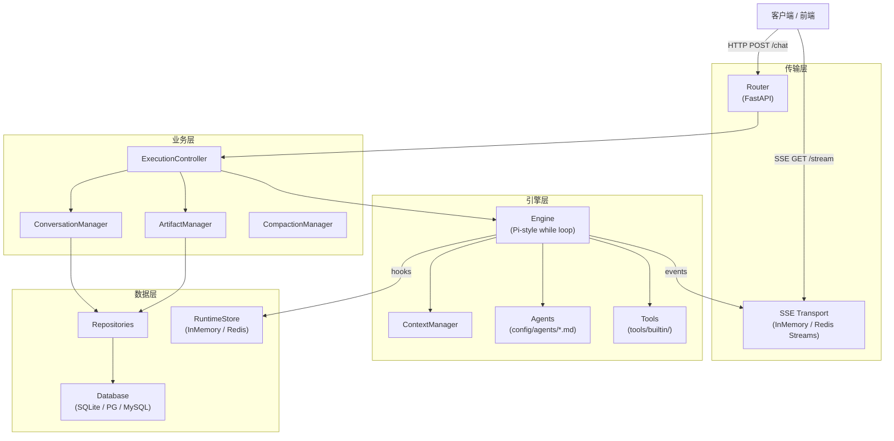
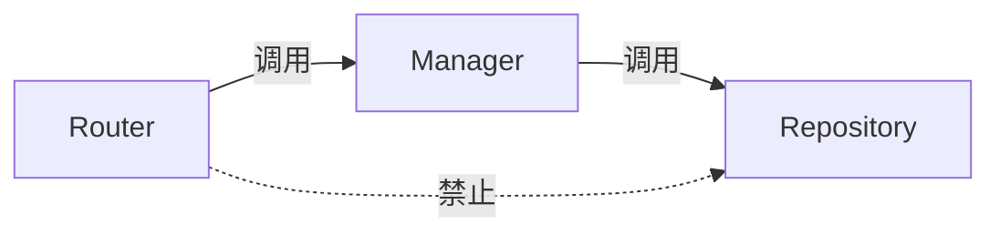
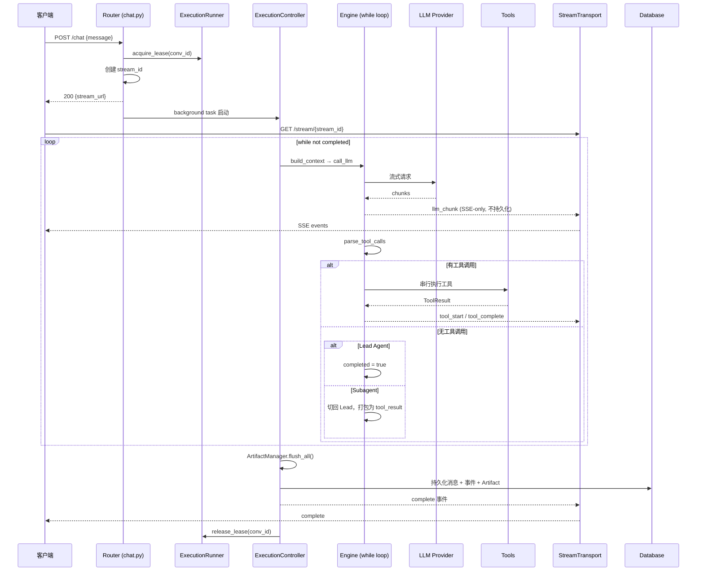
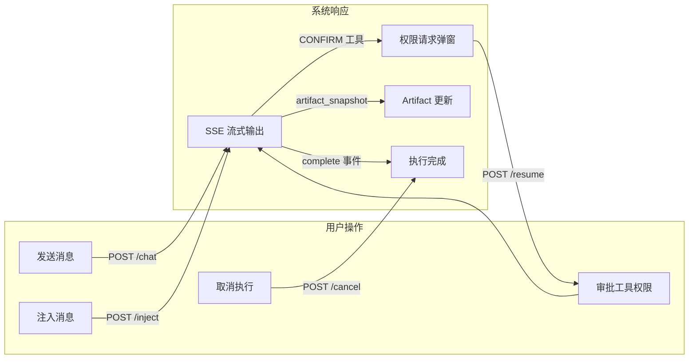

# 架构概览

ArtifactFlow 采用三层责任模型和 Pi-style 扁平执行引擎，以最小抽象实现多 Agent 协作。

## 整体架构

## 三层责任模型

ArtifactFlow 的代码组织遵循严格的三层分离：

| 层 | 目录 | 职责 | 不做什么 |
|----|------|------|----------|
| **Router** | `src/api/routers/` | 认证、参数解析、HTTP 状态码映射 | 不含业务逻辑，不直接调用 Repository |
| **Manager** | `src/core/`, `src/tools/builtin/artifact_ops.py` | 用例编排：所有权校验、历史格式化、Artifact 写回、序列化 | 不关心 HTTP 协议，不直接操作 ORM session |
| **Repository** | `src/repositories/` | 纯数据访问：返回 ORM 对象，管理事务 flush/commit | 不含格式化、序列化或业务逻辑 |

**关键约束：** Router 必须通过 Manager 访问数据，不可绕过 Manager 直接调用 Repository。

## 请求生命周期

一次用户消息从发送到接收完整响应的全流程：

### 关键节点说明

1. **POST /chat 返回 stream_url** — 不等待执行完成，立即返回。客户端用返回的 `stream_url` 建立 SSE 连接
2. **Background task** — 执行在后台任务中运行，生命周期独立于 HTTP 请求
3. **Lease** — `ExecutionRunner` 通过租约保证同一对话同时只有一个执行（409 = lease conflict）
4. **flush_all()** — Artifact 写回在引擎循环结束后一次性执行，中间编辑折叠为单次持久化

## 配置化扩展点

ArtifactFlow 的核心扩展机制全部基于配置文件，无需修改 Python 代码：

| 扩展点 | 配置位置 | 格式 | 热加载 |
|--------|----------|------|--------|
| **Agent** | `config/agents/*.md` | YAML frontmatter + Markdown role prompt | 重启生效 |
| **Model** | `config/models/models.yaml` | YAML（alias, provider, params） | 重启生效 |
| **Tool** | `src/tools/builtin/` | Python 类（继承 `BaseTool`） | 需重启 |

### 当前 Agent 清单

| Agent | 职责 | 工具 | 备注 |
|-------|------|------|------|
| `lead_agent` | 协调者，任务规划，Artifact 管理 | 全部工具 + `call_subagent` | 唯一出口 |
| `search_agent` | Web 搜索 | `web_search` (AUTO) | max 3 rounds |
| `crawl_agent` | 网页内容提取 | `web_fetch` (CONFIRM) | max 3 rounds |
| `compact_agent` | 生成对话摘要 | 无 | internal，不可被 `call_subagent` 调用 |

## 信号流：用户视角的完整交互

## Design Decisions

### 为什么选 Pi-style flat loop（vs LangGraph / middleware）

ArtifactFlow 的执行引擎是一个朴素的 `while not completed` 循环，没有 graph、DAG、middleware chain 或状态机。

**选择理由：**

- **可调试性** — 整个执行流程在一个函数内，断点可以直接加在循环体里。不存在框架内部的隐式调度或回调链
- **透明性** — 每一轮做什么完全由代码决定：build context → call LLM → parse tools → execute → route。没有需要理解的框架概念
- **足够用** — 当前的 Agent 协作模型（Lead 分发 → Subagent 执行 → 结果回传）不需要 DAG 级别的复杂路由

**参考：** [Pi agent](https://github.com/badlogic/pi-mono) — 同样采用扁平循环的 Agent 实现

### 三层模型的边界划分原则

三层划分的核心考量是**最小化每层的知识依赖**：

- **Router 不知道 ORM** — 只处理 HTTP 协议，不导入 Repository。这使得 API 层可以独立测试
- **Manager 不知道 HTTP** — 只处理业务用例。同一个 Manager 方法可以被 Router 调用，也可以被 CLI 脚本调用
- **Repository 不知道业务** — 只做 CRUD + 事务控制。ORM 对象不逃出 session 作用域

### 404 not 403 安全策略

跨用户访问资源时返回 **404**（Not Found）而非 **403**（Forbidden）：

- 403 会泄露资源存在性 — 攻击者可以通过遍历 ID 确认哪些资源存在
- 404 使得"不存在"和"无权访问"对攻击者不可区分
- 认证（Auth）只在 API 边界处理，core/engine/tools 层接收 `user_id` 作为普通字段，不做二次校验
