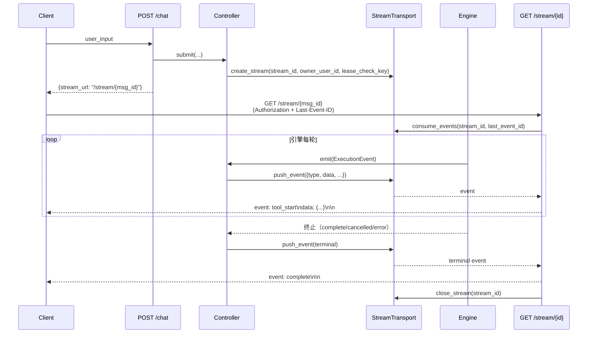
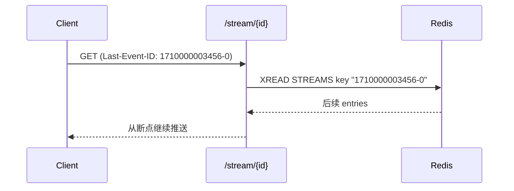

# SSE 流式传输

> 统一事件类型 + 两种 Transport 实现 + Last-Event-ID 断线续传 — 把引擎的执行过程实时投射到前端。

## 责任边界

Streaming 层只关心"事件如何从引擎传到浏览器"：

| 在本章 | 在别处 |
|--------|-------|
| `StreamEventType` 枚举与事件数据结构 | 事件的 DB 持久化与回看 → [observability.md](observability.md) |
| `StreamTransport` Protocol + InMemory / Redis 实现 | Interrupt / Cancel 的运行时语义 → [concurrency.md](concurrency.md#runtimestore) |
| SSE 协议格式、心跳、Last-Event-ID 续传 | Lease / 心跳续租 → [concurrency.md](concurrency.md#心跳续租) |
| `/stream/{stream_id}` 端点行为 | 业务层消费（stores / hooks） → [../frontend.md](../frontend.md) |

Streaming 与 Concurrency 的分界线很关键：RuntimeStore 负责"对话执行中要不要继续、要不要等人"，StreamTransport 负责"已经发生的事件怎么送达客户端"。两者通过 `lease_check_key` 发生弱耦合（Transport 会检查 lease 是否还在，见下文）。

## 统一事件模型

`src/core/events.py` 定义所有层共用的事件类型：

```python
class StreamEventType(Enum):
    # Controller 层
    METADATA = "metadata"
    COMPLETE = "complete"
    CANCELLED = "cancelled"
    ERROR = "error"

    # Agent 层
    AGENT_START = "agent_start"
    LLM_CHUNK = "llm_chunk"          # 仅 SSE，不持久化
    LLM_COMPLETE = "llm_complete"
    AGENT_COMPLETE = "agent_complete"

    # 工具 / 权限层
    TOOL_START = "tool_start"
    TOOL_COMPLETE = "tool_complete"
    PERMISSION_REQUEST = "permission_request"
    PERMISSION_RESULT = "permission_result"

    # Compaction
    COMPACTION_START = "compaction_start"      # 引擎内触发压缩，持久化
    COMPACTION_SUMMARY = "compaction_summary"  # 结构化摘要，持久化 + boundary

    # 输入 / 消息注入层
    USER_INPUT = "user_input"
    QUEUED_MESSAGE = "queued_message"
    SUBAGENT_INSTRUCTION = "subagent_instruction"
```

所有发射点都用同一个枚举（前端 `types/events.ts` 镜像此列表），避免引擎/控制器/工具层各自起名。每个事件类型的 `data` 字段约定见 [observability.md → 事件目录](observability.md#事件目录).

`ExecutionEvent` 是内存中流转的统一容器：

```python
@dataclass
class ExecutionEvent:
    event_type: str                  # StreamEventType.value
    agent_name: Optional[str] = None
    data: Any = None
    event_id: Optional[str] = None   # 持久化前由 Controller 赋值，作为幂等键
    created_at: datetime = field(default_factory=datetime.now)
```

`agent_name` 在 Agent 层事件里标注是 lead / search / crawl / compact，Controller 层事件为 `None`。

## Stream 生命周期

一次 `POST /chat` 的事件流从 Controller 起笔，经 Transport 缓冲，到 `/stream/{stream_id}` 消费，完整生命周期如下：



`stream_id` 与 `message_id` 一对一（用同一个字符串），客户端拿到 `stream_url` 后立即 GET 订阅。中间任何时刻 Client 掉线重连，都带上最后收到的 `id` 作为 `Last-Event-ID` header 即可续传。

## StreamTransport Protocol

`src/api/services/stream_transport.py` 定义了抽象接口：

```python
@runtime_checkable
class StreamTransport(Protocol):
    async def create_stream(
        self,
        stream_id: str,
        owner_user_id: Optional[str] = None,
        lease_check_key: Optional[str] = None,
        lease_expected_owner: Optional[str] = None,
    ) -> None: ...

    async def push_event(self, stream_id: str, event: Dict[str, Any]) -> bool: ...

    async def consume_events(
        self,
        stream_id: str,
        heartbeat_interval: Optional[float] = None,
        user_id: Optional[str] = None,
        last_event_id: Optional[str] = None,
    ) -> AsyncGenerator[Dict[str, Any], None]: ...

    async def close_stream(self, stream_id: str) -> bool: ...
    async def get_stream_status(self, stream_id: str) -> Optional[str]: ...
    async def is_stream_alive(self, stream_id: str) -> bool: ...
```

Protocol 方法全部 async — 即使 InMemory 实现实际是同步 dict 操作，也保留 async 以兼容 Redis 实现。

## InMemoryStreamTransport（单进程）

`src/api/services/stream_transport.py` — 开发与单实例部署使用。

| 机制 | 实现 |
|------|------|
| 缓冲 | `asyncio.Queue` per stream |
| 状态 | `pending / streaming / closed` |
| 生产者→消费者 | `Queue.put` / `Queue.get`，无背压 |
| 心跳 | `asyncio.wait_for(queue.get, timeout=heartbeat_interval)` 超时即 yield `{"type": "__ping__"}` |
| Last-Event-ID 续传 | **不支持**（无持久化游标） |
| TTL | 未被消费者接上的 stream 30s 自动清理 |
| 终止清理 | `close_stream()` 后延迟 5s 再删除 context（给 in-flight consumer 留窗口） |

消费者断线但 stream 未终止时，`consume_events` 的 finally 块把状态从 `streaming` 回退到 `pending` 并重启 TTL，允许短时间内重连（但 InMemory 没有游标，重连只能从当前时刻往后，之前错过的事件丢失）。这是 InMemory 与 Redis 的核心差别。

## RedisStreamTransport（分布式）

`src/api/services/redis_stream_transport.py` — 多 Worker / 多 Pod 生产部署。

**Key 设计**（hash tag 保证 Cluster 下同 stream 的 key 落同一 slot）：

| Key | 类型 | TTL | 用途 |
|-----|------|-----|------|
| `{af:msg_id}:stream` | Stream (XADD) | `EXECUTION_TIMEOUT`（1800s） | 事件主体 |
| `{af:msg_id}:stream_meta` | Hash | 同上 | owner、status、consumer_id、lease_check_key、lease_expected_owner |

**写入**：

- `XADD ... MAXLEN ~ 1000` — 近似裁剪，限制单 stream 最大事件数（长任务超过会丢最旧事件，前端须在终止前消费完）
- `_stream_id` 字段注入到事件 dict，携带 Redis entry ID（形如 `1710000000000-0`），作为 SSE `id:` 行输出

**消费**：

```python
XREAD BLOCK block_ms COUNT 100 STREAMS {key} {cursor}
```

- `cursor` 初始化为 `last_event_id`（客户端带来）或 `"0-0"`（从头）
- `block_ms` 取 `heartbeat_interval`（默认 15s）；XREAD 返回空即超时 → yield `__ping__`
- Consumer 在接管前生成 `consumer_id`（8-byte hex），写入 meta Hash；finally 块用 Lua CAS 把 status 回退到 `pending`，但仅当 `consumer_id` 仍是自己（防止踢掉已接管的新消费者）

**Lease 感知**（可选）：

若 `create_stream` 传入 `lease_check_key` 和 `lease_expected_owner`，每次 XREAD 超时时 consumer 会检查 lease 是否仍归预期 owner。Lease 被抢或释放（见 [concurrency.md → 心跳续租](concurrency.md#心跳续租)）意味着生产者已退出，此时 consumer 主动发送 error 事件并终止，避免僵尸 SSE 连接挂到 `EXECUTION_TIMEOUT` 才断。

## SSE 端点

`src/api/routers/stream.py`：

```python
@router.get("/{stream_id}")
async def stream_events(
    stream_id: str,
    request: Request,
    current_user: TokenPayload = Depends(get_current_user),
    stream_transport: StreamTransport = Depends(get_stream_transport),
) -> StreamingResponse
```

**关键行为：**

- **鉴权**：标准 `Authorization: Bearer <JWT>` header，不支持 query 参数 token。这迫使前端用 `fetch + ReadableStream` 实现（EventSource 不支持自定义 header，详见 Design Decisions）
- **Last-Event-ID**：从请求 header 读取，透传给 `consume_events()` 作为 cursor
- **响应 header**：
  - `Cache-Control: no-cache`
  - `Connection: keep-alive`
  - `X-Accel-Buffering: no`（nginx 不缓冲）
  - `media_type: text/event-stream`
- **心跳**：`config.SSE_PING_INTERVAL`（默认 15s）传给 transport 作为超时阈值；收到 `__ping__` 转为 SSE comment `: ping\n\n`
- **终止检测**：收到 `complete / cancelled / error` 后关闭连接；客户端 `CancelledError` 不视为 deny，仅调用 `consumer.aclose()` 归还 context

## SSE 格式

`src/api/utils/sse.py` 负责字节序列化：

```python
def format_sse_event(data, event=None, id=None, retry=None) -> str:
    # event: <name>\n
    # id: <entry_id>\n
    # data: <json>\n\n
```

每条事件输出三行加空行结尾：

```
event: tool_complete
id: 1710000003456-0
data: {"type":"tool_complete","timestamp":"2026-04-14T12:00:03","agent":"search_agent","data":{"tool":"web_search","success":true,"duration_ms":812,...}}

```

- `event` 取 `event.type`（即 `StreamEventType.value`），前端可按 event 名分发
- `id` 只有 Redis transport 会填（XADD entry ID）；InMemory 为 None，`format_sse_event` 跳过 `id:` 行
- `data` 是单行 JSON；`datetime` 统一通过 `_json_serializer` 转 ISO 字符串
- 心跳用 SSE comment（`: ping\n\n`）而不是伪事件，避免污染前端的 event-name 路由

## Last-Event-ID 断线续传

只有 RedisStreamTransport 支持真正的续传。流程：



InMemory 模式下 client 带 `Last-Event-ID` 也没有影响（transport 忽略），重连后只能收到重连之后的新事件 — 但因为 InMemory 只跑在单实例，客户端重连路径通常也意味着同一进程还在推事件，丢失窗口小。

跨层的完整可靠性矩阵：

| 场景 | InMemory | Redis |
|------|---------|-------|
| 正常消费 | ✅ | ✅ |
| Client 短暂断网 → 重连 | 丢失期间事件 | 完全续传 |
| Pod 挂掉 → 另一 Pod 接管 | ❌（stream 在原进程内存） | ✅（通过 lease 检测 + 续传） |
| 生产者崩溃 | stream 孤立 → TTL 清理 | lease 失效 → consumer 主动 error |

## 与 Concurrency 的协作点

Streaming 与 RuntimeStore 是两个独立系统，但在三处握手：

1. **Permission Interrupt 的 SSE 投影**：RuntimeStore 的 `wait_for_interrupt()` 阻塞引擎时，Controller 在阻塞前已经推了一条 `PERMISSION_REQUEST` 事件；前端据此弹确认框。用户 `POST /chat/{id}/resume` 时 Controller 推 `PERMISSION_RESULT`，引擎恢复。Interrupt 的存活/超时语义属于 RuntimeStore（见 [concurrency.md → Interrupt 机制](concurrency.md#interrupt-机制)），Streaming 只负责把两端的状态切换可视化。

2. **Cancellation 的终端事件**：`request_cancel()` 只设标志；真正 emit `CANCELLED` 是引擎在下一个 checkpoint 发现已取消后由 Controller 推送，然后 `close_stream()`。

3. **Lease 感知的 Redis transport**：`create_stream` 时 Controller 把当前 lease key + owner 传给 transport，作为"生产者还活着"的探针。这是 transport 层对 concurrency 层的唯一依赖。

## Design Decisions

### 为什么 `llm_chunk` 不持久化

- 频率极高（每个 token 一次），占 MessageEvent 表空间最大来源
- 信息可从 `llm_complete` 完整恢复（`llm_complete.data.content` 就是累积的最终文本）
- 回看场景只需最终内容，不需要逐字重放
- 引擎发射处显式 `sse_only=True` 标记，Controller 收集 `state["events"]` 时跳过（`src/core/engine.py`）

### 为什么选 fetch + ReadableStream 而非 EventSource

- EventSource 不支持自定义 header — 而 `/stream/{stream_id}` 必须带 `Authorization: Bearer <JWT>`
- 替代方案（把 token 放 query 参数）会导致 token 进入 access log 与浏览器历史记录，泄露风险更高
- fetch API 天然支持 `AbortController`，断开控制更干净
- 代价：前端需手写 event-stream 解析（见 [../frontend.md](../frontend.md) 的 `lib/sse.ts`）

### 为什么两种 Transport 共享 Protocol

- 本地开发、单元测试、Docker Compose 单实例场景不需要 Redis 的复杂度
- 生产多实例必须 Redis — 否则 POST /chat 落在 Pod A、GET /stream 落在 Pod B 时后者拿不到事件
- 配置驱动切换（`REDIS_URL` 有值则用 Redis），业务层无感知

### 为什么 Redis 用 Stream 而非 Pub/Sub

- Pub/Sub 是 fire-and-forget — 消费者晚到就丢事件，无法支持重连续传
- Redis Stream 自带持久化缓冲 + entry ID，天然匹配 `Last-Event-ID` 语义
- `XADD MAXLEN ~ 1000` 限制内存占用，一次 30 分钟内的执行产生的事件远低于此
- 代价：XREAD BLOCK 轮询比 Pub/Sub 推送延迟略高，但 15s 心跳节奏下不敏感
