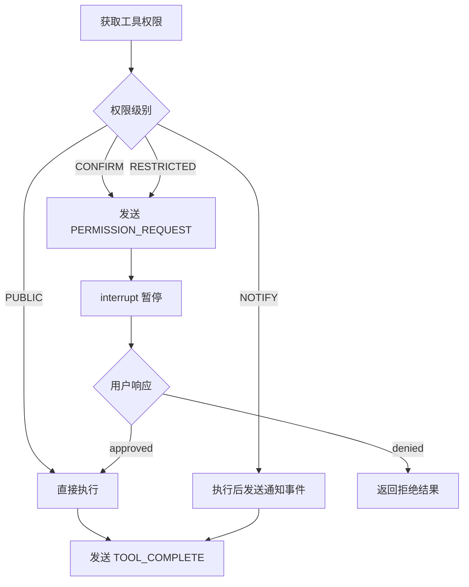

# Tool 系统

Tool 系统为 Agent 提供与外部世界交互的能力，包括搜索、抓取、Artifact 操作等。

## 模块结构

```
src/tools/
├── base.py              # 工具基类和权限定义
├── registry.py          # 工具注册中心
├── xml_parser.py        # XML 工具调用解析
├── prompt_generator.py  # 工具提示词生成
└── implementations/     # 具体工具实现
    ├── call_subagent.py
    ├── web_search.py
    ├── web_fetch.py
    └── artifact_ops.py
```

## 权限系统 (base.py)

### ToolPermission

四级权限模型：

```python
class ToolPermission(Enum):
    PUBLIC = "public"          # 直接执行，无需确认
    NOTIFY = "notify"          # 执行后通知用户
    CONFIRM = "confirm"        # 执行前需用户确认
    RESTRICTED = "restricted"  # 需特殊授权
```

**权限处理流程**（在 `graph.py` 的 `tool_execution_node` 中）：



### ToolParameter

工具参数定义：

```python
@dataclass
class ToolParameter:
    name: str                    # 参数名
    type: str                    # 类型：string, integer, boolean, array, object
    description: str             # 参数描述
    required: bool = True        # 是否必需
    default: Any = None          # 默认值
```

### ToolResult

工具执行结果：

```python
@dataclass
class ToolResult:
    success: bool                # 执行是否成功
    data: Any                    # 结果数据
    error: str | None = None     # 错误信息
    metadata: dict | None = None # 元数据
```

## BaseTool 基类

### 定义工具

```python
class BaseTool(ABC):
    name: str                    # 工具名称（唯一标识）
    description: str             # 工具描述
    permission: ToolPermission   # 权限级别

    @abstractmethod
    def get_parameters(self) -> list[ToolParameter]:
        """返回参数定义列表"""
        pass

    @abstractmethod
    async def execute(self, **params) -> ToolResult:
        """执行工具"""
        pass

    def validate_params(self, params: dict) -> tuple[bool, str]:
        """验证参数（可选覆盖）"""
        # 默认实现：检查必需参数
        ...
```

### 示例：WebSearchTool

```python
class WebSearchTool(BaseTool):
    name = "web_search"
    description = "搜索互联网获取信息"
    permission = ToolPermission.PUBLIC

    def get_parameters(self) -> list[ToolParameter]:
        return [
            ToolParameter(
                name="query",
                type="string",
                description="搜索查询词",
                required=True
            ),
            ToolParameter(
                name="max_results",
                type="integer",
                description="最大结果数量",
                required=False,
                default=10
            )
        ]

    async def execute(self, query: str, max_results: int = 10) -> ToolResult:
        try:
            results = await self._do_search(query, max_results)
            return ToolResult(success=True, data=results)
        except Exception as e:
            return ToolResult(success=False, error=str(e))
```

## 工具注册中心 (registry.py)

### ToolRegistry

全局工具库管理：

```python
class ToolRegistry:
    def __init__(self):
        self._library: dict[str, BaseTool] = {}
        self._agent_toolkits: dict[str, AgentToolkit] = {}

    def register_tool_to_library(self, tool: BaseTool):
        """注册工具到全局库"""
        self._library[tool.name] = tool

    def create_agent_toolkit(
        self,
        agent_name: str,
        tool_names: list[str]
    ) -> AgentToolkit:
        """为 Agent 创建专属工具集"""
        tools = [self._library[name] for name in tool_names]
        toolkit = AgentToolkit(agent_name, tools)
        self._agent_toolkits[agent_name] = toolkit
        return toolkit

    def get_tool(self, tool_name: str) -> BaseTool:
        """获取工具实例"""
        return self._library[tool_name]
```

### AgentToolkit

Agent 专属工具集：

```python
class AgentToolkit:
    def __init__(self, agent_name: str, tools: list[BaseTool]):
        self.agent_name = agent_name
        self._tools: dict[str, BaseTool] = {t.name: t for t in tools}

    def get_tool(self, name: str) -> BaseTool | None:
        return self._tools.get(name)

    def list_tools(self) -> list[str]:
        return list(self._tools.keys())

    async def execute_tool(self, name: str, params: dict) -> ToolResult:
        """执行工具（权限检查由 Graph 层负责）"""
        tool = self.get_tool(name)
        if not tool:
            return ToolResult(success=False, error=f"Tool not found: {name}")

        valid, error = tool.validate_params(params)
        if not valid:
            return ToolResult(success=False, error=error)

        return await tool.execute(**params)
```

### 初始化流程

```python
# 在应用启动时
def create_tool_registry() -> ToolRegistry:
    registry = ToolRegistry()

    # 注册所有工具到库
    registry.register_tool_to_library(WebSearchTool())
    registry.register_tool_to_library(WebFetchTool())
    registry.register_tool_to_library(CreateArtifactTool())
    # ...

    return registry

# 为每个 Agent 创建 Toolkit
def setup_agent_toolkits(registry: ToolRegistry, agents: list[BaseAgent]):
    for agent in agents:
        registry.create_agent_toolkit(
            agent.name,
            agent.config.required_tools
        )
```

## XML 解析器 (xml_parser.py)

### 工具调用格式

Agent 使用 XML 格式发起工具调用，所有参数值使用 CDATA 包裹：

```xml
<tool_call>
  <name>web_search</name>
  <params>
    <query><![CDATA[Python async best practices]]></query>
    <max_results><![CDATA[10]]></max_results>
  </params>
</tool_call>
```

**为什么使用 CDATA？**

- 避免特殊字符（`<`, `>`, `&`）导致解析失败
- 支持多行内容（如代码片段）
- 保持内容原样，无需转义

### XMLToolCallParser

```python
class XMLToolCallParser:
    @staticmethod
    def parse(content: str) -> list[dict]:
        """
        解析 XML 工具调用

        Returns:
            [{"name": "tool_name", "params": {...}}, ...]
        """
        # 使用 xml.etree.ElementTree 解析
        # 自动处理 CDATA
        # 自动类型转换（bool, int, float, string）
```

**类型转换规则**：

| 原始值 | 转换结果 |
|--------|----------|
| `"true"` / `"false"` | `bool` |
| `"123"` | `int` |
| `"3.14"` | `float` |
| 其他 | `str` |

## 提示词生成器 (prompt_generator.py)

### ToolPromptGenerator

为 Agent 生成工具使用说明：

```python
class ToolPromptGenerator:
    @staticmethod
    def generate_tool_instruction(toolkit: AgentToolkit) -> str:
        """
        生成完整的工具使用说明

        包含：
        - 可用工具列表
        - 每个工具的参数说明
        - XML 调用格式示例
        - 注意事项
        """
```

**生成示例**：

```markdown
# 可用工具

## web_search
搜索互联网获取信息

**参数：**
- `query` (string, 必需): 搜索查询词
- `max_results` (integer, 可选, 默认: 10): 最大结果数量

**调用示例：**
\`\`\`xml
<tool_call>
  <name>web_search</name>
  <params>
    <query><![CDATA[your search query]]></query>
  </params>
</tool_call>
\`\`\`

## create_artifact
创建新的 Artifact

...
```

## 内置工具

### call_subagent

Lead Agent 调用 SubAgent：

```python
class CallSubagentTool(BaseTool):
    name = "call_subagent"
    description = "调用其他 Agent 执行任务"
    permission = ToolPermission.PUBLIC

    def get_parameters(self):
        return [
            ToolParameter("target", "string", "目标 Agent 名称"),
            ToolParameter("instruction", "string", "执行指令")
        ]
```

### web_search

互联网搜索：

```python
class WebSearchTool(BaseTool):
    name = "web_search"
    description = "搜索互联网"
    permission = ToolPermission.PUBLIC
```

### web_fetch

网页内容抓取：

```python
class WebFetchTool(BaseTool):
    name = "web_fetch"
    description = "获取网页内容"
    permission = ToolPermission.PUBLIC
```

### Artifact 操作

```python
# 创建
CreateArtifactTool   # create_artifact
# 读取
ReadArtifactTool     # read_artifact
# 更新（增量）
UpdateArtifactTool   # update_artifact
# 重写（完全覆盖）
RewriteArtifactTool  # rewrite_artifact
# 删除
DeleteArtifactTool   # delete_artifact
# 列表
ListArtifactsTool    # list_artifacts
```

## 添加新工具

参见 [Extension Guide](../extension-guide.md#添加新工具)。
