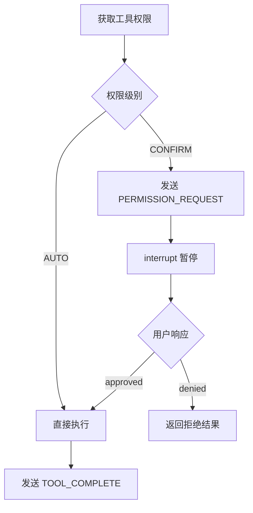

# Tool 系统

Tool 系统为 Agent 提供与外部世界交互的能力，包括搜索、抓取、Artifact 操作等。

## 模块结构

```
src/tools/
├── base.py              # 工具基类和权限定义
├── registry.py          # 工具注册中心
├── xml_parser.py        # XML 工具调用解析
├── prompt_generator.py  # 工具提示词生成
└── implementations/     # 具体工具实现
    ├── call_subagent.py
    ├── web_search.py
    ├── web_fetch.py
    └── artifact_ops.py
```

## 权限系统 (base.py)

### ToolPermission

两级权限模型：

```python
class ToolPermission(Enum):
    AUTO = "auto"        # 自动执行，无需用户确认
    CONFIRM = "confirm"  # 执行前需用户确认（通过 interrupt 暂停）
```

**权限处理流程**（在 `graph.py` 的 `tool_execution_node` 中）：



### ToolParameter

工具参数定义：

```python
@dataclass
class ToolParameter:
    name: str                    # 参数名
    type: str                    # 类型：string, integer, boolean, array, object
    description: str             # 参数描述
    required: bool = True        # 是否必需
    default: Any = None          # 默认值
```

### ToolResult

工具执行结果：

```python
@dataclass
class ToolResult:
    success: bool                              # 执行是否成功
    data: Any = None                           # 结果数据
    error: Optional[str] = None                # 错误信息
    metadata: Dict[str, Any] = field(default_factory=dict)  # 元数据

    def to_dict(self) -> Dict[str, Any]:
        """转换为字典格式"""
```

## BaseTool 基类

### 定义工具

```python
class BaseTool(ABC):
    def __init__(
        self,
        name: str,
        description: str,
        permission: ToolPermission = ToolPermission.AUTO,
        **kwargs
    ):
        self.name = name
        self.description = description
        self.permission = permission
        self.config = kwargs

    @abstractmethod
    def get_parameters(self) -> List[ToolParameter]:
        """返回参数定义列表"""
        pass

    @abstractmethod
    async def execute(self, **params) -> ToolResult:
        """执行工具"""
        pass

    def validate_params(self, params: Dict[str, Any]) -> Optional[str]:
        """
        验证参数（可选覆盖）

        Returns:
            None 表示验证通过，字符串表示错误信息
        """
        # 默认实现：检查必需参数和未知参数
        ...

    async def __call__(self, **params) -> ToolResult:
        """使工具可调用（内部调用 validate_params 和 execute）"""
```

### 示例：WebSearchTool

```python
class WebSearchTool(BaseTool):
    def __init__(self):
        super().__init__(
            name="web_search",
            description="搜索互联网获取信息",
            permission=ToolPermission.AUTO
        )

    def get_parameters(self) -> List[ToolParameter]:
        return [
            ToolParameter(
                name="query",
                type="string",
                description="搜索查询词",
                required=True
            ),
            ToolParameter(
                name="max_results",
                type="integer",
                description="最大结果数量",
                required=False,
                default=10
            )
        ]

    async def execute(self, query: str, max_results: int = 10, **kwargs) -> ToolResult:
        try:
            results = await self._do_search(query, max_results)
            return ToolResult(success=True, data=results)
        except Exception as e:
            return ToolResult(success=False, error=str(e))
```

## 工具注册中心 (registry.py)

### ToolRegistry

全局工具库管理：

```python
class ToolRegistry:
    def __init__(self):
        self.tool_library: Dict[str, BaseTool] = {}
        self.agent_toolkits: Dict[str, AgentToolkit] = {}

    def register_tool_to_library(self, tool: BaseTool) -> None:
        """注册工具到全局库"""
        self.tool_library[tool.name] = tool

    def create_agent_toolkit(
        self,
        agent_name: str,
        tool_names: List[str] = None
    ) -> AgentToolkit:
        """为 Agent 创建专属工具集"""
        toolkit = AgentToolkit(agent_name)
        if tool_names:
            for tool_name in tool_names:
                if tool_name in self.tool_library:
                    toolkit.add_tool(self.tool_library[tool_name])
        self.agent_toolkits[agent_name] = toolkit
        return toolkit

    def get_agent_toolkit(self, agent_name: str) -> Optional[AgentToolkit]:
        """获取 Agent 的工具包"""
        return self.agent_toolkits.get(agent_name)
```

### AgentToolkit

Agent 专属工具集：

```python
class AgentToolkit:
    def __init__(self, agent_name: str):
        self.agent_name = agent_name
        self.tools: Dict[str, BaseTool] = {}

    def add_tool(self, tool: BaseTool) -> None:
        """添加工具到工具包"""
        self.tools[tool.name] = tool

    def add_tools(self, tools: List[BaseTool]) -> None:
        """批量添加工具"""
        for tool in tools:
            self.add_tool(tool)

    def get_tool(self, name: str) -> Optional[BaseTool]:
        return self.tools.get(name)

    def list_tools(self) -> List[BaseTool]:
        """返回工具实例列表"""
        return list(self.tools.values())

    async def execute_tool(self, name: str, params: Dict) -> ToolResult:
        """
        执行工具（权限检查由 Graph 层负责）
        参数验证在 tool.__call__ 内部处理
        """
        tool = self.get_tool(name)
        if not tool:
            return ToolResult(
                success=False,
                error=f"Tool '{name}' not available in {self.agent_name}'s toolkit"
            )
        return await tool(**params)
```

### 初始化流程

工具初始化在 `create_default_graph()` 函数中完成（`core/graph.py`）：

```python
# 1. 创建工具注册中心
registry = ToolRegistry()

# 2. 创建工具列表
tools = [
    CallSubagentTool(),
    WebSearchTool(),
    WebFetchTool(),
]

# Artifact 工具需要 manager 依赖注入
if artifact_manager:
    tools.extend(create_artifact_tools(artifact_manager))

# 3. 注册所有工具到库
for tool in tools:
    registry.register_tool_to_library(tool)

# 4. 为每个 Agent 创建 toolkit 并绑定
for agent in [lead, search, crawl]:
    if agent.config.required_tools:
        toolkit = registry.create_agent_toolkit(
            agent.config.name,
            tool_names=agent.config.required_tools
        )
        agent.toolkit = toolkit
```

## XML 解析器 (xml_parser.py)

### 工具调用格式

Agent 使用 XML 格式发起工具调用，所有参数值使用 CDATA 包裹：

```xml
<tool_call>
  <name>web_search</name>
  <params>
    <query><![CDATA[Python async best practices]]></query>
    <max_results><![CDATA[10]]></max_results>
  </params>
</tool_call>
```

**为什么使用 CDATA？**

- 避免特殊字符（`<`, `>`, `&`）导致解析失败
- 支持多行内容（如代码片段）
- 保持内容原样，无需转义

### XMLToolCallParser

```python
@dataclass
class ToolCall:
    """工具调用数据结构"""
    name: str
    params: Dict[str, Any]
    raw_text: str = ""

class XMLToolCallParser:
    @staticmethod
    def parse_tool_calls(text: str) -> List[ToolCall]:
        """
        解析 XML 工具调用

        Returns:
            ToolCall 对象列表
        """
        # 使用 xml.etree.ElementTree 解析
        # 自动处理 CDATA
        # 自动类型转换（bool, int, float, string）
        # 支持 fallback 正则解析（处理 LLM 格式不严格的情况）

# 便捷函数
def parse_tool_calls(text: str) -> List[ToolCall]:
    return XMLToolCallParser.parse_tool_calls(text)
```

**类型转换规则**：

| 原始值 | 转换结果 |
|--------|----------|
| `"true"` / `"false"` | `bool` |
| `"123"` | `int` |
| `"3.14"` | `float` |
| 其他 | `str` |

## 提示词生成器 (prompt_generator.py)

### ToolPromptGenerator

为 Agent 生成工具使用说明：

```python
class ToolPromptGenerator:
    @staticmethod
    def generate_tool_instruction(tools: List[BaseTool]) -> str:
        """
        生成完整的工具使用说明

        Args:
            tools: 工具实例列表（通常来自 toolkit.list_tools()）

        包含：
        - 可用工具列表
        - 每个工具的参数说明
        - XML 调用格式示例（使用 CDATA）
        - 注意事项
        """

    @staticmethod
    def format_tool_result(name: str, result: Dict[str, Any]) -> str:
        """格式化工具执行结果为 XML"""
```

**生成示例**（实际输出格式）：

```
### web_search
Description: Search the web for information using Bocha AI search engine
Parameters:
  - query: string (required) - Search query using keywords.
  - freshness: string (optional) - Time range filter: 'noLimit', 'oneDay', ...
    Default: noLimit
  - count: integer (optional) - Number of results to return (1-50)
    Default: 10
Example:
<tool_call>
  <name>web_search</name>
  <params>
    <query><![CDATA[your_query_here]]></query>
    <freshness><![CDATA[noLimit]]></freshness>
    <count><![CDATA[10]]></count>
  </params>
</tool_call>
```

## 内置工具

| 工具名 | 类 | 说明 | 权限 |
|--------|-----|------|------|
| `call_subagent` | CallSubagentTool | 路由到 SubAgent（特殊工具，不实际执行）| AUTO |
| `web_search` | WebSearchTool | 互联网搜索（博查 AI） | AUTO |
| `web_fetch` | WebFetchTool | 网页/PDF 内容抓取（crawl4ai） | AUTO |
| `create_artifact` | CreateArtifactTool | 创建新 Artifact | AUTO |
| `read_artifact` | ReadArtifactTool | 读取内容（支持历史版本） | AUTO |
| `update_artifact` | UpdateArtifactTool | 增量更新（支持模糊匹配） | AUTO |
| `rewrite_artifact` | RewriteArtifactTool | 完全重写内容 | AUTO |

**注意**：`call_subagent` 是特殊的路由工具。Agent 在 `base.py` 中检测到此工具时，会先调用 `execute()` 验证参数（如 agent_name 是否有效），验证通过后再设置路由信息，由 Graph 路由到目标 SubAgent。

## 添加新工具

参见 [Extension Guide](../extension-guide.md#添加新工具)。
