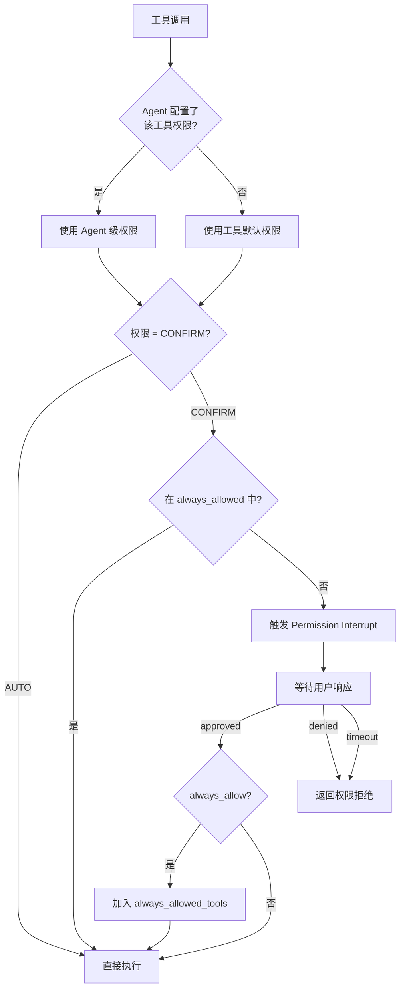

# 工具系统

> XML 调用格式 + CDATA 包裹 + 两级权限 + 串行执行 — 为 LLM 文本生成场景设计的工具系统。

## XML 工具调用格式

ArtifactFlow 使用 XML 格式进行工具调用，所有参数值用 CDATA 包裹：

```xml
<tool_call>
  <name>web_search</name>
  <params>
    <query><![CDATA[python async tutorial]]></query>
    <count><![CDATA[10]]></count>
  </params>
</tool_call>
```

LLM 可以在单次响应中包含多个 `<tool_call>` 块，引擎会按顺序串行执行。

### 工具结果格式

工具执行结果以 XML 格式注入上下文（由 `xml_formatter.py` 的 `format_result()` 生成）：

```xml
<tool_result name="web_search" success="true">
<data>
...搜索结果...
</data>
</tool_result>
```

### 容错解析

`XMLToolCallParser`（`src/tools/xml_parser.py`）面对小模型常见的格式错误提供多层容错：

**标准解析** → **修复后重试** → **正则 Fallback** → **错误 ToolCall**

修复策略覆盖以下常见问题：

| 问题 | 示例 | 修复方式 |
|------|------|---------|
| 工具名作为标签 | `<web_fetch><params>...` | 提取为 `<name>web_fetch</name>` |
| 标签等号语法 | `<name=call_subagent</name>` | 转为 `<name>call_subagent</name>` |
| CDATA 后缺闭合标签 | `<content><![CDATA[...]]>` 后无 `</content>` | 补全闭合标签 |
| 散落的参数标签 | 参数出现在 `<params>` 外部或多个 `<params>` 块 | 合并收集到单个 `<params>` 中 |
| 缺失 `</params>` | 没有 params 闭合标签 | 追加闭合标签 |
| 未闭合 `<tool_call>` | 末尾缺少 `</tool_call>` | 检测并解析未闭合块 |

所有解析手段均失败时，返回 `ToolCall(name="__malformed__", error=...)` 而非静默忽略，确保 engine 将解析错误反馈给 agent。

## 权限模型

### ToolPermission 两级模型

```python
class ToolPermission(Enum):
    AUTO = "auto"        # 自动执行，无需用户确认
    CONFIRM = "confirm"  # 执行前需用户确认（通过 Permission Interrupt）
```

### 权限决策流程


```mermaid
flowchart TD
    START[工具调用] --> AGENT_PERM{Agent 配置了<br/>该工具权限?}
    AGENT_PERM -->|是| USE_AGENT[使用 Agent 级权限]
    AGENT_PERM -->|否| USE_TOOL[使用工具默认权限]
    USE_AGENT --> CHECK{权限 = CONFIRM?}
    USE_TOOL --> CHECK
    CHECK -->|AUTO| EXEC[直接执行]
    CHECK -->|CONFIRM| ALWAYS{在 always_allowed 中?}
    ALWAYS -->|是| EXEC
    ALWAYS -->|否| INTERRUPT[触发 Permission Interrupt]
    INTERRUPT --> WAIT[等待用户响应]
    WAIT -->|approved| AA{always_allow?}
    AA -->|是| ADD[加入 always_allowed_tools] --> EXEC
    AA -->|否| EXEC
    WAIT -->|denied| DENY[返回权限拒绝]
    WAIT -->|timeout| DENY
```

**Permission Interrupt 流程：**

1. 推送 `PERMISSION_REQUEST` 事件（含工具名、参数、权限级别）
2. 调用 `hooks.wait_for_interrupt()` 阻塞等待（基于 `asyncio.Event`）
3. 超时（`config.PERMISSION_TIMEOUT`）或客户端断开 → 视为 deny
4. 用户响应中可包含 `always_allow: true` → 将该工具加入 `state["always_allowed_tools"]`，后续调用自动跳过确认

## 工具执行流水线

### BaseTool 调用管道

`BaseTool.__call__()` 定义了统一的执行管道：

```
XML 字符串参数 → 类型强转 → 默认值填充 → 参数校验 → 执行 → 错误包装
```

**1. 类型强转**（`_coerce_params`）

XML parser 返回的值统一为字符串，需要根据 `ToolParameter.type` 转换：

| 目标类型 | 转换规则 |
|---------|---------|
| `string` | 保持原值 |
| `integer` | `int(value)` |
| `boolean` | `true/1/yes` → `True`，`false/0/no` → `False` |
| `number` | `float(value)` |

转换失败保持原值，由后续校验报错。

**2. 默认值填充**（`_apply_defaults`）

遍历 `get_parameters()` 返回的参数定义，为缺失的参数填入 `default` 值。

**3. 参数校验**（`validate_params`）

按顺序检查：
- 必填参数是否存在
- 是否有未知参数
- enum 约束是否满足
- 类型是否正确（coerce 后仍为 str 说明转换失败）

校验失败返回 `ToolResult(success=False, error=...)` 而非抛异常。

**4. 执行**

调用子类实现的 `async execute(**params)` 方法。执行异常被捕获并包装为 `ToolResult`。

### 引擎中的工具执行

引擎的 `_execute_tools()` 在 BaseTool 管道之上增加了额外逻辑：

1. **排序**：`call_subagent` 排最后
2. **取消检查**：每个工具执行前检查 `hooks.check_cancelled()`
3. **Agent 白名单校验**：工具必须在当前 agent 的 `tools` 配置中
4. **权限处理**：CONFIRM 级工具触发 Permission Interrupt
5. **call_subagent 特殊路径**：成功则切换 agent + break 跳出工具循环
6. **事件推送**：每个工具推送 `TOOL_START` 和 `TOOL_COMPLETE` 事件（含参数、结果、耗时）

## 核心数据结构

### ToolResult

```python
@dataclass
class ToolResult:
    success: bool                           # 是否成功
    data: str = ""                          # 成功时的输出数据
    error: Optional[str] = None             # 失败时的错误信息
    metadata: Dict[str, Any] = field(...)   # 附加元数据
```

`metadata` 可携带 `artifact_snapshot`（Artifact 操作工具在内存更新后附带完整快照），通过 `TOOL_COMPLETE` 事件的 `metadata` 字段推送给前端，实现执行期间的实时 Artifact 更新。

### ToolParameter

```python
@dataclass
class ToolParameter:
    name: str                               # 参数名
    type: str                               # "string" | "integer" | "boolean" | "number"
    description: str                        # 参数描述
    required: bool = True                   # 是否必填
    default: Any = None                     # 默认值
    enum: Optional[List[str]] = None        # 可选值列表
```

## 内置工具清单

| 工具 | 类 | 默认权限 | 参数 | 说明 |
|------|---|---------|------|------|
| `web_search` | `WebSearchTool` | AUTO | `query` (string), `freshness` (string, enum, 默认 `noLimit`), `count` (integer, 默认 10) | Bocha AI API 搜索 |
| `web_fetch` | `WebFetchTool` | CONFIRM | `url` (string), `max_content_length` (integer, 默认 20000) | Jina Reader 深度内容提取 |
| `create_artifact` | `CreateArtifactTool` | AUTO | `id` (string), `content_type` (string, enum, 默认 `text/markdown`), `title` (string), `content` (string) | 创建 Artifact（写入内存缓存） |
| `update_artifact` | `UpdateArtifactTool` | AUTO | `id` (string), `old_str` (string), `new_str` (string) | 替换 Artifact 中的指定文本（支持模糊匹配） |
| `rewrite_artifact` | `RewriteArtifactTool` | AUTO | `id` (string), `content` (string) | 完整替换 Artifact 内容 |
| `read_artifact` | `ReadArtifactTool` | AUTO | `id` (string), `version` (integer, 可选) | 读取 Artifact 内容（默认最新版本） |
| `call_subagent` | `CallSubagentTool` | AUTO | `agent_name` (string), `instruction` (string) | 调用 subagent（仅路由验证，不执行） |

**注意：**

- Artifact 工具（create/update/rewrite/read）是请求级创建的（绑定 `ArtifactManager` 实例），名称为保留名（`RESERVED_TOOL_NAMES`），自定义工具不可同名
- `call_subagent` 的 `execute()` 仅做路由验证（目标 agent 是否存在、是否非 internal），实际的 agent 切换由引擎的 `_execute_tools` 处理

## 工具注册

### 工具映射构建

`build_tool_map()`（`src/tools/base.py`）在启动时构建 `name → BaseTool` 映射：

```python
def build_tool_map(builtin_tools, custom_tools) -> Dict[str, BaseTool]:
    # 1. 加载 builtin_tools
    # 2. 加载 custom_tools，检查与 builtin/reserved 名冲突
    # 3. 返回合并后的 tool_map
```

保留名列表：`create_artifact`, `update_artifact`, `rewrite_artifact`, `read_artifact`。

### 工具指令生成

工具的使用说明通过两步注入 system prompt：

1. `BaseTool.to_xml_example()` — 生成单个工具的 XML 调用示例（CDATA 包裹所有参数值）
2. `generate_tool_instruction(tools)` — 组装完整的工具说明块：

```xml
<tool_instructions>
<format>
You may make one or more tool calls per turn. They execute sequentially.
Wrap ALL parameter values in <![CDATA[...]]>.
</format>

<tool name="web_search">
Web search and information retrieval specialist...
Parameters:
  - query: string (required) - Search query
  - freshness: string (optional) - Time range filter. Values: noLimit, oneDay, oneWeek, oneMonth, oneYear. Default: noLimit
  - count: integer (optional) - Number of results to return (1-50). Default: 10
Example:
<tool_call>
  <name>web_search</name>
  <params>
    <query><![CDATA[your_query_here]]></query>
    <count><![CDATA[10]]></count>
  </params>
</tool_call>
</tool>

</tool_instructions>
```

每个 agent 只看到自己 `tools` 配置中列出的工具的说明。

## Design Decisions

### 为什么选 XML 而非 JSON

- **CDATA 避免转义地狱**：代码、Markdown 等内容包含大量特殊字符（`"`, `\`, `{}`），JSON 需要层层转义，XML CDATA 原样包裹
- **文本生成鲁棒性**：LLM 生成 JSON 时容易漏引号、多逗号、嵌套括号错误；XML 的标签结构更容易被 LLM 正确生成
- **容错修复空间大**：缺失闭合标签、格式变体等问题都可以通过修复策略恢复，JSON 的语法错误通常无法修复

### 为什么串行执行工具

- **Permission Interrupt 天然插入点**：CONFIRM 级工具需要暂停等待用户确认，串行执行使中断自然插入在工具之间
- **简单可靠**：不需要处理并行工具的依赖、竞争、部分失败等复杂场景
- **可观测性友好**：事件流按时间顺序线性排列，易于调试和回放

### 为什么 call_subagent 排最后

- `call_subagent` 成功后会 `break` 跳出工具循环（切换到目标 agent）
- 如果不排最后，同一轮 LLM 响应中 `call_subagent` 之后的常规工具会被跳过
- 排最后确保所有常规工具先完成，再进行 agent 切换
