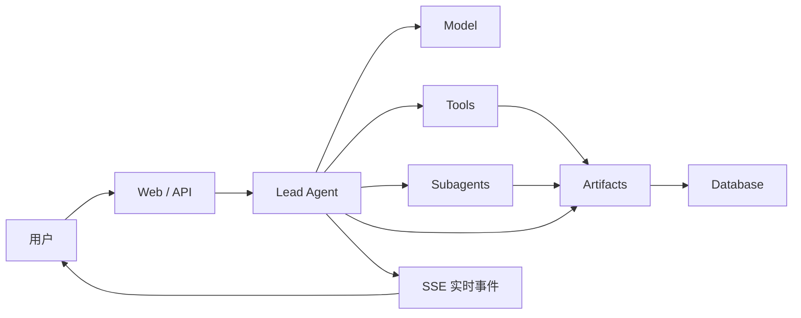
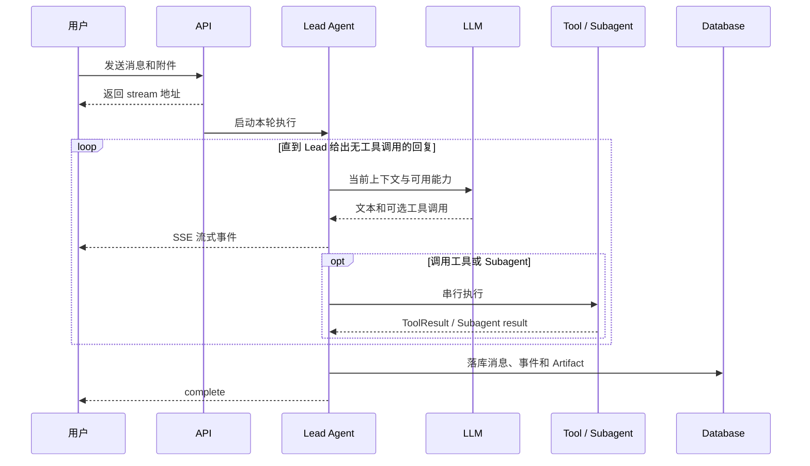
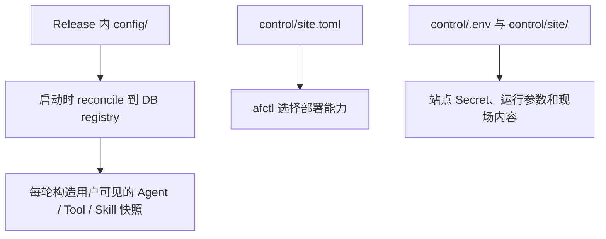

# ArtifactFlow 如何工作

ArtifactFlow 的目标不是提供一个通用 Agent 框架，而是让团队能通过配置快速交付一套可私有部署、可维护的 AI 服务。

## 系统组成

| 概念 | 作用 |
|---|---|
| Lead Agent | 接收用户请求，决定直接处理、调用工具或委派 Subagent，并给出最终回复 |
| Subagent | 在隔离的上下文中完成研究、材料分析等较大的子任务，结果回传给 Lead |
| Model | Agent 使用的 LLM，由 alias 映射到云端或自部署模型 |
| Tool | 一项可授权的操作，例如查询 HTTP API、调用 MCP 服务或运行沙盒命令 |
| Skill | 按需注入的工作方法和领域说明，也可以在激活时授予相关工具能力 |
| Artifact | 任务产生的可持久化材料，如计划、报告、代码、图片或上传文件 |

## 一次任务的执行过程

引擎是一个 per-agent 的普通循环：构造上下文、调用模型、解析并串行执行工具，然后把结果放回下一次模型调用。`call_subagent` 会原地进入目标 Agent 的同类循环；Subagent 结束后，结果像普通工具结果一样回到调用者。

Lead Agent 是唯一的用户回复出口。Subagent 的最终文本不会直接发送给用户。

## 配置怎样生效

配置分成三个层次：

- `config/models/models.yaml` 定义模型 alias。
- `config/agents/*.md` 定义 Agent、提示词和能力成员关系。
- `config/tools/`、`config/mcp/`、`config/skills/` 是配置作者的种子真相；发布启动阶段会把它们 reconcile 到数据库注册表。
- `control/site.toml` 描述部署能力，例如 TLS、基础设施来源和 Sandbox runtime。
- `control/.env` 保存 Secret 与应用运行参数。
- `control/site/` 保存欢迎提示和品牌信息；在线通知保存在共享数据库中。

生产环境修改 Release 内文件没有意义：Release 是不可变快照。应用配置改动应使用 [`afctl config`](operations/releases.md#配置热修)，现场 Secret 和证书则修改 `control/` 后执行 `apply current`。

## Artifact 与历史

Artifact 是任务的持久化工作成果，不等同于聊天回复。Agent 在一轮内可以多次创建或编辑 Artifact；执行结束时统一写回数据库，因此同一轮的多次编辑可能只产生一个持久版本。

聊天历史由执行事件重建，而不是把消息表的展示文本直接重新喂给模型。这使工具调用、Subagent 结果、权限决定和压缩摘要都能进入后续上下文。上下文过长时，系统为对应 Agent 生成压缩摘要，并从该摘要继续。

## 实时、权限与取消

- 模型片段、工具状态和 Artifact 变更通过 SSE 实时发送。
- `confirm` 级工具在执行前等待用户批准；`auto` 级工具直接执行。
- 同一对话通过 lease 保证同一时刻只有一个执行。
- 取消、超时、错误和正常完成最终都进入统一的终态处理，随后持久化本轮事件。

本地试用使用进程内 RuntimeStore 和 StreamTransport。生产多副本使用 Redis 保存 lease、interrupt、cancel 和流式传输状态；PostgreSQL 保存用户、对话、事件、配置注册表和 Artifact。

## Sandbox 边界

`bash`、`mount`、`persist` 共享一个按轮创建的临时 Sandbox：

- `mount` 把 Artifact 显式放入工作区；
- `bash` 在隔离容器里处理文件；
- `persist` 把需要保留的文件显式写回 Artifact。

生产支持的隔离 runtime 是 gVisor `runsc`。Sandbox 默认无网络；Backend 挂载 Docker socket 来创建同级容器，因此 Backend 本身属于宿主高信任组件。主机侧隔离和 scratch 文件系统必须在部署前完成，详见[主机准备](operations/host-preparation.md)。

## 生产部署模型

生产交付只有一个不可变 Release 契约和一个站点控制器：

- `release.sh` 在构建机生成应用、配置、部署文件、Sandbox 镜像和严格 manifest；
- `afctl` 在目标站点校验、物化并应用 Release；
- `.artifactflow/state.json` 是当前版和上一版的唯一状态；
- `control/` 保存不会随升级覆盖的现场配置，包括入站 TLS 材料与 Backend 出站 HTTPS 信任锚；
- 单机是当前正式支持路径，Ansible 多机 executor 仍是实验性能力。

接下来可以阅读[配置总览](configuration/index.md)或从[主机准备](operations/host-preparation.md)开始部署。
