# ArtifactFlow

ArtifactFlow 是一个基于 LangGraph 构建的**多 Agent 协作框架**，采用双 Artifact 架构实现复杂任务的规划与执行。

## 设计理念

### 为什么需要多 Agent 协作？

单一 LLM 在处理复杂任务时面临几个核心挑战：

- **上下文窗口限制**：长程任务容易丢失关键信息
- **能力边界模糊**：一个 prompt 难以覆盖所有专业领域
- **执行过程不透明**：用户难以干预和调整执行方向

ArtifactFlow 通过**专业化分工 + 结构化协作**解决这些问题。

### 双 Artifact 架构

```mermaid
flowchart BT
    subgraph Agents["Agent System"]
        Lead["🎯 Lead Agent"]
        Search["🔍 Search Agent"]
        Crawl["🌐 Crawl Agent"]
    end

    subgraph Artifacts["Artifacts"]
        TaskPlan["📋 Task Plan Artifact<br/>- 任务分解<br/>- 进度追踪<br/>- 依赖关系"]
        Result["📄 Result Artifact<br/>- 执行产出<br/>- 版本历史<br/>- 增量更新"]
    end

    Lead -->|读取/更新| TaskPlan
    Lead -->|写入| Result
    Lead -->|调度| Search
    Lead -->|调度| Crawl
    Search -->|返回结果| Lead
    Crawl -->|返回结果| Lead
```



**Task Plan Artifact**：记录任务规划、分解步骤、当前进度，确保长程任务不会"迷路"

**Result Artifact**：累积执行产出，支持版本追溯，用户可随时查看中间结果

### 核心优势

| 特性 | 说明 |
|------|------|
| **计划与结果分离** | 任务规划和执行产出独立管理，互不干扰 |
| **可追溯性** | Artifact 版本历史完整记录每次变更 |
| **人机协作** | 权限系统支持关键操作的用户确认 |
| **流式反馈** | SSE 实时推送执行状态，前端可即时展示 |
| **可扩展** | 轻松添加新 Agent 和 Tool 应对不同场景 |

## 应用场景

ArtifactFlow 是一个通用框架，可适配多种复杂任务场景：

- **信息检索与整合**：多源搜索、内容聚合、报告生成
- **文档撰写**：大纲规划、分章节撰写、迭代修订
- **代码任务**：代码审查、重构规划、多文件修改
- **数据分析**：数据采集、清洗、分析、可视化
- **工作流自动化**：多步骤任务编排、条件分支处理

## 技术栈

| 组件 | 技术 | 用途 |
|------|------|------|
| 编排引擎 | LangGraph | 多 Agent 工作流、状态管理、断点恢复 |
| API 服务 | FastAPI | REST API、SSE 流式推送 |
| 数据存储 | SQLAlchemy + aiosqlite | 对话历史、Artifact 持久化 |
| LLM 接口 | LiteLLM | 统一接口支持 100+ 模型提供商 |
| 内容采集 | crawl4ai | 网页内容抓取与解析 |
| 前端 | Next.js 15 / React 19 / Zustand / Tailwind CSS | Web UI、SSE 流式渲染 |

## 快速开始

```bash
# 安装依赖
pip install -r requirements.txt
pip install -e .

# 初始化 crawl4ai（首次使用前必须）
crawl4ai-setup

# 设置 JWT 密钥（写入 .env，必须，否则服务无法启动）
echo "ARTIFACTFLOW_JWT_SECRET=$(python -c 'import secrets; print(secrets.token_urlsafe(32))')" >> .env

# 创建管理员账号（首次使用前必须）
python scripts/create_admin.py admin

# 启动 API 服务
python run_server.py

# CLI 交互（首次需要登录）
python run_cli.py login
python run_cli.py chat
```

## 文档导航

- [Frontend Guide](frontend.md) - 前端架构、文件详解与数据流
- [Request Lifecycle](request-lifecycle.md) - 理解一个请求的完整生命周期
- [Architecture](architecture/core.md) - 深入了解各模块实现
- [Concurrency](architecture/concurrency.md) - 并发模型、已知局限与演进路线
- [Streaming](streaming.md) - 流式事件系统详解
- [Extension Guide](extension-guide.md) - 如何扩展 Agent 和 Tool
- [API Reference](api.md) - 前端集成接口文档
- [FAQ](faq.md) - 常见问题与排查
