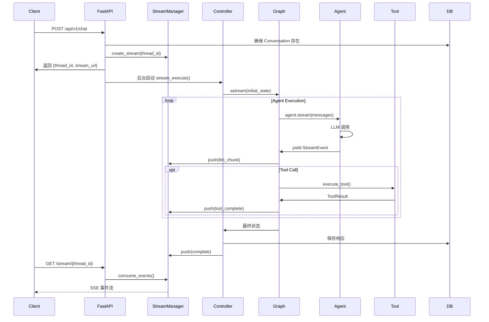
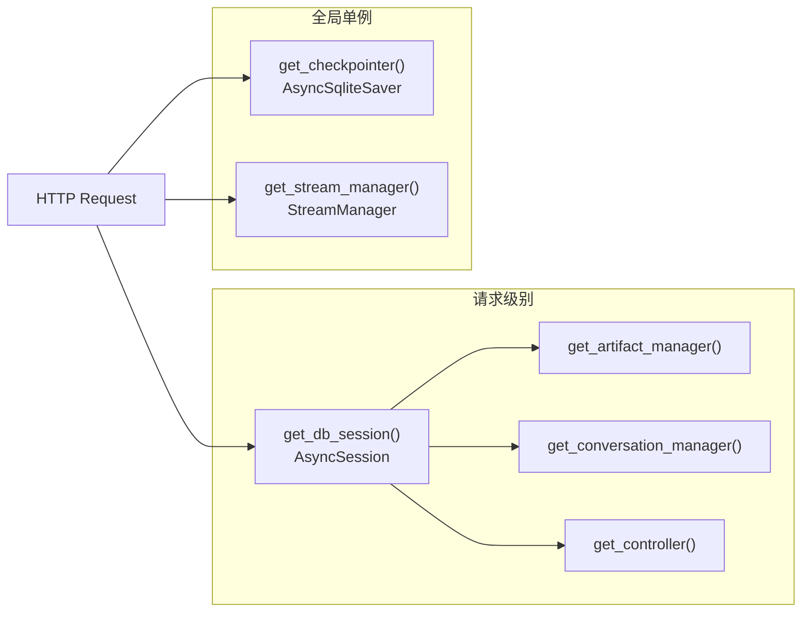
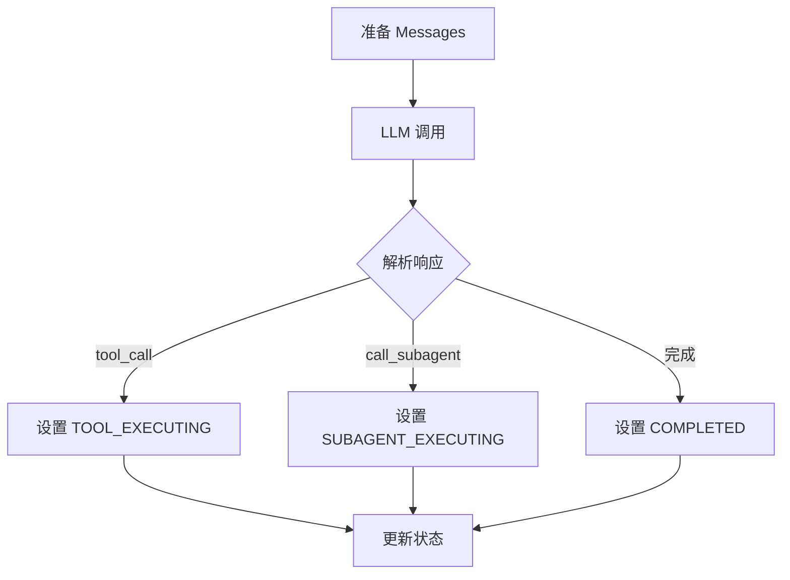
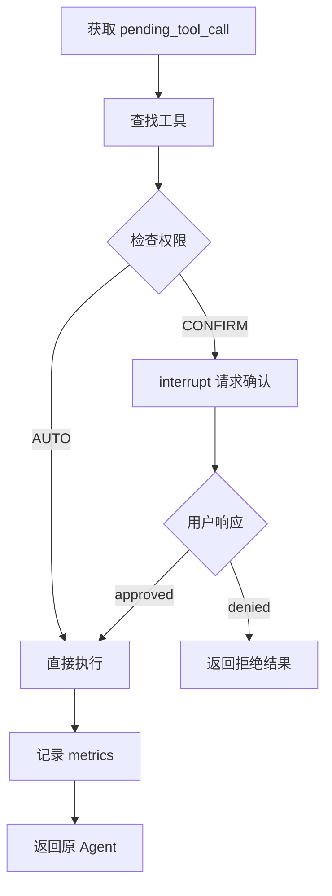
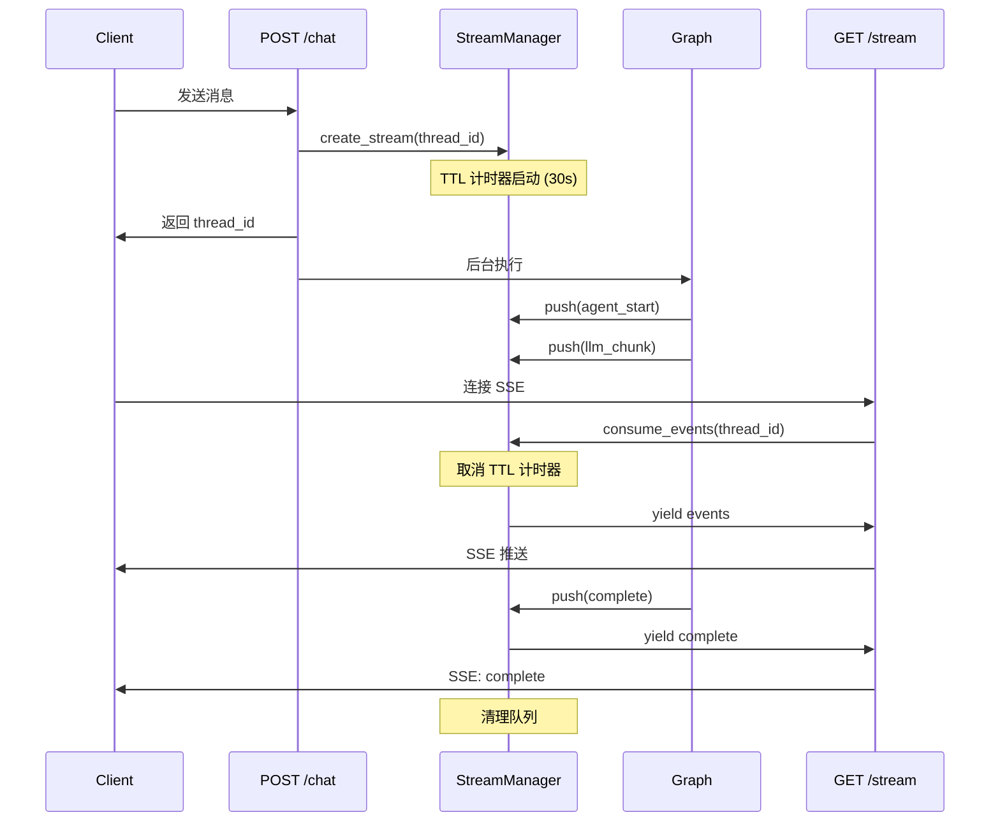
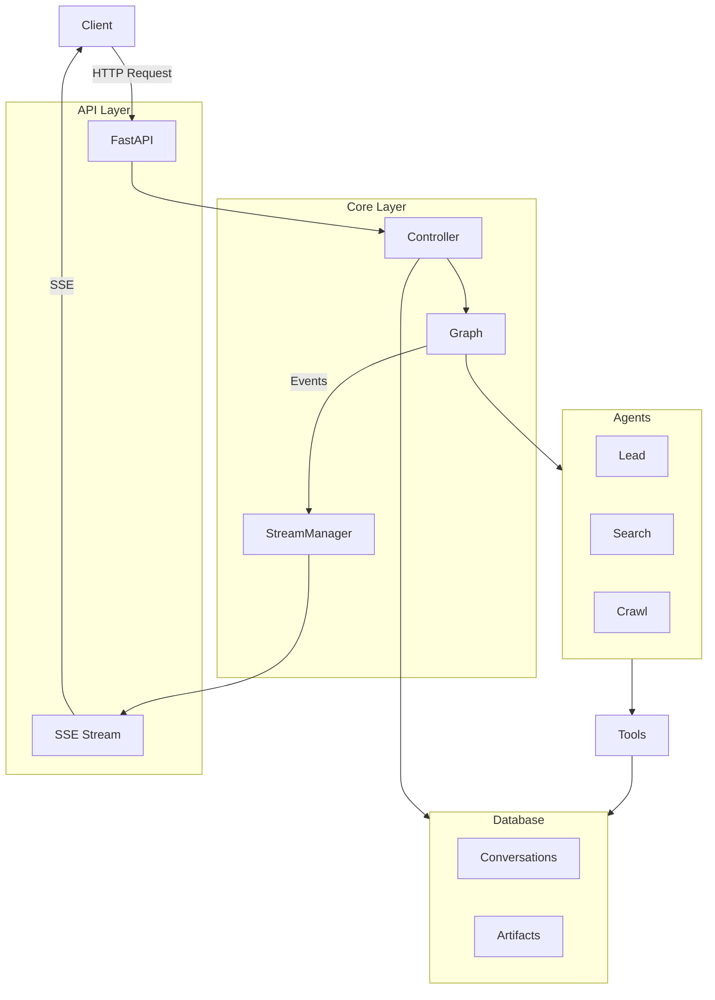

# Request Lifecycle

本文档详细描述一个请求从进入 API 到返回结果的完整生命周期。

## 整体流程



## Phase 1: 请求接收与初始化

### API 层处理

```python
# POST /api/v1/chat
{
    "content": "帮我分析一下 Python 异步编程的最佳实践",
    "conversation_id": null,  # null 表示新对话
    "parent_message_id": null
}
```

**依赖注入链**（`src/api/dependencies.py`）：



### Conversation 创建

如果 `conversation_id` 为空，Controller 会在 `_stream_new_message()` 中：

1. 调用 `conversation_manager.start_conversation_async()` 生成新 ID
2. 在数据库创建 `Conversation` 记录
3. Artifact session ID 与 conversation ID 相同

```python
# src/core/controller.py - _stream_new_message() 中的逻辑
if not conversation_id:
    conversation_id = await self.conversation_manager.start_conversation_async()
else:
    await self.conversation_manager.ensure_conversation_exists(conversation_id)
```

## Phase 2: 状态准备

### 对话历史格式化

`ConversationManager` 从消息树中提取当前分支的历史：

```python
# 树状结构示例
#       msg_1 (root)
#      /      \
#   msg_2    msg_3
#     |
#   msg_4 (current)

# 格式化结果（从 root 到 current 的路径）
# 返回 List[Dict]，用于后续构建 LLM messages
conversation_history = [
    {"role": "user", "content": "第一条消息"},
    {"role": "assistant", "content": "第一条回复"},
    {"role": "user", "content": "第二条消息"},
    {"role": "assistant", "content": "第二条回复"}
]
```

### 初始状态构建

```python
# src/core/state.py - create_initial_state()
initial_state = {
    "current_task": "帮我分析一下 Python 异步编程的最佳实践",
    "session_id": conversation_id, # session_id 与 conversation_id 相同，用于对话与Artifact映射
    "thread_id": f"thd-{uuid4().hex}",
    "conversation_history": [...],  # List[Dict]，格式化的对话历史
    "phase": ExecutionPhase.LEAD_EXECUTING,
    "current_agent": "lead_agent",
    "subagent_pending": None,
    "pending_tool_call": None,
    "agent_memories": {},
    "compression_level": "normal",
    "user_message_id": f"msg-{uuid4().hex}",
    "graph_response": None,
    "execution_metrics": create_initial_metrics()
}
```

## Phase 3: Graph 执行

### 执行模式

ArtifactFlow 使用 LangGraph 的 `stream_mode="custom"` 实现流式输出：

```python
# src/core/controller.py
async for event in self.graph.astream(
    initial_state,
    config={"configurable": {"thread_id": thread_id}},
    stream_mode="custom"
):
    yield event  # StreamEvent
```

### Agent 节点执行

每个 Agent 节点执行单轮 LLM 调用：



**消息构建**（`src/core/context_manager.py`）：

`ContextManager.build_agent_messages()` 按顺序拼装 messages 列表：

```python
# Part 1: System prompt
messages = [{"role": "system", "content": system_prompt}]

# Part 2: Conversation history（仅 Lead Agent）
# 自动压缩，至少保留最近 4 条（2 轮对话）
if agent.config.name == "lead_agent" and conversation_history:
    messages.extend(compressed_history)

# Part 3: Current instruction
messages.append({"role": "user", "content": instruction})

# Part 4: Tool interactions（如果有）
# assistant/user 交替的工具调用历史
if tool_interactions:
    messages.extend(compressed_tool_interactions)

# Part 5: Pending tool result（如果有）
if pending_tool_result:
    messages.append({"role": "user", "content": formatted_result})
```

### 状态路由

路由基于 `ExecutionPhase` 决定下一个节点（定义在 `_add_routing_rules()` 中）：

```python
# src/core/graph.py - route_func 内部函数
def route_func(state: AgentState) -> str:
    phase = state["phase"]

    if phase == ExecutionPhase.TOOL_EXECUTING:
        return "tool_execution"
    elif phase == ExecutionPhase.SUBAGENT_EXECUTING:
        return state["subagent_pending"]["target"]
    elif phase == ExecutionPhase.LEAD_EXECUTING:
        return "lead_agent"
    elif phase == ExecutionPhase.COMPLETED:
        return END
    else:
        return END
```

### 工具执行节点

统一处理所有工具调用，包括权限检查：



## Phase 4: 事件流与 SSE

### 事件类型

```python
# src/core/events.py
class StreamEventType(Enum):
    # Controller 层
    METADATA = "metadata"
    COMPLETE = "complete"
    ERROR = "error"

    # Agent 层
    AGENT_START = "agent_start"
    LLM_CHUNK = "llm_chunk"
    LLM_COMPLETE = "llm_complete"
    AGENT_COMPLETE = "agent_complete"

    # Graph 层
    TOOL_START = "tool_start"
    TOOL_COMPLETE = "tool_complete"
    PERMISSION_REQUEST = "permission_request"
    PERMISSION_RESULT = "permission_result"
```

### 事件缓冲

由于 POST 请求立即返回，SSE 连接稍后建立，需要缓冲中间事件：



### SSE 格式

使用标准 SSE `event:` 字段区分事件类型，`data:` JSON 内同时保留 `type` 字段以便统一解析：

```
event: metadata
data: {"type":"metadata","timestamp":"...","data":{"conversation_id":"xxx","thread_id":"yyy","message_id":"zzz"}}

event: agent_start
data: {"type":"agent_start","timestamp":"...","agent":"lead_agent","data":{"success":true,"content":"","metadata":{...}}}

event: llm_chunk
data: {"type":"llm_chunk","timestamp":"...","agent":"lead_agent","data":{"success":true,"content":"让我","metadata":{...}}}

event: llm_chunk
data: {"type":"llm_chunk","timestamp":"...","agent":"lead_agent","data":{"success":true,"content":"让我来分析","metadata":{...}}}

event: llm_complete
data: {"type":"llm_complete","timestamp":"...","agent":"lead_agent","data":{"success":true,"content":"...","token_usage":{...}}}

event: agent_complete
data: {"type":"agent_complete","timestamp":"...","agent":"lead_agent","data":{"success":true,"content":"...","routing":{"type":"tool_call",...}}}

event: tool_start
data: {"type":"tool_start","timestamp":"...","agent":"lead_agent","tool":"web_search","data":{"params":{"query":"Python async best practices"}}}

event: tool_complete
data: {"type":"tool_complete","timestamp":"...","agent":"lead_agent","tool":"web_search","data":{"success":true,"duration_ms":1234,"error":null}}

event: complete
data: {"type":"complete","timestamp":"...","data":{"success":true,"interrupted":false,"response":"...","execution_metrics":{...}}}
```

**关键点：**
- `llm_chunk.data.content` 是**累积**内容，每次事件包含从头开始的完整文本
- `tool_complete` 不包含工具返回的实际数据（出于性能考虑）
- `complete` 事件的 `interrupted` 字段指示是否需要用户确认权限

详细字段说明见 [API Reference](./api.md#stream-api)。

## Phase 5: 权限中断与恢复

当工具需要用户确认时：

### 中断流程

```python
# src/core/graph.py - tool_execution_node
if tool.permission == ToolPermission.CONFIRM:
    # 发送权限请求事件
    writer({
        "type": StreamEventType.PERMISSION_REQUEST.value,
        "agent": from_agent,
        "tool": tool_name,
        "timestamp": datetime.now().isoformat(),
        "data": {
            "permission_level": tool.permission.value,
            "params": params
        }
    })

    # 暂停执行，等待用户确认
    is_approved = interrupt({
        "type": "tool_permission",
        "agent": from_agent,
        "tool_name": tool_name,
        "params": params,
        "permission_level": tool.permission.value,
        "message": f"Tool '{tool_name}' requires {tool.permission.value} permission"
    })
```

### 恢复流程

```python
# POST /api/v1/chat/{conversation_id}/resume
{
    "thread_id": "thd-xxx",
    "message_id": "msg-yyy",  # 要更新的消息 ID
    "approved": true
}

# Controller 恢复执行
await graph.astream(
    Command(resume=approved),
    config={"configurable": {"thread_id": thread_id}},
    stream_mode="custom"
)
```

## Phase 6: 结果持久化

执行完成后，Controller 保存结果：

```python
# 更新消息的 graph_response
await self.conversation_manager.update_response_async(
    conv_id=conversation_id,
    message_id=message_id,
    response=final_response
)

# Artifact 变更已在执行过程中通过工具保存
# 版本历史自动记录
```

## 数据流总结


