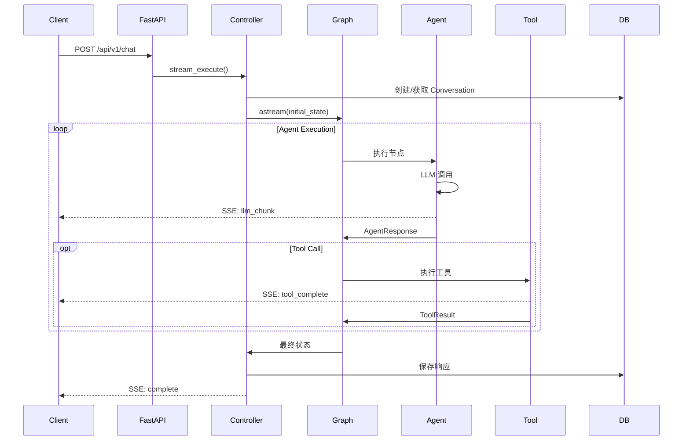
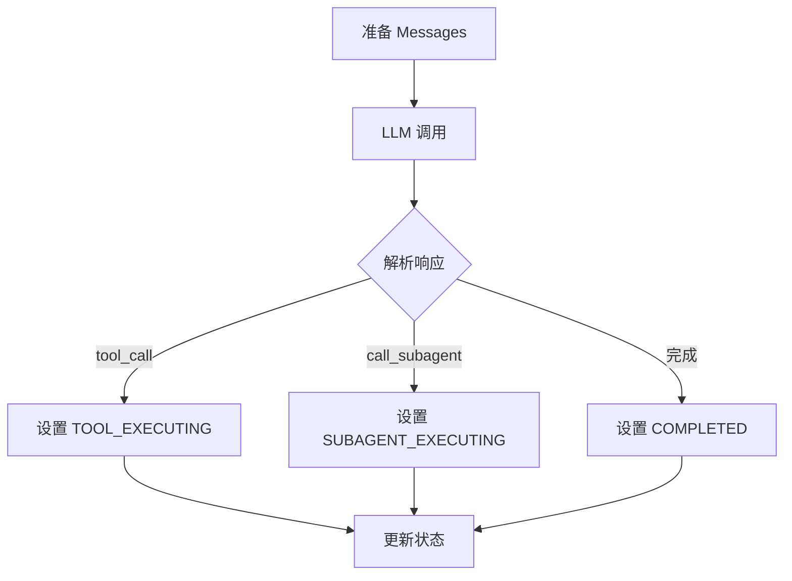
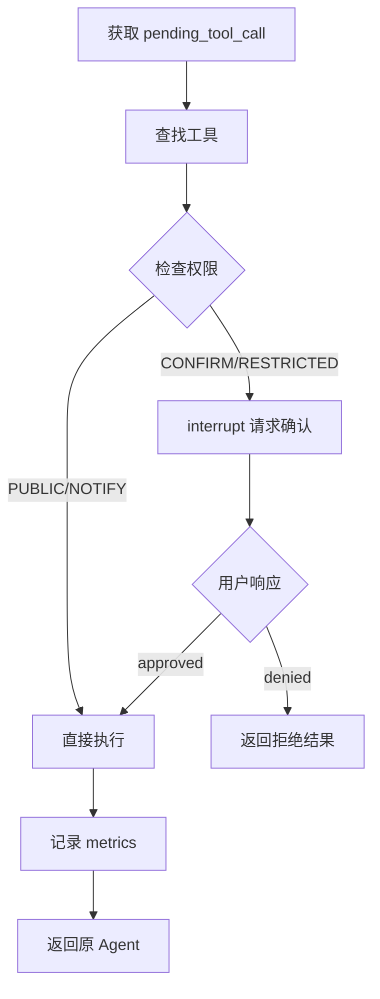

# Request Lifecycle

本文档详细描述一个请求从进入 API 到返回结果的完整生命周期。

## 整体流程



## Phase 1: 请求接收与初始化

### API 层处理

```python
# POST /api/v1/chat
{
    "content": "帮我分析一下 Python 异步编程的最佳实践",
    "conversation_id": null,  # null 表示新对话
    "parent_message_id": null
}
```

**依赖注入链**（`src/api/dependencies.py`）：

```
HTTP Request
    │
    ├─► get_db_session()        → AsyncSession（请求级别）
    │       │
    │       ├─► get_artifact_manager()
    │       ├─► get_conversation_manager()
    │       └─► get_controller()
    │
    ├─► get_checkpointer()      → AsyncSqliteSaver（全局单例）
    └─► get_stream_manager()    → StreamManager（全局单例）
```

### Conversation 创建

如果 `conversation_id` 为空，系统会：

1. 生成新的 `conversation_id`（UUID）
2. 在数据库创建 `Conversation` 记录
3. 自动关联 `ArtifactSession`

```python
# src/core/controller.py
async def _ensure_conversation(self, conversation_id: str | None) -> str:
    if not conversation_id:
        conversation_id = str(uuid.uuid4())
        await self.conversation_manager.start_conversation_async(conversation_id)
    return conversation_id
```

## Phase 2: 状态准备

### 对话历史格式化

`ConversationManager` 从消息树中提取当前分支的历史：

```python
# 树状结构示例
#       msg_1 (root)
#      /      \
#   msg_2    msg_3
#     |
#   msg_4 (current)

# 格式化结果（从 root 到 current 的路径）
conversation_history = """
[User]: 第一条消息
[Assistant]: 第一条回复
[User]: 第二条消息
[Assistant]: 第二条回复
"""
```

### 初始状态构建

```python
# src/core/state.py
initial_state = {
    "current_task": "帮我分析一下 Python 异步编程的最佳实践",
    "session_id": "artifact-session-uuid",
    "thread_id": "langgraph-thread-uuid",
    "conversation_history": "...",  # 格式化的历史
    "phase": ExecutionPhase.LEAD_EXECUTING,
    "current_agent": "lead",
    "agent_memories": {},
    "execution_metrics": ExecutionMetrics(),
    # ...
}
```

## Phase 3: Graph 执行

### 执行模式

ArtifactFlow 使用 LangGraph 的 `stream_mode="custom"` 实现流式输出：

```python
# src/core/controller.py
async for event in self.graph.astream(
    initial_state,
    config={"configurable": {"thread_id": thread_id}},
    stream_mode="custom"
):
    yield event  # StreamEvent
```

### Agent 节点执行

每个 Agent 节点执行单轮 LLM 调用：



**消息构建**（`src/core/context_manager.py`）：

```python
messages = [
    {"role": "system", "content": system_prompt},
    {"role": "user", "content": f"""
## 对话历史
{conversation_history}

## 当前任务
{current_task}

## Agent 记忆
{agent_memory}
"""}
]

# 如果有工具交互历史，追加到 messages
if tool_interactions:
    messages.extend(tool_interactions)
```

### 状态路由

路由基于 `ExecutionPhase` 决定下一个节点：

```python
# src/core/graph.py
def _route_after_agent(state: AgentState) -> str:
    phase = state["phase"]

    if phase == ExecutionPhase.TOOL_EXECUTING:
        return "tool_execution"
    elif phase == ExecutionPhase.SUBAGENT_EXECUTING:
        return state["subagent_pending"]["target"]
    elif phase == ExecutionPhase.COMPLETED:
        return END
    else:
        return state["current_agent"]
```

### 工具执行节点

统一处理所有工具调用，包括权限检查：



## Phase 4: 事件流与 SSE

### 事件类型

```python
# src/core/events.py
class StreamEventType(Enum):
    # Controller 层
    METADATA = "metadata"
    COMPLETE = "complete"
    ERROR = "error"

    # Agent 层
    AGENT_START = "agent_start"
    LLM_CHUNK = "llm_chunk"
    LLM_COMPLETE = "llm_complete"
    AGENT_COMPLETE = "agent_complete"

    # Graph 层
    TOOL_START = "tool_start"
    TOOL_COMPLETE = "tool_complete"
    PERMISSION_REQUEST = "permission_request"
    PERMISSION_RESULT = "permission_result"
```

### 事件缓冲

由于 POST 请求立即返回，SSE 连接稍后建立，需要缓冲中间事件：

```
POST /chat ──────────────────────────────────────────►
    │
    │  创建 StreamContext
    │  启动 TTL 计时器 (30s)
    │        │
    │        ▼
    │  ┌─────────────┐
    │  │ Event Queue │ ◄── Graph 执行产生事件
    │  └─────────────┘
    │        │
    └────────│────────────────────────────────────────►
             │
GET /stream ─┼────────────────────────────────────────►
             │
             └──► 消费队列 ──► SSE 推送 ──► 客户端
```

### SSE 格式

```
event: metadata
data: {"conversation_id": "xxx", "thread_id": "yyy", "message_id": "zzz"}

event: agent_start
data: {"agent": "lead"}

event: llm_chunk
data: {"content": "让我", "agent": "lead"}

event: llm_chunk
data: {"content": "来分析", "agent": "lead"}

event: tool_start
data: {"tool": "web_search", "params": {"query": "Python async best practices"}}

event: tool_complete
data: {"tool": "web_search", "success": true, "data": {...}}

event: complete
data: {"response": "...", "metrics": {...}}
```

## Phase 5: 权限中断与恢复

当工具需要用户确认时：

### 中断流程

```python
# src/core/graph.py - tool_execution_node
if permission in [ToolPermission.CONFIRM, ToolPermission.RESTRICTED]:
    # 发送权限请求事件
    writer(StreamEvent(
        type=StreamEventType.PERMISSION_REQUEST,
        data={"tool": tool_name, "params": params, "permission": permission}
    ))

    # 暂停执行，等待用户确认
    result = interrupt({
        "tool": tool_name,
        "params": params,
        "requires_permission": permission.value
    })
```

### 恢复流程

```python
# POST /api/v1/chat/{conversation_id}/resume
{
    "thread_id": "xxx",
    "approved": true
}

# Controller 恢复执行
await graph.ainvoke(
    Command(resume=approved),
    config={"configurable": {"thread_id": thread_id}}
)
```

## Phase 6: 结果持久化

执行完成后，Controller 保存结果：

```python
# 更新消息的 graph_response
await self.conversation_manager.update_response_async(
    conversation_id=conversation_id,
    message_id=message_id,
    response=final_response
)

# Artifact 变更已在执行过程中通过工具保存
# 版本历史自动记录
```

## 数据流总结

```
┌─────────────────────────────────────────────────────────────────┐
│                         Request Flow                             │
├─────────────────────────────────────────────────────────────────┤
│                                                                  │
│  HTTP Request                                                    │
│       │                                                          │
│       ▼                                                          │
│  ┌─────────┐    ┌────────────┐    ┌─────────┐                   │
│  │ FastAPI │───►│ Controller │───►│  Graph  │                   │
│  └─────────┘    └────────────┘    └─────────┘                   │
│       │               │                │                         │
│       │               │                ▼                         │
│       │               │         ┌─────────────┐                  │
│       │               │         │   Agents    │                  │
│       │               │         │ ┌─────────┐ │                  │
│       │               │         │ │  Lead   │ │                  │
│       │               │         │ ├─────────┤ │                  │
│       │               │         │ │ Search  │ │                  │
│       │               │         │ ├─────────┤ │                  │
│       │               │         │ │  Crawl  │ │                  │
│       │               │         │ └─────────┘ │                  │
│       │               │         └─────────────┘                  │
│       │               │                │                         │
│       │               │                ▼                         │
│       │               │         ┌─────────────┐                  │
│       │               │         │    Tools    │                  │
│       │               │         └─────────────┘                  │
│       │               │                │                         │
│       │               ▼                ▼                         │
│       │         ┌──────────────────────────┐                    │
│       │         │        Database          │                    │
│       │         │  ┌────────┐ ┌─────────┐  │                    │
│       │         │  │ Convos │ │Artifacts│  │                    │
│       │         │  └────────┘ └─────────┘  │                    │
│       │         └──────────────────────────┘                    │
│       │                                                          │
│       ▼                                                          │
│  ┌─────────────┐                                                │
│  │ SSE Stream  │ ◄── StreamManager ◄── Graph Events            │
│  └─────────────┘                                                │
│       │                                                          │
│       ▼                                                          │
│    Client                                                        │
│                                                                  │
└─────────────────────────────────────────────────────────────────┘
```
