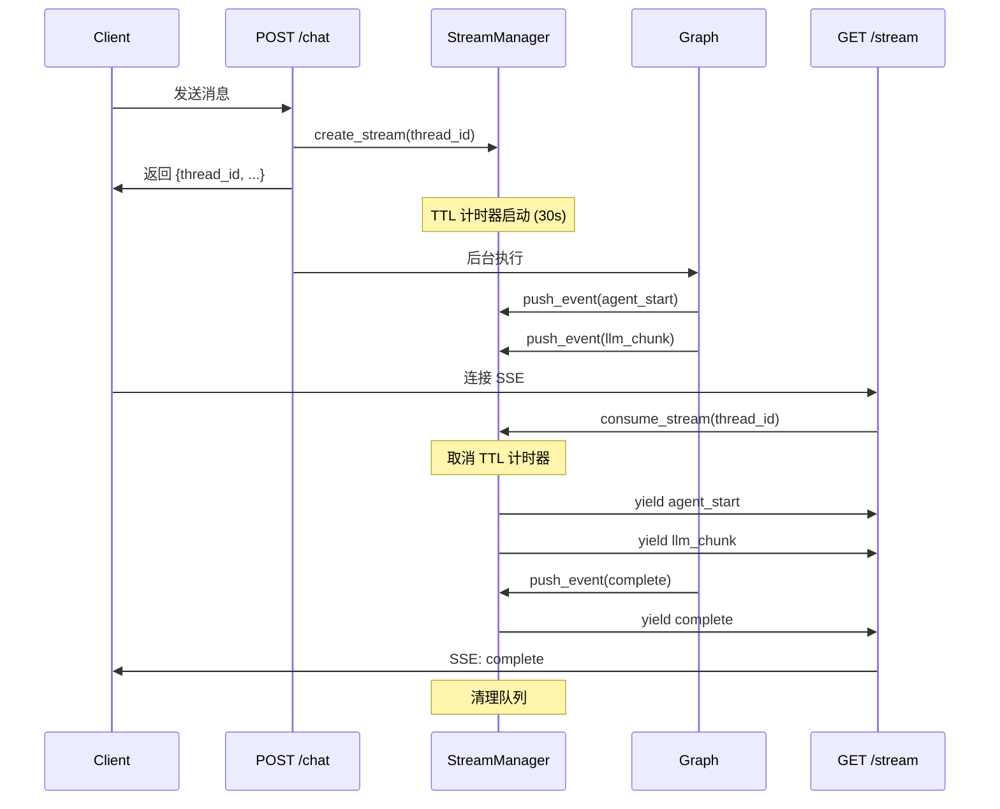

# 流式事件系统

ArtifactFlow 使用 Server-Sent Events (SSE) 实现实时事件推送，让前端能够即时展示执行进度。

## 架构概览

```
┌─────────────────────────────────────────────────────────────┐
│                      Event Flow                              │
├─────────────────────────────────────────────────────────────┤
│                                                              │
│   Graph 执行                                                 │
│       │                                                      │
│       ▼                                                      │
│   ┌─────────────┐                                           │
│   │   Agent     │──► StreamEvent(LLM_CHUNK)                 │
│   │   Node      │──► StreamEvent(AGENT_COMPLETE)            │
│   └─────────────┘                                           │
│       │                                                      │
│       ▼                                                      │
│   ┌─────────────┐                                           │
│   │    Tool     │──► StreamEvent(TOOL_START)                │
│   │    Node     │──► StreamEvent(TOOL_COMPLETE)             │
│   └─────────────┘                                           │
│       │                                                      │
│       ▼                                                      │
│   ┌─────────────┐     ┌─────────────┐     ┌─────────────┐  │
│   │ Controller  │────►│StreamManager│────►│  SSE 端点   │  │
│   └─────────────┘     └─────────────┘     └─────────────┘  │
│                             │                    │          │
│                             │    Event Queue     │          │
│                             │    (per thread)    │          │
│                             └────────────────────┘          │
│                                      │                      │
│                                      ▼                      │
│                                   Client                    │
│                                                              │
└─────────────────────────────────────────────────────────────┘
```

## 事件类型

### 完整事件列表

| 事件类型 | 来源 | 说明 | 数据结构 |
|----------|------|------|----------|
| `metadata` | Controller | 初始元数据 | `{conversation_id, thread_id, message_id}` |
| `agent_start` | Agent | Agent 开始执行 | `{agent}` |
| `llm_chunk` | Agent | LLM 流式输出片段 | `{content, agent}` |
| `llm_complete` | Agent | LLM 输出完成 | `{content, agent, token_usage}` |
| `agent_complete` | Agent | Agent 执行完成 | `{agent, response}` |
| `tool_start` | Graph | 工具开始执行 | `{tool, params}` |
| `tool_complete` | Graph | 工具执行完成 | `{tool, success, data, error}` |
| `permission_request` | Graph | 请求权限确认 | `{tool, params, permission}` |
| `permission_result` | Graph | 权限确认结果 | `{tool, approved}` |
| `complete` | Controller | 执行完成 | `{response, metrics}` |
| `error` | Controller | 执行错误 | `{error, traceback}` |

### 事件时序示例

```
─────────────────────────────────────────────────────────────►
                         时间轴

metadata ─┐
          │
agent_start (lead) ─┐
                    │
llm_chunk ──────────┼─── "让我"
llm_chunk ──────────┼─── "来分析"
llm_chunk ──────────┼─── "这个问题"
llm_chunk ──────────┼─── "<tool_call>..."
llm_complete ───────┘
                    │
tool_start ─────────┼─── web_search
tool_complete ──────┘
                    │
agent_start (lead) ─┐    (继续处理工具结果)
llm_chunk ──────────┼─── ...
agent_complete ─────┘
                    │
complete ───────────┘
```

## StreamManager

### 核心职责

1. **事件缓冲**：POST 请求返回后，Graph 继续执行产生的事件需要缓冲
2. **队列管理**：每个 `thread_id` 对应独立的事件队列
3. **TTL 清理**：防止前端未连接导致的内存泄漏

### 实现

```python
# src/api/services/stream_manager.py

@dataclass
class StreamContext:
    queue: asyncio.Queue[dict]
    created_at: datetime
    status: str  # pending | streaming | closed
    ttl_task: asyncio.Task | None

class StreamManager:
    def __init__(self, ttl_seconds: int = 30):
        self._streams: dict[str, StreamContext] = {}
        self._ttl_seconds = ttl_seconds

    async def create_stream(self, thread_id: str) -> StreamContext:
        """创建新的事件流"""
        context = StreamContext(
            queue=asyncio.Queue(),
            created_at=datetime.utcnow(),
            status="pending",
            ttl_task=None
        )
        self._streams[thread_id] = context

        # 启动 TTL 计时器
        context.ttl_task = asyncio.create_task(
            self._ttl_cleanup(thread_id)
        )

        return context

    async def push_event(self, thread_id: str, event: dict):
        """推送事件到队列"""
        if thread_id in self._streams:
            await self._streams[thread_id].queue.put(event)

    async def consume_stream(
        self,
        thread_id: str
    ) -> AsyncGenerator[dict, None]:
        """消费事件流"""
        context = self._streams.get(thread_id)
        if not context:
            return

        # 取消 TTL 计时器
        if context.ttl_task:
            context.ttl_task.cancel()

        context.status = "streaming"

        while True:
            event = await context.queue.get()
            yield event

            # 检查是否结束
            if event.get("type") in ["complete", "error"]:
                break

        context.status = "closed"
        del self._streams[thread_id]

    async def _ttl_cleanup(self, thread_id: str):
        """TTL 超时清理"""
        await asyncio.sleep(self._ttl_seconds)

        context = self._streams.get(thread_id)
        if context and context.status == "pending":
            # 前端未连接，清理队列
            del self._streams[thread_id]
```

### 时序图



## SSE 端点

### 实现

```python
# src/api/routers/stream.py

@router.get("/{thread_id}")
async def stream_events(
    thread_id: str,
    stream_manager: StreamManager = Depends(get_stream_manager)
):
    async def event_generator():
        async for event in stream_manager.consume_stream(thread_id):
            yield format_sse_event(event)

    return StreamingResponse(
        event_generator(),
        media_type="text/event-stream",
        headers={
            "Cache-Control": "no-cache",
            "Connection": "keep-alive",
            "X-Accel-Buffering": "no"  # 禁用 nginx 缓冲
        }
    )

def format_sse_event(event: dict) -> str:
    """格式化为 SSE 协议"""
    event_type = event.get("type", "message")
    data = json.dumps(event.get("data", event))
    return f"event: {event_type}\ndata: {data}\n\n"
```

### SSE 协议格式

```
event: metadata
data: {"conversation_id":"abc","thread_id":"xyz","message_id":"123"}

event: agent_start
data: {"agent":"lead"}

event: llm_chunk
data: {"content":"让我","agent":"lead"}

event: llm_chunk
data: {"content":"来分析","agent":"lead"}

event: tool_start
data: {"tool":"web_search","params":{"query":"Python async"}}

event: tool_complete
data: {"tool":"web_search","success":true,"data":[...]}

event: complete
data: {"response":"...","metrics":{...}}
```

## 前端集成

### JavaScript 示例

```javascript
async function chat(content) {
  // 1. 发送消息
  const response = await fetch('/api/v1/chat', {
    method: 'POST',
    headers: { 'Content-Type': 'application/json' },
    body: JSON.stringify({ content })
  });
  const { thread_id, conversation_id, message_id } = await response.json();

  // 2. 连接 SSE
  const eventSource = new EventSource(`/api/v1/stream/${thread_id}`);

  // 3. 处理各类事件
  eventSource.addEventListener('metadata', (e) => {
    console.log('Started:', JSON.parse(e.data));
  });

  eventSource.addEventListener('llm_chunk', (e) => {
    const { content } = JSON.parse(e.data);
    appendToOutput(content);  // 流式显示
  });

  eventSource.addEventListener('tool_start', (e) => {
    const { tool, params } = JSON.parse(e.data);
    showToolIndicator(tool, params);
  });

  eventSource.addEventListener('tool_complete', (e) => {
    const { tool, success, data } = JSON.parse(e.data);
    hideToolIndicator(tool);
    if (!success) showError(data.error);
  });

  eventSource.addEventListener('permission_request', (e) => {
    const { tool, params, permission } = JSON.parse(e.data);
    showPermissionDialog(tool, params, permission);
  });

  eventSource.addEventListener('complete', (e) => {
    const { response, metrics } = JSON.parse(e.data);
    finalizeOutput(response);
    showMetrics(metrics);
    eventSource.close();
  });

  eventSource.addEventListener('error', (e) => {
    if (e.data) {
      const { error } = JSON.parse(e.data);
      showError(error);
    }
    eventSource.close();
  });
}
```

### React Hook 示例

```typescript
function useChat() {
  const [messages, setMessages] = useState<Message[]>([]);
  const [isStreaming, setIsStreaming] = useState(false);
  const [currentContent, setCurrentContent] = useState('');

  const sendMessage = async (content: string) => {
    setIsStreaming(true);
    setCurrentContent('');

    // 添加用户消息
    setMessages(prev => [...prev, { role: 'user', content }]);

    const res = await fetch('/api/v1/chat', {
      method: 'POST',
      body: JSON.stringify({ content })
    });
    const { thread_id } = await res.json();

    const eventSource = new EventSource(`/api/v1/stream/${thread_id}`);

    eventSource.addEventListener('llm_chunk', (e) => {
      const { content } = JSON.parse(e.data);
      setCurrentContent(prev => prev + content);
    });

    eventSource.addEventListener('complete', (e) => {
      const { response } = JSON.parse(e.data);
      setMessages(prev => [...prev, { role: 'assistant', content: response }]);
      setCurrentContent('');
      setIsStreaming(false);
      eventSource.close();
    });
  };

  return { messages, currentContent, isStreaming, sendMessage };
}
```

## 权限中断处理

当遇到需要确认的工具时：

### 后端流程

```python
# tool_execution_node 中
if tool.permission in [ToolPermission.CONFIRM, ToolPermission.RESTRICTED]:
    # 发送权限请求事件
    writer(StreamEvent(
        type=StreamEventType.PERMISSION_REQUEST,
        data={
            "tool": tool_name,
            "params": params,
            "permission": tool.permission.value,
            "message": f"工具 {tool_name} 需要您的确认才能执行"
        }
    ))

    # 中断执行
    result = interrupt({
        "type": "permission_request",
        "tool": tool_name,
        "params": params
    })

    # 恢复后继续...
```

### 前端处理

```javascript
eventSource.addEventListener('permission_request', async (e) => {
  const { tool, params, message } = JSON.parse(e.data);

  // 显示确认对话框
  const approved = await showConfirmDialog({
    title: `确认执行 ${tool}`,
    message,
    details: params
  });

  // 发送恢复请求
  await fetch(`/api/v1/chat/${conversationId}/resume`, {
    method: 'POST',
    body: JSON.stringify({
      thread_id: threadId,
      approved
    })
  });
});
```

## 配置选项

```python
# src/api/config.py

class APIConfig:
    # SSE 配置
    SSE_PING_INTERVAL: int = 15      # 心跳间隔（秒）
    STREAM_TIMEOUT: int = 300        # 流超时（秒）
    STREAM_TTL: int = 30             # 队列 TTL（秒）
```

## 错误处理

### 连接断开

前端应处理连接断开情况：

```javascript
eventSource.onerror = (e) => {
  if (eventSource.readyState === EventSource.CLOSED) {
    // 连接已关闭
    handleDisconnect();
  } else {
    // 尝试重连（浏览器自动）
    showReconnecting();
  }
};
```

### 超时处理

```javascript
const timeout = setTimeout(() => {
  eventSource.close();
  showTimeout();
}, 5 * 60 * 1000);  // 5 分钟超时

eventSource.addEventListener('complete', () => {
  clearTimeout(timeout);
});
```
