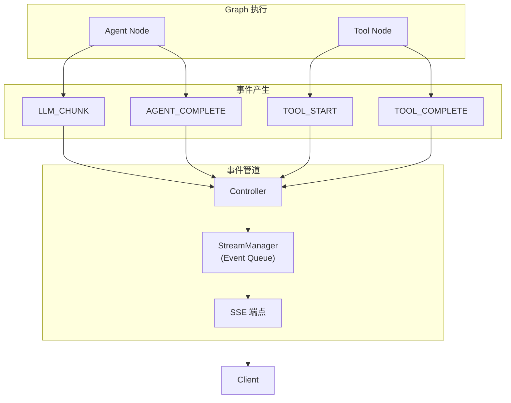
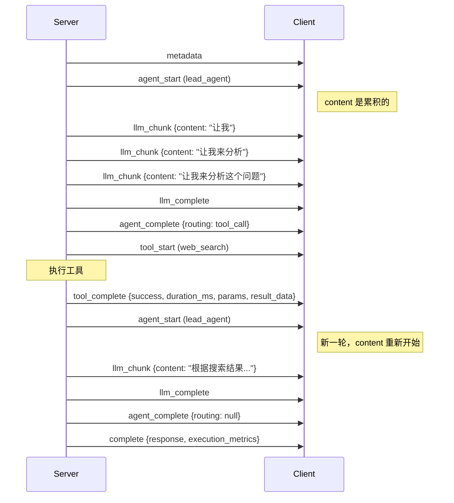

# 流式事件系统

ArtifactFlow 使用 Server-Sent Events (SSE) 实现实时事件推送，让前端能够即时展示执行进度。

## 架构概览



## 事件类型

### 完整事件列表

| 事件类型 | 来源 | 说明 | data 主要字段 |
|----------|------|------|----------|
| `metadata` | Controller | 初始元数据 | `{conversation_id, thread_id, message_id}` |
| `agent_start` | Agent | Agent 开始执行 | `{success, content, metadata}` |
| `llm_chunk` | Agent | LLM 流式输出片段 | `{success, content*, reasoning_content, metadata, token_usage}` |
| `llm_complete` | Agent | LLM 单次调用完成 | `{success, content, reasoning_content, metadata, token_usage}` |
| `agent_complete` | Agent | Agent 单轮完成 | `{success, content, routing, metadata, token_usage}` |
| `tool_start` | Graph | 工具开始执行 | `{params}` |
| `tool_complete` | Graph | 工具执行完成 | `{success, duration_ms, error, params, result_data}` |
| `permission_request` | Graph | 请求权限确认 | `{permission_level, params}` |
| `permission_result` | Graph | 权限确认结果 | `{approved}` |
| `complete` | Controller | 执行完成 | `{success, interrupted, response, execution_metrics, ...}` |
| `error` | Controller | 执行错误 | `{success, error, conversation_id, ...}` |

**注意：** `llm_chunk.content` 是**累积**内容，非增量 delta。详细字段说明见 [API Reference](./api.md#stream-api)。

### 事件时序示例



## StreamManager

### 核心职责

1. **事件缓冲**：POST 请求返回后，Graph 继续执行产生的事件需要缓冲
2. **队列管理**：每个 `thread_id` 对应独立的事件队列
3. **TTL 清理**：防止前端未连接导致的内存泄漏

### 实现

```python
# src/api/services/stream_manager.py

@dataclass
class StreamContext:
    queue: asyncio.Queue = field(default_factory=asyncio.Queue)
    created_at: datetime = field(default_factory=datetime.now)
    status: Literal["pending", "streaming", "closed"] = "pending"
    ttl_task: Optional[asyncio.Task] = None
    owner_user_id: Optional[str] = None  # 绑定创建者，消费时校验

class StreamManager:
    def __init__(self, ttl_seconds: int = 30):
        self.streams: Dict[str, StreamContext] = {}
        self.ttl_seconds = ttl_seconds

    async def create_stream(self, thread_id: str, owner_user_id: str = None) -> StreamContext:
        """创建新的事件流"""
        context = StreamContext(owner_user_id=owner_user_id)
        self.streams[thread_id] = context

        # 启动 TTL 计时器
        context.ttl_task = asyncio.create_task(
            self._ttl_cleanup(thread_id)
        )

        return context

    async def push_event(self, thread_id: str, event: Dict[str, Any]) -> bool:
        """推送事件到队列"""
        context = self.streams.get(thread_id)
        if not context or context.status == "closed":
            return False
        await context.queue.put(event)
        return True

    async def consume_events(
        self,
        thread_id: str,
        user_id: str = None
    ) -> AsyncGenerator[Dict[str, Any], None]:
        """消费事件流（校验 owner）"""
        context = self.streams.get(thread_id)
        if not context:
            raise StreamNotFoundError(thread_id)

        # 校验 ownership：非创建者不能消费
        if context.owner_user_id and user_id != context.owner_user_id:
            raise StreamNotFoundError(thread_id)

        # 取消 TTL 计时器
        if context.ttl_task:
            context.ttl_task.cancel()
            context.ttl_task = None

        context.status = "streaming"

        try:
            while True:
                event = await context.queue.get()
                yield event

                # 检查是否结束
                if event.get("type") in ("complete", "error"):
                    break
        finally:
            await self.close_stream(thread_id)

    async def _ttl_cleanup(self, thread_id: str):
        """TTL 超时清理"""
        await asyncio.sleep(self.ttl_seconds)

        context = self.streams.get(thread_id)
        if context and context.status == "pending":
            # 前端未连接，清理队列
            await self._close_stream_internal(thread_id)
```

### 时序图

> 完整的事件缓冲时序图见 [Request Lifecycle — 事件缓冲](request-lifecycle.md#phase-4-事件流与-sse)。

## SSE 端点

### 实现

```python
# src/api/routers/stream.py

@router.get("/{thread_id}")
async def stream_events(
    thread_id: str,
    current_user: TokenPayload = Depends(get_current_user),
    stream_manager: StreamManager = Depends(get_stream_manager),
) -> StreamingResponse:
    async def event_generator() -> AsyncGenerator[str, None]:
        try:
            async for event in stream_manager.consume_events(thread_id, user_id=current_user.user_id):
                yield format_sse_event(event, event=event.get("type"))

                # 检查是否是终结事件
                if event.get("type") in ("complete", "error"):
                    break

        except StreamNotFoundError:
            error_event = {"type": "error", "data": {"error": f"Stream not found"}}
            yield format_sse_event(error_event, event="error")

    return StreamingResponse(
        event_generator(),
        media_type="text/event-stream",
        headers={
            "Cache-Control": "no-cache",
            "Connection": "keep-alive",
            "X-Accel-Buffering": "no",  # 禁用 nginx 缓冲
        }
    )

# src/api/utils/sse.py
def format_sse_event(data: Dict[str, Any], event: str = None) -> str:
    """
    格式化为 SSE 协议

    Args:
        data: 事件数据（整个事件字典，包含 type 字段）
        event: SSE event 名称（从事件 type 字段提取）

    Returns:
        格式化的 SSE 字符串
    """
    lines = []
    if event:
        lines.append(f"event: {event}")
    json_data = json.dumps(data, ensure_ascii=False)
    lines.append(f"data: {json_data}")
    return "\n".join(lines) + "\n\n"
```

### SSE 协议格式

使用标准 SSE `event:` 字段区分事件类型，`data:` JSON 内同时保留 `type` 字段以便统一解析：

```
event: metadata
data: {"type":"metadata","timestamp":"...","data":{"conversation_id":"abc","thread_id":"xyz","message_id":"123"}}

event: agent_start
data: {"type":"agent_start","timestamp":"...","agent":"lead_agent","data":{"success":true,"content":"","metadata":{...}}}

event: llm_chunk
data: {"type":"llm_chunk","timestamp":"...","agent":"lead_agent","data":{"success":true,"content":"让我","metadata":{...}}}

event: llm_chunk
data: {"type":"llm_chunk","timestamp":"...","agent":"lead_agent","data":{"success":true,"content":"让我来分析","metadata":{...}}}

event: llm_complete
data: {"type":"llm_complete","timestamp":"...","agent":"lead_agent","data":{"success":true,"content":"让我来分析...","token_usage":{...}}}

event: agent_complete
data: {"type":"agent_complete","timestamp":"...","agent":"lead_agent","data":{"success":true,"content":"...","routing":{"type":"tool_call","tool_name":"web_search","params":{...}}}}

event: tool_start
data: {"type":"tool_start","timestamp":"...","agent":"lead_agent","tool":"web_search","data":{"params":{"query":"Python async"}}}

event: tool_complete
data: {"type":"tool_complete","timestamp":"...","agent":"lead_agent","tool":"web_search","data":{"success":true,"duration_ms":1234,"error":null,"params":{"query":"Python async"},"result_data":"<search_results>...</search_results>"}}

event: complete
data: {"type":"complete","timestamp":"...","data":{"success":true,"interrupted":false,"response":"...","execution_metrics":{...}}}
```

**关键点：**
- `llm_chunk.data.content` 是累积内容，每次事件包含从头开始的完整文本
- `tool_complete` 包含 `params`（工具调用参数）和 `result_data`（工具返回的业务数据）
- `complete` 事件的 `interrupted` 字段指示是否需要用户确认权限

## 前端集成

### JavaScript 示例

前端使用 `fetch` + `ReadableStream`（而非 `EventSource`）连接 SSE，以便携带 `Authorization` header：

```javascript
async function chat(content) {
  const token = localStorage.getItem('af_token');
  const authHeaders = token ? { Authorization: `Bearer ${token}` } : {};

  // 1. 发送消息
  const response = await fetch('/api/v1/chat', {
    method: 'POST',
    headers: { 'Content-Type': 'application/json', ...authHeaders },
    body: JSON.stringify({ content })
  });
  const { thread_id, conversation_id, message_id, stream_url } = await response.json();

  // 2. 连接 SSE（使用 fetch 以支持 Authorization header）
  const sseRes = await fetch(stream_url, {
    headers: { Accept: 'text/event-stream', ...authHeaders },
  });

  // 解析 SSE 流...
  // 实际实现参考 frontend/src/lib/sse.ts

  // 具体的 SSE 流解析和事件分发逻辑详见 API Reference 的前端集成示例
}
```

> **注意**：浏览器原生的 `EventSource` 不支持自定义 Header，无法传递 `Authorization`。ArtifactFlow 前端使用 `fetch()` + `ReadableStream` 手动解析 SSE 协议，详见 [前端架构 — sse.ts](frontend.md#ssets--sse-连接)。
```

### React Hook 示例

ArtifactFlow 前端的实际实现使用 Zustand store 管理认证和流式状态，详见：
- `frontend/src/stores/authStore.ts` — 认证状态管理
- `frontend/src/hooks/useSSE.ts` — SSE 事件处理
- `frontend/src/hooks/useChat.ts` — 聊天操作封装
- `frontend/src/lib/sse.ts` — SSE 连接（fetch + auth header）

## 权限中断处理

当遇到需要确认的工具时：

### 后端流程

```python
# tool_execution_node 中
if tool.permission == ToolPermission.CONFIRM:
    # 发送 PERMISSION_REQUEST 事件
    writer({
        "type": StreamEventType.PERMISSION_REQUEST.value,
        "agent": from_agent,
        "tool": tool_name,
        "timestamp": datetime.now().isoformat(),
        "data": {
            "permission_level": tool.permission.value,
            "params": params
        }
    })

    # 中断执行，等待用户确认
    is_approved = interrupt({
        "type": "tool_permission",
        "agent": from_agent,
        "tool_name": tool_name,
        "params": params,
        "permission_level": tool.permission.value,
        "message": f"Tool '{tool_name}' requires {tool.permission.value} permission"
    })

    # 发送 PERMISSION_RESULT 事件
    writer({
        "type": StreamEventType.PERMISSION_RESULT.value,
        "agent": from_agent,
        "tool": tool_name,
        "timestamp": datetime.now().isoformat(),
        "data": {"approved": is_approved}
    })

    if not is_approved:
        # 用户拒绝，返回错误结果
        ...
```

### 前端处理

权限中断是一个两步流程，前端会依次收到两个事件：
1. `permission_request` 事件 - 在 `interrupt()` 前发送，提前通知前端即将中断（可用于显示等待状态）
2. `complete` 事件 (`interrupted=true`) - 执行已暂停，包含完整中断数据，前端据此弹出确认对话框并发起 resume 请求

```javascript
// 步骤1：收到 permission_request 时，可提前显示等待状态
eventSource.addEventListener('permission_request', (e) => {
  const { tool, data } = JSON.parse(e.data);
  showPendingPermission(tool, data.permission_level, data.params);
});

// 步骤2：收到 complete 且 interrupted=true 时，触发确认流程
eventSource.addEventListener('complete', async (e) => {
  const { data } = JSON.parse(e.data);
  if (!data.interrupted) return;

  const { interrupt_data, thread_id, message_id, conversation_id } = data;

  // 显示确认对话框
  const approved = await showConfirmDialog({
    title: `确认执行 ${interrupt_data.tool_name}`,
    message: interrupt_data.message,
    details: interrupt_data.params
  });

  const token = localStorage.getItem('af_token');
  const authHeaders = token ? { Authorization: `Bearer ${token}` } : {};

  // 发送恢复请求
  const res = await fetch(`/api/v1/chat/${conversation_id}/resume`, {
    method: 'POST',
    headers: { 'Content-Type': 'application/json', ...authHeaders },
    body: JSON.stringify({
      thread_id,
      message_id,
      approved
    })
  });

  // 重新连接 SSE 继续接收事件（同样使用 fetch + auth header）
  const { stream_url } = await res.json();
  const sseRes = await fetch(stream_url, {
    headers: { Accept: 'text/event-stream', ...authHeaders },
  });
  // ... 用 ReadableStream 处理后续事件
}
```

## 配置选项

```python
# src/api/config.py

class APIConfig(BaseSettings):
    # SSE 配置
    SSE_PING_INTERVAL: int = 15      # 心跳间隔（秒）
    STREAM_TIMEOUT: int = 300        # 流超时（秒）
    STREAM_TTL: int = 30             # 队列 TTL（秒）

    class Config:
        env_prefix = "ARTIFACTFLOW_"
```

## 错误处理

### 连接断开

前端应处理连接断开情况：

```javascript
eventSource.onerror = (e) => {
  if (eventSource.readyState === EventSource.CLOSED) {
    // 连接已关闭
    handleDisconnect();
  } else {
    // 尝试重连（浏览器自动）
    showReconnecting();
  }
};
```

### 超时处理

```javascript
const timeout = setTimeout(() => {
  eventSource.close();
  showTimeout();
}, 5 * 60 * 1000);  // 5 分钟超时

eventSource.addEventListener('complete', () => {
  clearTimeout(timeout);
});
```
